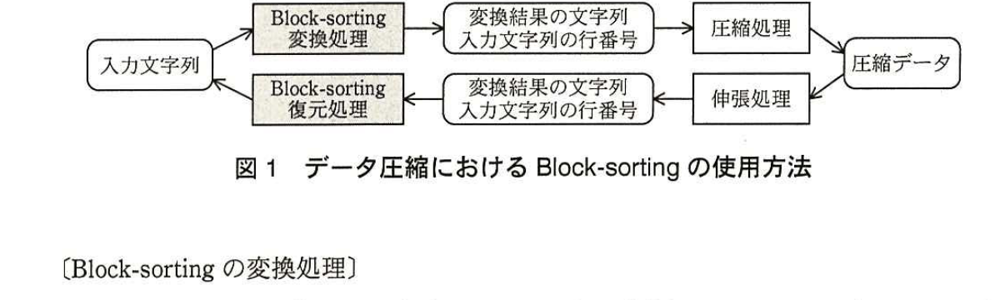
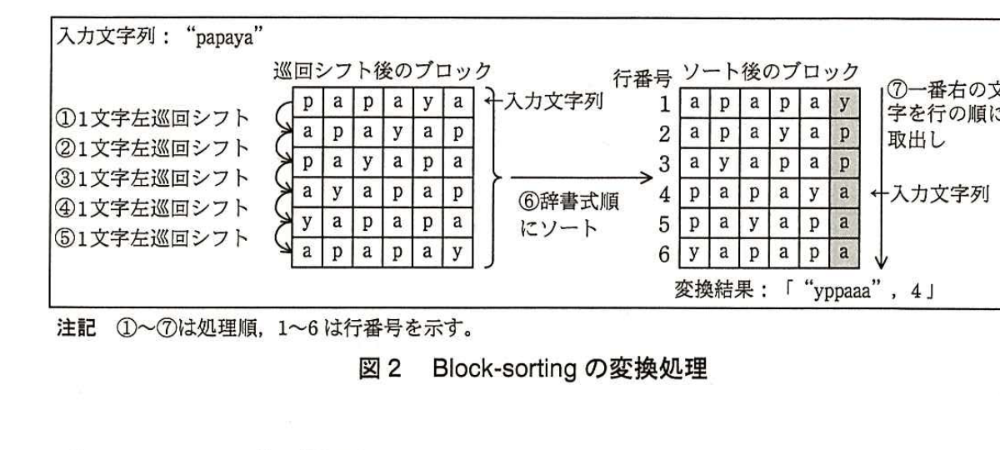

# 2015年春期（平成27年度）応用情報技術者試験 午後 問3（選択）
## プログラミング：データ圧縮の前処理として用いられるBlock-sorting

---

## 問題文

**問3** データ圧縮の前処理として用いられるBlock-sortingに関する次の記述を読んで、設問1〜4に答えよ。

Block-sortingは、文字列に対する可逆変換の一種である。変換後の文字列は、変換前の文字列と比較して同じ文字が多く続く傾向があるので、その後に行う圧縮処理において圧縮率を向上させることができる。

Block-sortingは、変換処理と復元処理の二つの処理で構成される。変換処理は、入力文字列を受け取って、変換結果の文字列と、入力文字列がソート後のブロックで何行目にあるか（以下、入力文字列の行番号という）を出力する。一方、復元処理は、変換結果の文字列と入力文字列の行番号を受け取って入力文字列を出力する。

データ圧縮におけるBlock-sortingの使用方法を図1に示す。



> 図1の内容：入力文字列→Block-sorting変換処理→（変換結果の文字列、入力文字列の行番号）→圧縮処理→圧縮データ。逆に、圧縮データ→伸張処理→（変換結果の文字列、入力文字列の行番号）→Block-sorting復元処理→入力文字列。

---

### 〔Block-sortingの変換処理〕

例として"papaya"を入力文字列としたときの変換処理を図2に示す。図2では、入力文字列を1文字左に巡回シフトすること（①）で文字列"apayap"となる。さらに、もう1文字左に巡回シフトすること（②）で文字列"payapa"となる。同様に1文字ずつ左に巡回シフトした（③〜⑤）結果の文字列を縦に並べて正方形のブロック（巡回シフト後のブロック）を作成する。

次に、このブロックを行単位で辞書式順にソートし（⑥）、ソート後のブロックを得る。ソート後のブロックの各行の文字列から一番右の文字を行の順に取り出して並べた文字列と、ソート後のブロックにおいて入力文字列に一致する行の行番号を変換結果とする（⑦）。



> 図2の内容：入力文字列"papaya"を1文字ずつ左に巡回シフトして6行のブロックを作成（papaya, apayap, payapa, ayapap, yapapa, apapay）。これを辞書式順にソートすると（行番号1〜6）：1:apapay, 2:apayap, 3:ayapap, 4:papaya（入力文字列に一致）, 5:payapa, 6:yapapa。各行の一番右の文字を取り出すと y,p,p,a,a,a となり、変換結果は「"yppaaa", 4」となる。

---

### 〔Block-sortingの復元処理〕

図2の変換結果「"yppaaa"、4」を復元する手順を表1に示す。

### 表1 Block-sortingの復元手順

| 手順 | 処理 | 内容 |
|---|---|---|
| 1 | 変換結果の文字列に対して、各文字に1から順に添字を付ける。 | "yppaaa"→"y(1),p(2),p(3),a(4),a(5),a(6)" |
| 2 | 文字をソートする。同じ文字の場合は添字の順に並べる。 | "y(1),p(2),p(3),a(4),a(5),a(6)"→"a(4),a(5),a(6),p(2),p(3),y(1)" |
| 3 | 手順2でソートした文字を次の手順で並べる。<br>・変換結果の行番号"4"から、ソート後の文字列"a(4),a(5),a(6),p(2),p(3),y(1)"の4番目の要素"p(2)"を取り出して並べる。<br>・"p(2)"の添字が2であることから、2番目の要素"a(5)"を取り出して並べる。<br>・"a(5)"の添字が5であることから5番目の要素の"p(3)"を取り出して並べる。以降、並べた要素の個数が変換結果の文字列の長さと同じになるまで、要素を取り出して並べることを繰り返す。 | →"p(2)"<br>→"p(2),a(5)"<br>→"p(2),a(5),p(3)"<br>→"p(2),a(5),p(3),a(6)"<br>→"p(2),a(5),p(3),a(6),y(1)"<br>→"p(2),a(5),p(3),a(6),y(1),a(4)" |
| 4 | 手順3の結果から添字を取り除く。 | "p(2),a(5),p(3),a(6),y(1),a(4)"→"papaya" |

---

### 〔Block-sortingの実装〕

Block-sortingのプログラムを作成するために使用する配列、関数及び変数を、表2に示す。

### 表2 使用する配列、関数及び変数

| 名称 | 種類 | 内容 |
|---|---|---|
| EncodeArray[n] | 配列 | 巡回シフト後のブロックを格納する。ブロックの1行を文字列として、配列の一つの要素に格納する。配列の添字は1から始まる。例："papaya" "apayap" "payapa" "ayapap" "yapapa" "apapay" |
| DecodeArray[2][n] | 配列 | 復元用の文字と添字の組を格納する。配列の添字は1から始まる。例：("y","p","p","a","a","a")と(1,2,3,4,5,6) |
| sort1(Array[]) | 関数 | 1次元配列Array[]の要素を辞書式順にソートする。 |
| sort2(Array[][]) | 関数 | 2次元配列Array[][]を、Array[1]の要素をキーにしてソートする。例：("y","p","p","a","a","a")と(1,2,3,4,5,6)→("a","a","a","p","p","y")と(4,5,6,2,3,1) |
| rotation(String) | 関数 | 文字列Stringを1文字左に巡回シフトした結果を返す。 |
| InputString | 変数 | 入力文字列。この文字列の長さを"InputStringの長さ"とする。他の文字列変数についても、長さを同様に表す。 |
| BlockSortString | 変数 | 変換結果の文字列。 |
| Line | 変数 | ソート後のブロックでの入力文字列の行番号。 |
| OutputString | 変数 | 復元処理の出力文字列。 |

（注記　nは入力文字列の長さを表す。）

### 〔変換処理関数encode〕

変換処理を実装した関数encodeのプログラムを図3に示す。

```
function encode(InputString)
  rString ← InputString
  for( i を [　ア　] から [　イ　] まで1ずつ増やす )
    EncodeArray[i] ← rString
    rString ← rotation(rString)
  endfor
  sort1(EncodeArray)
  BlockSortString を空文字列に初期化する
  for( k を [　ア　] から [　イ　] まで1ずつ増やす )
    BlockSortString の末尾に EncodeArray[k]の末尾の1文字を追加する
    if( [　ウ　] )
      Line ← k
    endif
  endfor
endfunction
```

図3 関数encodeのプログラム

### 〔復元処理関数decode〕

復元処理を実装した関数decodeのプログラムを図4に示す。

```
function decode(BlockSortString, Line)
  for( i を 1 から BlockSortString の長さまで1ずつ増やす )
    DecodeArray[1][i] ← BlockSortString の i 文字目
    DecodeArray[2][i] ← i
  endfor
  sort2(DecodeArray)
  OutputString を空文字列に初期化する
  OutputString の末尾に [　エ　] に格納されている1文字を追加する
  n ← [　オ　]
  while( [　カ　] )
    OutputString の末尾に DecodeArray[1][n]に格納されている1文字を追加する　←(α)
    n ← DecodeArray[2][n]
  endwhile
endfunction
```

図4 関数decodeのプログラム

### 〔関数sort2(Array[][])の実装〕

関数decodeの処理時間は、使用する関数sort2(Array[][])の計算量に大きく依存する。処理時間を短くするためには、sort2(Array[][])の内部で計算量が少ないソートのアルゴリズムを使用して実装する必要がある。

処理時間の違いを確認するために複数のソートアルゴリズムを使用して関数sort2(Array[][])を実装したところ、Array[1]の要素をキーにしてクイックソート（不安定なソート）を使用した場合には復元処理の結果が入力文字列と一致しなかった。

この場合、sort2(Array[][])が表1の手順2を正しく実装できていないので、(β)ソートアルゴリズム、ソートキーのいずれかを見直す必要がある。

---

## 設問

### 設問1
文字列"kiseki"に対してBlock-sortingを適用して変換した結果を答えよ。変換結果は図2の記法に合わせて記述すること。

### 設問2
図3中の`[　ア　]`〜`[　ウ　]`に入れる適切な字句を答えよ。

### 設問3
〔復元処理関数decode〕について、(1)、(2)に答えよ。

(1) 図4中の`[　エ　]`〜`[　カ　]`に入れる適切な字句を答えよ。

(2) BlockSortStringの長さがpのとき、図4中の下線(α)の処理の実行回数を答えよ。

### 設問4
本文中の下線(β)について、ソートアルゴリズムを見直す場合とソートキーを見直す場合のそれぞれについて、どのように見直せばよいかを30字以内で述べよ。

---

## 解答と解説

### 設問1

**正解："skkeii"、5**

"kiseki"を1文字ずつ左に巡回シフトすると次の6行ができる。

1. kiseki
2. isekik
3. sekiki
4. ekikis
5. kikise
6. ikisek

これを辞書式順（e＜i＜k＜s）にソートすると次のようになる。

1. ekikis
2. ikisek
3. isekik
4. kikise
5. kiseki（＝入力文字列）
6. sekiki

各行の一番右の文字を順に取り出すと「s, k, k, e, i, i」となり、変換結果の文字列は"skkeii"となる。また、入力文字列"kiseki"はソート後の5行目にあるため、行番号は5となる。

**IPA公式："skkeii"，5**

### 設問2

**正解：ア＝1、イ＝InputStringの長さ、ウ＝EncodeArray[k]がInputStringと同一**

図3のforループは、入力文字列を1文字ずつ左に巡回シフトしながら、その結果をEncodeArray[1]からEncodeArray[InputStringの長さ]まで格納する処理であるから、`[　ア　]`＝**1**、`[　イ　]`＝**InputStringの長さ**となる。また、ソート後の配列を1行ずつ末尾の文字を取り出しながら走査していく際、その行が入力文字列そのものと一致した時点でその行番号をLineに記録する必要があるため、`[　ウ　]`＝**EncodeArray[k]がInputStringと同一**という条件になる。

**IPA公式：ア＝1、イ＝InputStringの長さ、ウ＝EncodeArray[k]がInputStringと同一**

### 設問3

**(1) 正解：エ＝DecodeArray[1][Line]、オ＝DecodeArray[2][Line]、カ＝OutputStringの長さがBlockSortStringの長さより小さい**

表1の手順3にあるとおり、復元処理はまず変換結果の行番号（Line）に対応する文字から出力を開始する。ソート後の配列DecodeArray[1][ ]のLine番目の文字が最初の出力文字であるから、`[　エ　]`＝**DecodeArray[1][Line]**となる。続けて辿るべき次の添字は、その要素に対応するDecodeArray[2][Line]であるから、`[　オ　]`＝**DecodeArray[2][Line]**となる。このたどる処理は、出力文字列の長さが変換結果の文字列（BlockSortString）の長さと同じになるまで繰り返すので、while文の継続条件`[　カ　]`は「**OutputStringの長さがBlockSortStringの長さより小さい**」となる。

**IPA公式：エ＝DecodeArray[1][Line]、オ＝DecodeArray[2][Line]、カ＝OutputStringの長さがBlockSortStringの長さより小さい**

**(2) 正解：p－1**

whileループ内の下線(α)の処理は、最初にfor文の外側で1文字（エの処理）が既に出力されているのに続けて実行される。出力文字列の長さがBlockSortStringの長さpになるまで繰り返されるので、最初の1文字を除いたp－1回、下線(α)の処理が実行される。

**IPA公式：p－1**

### 設問4

**正解例：ソートアルゴリズム＝同じ文字の場合に元の順序を保持するソートを使用する。／ソートキー＝2番目のソートキーにArray[2]の要素を加える。**

表1の手順2は「同じ文字の場合は添字の順に並べる」ことを要求しているが、クイックソートのような不安定なソートは、同じキー値をもつ要素の元の順序を保持する保証がない。これを解消するには2通りの見直し方がある。一つは、ソートアルゴリズム自体を安定なソート（同じ文字の場合に元の順序を保持するソート、例：マージソートなど）に変更する方法である。もう一つは、ソートキーを見直し、Array[1]の値だけでなく、同順位の場合の順序を決定するためにArray[2]（添字）の値も第2のソートキーとして加える方法である。

**IPA公式：ソートアルゴリズム＝同じ文字の場合に元の順序を保持するソートを使用する。／ソートキー＝2番目のソートキーにArray[2]の要素を加える。**

---

## 参考：主要キーワード

| 用語 | 説明 |
|------|------|
| Block-sorting（BWT） | Burrows-Wheeler変換とも呼ばれる可逆変換。同じ文字が連続しやすくなり、後続の圧縮処理の効率を高める |
| 巡回シフト | 文字列の先頭文字を末尾に移動させる操作を繰り返し、全ての回転パターンを生成する処理 |
| 安定なソート | キー値が等しい要素同士の相対順序を、ソート前後で保持するソートアルゴリズム（例：マージソート、バブルソート） |
| 不安定なソート | キー値が等しい要素同士の相対順序が保持されないソートアルゴリズム（例：クイックソート） |
| ソートキーの多重化 | 主キーが同値の場合に順序を一意に確定するため、副次的なキー（添字など）を追加してソートする手法 |
