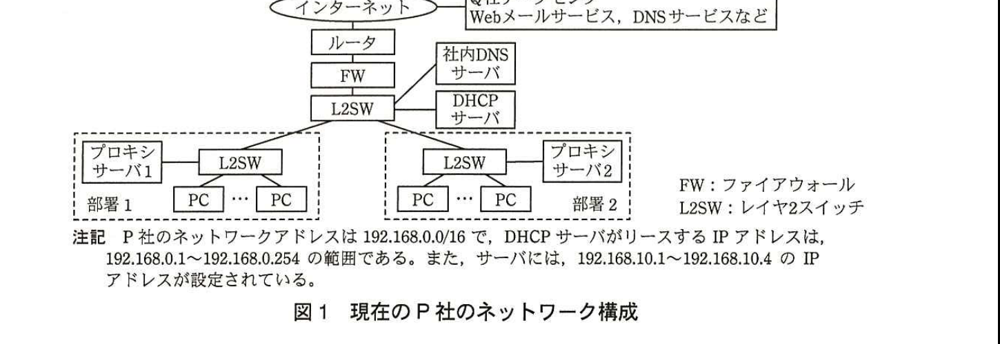
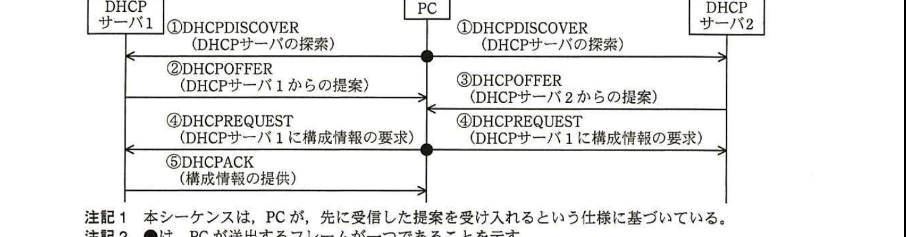
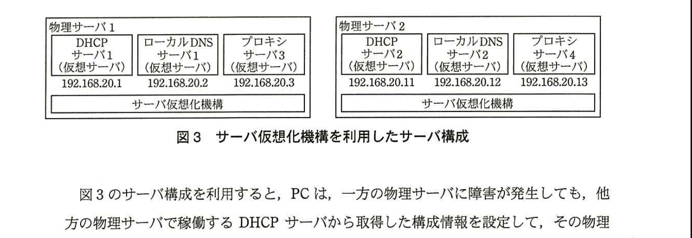
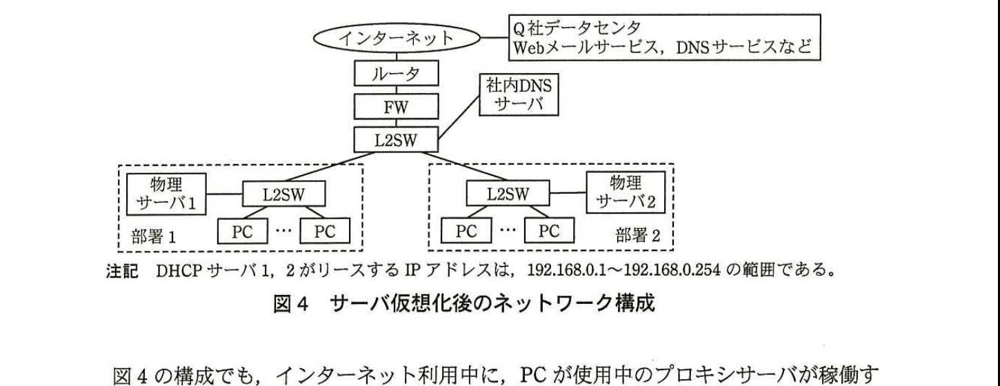

# 2015年春期（平成27年度）応用情報技術者試験 午後 問5（選択）
## ネットワーク：DHCPを利用したサーバの冗長化（P社）

---

## 問題文

**問5** DHCPを利用したサーバの冗長化に関する次の記述を読んで、設問1〜4に答えよ。

P社は、社員100名の調査会社である。P社では、インターネットから様々な情報を収集し、業務で活用している。顧客との情報交換には、ISPのQ社が提供するWebメールサービスを利用している。Webの閲覧や電子メールの送受信などのインターネットの利用は、全てプロキシサーバ経由で行っている。

現在のP社のネットワーク構成を図1に示す。

> 図1の内容：インターネット―ルータ―FW―L2SWと接続。L2SWに社内DNSサーバとDHCPサーバが接続。L2SW配下に部署1（プロキシサーバ1、L2SW、複数PC）と部署2（L2SW、複数PC、プロキシサーバ2）が接続。インターネットにはQ社データセンタ（Webメールサービス、DNSサービスなど）も接続。P社のネットワークアドレスは192.168.0.0/16で、DHCPサーバがリースするIPアドレスは192.168.0.1〜192.168.0.254の範囲。サーバには192.168.10.1〜192.168.10.4のIPアドレスが設定されている。

部署1のPCはプロキシサーバ1を、部署2のPCはプロキシサーバ2を経由してインターネットを利用している。PCは、(ア)DHCPサーバから、自身のIPアドレスを含むネットワーク関連の構成情報（以下、構成情報という）を取得して自動設定している。ただし、使用するプロキシサーバと社内DNSサーバのIPアドレスは、あらかじめPCに設定されている。プロキシサーバ1、2は、優先DNSとして社内DNSサーバを、代替DNSとしてQ社のDNSサービスを利用している。

先般、プロキシサーバ1に障害が発生し、部署1で半日の間インターネットが利用できなくなり、業務が混乱した。この事態を重視した情報システム部のR課長は、ネットワーク担当のS君に、次の2点の要件を満たす対応策の検討を指示した。

・プロキシサーバとDHCPサーバを冗長構成にして、サーバ障害発生時のインターネット利用の中断を短時間に抑えられるようにすること。
・費用をできるだけ抑えられる構成とすること。

---

### 〔冗長化方式の検討〕

S君は、PCの構成情報を自動設定するためのDHCPの仕組みに注目した。

同一サブネットに2台のDHCPサーバがあっても、PCによる自動設定は問題なく行われるので、DHCPサーバを2台導入して冗長化する。

PCは、使用するDNSサーバのIPアドレスをDHCPサーバから取得できる。そこで、DNSサーバとプロキシサーバを2台ずつ導入して、2台のDHCPサーバからそれぞれ異なるDNSサーバのIPアドレスを取得させるようにする。そして、2台のプロキシサーバに同じホスト名を付与し、それぞれのDNSサーバのAレコードに、プロキシサーバのホスト名に対して、異なるプロキシサーバの`[　a　]`を登録する。

この構成にすれば、どちらのDHCPサーバから取得した構成情報をPCが自動設定するかによって、使用するDNSサーバが変わる。そこで、PCのWebブラウザの設定情報の中に、プロキシサーバの`[　b　]`を登録すれば、PCが使用するプロキシサーバを変えることができる。

DHCPサーバによる構成情報の付与シーケンスを図2に示す。DHCPメッセージは、OSI基本参照モデル第4層の`[　c　]`プロトコルで送受信される。

> 図2の内容：PCがDHCPDISCOVER（DHCPサーバの探索、ブロードキャスト）を送信すると、DHCPサーバ1・2の両方が受信する（①）。DHCPサーバ1は②DHCPOFFER、DHCPサーバ2は③DHCPOFFERをそれぞれPCに提案する。PCは④DHCPREQUEST（DHCPサーバ1に構成情報の要求、ブロードキャスト）を送信し、両方のDHCPサーバが受信する。DHCPサーバ1は⑤DHCPACK（構成情報の提供）をPCに返す。（注記1：PCが先に受信した提案を受け入れる仕様。注記2：●はPCが送出するフレームが一つであることを示す。）

S君はこのようなDHCPとDNSの仕組みを利用し、DHCPサーバ及びプロキシサーバの冗長化を実現することにした。

---

### 〔DHCPサーバとプロキシサーバの冗長化〕

PCでのインターネット利用の中断を避けるためには、PCがDHCPサーバから取得したIPアドレスをもつDNSサーバと、そのPCがDNSサーバで取得したIPアドレスをもつプロキシサーバが同時に稼働している必要がある。

S君はこの条件を基に、サーバ間の独立性が確保できるサーバ仮想化機構を利用した冗長化方式をまとめた。

サーバ仮想化機構を利用したサーバ構成を図3に示す。

図3中の、ローカルDNSサーバ1、2は、図1中の社内DNSサーバとは別に導入し、プロキシサーバ3、4の名前解決を行う。プロキシサーバ3、4には、図1中のプロキシサーバ1、2と同様のDNSの設定を行う。プロキシサーバ1、2は不要になるので、それらのサーバが稼働するハードウェアを物理サーバ1、2として再利用する。

> 図3の内容：物理サーバ1（サーバ仮想化機構上にDHCPサーバ1(仮想サーバ)＝192.168.20.1、ローカルDNSサーバ1(仮想サーバ)＝192.168.20.2、プロキシサーバ3(仮想サーバ)＝192.168.20.3を稼働）。物理サーバ2（サーバ仮想化機構上にDHCPサーバ2(仮想サーバ)＝192.168.20.11、ローカルDNSサーバ2(仮想サーバ)＝192.168.20.12、プロキシサーバ4(仮想サーバ)＝192.168.20.13を稼働）。

図3のサーバ構成を利用すると、PCは、一方の物理サーバに障害が発生しても、他方の物理サーバで稼働するDHCPサーバから取得した構成情報を設定して、その物理サーバで稼働するプロキシサーバ経由でインターネットを利用できる。サーバ仮想化後のネットワーク構成を図4に示す。

> 図4の内容：インターネット―ルータ―FW―L2SWと接続。L2SWに社内DNSサーバが接続。L2SW配下に部署1（物理サーバ1、L2SW、複数PC）と部署2（L2SW、複数PC、物理サーバ2）が接続。インターネットにはQ社データセンタ（Webメールサービス、DNSサービスなど）も接続。DHCPサーバ1、2がリースするIPアドレスは192.168.0.1〜192.168.0.254の範囲。

図4の構成でも、インターネット利用中に、PCが使用中のプロキシサーバが稼働する物理サーバに障害が発生したときは、PCのインターネット利用が中断してしまう。

しかし、PCを再起動してPCの構成情報を再設定すればインターネットの利用を再開できるので、中断は短時間に抑えられる。

S君は、検討結果をR課長に報告した。R課長がS君の検討結果を承認し、導入が進められることになった。

---

## 設問

### 設問1
本文中の`[　a　]`〜`[　c　]`に入れる適切な字句を解答群の中から選び、記号で答えよ。

解答群
- ア　ICMP
- イ　IPアドレス
- ウ　MACアドレス
- エ　TCP
- オ　UDP
- カ　ドメイン名
- キ　ホスト名

### 設問2
本文中の下線（ア）について、自動設定できる構成情報を解答群の中から二つ選び、記号で答えよ。

解答群
- ア　DNSキャッシュ時間
- イ　サブネットマスク
- ウ　デフォルトゲートウェイのIPアドレス
- エ　プロキシサーバのIPアドレス

### 設問3
〔冗長化方式の検討〕について、(1)、(2)に答えよ。

(1) 図2中の①DHCPDISCOVERと④DHCPREQUESTは、全てのDHCPサーバで受信される。その通信方式を答えよ。

(2) 図2中の④DHCPREQUESTの内容から、2台のDHCPサーバが知ることができるDHCPOFFERの結果について、20字以内で述べよ。

### 設問4
〔DHCPサーバとプロキシサーバの冗長化〕について、(1)、(2)に答えよ。

(1) 図3中のDHCPサーバ1が、PCに提案すべきDNSサーバのIPアドレスを答えよ。また、そのDNSサーバに登録されるべきプロキシサーバのIPアドレスを答えよ。

(2) 図3、4の構成としたとき、PCのWebブラウザでインターネットを利用する際に、社内DNSサーバを使用するサーバ又はPCのIPアドレスを、全て答えよ。

---

## 解答と解説

### 設問1

**正解：a＝イ、b＝キ、c＝オ**

2台のDNSサーバのAレコードに、同じホスト名を持つ2台のプロキシサーバそれぞれ異なる「**IPアドレス**」（イ）を登録することで、どちらのDNSサーバに問い合わせるかによって解決されるプロキシサーバが変わる。また、PCのWebブラウザ設定にプロキシサーバの「**ホスト名**」（キ）を登録しておけば、DNSの名前解決結果に応じて実際に使用されるプロキシサーバを切り替えられる。DHCPメッセージはOSI基本参照モデル第4層（トランスポート層）の「**UDP**」（オ）プロトコルで送受信される。

**IPA公式：a＝イ、b＝キ、c＝オ**

### 設問2

**正解：イ、ウ**

DHCPによって自動設定できる構成情報には、IPアドレス、サブネットマスク（イ）、デフォルトゲートウェイのIPアドレス（ウ）、DNSサーバのIPアドレスなどがある。DNSキャッシュ時間（ア）はDNSサーバ側の設定情報であり、プロキシサーバのIPアドレス（エ）は本文にあるとおり「あらかじめPCに設定されている」ものであり、DHCPによる自動設定の対象ではない。

**IPA公式：イ，ウ**

### 設問3

**(1) 正解：ブロードキャスト**

PCはまだDHCPサーバのIPアドレスを知らない状態でDHCPDISCOVERを送信するため、宛先を特定できず、同一セグメント内の全ての機器（全てのDHCPサーバを含む）に届く「**ブロードキャスト**」で送信される。DHCPREQUESTについても、どのDHCPサーバの提案を受け入れたかを他のDHCPサーバにも知らせる目的でブロードキャストされる。

**IPA公式：ブロードキャスト**

**(2) 正解例：自身の提案が受け入れられたかどうか**

図2のとおり、④DHCPREQUESTは「DHCPサーバ1に構成情報の要求」という内容が付与された状態でブロードキャストされ、DHCPサーバ1・2の両方がこれを受信する。この内容から、DHCPサーバ2は自身が提案した内容がPCに採用されなかったこと（DHCPサーバ1の提案が採用されたこと）を知ることができる。すなわち、2台のDHCPサーバは、この内容から「**自身の提案が受け入れられたかどうか**」を知ることができる。

**IPA公式：自身の提案が受け入れられたかどうか**

### 設問4

**(1) 正解：DNSサーバのIPアドレス＝192.168.20.2、プロキシサーバのIPアドレス＝192.168.20.3**

DHCPサーバ1が稼働する物理サーバ1では、ローカルDNSサーバ1（192.168.20.2）とプロキシサーバ3（192.168.20.3）が同じ物理サーバ上の仮想サーバとして稼働している。物理サーバ間の独立性を確保するには、DHCPサーバ1がPCに提案するDNSサーバは同一物理サーバ上のローカルDNSサーバ1（**192.168.20.2**）であるべきであり、そのDNSサーバに登録されるプロキシサーバのIPアドレスも同一物理サーバ上のプロキシサーバ3（**192.168.20.3**）であるべきである。こうすることで、一方の物理サーバに障害が発生しても、他方の物理サーバだけで名前解決からプロキシサーバ利用まで完結できる。

**IPA公式：DNSサーバのIPアドレス＝192.168.20.2、プロキシサーバのIPアドレス＝192.168.20.3**

**(2) 正解：192.168.20.3、192.168.20.13**

図4の構成では、社内DNSサーバはルータ配下のL2SWに接続されており、図1と同様にプロキシサーバの優先DNSとしては使われず、ローカルDNSサーバ（プロキシサーバ3、4の名前解決用）が別途用意されている。社内DNSサーバを実際に使用するのは、Webブラウザ経由でインターネットを利用する際にプロキシサーバ自身が名前解決に利用する場合であり、これはプロキシサーバ3（192.168.20.3）とプロキシサーバ4（192.168.20.13）自身である。PCは社内DNSサーバではなくローカルDNSサーバを利用するため、社内DNSサーバを使用するのはプロキシサーバ3、4のIPアドレス「**192.168.20.3、192.168.20.13**」のみとなる。

**IPA公式：192.168.20.3，192.168.20.13**

---

## 参考：主要キーワード

| 用語 | 説明 |
|------|------|
| DHCP（Dynamic Host Configuration Protocol） | IPアドレスなどのネットワーク構成情報をクライアントに自動的に割り当てるプロトコル。UDPで通信する |
| DHCPの4Way Handshake | DISCOVER→OFFER→REQUEST→ACKの4段階でクライアントに構成情報を付与する手順 |
| ブロードキャスト | 同一セグメント内の全ての機器に対して送信する通信方式。DHCPDISCOVER・REQUESTなどで使用される |
| Aレコード | DNSにおいて、ホスト名（ドメイン名）とIPv4アドレスを対応付けるレコード |
| サーバ仮想化機構 | 1台の物理サーバ上に複数の仮想サーバを独立して稼働させる技術。物理サーバ間の独立性を保ちながら冗長化を実現できる |
