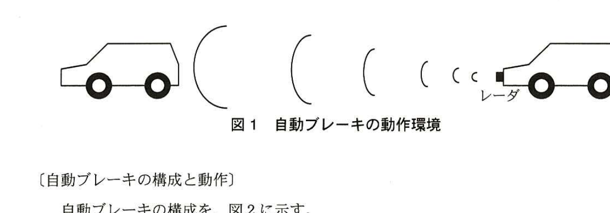
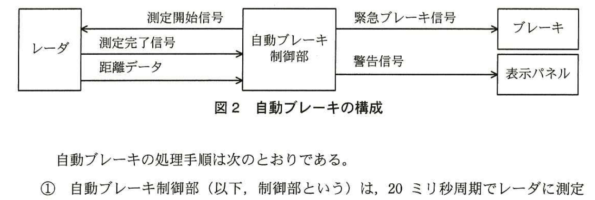
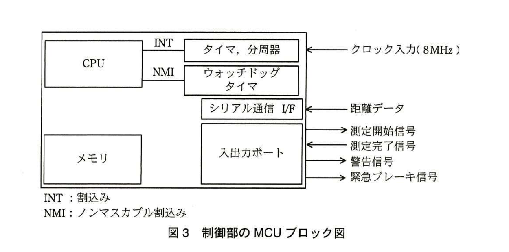
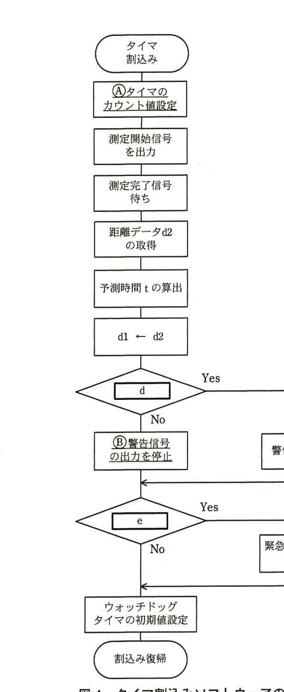

# 2015年春期（平成27年度）応用情報技術者試験 午後 問7（選択）
## 組込みシステム開発：自動車用衝突被害軽減ブレーキシステム（G社）

---

## 問題文

**問7** 自動車用衝突被害軽減ブレーキシステムに関する次の記述を読んで、設問1〜3に答えよ。

G社は、自動車用衝突被害軽減ブレーキシステム（以下、自動ブレーキという）を開発している。自動ブレーキ装着車両は、車体の前部に設置されているミリ波レーダ装置（以下、レーダという）によって、前を走行している車両との距離を測定し、衝突のおそれがあるときにブレーキ操作を行う。

自動ブレーキの動作環境を、図1に示す。



> 図1の内容：自動ブレーキ装着車両（右側、レーダを前部に装備）が、前方を走行する車両（左側）との距離をミリ波レーダで測定している様子。

---

### 〔自動ブレーキの構成と動作〕

自動ブレーキの構成を、図2に示す。



> 図2の内容：レーダと自動ブレーキ制御部の間で「測定開始信号」（制御部→レーダ）、「測定完了信号」「距離データ」（レーダ→制御部）をやり取りする。自動ブレーキ制御部から「緊急ブレーキ信号」をブレーキへ、「警告信号」を表示パネルへ出力する。

自動ブレーキの処理手順は次のとおりである。

① 自動ブレーキ制御部（以下、制御部という）は、20ミリ秒周期でレーダに測定開始信号を出力する。

② レーダは、測定開始信号が入力されると、前を走行している車両との距離測定を開始し、10ミリ秒後に測定完了信号と距離データを制御部に出力する。

③ 制御部は、測定完了信号が入力されると、距離データを0.01m単位で読み取り、相対速度を算出する。相対速度s（m／秒）は、前回測定した距離d1（m）、今回測定した距離d2（m）及び経過時間（20ミリ秒）を用いて、次の式で計算することができる。

```
s = (d1－d2) ／ [　a　]
```

④ 制御部は、衝突までの予測時間（以下、予測時間という）を算出する。予測時間t（秒）は、次の式で計算することができる。

```
t = [　b　] ／ [　c　]
```

⑤ 制御部は、算出した予測時間によって次の処理を行う。

・予測時間が0秒以上3秒未満のとき、制御部は警告信号を出力し、表示パネルに警告表示を行わせる。
・予測時間が0秒以上1.5秒未満のとき、制御部は緊急ブレーキ信号を出力して、ブレーキを作動させる。

---

### 〔制御部の構成とタイマ割込みソフトウェア〕

制御部のMCUブロック図を、図3に示す。



> 図3の内容：CPUがINT（割込み）でタイマ・分周器（クロック入力8MHz）と接続、NMI（ノンマスカブル割込み）でウォッチドッグタイマと接続。シリアル通信I/Fが距離データを受信。入出力ポートが測定開始信号（出力）、測定完了信号（入力）、警告信号（出力）、緊急ブレーキ信号（出力）を扱う。メモリも搭載。

MCUは、クロック入力を8分周したクロックで内蔵されたタイマをダウンカウントし、カウント値が0になるとCPUに割込みを発生させる。タイマ割込みソフトウェアは、次の割込みが20ミリ秒後に発生するようにタイマのカウント値を設定する。

タイマ割込みソフトウェアのフロー図を、図4に示す。



> 図4の内容：「タイマ割込み」開始→「(A)タイマのカウント値設定」→「測定開始信号を出力」→「測定完了信号待ち」→「距離データd2の取得」→「予測時間tの算出」→「d1←d2」→条件分岐`[　d　]`（Yesなら「警告信号を出力」、Noなら「(B)警告信号の出力を停止」）→合流後、条件分岐`[　e　]`（Yesなら「緊急ブレーキ信号を出力」、Noならそのまま）→合流後「ウォッチドッグタイマの初期値設定」→「割込み復帰」。

自動ブレーキには安全設計が求められるので、ウォッチドッグタイマを使って、タイマ割込みソフトウェアが動作しているかを周期的に監視する。

---

## 設問

### 設問1
〔自動ブレーキの構成と動作〕について、(1)〜(3)に答えよ。

(1) 式中の`[　a　]`〜`[　c　]`に入れる適切な数値又は字句を答えよ。

(2) 相対速度sが負数になる場合の、自動ブレーキ装着車両と前を走行する車両との関係を、15字以内で述べよ。

(3) 時速18km／時で走行している自動ブレーキ装着車両の前方に停止している車両がある。このとき、ブレーキが作動してから停止するまでの走行距離を6mとすると、停止している車両の何m前で停止することができるか。答えは小数第2位を切り上げ、小数第1位まで求めよ。ここで、測定周期及び測定に掛かる時間の影響は、無視できるものとする。

### 設問2
図4中の処理及び条件式について、(1)〜(3)に答えよ。

(1) 下線Ⓐにおいて、タイマのカウント値に設定する値を10進数で答えよ。ここで、割込み発生からタイマのカウント値設定までの処理時間は、無視できるものとする。

(2) `[　d　]`、`[　e　]`に入れる適切な条件式を解答群の中から選び、記号で答えよ。

解答群
- ア　0秒 ≦ t ＜ 1.5秒
- イ　0秒 ≦ t ＜ 3秒
- ウ　1.5秒 ≦ t ＜ 3秒
- エ　t ＜ 3秒

(3) 下線Ⓑを行わないときに発生する不具合を、20字以内で述べよ。

### 設問3
ウォッチドッグタイマによって割込みを発生させる間隔（ミリ秒）として適切な数値を解答群の中から選び、記号で答えよ。

解答群
- ア　5
- イ　15
- ウ　25

---

## 解答と解説

### 設問1

**(1) 正解：a＝0.02、b＝d2、c＝s**

経過時間は「20ミリ秒」であり、秒単位に換算すると0.02秒であるから、`[　a　]`＝**0.02**となる。予測時間tは、現在の車間距離d2を相対速度sで割ることで求められる（距離÷速度＝時間）ため、`[　b　]`＝**d2**、`[　c　]`＝**s**となる。

**IPA公式：a＝0.02、b＝d2、c＝s**

**(2) 正解例：車間距離が広がっている。**

相対速度s＝(d1－d2)／0.02において、sが負数になるのはd1＜d2、すなわち前回の測定より今回の測定の方が距離が大きくなった場合である。これは自動ブレーキ装着車両と前方車両との車間距離が広がっている（前方車両が遠ざかっている、又は自車が減速している）ことを意味する。

**IPA公式：車間距離が広がっている。**

**(3) 正解：1.5（m）**

時速18km／時を秒速に換算すると、18×1000／3600＝5（m／秒）となる。前方車両は停止しているため、相対速度s＝5（m／秒）で一定である。緊急ブレーキは予測時間tが1.5秒未満になった時点で作動するため、作動時の車間距離d2は、t＝d2／s＜1.5より、d2が1.5×5＝7.5（m）を下回った時点で作動する。測定周期・測定時間の影響を無視できるとすると、ブレーキ作動時の車間距離は7.5mとみなせる。ブレーキ作動後の走行距離が6mであるから、停止位置は前方車両の7.5－6＝**1.5**（m）手前となる。

**IPA公式：1.5**

### 設問2

**(1) 正解：20,000**

タイマは、クロック入力8MHzを8分周したクロック（すなわち8,000,000÷8＝1,000,000Hz＝1μ秒周期）でダウンカウントする。次の割込みを20ミリ秒（20,000μ秒）後に発生させるためには、1μ秒ごとに1減少するカウンタに20,000をカウント値として設定すればよい。したがって、設定するカウント値は**20,000**である。

**IPA公式：20,000**

**(2) 正解：d＝イ、e＝ア**

図4のフローでは、予測時間tの算出後、まず警告信号出力の判定（`[　d　]`）を行い、続けて緊急ブレーキ信号出力の判定（`[　e　]`）を行う。本文⑤の「予測時間が0秒以上3秒未満のとき、警告信号を出力する」という条件から`[　d　]`＝「**0秒 ≦ t ＜ 3秒**」（イ）となり、「予測時間が0秒以上1.5秒未満のとき、緊急ブレーキ信号を出力する」という条件から`[　e　]`＝「**0秒 ≦ t ＜ 1.5秒**」（ア）となる。

**IPA公式：d＝イ、e＝ア**

**(3) 正解例：衝突を回避しても警告が止まらない。**

下線Ⓑの処理は、予測時間が警告条件（0秒≦t＜3秒）を満たさなくなった場合に警告信号の出力を停止する処理である。この処理を行わないと、一度警告信号が出力された後、たとえ衝突の危険が解消されて予測時間が3秒以上になっても警告信号の出力が停止されないままとなり、衝突を回避した後も警告が鳴り続けてしまうという不具合が発生する。

**IPA公式：衝突を回避しても警告が止まらない。**

### 設問3

**正解：ウ**

ウォッチドッグタイマは、タイマ割込みソフトウェアが正常に周期的（20ミリ秒周期）に動作していることを監視するために用いられる。図4のフローの最後で「ウォッチドッグタイマの初期値設定」が毎回のタイマ割込み処理の中で実行されており、これが実行されればウォッチドッグタイマがリセットされる。ソフトウェアの周期は20ミリ秒であるため、ウォッチドッグタイマの監視間隔は、この周期よりも長く、かつ異常を早期に検知できる程度の余裕を持たせた値（25ミリ秒、ウ）が適切である。5ミリ秒（ア）や15ミリ秒（イ）では、正常な20ミリ秒周期の動作でも監視間隔内に処理が完了せず、誤って異常と判定してしまう。

**IPA公式：ウ**

---

## 参考：主要キーワード

| 用語 | 説明 |
|------|------|
| ミリ波レーダ | ミリ波帯の電波を用いて、対象物との距離や相対速度を測定する装置。自動車の衝突被害軽減ブレーキなどに利用される |
| タイマ割込み | 一定周期でCPUに割込みを発生させ、周期的な処理（リアルタイム処理）を実現する仕組み |
| ウォッチドッグタイマ（WDT） | ソフトウェアが正常に動作しているかを監視するためのタイマ。一定時間内にリセットされないと異常とみなし、システムに介入する |
| ノンマスカブル割込み（NMI） | マスク（禁止）できない優先度の高い割込み。ウォッチドッグタイマの異常検知などに用いられる |
| 分周器 | 入力クロックの周波数を整数分の1に下げる回路。MCU内部のタイマのカウント速度を調整するために使われる |
