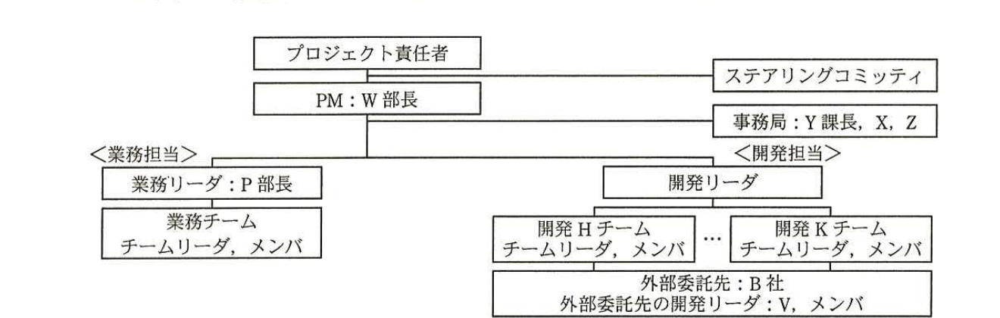

# 2015年春期（平成27年度）応用情報技術者試験 午後 問9（選択）
## プロジェクトマネジメント：プロジェクトの人的資源計画とコミュニケーション計画の策定及び実施（A社）

---

## 問題文

**問9** プロジェクトの人的資源計画とコミュニケーション計画の策定及び実施に関する次の記述を読んで、設問1〜3に答えよ。

A社は、食品加工業を営む中堅の会社である。中長期売上目標を達成するための施策として、物流システムを再構築することを決定し、プロジェクトを立ち上げた。プロジェクトマネージャ（PM）には、システム部のW部長が任命された。システム部のX君は、システム部のY課長と利用部門である営業部のZ君とともに、プロジェクト運営事務局（以下、事務局という）のメンバに任命された。

新物流システムは利用部門の意見を最大限に取り入れ、利用者の操作画面を一新するとともに、ワークフローを取り入れて業務プロセスを大きく変えようとしていた。そのため、利用部門をプロジェクトに巻き込んで一体感を生むことが必要であった。

---

### 〔人的資源計画及びコミュニケーション計画〕

W部長と事務局は、人的資源計画及びコミュニケーション計画の立案に着手した。まず、人的資源計画として図1に示すプロジェクト体制図を作成した。

> 図1の内容：プロジェクト責任者の配下にPM（W部長）が位置し、右側にステアリングコミッティ、その下に事務局（Y課長、X、Z）が並ぶ。PMの配下は〈業務担当〉と〈開発担当〉に分かれ、業務担当は業務リーダ（P部長）→業務チーム（チームリーダ、メンバ）、開発担当は開発リーダ→開発Hチーム〜開発Kチーム（各チームリーダ、メンバ）→外部委託先：B社（外部委託先の開発リーダ：V、メンバ）と続く。

W部長は、プロジェクトメンバを、業務担当は①利用部門から専任で選出し、開発担当はシステム部から専任で選出してPMの配下に置いた。同時に、A社内で全体の利害調整や意思決定を行う委員会組織であるステアリングコミッティが設置された。本プロジェクトのステークホルダは、A社内では経営層、利用部門とシステム部、社外では原材料供給業者、卸売業者、システム開発委託先など多岐にわたった。例えば、ステアリングコミッティのメンバである営業担当役員のN常務は、本プロジェクトの活動を営業部長のP氏に一任していたのでプロジェクトへの直接の関与は少なかったが、業務プロセスの改革によって商品の納期が大幅に短縮されることを期待していたので、プロジェクトへの関心は高かった。

A社は、詳細設計からソフトウェア結合テストまでの開発工程について、過去に取引実績があったB社と請負契約を締結した。それ以外の工程は、準委任契約とした。B社の開発リーダであるV氏は、過去にA社の大規模開発プロジェクトに携わった経験があり、A社からの信頼が厚かった。X君は、プロジェクト計画書、及び開発要員に対する要求事項を、V氏に提示した。それを受けて、B社は、A社システムの開発経験者を中心に20数名の開発要員を手配した。

次に、事務局は、プロジェクトにおける工程ごとの`[　a　]`、責任及び権限を明確にするために、表1に示す責任分担のマトリックスを作成した。

### 表1 物流システム再構築プロジェクトの責任分担のマトリックス（抜粋）

| No. | 工程名 | PM | 業務担当 | 開発担当：A社 | 開発担当：B社 |
|---|---|---|---|---|---|
| 1 | 要件定義 | 管理責任 | 実行責任 | 作業支援 | 作業支援 |
| 2 | 設計 | 管理責任 | 作業支援 | 実行責任 | 作業支援 |
| 3 | 開発 1) | 管理責任 | － | － | 実行責任 |
| 4 | システムテスト | 管理責任 | － | 実行責任 | 作業支援 |
| 5 | ユーザ受入れテスト | 管理責任 | 実行責任 | 作業支援 | 作業支援 |
| 6 | 移行 | 管理責任 | 実行責任 | 実行責任 | 作業支援 |

（注1　開発：詳細設計〜ソフトウェア結合テスト）

利用部門とシステム部は、これまでもシステム化案件に関する定例会議を開催していたが、利用部門は積極的に参加せず、コミュニケーションが十分に図られていなかった。そこで、責任分担のマトリックスに、要件定義、ユーザ受入れテスト、移行の実行、及び設計の作業支援は、業務担当の`[　a　]`であることを明記した。

さらに、コミュニケーション計画の一環で、プロジェクトに対する各ステークホルダの`[　b　]`関係及び関与に関する情報を基に、ステークホルダ登録簿を作成した。`[　b　]`が対立する可能性があるステークホルダに対して、印を付けた。

---

### 〔設計工程でのコミュニケーション〕

設計工程に入り、事務局は週次開催の進捗確認会議を設定した。参加者は、W部長、事務局、P部長、業務チームリーダ、開発リーダ、H〜Kの開発チームリーダとした。事務局は、各開発チームリーダからの報告に基づき、全体の進捗状況を一覧形式でまとめた。さらに、進捗状況や課題などについて、月ごとに、プロジェクト状況報告書を作成し、ステアリングコミッティへ報告した。また、プロジェクトの管理情報は共有ファイルサーバに格納されており、ステークホルダ登録簿に設定されているアクセス権限に応じた資料の閲覧が可能であった。

X君は、初回の進捗確認会議の冒頭で、前週時点の設計書の作成の予実を提出するように、開発チームリーダに指示した。会議終了後、作業の進捗度合をどのように報告すべきか、という問合せがあった。A社では、社内のプロジェクト活動の標準化を推進中であったが、その時点では作業の進捗度合に関する正式な社内基準はなかった。X君は、過去に採用された基準の事例を調べ、活動中の他プロジェクトの事務局とも話し合った結果、次に示す基準をまとめ、この基準を採用すると結論付けた。

- 作業ステータスは、設計書ごとに"作業未着手"、"作業中（設計書作成中）"、"レビュー中（レビュー及び指摘事項の対応中）"、"作業完了"の4段階で示す。
- "作業中"の進捗度合は、設計書ごとに"作成ページ数／予定ページ数"で示す。

X君は、②本プロジェクトではX君がまとめたこの基準に従って報告するように回答し、プロジェクト内に周知徹底した。

利用部門は、要件定義工程でシステムへの要求仕様についてシステム部と合意していた。しかし、設計工程に入っても、利用部門から仕様に関する質問が頻繁にあった。A社内では、利用部門との質疑応答は全て事務局で受け付け、仕分けする手順になっていて、今のところ遅滞なく運営されていた。しかし、連絡手段が電子メール、電話、対面と様々であったので、事務局はそれらを仕分けたり、電話や対面による連絡内容を文書化したりすることに多くの時間を費やしていた。さらに、必要項目が漏れていることが度々あった。その結果、事務局から開発リーダ及び開発チームリーダに質問内容を的確に伝えられなかったケースが発生していた。X君は、これらの対策として、③プロジェクトにおける質疑応答の連絡手段を電子メールに限定し、B社を含めたプロジェクトの関係者全員に周知徹底した。

---

### 〔ソフトウェア結合テスト工程でのコミュニケーション〕

ソフトウェア結合テスト実施中、X君は、Y課長から緊急の仕様変更指示を受けた。3日後に予定している次回のテスト実施までに、プログラムの変更が必要だった。その日、B社のV氏は出張で不在だった。X君は、A社の開発リーダがB社の開発要員を招集してプログラムの変更を直接指示してもよいかと、Y課長に相談した。しかし、Y課長からは④"B社の開発要員に、直接指示してはいけない。"と指摘されたので、プロジェクト内で定めた基準に従い、B社にプログラムの変更を指示した。B社の開発要員の速やかな対応によって、予定どおり次回のテストに進むことができた。

---

## 設問

### 設問1
〔人的資源計画及びコミュニケーション計画〕について、(1)〜(3)に答えよ。

(1) W部長が本文中の下線①のようにした狙いを、A社内のコミュニケーションの観点から30字以内で述べよ。

(2) ステアリングコミッティにおいて、重要な意思決定が円滑に行われるために、ステアリングコミッティのメンバであるN常務に適した効果の高いコミュニケーション活動を解答群の中から選び、記号で答えよ。

解答群
- ア　共有ファイルサーバに格納されている、アクセス権限が高いステークホルダ向けのプロジェクトの管理情報を閲覧してもらう。
- イ　週次開催の進捗確認会議への出席を依頼する。
- ウ　適時個別の場を設け、プロジェクトの成果や状況を具体的に報告する。
- エ　プロジェクト状況報告書を、毎月送付する。
- オ　プロジェクトへの質問や意見が出されることを待ち、それらを受けたら、迅速かつ的確に対応する。

(3) 本文中の`[　a　]`、`[　b　]`に入れる適切な字句を答えよ。

### 設問2
〔設計工程でのコミュニケーション〕について、(1)、(2)に答えよ。

(1) X君が行った本文中の下線②を受けて、A社として社内プロジェクト活動の標準化推進の観点から行うべきことを40字以内で述べよ。

(2) X君は、質疑応答の連絡における問題点を解消するために、本文中の下線③のとおりにした。さらに実行すべき対策を20字以内で述べよ。

### 設問3
本文中の下線④について、Y課長が指摘した理由を20字以内で述べよ。

---

## 解答と解説

### 設問1

**(1) 正解例：利用部門をプロジェクトに巻き込んで一体感を生むため**

本文冒頭に「新物流システムは利用部門の意見を最大限に取り入れ、利用者の操作画面を一新するとともに、ワークフローを取り入れて業務プロセスを大きく変えようとしていた。そのため、利用部門をプロジェクトに巻き込んで一体感を生むことが必要であった」とある。業務担当を利用部門から専任で選出したのは、まさにこの一体感の醸成を狙ったものである。

**IPA公式：利用部門をプロジェクトに巻き込んで一体感を生むため**

**(2) 正解：ウ**

N常務は業務プロセス改革によるプロジェクト成果（納期短縮）への関心は高いが、活動への直接関与は少なく、日常の会議体（週次進捗確認会議など）への出席は現実的でない。このようなステークホルダには、適時個別の場を設けて成果や状況を具体的に報告する（ウ）ことが、効果的かつ効率的なコミュニケーション活動となる。ア・エは一方的な情報提供にとどまり関心の高さに応えられず、イは多忙な役員の出席を前提とし非現実的、オは事務局側が受け身であり積極的な関与を引き出せない。

**IPA公式：ウ**

**(3) 正解：a＝役割、b＝利害**

責任分担のマトリックス（表1）は、工程ごとの「役割」、責任及び権限を明確にするものであり、`[　a　]`＝**役割**となる。また、ステークホルダ登録簿は、各ステークホルダの「利害」関係及び関与に関する情報を基に作成し、利害が対立する可能性があるステークホルダに印を付けるものであるから、`[　b　]`＝**利害**となる。

**IPA公式：a＝役割、b＝利害**

### 設問2

**(1) 正解例：X君がまとめた基準を正式な社内基準とすべきかを検討する。**

X君は、社内に正式な基準がなかったため、独自に進捗度合の基準をまとめてプロジェクト内で採用した。社内のプロジェクト活動の標準化を推進中であるA社としては、このX君がまとめた基準を他プロジェクトにも展開できる正式な社内基準とすべきかどうかを検討し、標準化に反映することが求められる。

**IPA公式：X君がまとめた基準を正式な社内基準とすべきかを検討する。**

**(2) 正解例：連絡が必要な項目を定める。**

質疑応答の連絡手段を電子メールに限定しただけでは、必要項目の漏れという問題は解消されない。連絡すべき項目（宛先、質問内容、期限など）をあらかじめ定型化して定めておくことで、必要項目の漏れを防ぎ、的確な連絡が行えるようになる。

**IPA公式：連絡が必要な項目を定める。**

### 設問3

**正解例：開発工程は請負契約としたから**

A社は、詳細設計からソフトウェア結合テストまでの開発工程についてB社と請負契約を締結している。請負契約においては、成果物の完成に関する業務遂行の指揮命令権は請負者（B社）側にあり、発注者（A社）が請負契約の相手方の作業者に直接指揮命令を行うと、労働者派遣法上の「偽装請負」に該当するおそれがある。そのため、Y課長はA社の開発リーダがB社の開発要員に直接指示することを禁じた。

**IPA公式：開発工程は請負契約としたから**

---

## 参考：主要キーワード

| 用語 | 説明 |
|------|------|
| 責任分担のマトリックス（RAM） | プロジェクトの作業（工程）と役割・責任者の対応関係を一覧化した図表。管理責任・実行責任・作業支援などを明示する |
| ステークホルダ登録簿 | プロジェクトの利害関係者の情報（関与度、利害関係、影響力など）を記録した文書。コミュニケーション計画の基礎となる |
| 請負契約と偽装請負 | 請負契約では指揮命令権は請負者側にあり、発注者が請負者の作業員に直接指示すると労働者派遣法違反（偽装請負）となるおそれがある |
| プロジェクト体制図 | プロジェクトの組織構造・指揮命令系統・役割分担を図示したもの |
| コミュニケーションマネジメント計画 | ステークホルダの特性に応じて、適切な情報伝達の方法・頻度・手段を計画すること |
