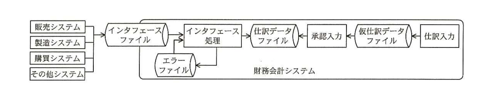

# 2015年春期（平成27年度）応用情報技術者試験 午後 問11（必須）
## システム監査：財務会計システムの運用の監査（H社）

---

## 問題文

**問11** 財務会計システムの運用の監査に関する次の記述を読んで、設問1〜6に答えよ。

H社は、部品メーカであり、原材料を仕入れて自社工場で製造し、主に組立てメーカに販売している。H社では、財務会計システムのコントロールの運用状況について、監査室による監査が実施されることになった。

財務会計システムは、2年前に導入したシステムである。財務会計システムに関連する販売システム、製造システム、購買システムなど（以下、関連システムという）は、全て自社で開発したものである。財務会計システムは、関連システムからのインタフェースによる自動仕訳と手作業による仕訳入力の機能で構成されている。

財務会計システムの処理概要を図1に示す。

> 図1の内容：販売システム、製造システム、購買システム、その他システムから「インタフェースファイル」へデータが渡され、「インタフェース処理」で取り込まれて「仕訳データファイル」に格納される。インタフェース処理でエラーが発生すると「エラーファイル」に格納され、再度インタフェース処理に取り込まれる。一方、「仕訳入力」で入力されたデータは「仮仕訳データファイル」に格納され、「承認入力」を経て「仕訳データファイル」に格納される。これらは全て財務会計システムの内部処理である。

---

### 〔財務会計システムの予備調査〕

監査室が、財務会計システムに関する予備調査によって入手した情報は、次のとおりである。

(1) 関連システムからのインタフェースによる自動仕訳

① 財務会計システムには、仕訳の基礎情報となるトランザクションデータが各関連システムからインタフェースファイルとして提供される。

② インタフェースファイルは、日次の夜間バッチ処理のインタフェース処理に取り込まれる。インタフェース処理は、必要な項目のチェックを行い、仕訳データを生成して、仕訳データファイルに格納する。

③ チェックでエラーが発見されれば、トランザクション単位でエラーデータとして、エラーファイルに格納される。財務会計システムには、エラーファイルの内容を確認できる照会画面がないので、エラーの詳細は翌日の朝に情報システム部から経理部に通知される。財務会計システムのマスタが最新でないことが原因でエラーデータが発生した場合には、財務会計システムのマスタ変更を経理部が行う。ただし、エラーとなったデータの修正が必要な場合は、経理部で対応できないので、情報システム部が対応している。

④ エラーファイル内のエラーデータは、翌日のインタフェース処理に再度取り込まれ、処理される。

なお、日次の夜間バッチ処理はジョブ数、ファイル数が多く、日によって実行ジョブも異なり、複雑である。そこで、ジョブの実行を自動化するために、ジョブ管理ツールを利用している。このジョブ管理ツールへの登録、ジョブの実行、異常メッセージの管理などは、情報システム部が行っている。

(2) 手作業による仕訳入力

手作業による仕訳入力は、仕訳の基礎となる資料に基づいて経理部の担当者が行う。ここで入力されたデータは、一旦、仮仕訳データとして仮仕訳データファイルに格納される。経理課長がシステム上で仮仕訳データの承認を行うことによって、仕訳データファイルに格納される。

なお、手作業による仕訳入力に関するアクセスは、各担当者に個別に付与されたIDに入力権限及び承認権限を設定することでコントロールされている。

(3) 月次処理

① 翌月の第7営業日までに、当月の仕訳入力業務を全て完了させている。

② 経理部は、入力された仕訳が全て承認されているかを確かめるために、`[　Ⅰ　]`が残っていないことを確認する。

③ 経理部は、当月の仕訳入力業務が全て完了したことを確認した後、財務会計システムで確定処理を行う。これ以降は、当月の仕訳入力ができなくなる。

(4) 財務レポート作成・出力

財務会計システムで確定した月次の財務数値を基に、数十ページの財務レポートが作成・出力され、月次の経営会議で報告される。財務レポートは、経理部が簡易ツールを操作して、出力の都度、対象データ種別、対象期間、対象科目を設定して出力される。

---

### 〔監査要点の検討〕

監査室では、財務会計システムの予備調査で入手した情報に基づいてリスクを洗い出し、監査要点について検討し、"監査要点一覧"にまとめた。その抜粋を表1に示す。

なお、財務会計システムに関するプログラムの正確性については、別途、開発・プログラム保守に関する監査を実施する計画なので、今回の監査では対象外とする。

### 表1 監査要点一覧（抜粋）

| 項番 | リスク | 監査要点 |
|---|---|---|
| (1) | インタフェース処理が正常に実行されない。 | ① ジョブ管理ツールに、ジョブスケジュールが適切に登録されているか。 ② バッチジョブの実行に際しては、`[　a　]`され、検出された事項は全て適切に対応されているか。 |
| (2) | 正当性のない手作業入力が行われる。 | ① 手作業による仕訳入力及び承認は、適切であるか。特に、`[　b　]`の両方が一つのIDに設定されていないことに注意する。 |
| (3) | 全ての仕訳が仕訳データファイルに格納されずに確定処理が行われる。 | ① 経理部は、手作業による全ての仕訳入力が仕訳データファイルに反映されていることを確認しているか。 ② 情報システム部は、インタフェース処理で発生した`[　c　]`が全て処理されていることを確認しているか。 |
| (4) | 財務レポートが正確に、網羅的に出力されない。 | ① 財務レポート出力のタイミングは適切であるか。 ② 財務レポート出力の操作は、適切に行われているか。 |

---

## 設問

### 設問1
表1中の`[　a　]`に入れる適切な字句を15字以内で答えよ。

### 設問2
表1中の`[　b　]`に入れる適切な字句を10字以内で答えよ。

### 設問3
表1項番(3)の監査要点①に対して、経理部が実施しているコントロールとして、本文中の`[　Ⅰ　]`に入れる適切な字句を10字以内で答えよ。

### 設問4
表1中の`[　c　]`に入れる適切な字句を10字以内で答えよ。

### 設問5
表1項番(4)の監査要点①について、どのようなタイミングで財務レポートを出力すべきか。適切なタイミングを10字以内で答えよ。

### 設問6
表1項番(4)の監査要点②について、経理部が操作時にチェックすべき項目を、三つ答えよ。

---

## 解答と解説

### 設問1

**正解例：異常メッセージが監視**

日次の夜間バッチ処理では、ジョブ管理ツールへの登録、ジョブの実行、異常メッセージの管理を情報システム部が行っている。バッチジョブが正常に実行されないリスクに対応するためには、ジョブ実行時に発生する「**異常メッセージが監視**」され、検出された事項が全て適切に対応されているかを確認する必要がある。

**IPA公式：異常メッセージが監視**

### 設問2

**正解例：入力権限と承認権限**

〔手作業による仕訳入力〕に「各担当者に個別に付与されたIDに入力権限及び承認権限を設定することでコントロールされている」とある。同一の担当者が仕訳の入力と承認の両方を行えてしまうと、不正な仕訳が第三者のチェックなしに計上されてしまう職務分掌上のリスクがある。そのため、「**入力権限と承認権限**」の両方が一つのIDに設定されていないことを確認する必要がある。

**IPA公式：入力権限と承認権限**

### 設問3

**正解例：仮仕訳データ**

手作業による仕訳入力データは、まず仮仕訳データとして仮仕訳データファイルに格納され、経理課長の承認を経て仕訳データファイルに格納される。承認済みでないデータは仮仕訳データのまま仮仕訳データファイルに残り続けるため、経理部は月次処理において「**仮仕訳データ**」が残っていないことを確認することで、入力された仕訳が全て承認されていることを確かめられる。

**IPA公式：仮仕訳データ**

### 設問4

**正解例：エラーデータ**

インタフェース処理においてチェックでエラーが発見された場合、エラーデータとしてエラーファイルに格納され、翌日のインタフェース処理で再度取り込まれる。全ての仕訳が仕訳データファイルに反映されずに確定処理が行われるリスクを防ぐには、情報システム部が、インタフェース処理で発生した「**エラーデータ**」が全て処理されていることを確認する必要がある。

**IPA公式：エラーデータ**

### 設問5

**正解例：確定処理後**

財務会計システムでは、経理部が当月の仕訳入力業務の完了を確認した後に確定処理を行い、以降は当月の仕訳入力ができなくなる。財務レポートは確定した月次の財務数値を基に作成されるため、確定処理が行われる前に財務レポートを出力すると、その後に追加・修正された仕訳が反映されず、不正確・非網羅的なレポートとなるおそれがある。したがって、財務レポートは「**確定処理後**」に出力すべきである。

**IPA公式：確定処理後**

### 設問6

**正解例：対象データ種別、対象期間、対象科目**

財務レポートは、経理部が簡易ツールを操作して、出力の都度、対象データ種別、対象期間、対象科目を設定して出力される。この設定操作を誤ると、財務レポートが正確に、網羅的に出力されないリスクがあるため、経理部は操作時にこれら三つの設定項目（**対象データ種別**、**対象期間**、**対象科目**）が正しく設定されているかをチェックする必要がある。

**IPA公式：①対象データ種別　②対象期間　③対象科目**

---

## 参考：主要キーワード

| 用語 | 説明 |
|------|------|
| インタフェース処理 | 複数のシステム間でデータを受け渡し、変換・チェックを行った上で取り込む処理。自動仕訳の基礎となる |
| インプットコントロール | データ入力時に正当性・正確性・網羅性を確保するための統制（入力チェック、権限設定など） |
| プロセスコントロール | システム内部でのデータ処理過程における正確性・網羅性を確保するための統制（エラー処理、ジョブ管理など） |
| アウトプットコントロール | システムからの出力（帳票・レポートなど）の正確性・網羅性・適時性を確保するための統制 |
| 職務分掌（職務の分離） | 一人の担当者に矛盾する権限（入力と承認など）を集中させず、複数人でチェック機能を働かせる内部統制の基本原則 |
| ジョブ管理ツール | 複数のバッチジョブのスケジュール登録・実行・異常監視を自動化するためのツール |
