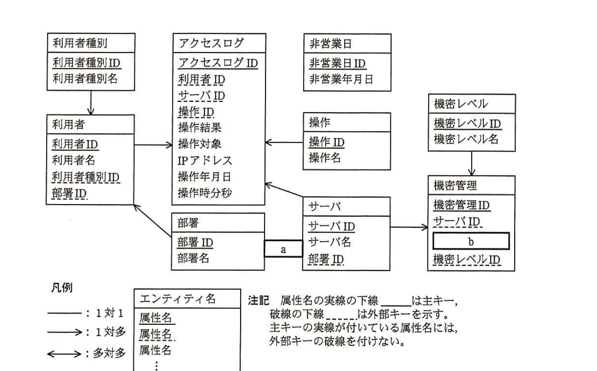

# 2015年春期（平成27年度）応用情報技術者試験 午後 問6（選択）
## データベース：アクセスログ監査システムの構築（K社）

---

## 問題文

**問6** アクセスログ監査システムの構築に関する次の記述を読んで、設問1〜4に答えよ。

K社は、システム開発を請け負う中堅企業である。セキュリティ強化策の一つとして、ファイルサーバのアクセスログを管理するシステム（以下、ログ監査システムという）を構築することになった。

現在のファイルサーバの運用について、次に整理する。

・ファイルサーバの利用者はディレクトリサーバで一元管理されている。
・利用者には、社員、パートナ、アルバイトなどの種別がある。
・利用者はいずれか一つの部署に所属する。
・部署はファイルサーバを1台以上保有している。
・ファイルサーバ上のファイルへのアクセス権は、利用者やその種別、部署、操作ごとに設定される。
・操作には、読取、作成、更新及び削除がある。
・ファイルサーバ上のファイルに対して操作を行うと、操作を行った利用者の情報や操作対象のファイルの絶対パス名、操作の内容がファイルサーバ上にアクセスログとして記録される。
・ファイルサーバのフォルダごとに社外秘や部外秘などの機密レベルが設定されている。

ログ監査システムの機能を表1に、E-R図を図1に示す。

### 表1 ログ監査システムの機能

| 機能名 | 機能概要 |
|---|---|
| アクセスログインポート | 各ファイルサーバに記録されたアクセスログにファイルサーバの情報を付与してログ監査システムに取り込む機能 |
| 非営業日利用一覧表示 | 非営業日にファイル操作を行った利用者、操作対象、操作元のIPアドレス、操作日時などを一覧表示する機能 |
| 部外者失敗一覧表示 | 他部署のファイルサーバ上のファイルへの操作のうち、その操作が失敗した利用者、操作対象、操作元のIPアドレス、操作日時などを一覧表示する機能 |



> 図1の内容：エンティティ「利用者種別」（利用者種別ID、利用者種別名）は「利用者」（利用者ID、利用者名、利用者種別ID、部署ID）に1対多で関連。「利用者」は「アクセスログ」（アクセスログID、利用者ID、サーバID、操作ID、操作結果、操作対象、IPアドレス、操作年月日、操作時分秒）に1対多で関連。「操作」（操作ID、操作名）は「アクセスログ」に1対多で関連。「サーバ」（サーバID、サーバ名、部署ID）は「アクセスログ」に1対多で関連。「部署」（部署ID、部署名）と「利用者」は1対多、「部署」と「サーバ」は`[　a　]`の関連。「非営業日」（非営業日ID、非営業年月日）は独立したエンティティ。「機密レベル」（機密レベルID、機密レベル名）は「機密管理」（機密管理ID、サーバID、`[　b　]`、機密レベルID）に1対多で関連。「サーバ」は「機密管理」に1対多で関連。（注記：属性名の実線の下線は主キー、破線の下線は外部キーを示す。主キーの実線が付いている属性名には、外部キーの破線を付けない。）

ログ監査システムでは、E-R図のエンティティ名を表名にし、属性名を列名にして、適切なデータ型と制約で表定義した関係データベースによって、データを管理する。なお、外部キーには、被参照表の主キーの値かNULLが入る。

---

### 〔非営業日利用一覧表示機能の実装〕

非営業日利用一覧表示機能で用いるSQL文を図2に示す。

なお、非営業日表の非営業年月日列には、K社の非営業日となる年月日が格納されている。

```sql
SELECT AC.*
FROM アクセスログ AC
WHERE [　c　]
  (SELECT * FROM 非営業日 NS
   WHERE [　d　] )
```

図2 非営業日利用一覧表示機能で用いるSQL文

---

### 〔部外者失敗一覧表示機能の実装〕

部外者失敗一覧表示機能で用いるSQL文を図3に示す。

なお、アクセスログ表の操作結果列には、ファイル操作が成功した場合には'S'が、失敗した場合には'F'が入っている。

```sql
SELECT AC.*
FROM アクセスログ AC
  INNER JOIN 利用者 US ON AC.利用者ID = US.利用者ID
  INNER JOIN サーバ SV ON AC.サーバID = SV.サーバID
WHERE [　e　]
  AND [　f　]
```

図3 部外者失敗一覧表示機能で用いるSQL文

---

### 〔アクセスログインポート機能の不具合〕

アクセスログインポート機能のシステムテストのために準備したアクセスログの一部が取り込めない、との指摘を受けた。テストで用いたアクセスログを図4に示す。このログはCSV形式であり、先頭行はヘッダ、アの行は操作対象のファイルへの削除権限がない社員（'USR001'）が削除を試みた場合のデータ、イの行はディレクトリサーバにログオンせずにファイル更新を試みた場合のデータ、ウの行は存在しない利用者ID（'ADMIN'）を指定してファイル削除を試みた場合のデータである。

アクセスログ表のデータを確認したところ、`[　g　]`の行のデータが表に存在しなかった。この問題を解消するために、①テーブル定義の一部を変更することで対応した。

```
"利用者ID","操作名","操作結果","操作対象","IPアドレス","操作日時"
'USR001','削除','F','/home/test1.txt',192.168.1.98,2015-4-1 9:30:00   ←ア
'','更新','F','/home/test2.txt',192.168.1.98,2015-4-1 10:00:00        ←イ
'ADMIN','削除','F','/home/test3.txt',192.168.1.98,2015-4-1 10:30:00   ←ウ
```

図4 テストで用いたアクセスログ

---

## 設問

### 設問1
図1のE-R図中の`[　a　]`、`[　b　]`に入れる適切なエンティティ間の関連及び属性名を答え、E-R図を完成させよ。

なお、エンティティ間の関連及び属性名の表記は、図1の凡例に倣うこと。

### 設問2
図2中の`[　c　]`、`[　d　]`に入れる適切な字句又は式を答えよ。

なお、表の列名には必ずその表の別名を付けて答えよ。

### 設問3
図3中の`[　e　]`、`[　f　]`に入れる適切な字句又は式を答えよ。

なお、表の列名には必ずその表の別名を付けて答えよ。

### 設問4
〔アクセスログインポート機能の不具合〕について、(1)、(2)に答えよ。

(1) 本文中の`[　g　]`に入れる適切な文字をア〜ウの中から選んで答えよ。

なお、アクセスログ中の空文字（''）はデータベースにNULLとしてインポートされる。

(2) 本文中の下線①の対応内容を、35字以内で述べよ。

---

## 解答と解説

### 設問1

**正解：a＝1対多（部署→サーバ）、b＝フォルダパス名**

本文に「部署はファイルサーバを1台以上保有している」とあり、1つの部署が複数のサーバを持ちうるため、部署とサーバの関連は「**1対多**」（→、部署からサーバへの矢印）となる。また、機密管理エンティティは「ファイルサーバのフォルダごとに社外秘や部外秘などの機密レベルが設定されている」ことを表現するためのものであり、サーバIDだけでは特定のフォルダを一意に識別できないため、フォルダを識別するための属性「**フォルダパス名**」が必要になる。

**IPA公式：a＝→、b＝フォルダパス名**

### 設問2

**正解：c＝EXISTS、d＝AC.操作年月日 = NS.非営業年月日**

非営業日にファイル操作が行われたレコードを抽出するには、アクセスログ表の各行について、その操作年月日が非営業日表に存在するかどうかを相関副問合せで判定すればよい。この存在チェックには「**EXISTS**」を用いる。副問合せの条件は、外側のアクセスログ表（別名AC）の操作年月日と、非営業日表（別名NS）の非営業年月日が一致することであるから、`[　d　]`＝「**AC.操作年月日 = NS.非営業年月日**」となる。

**IPA公式：c＝EXISTS、d＝AC.操作年月日 = NS.非営業年月日**

### 設問3

**正解：e＝AC.操作結果 = 'F'（順不同）、f＝US.部署ID <> SV.部署ID**

「部外者失敗一覧表示」は、他部署のファイルサーバ上のファイルへの操作のうち、操作が失敗したものを抽出する機能である。操作が失敗したことを判定する条件は、アクセスログ表の操作結果列が失敗を表す'F'であることから、`[　e　]`＝「**AC.操作結果 = 'F'**」となる。また、「他部署」という条件は、操作を行った利用者の所属部署（US.部署ID）と、操作対象のファイルサーバが属する部署（SV.部署ID）が一致しないことであるから、`[　f　]`＝「**US.部署ID <> SV.部署ID**」となる（eとfは順不同）。

**IPA公式：e＝AC.操作結果 = 'F'（順不同）、f＝US.部署ID <> SV.部署ID**

### 設問4

**(1) 正解：ウ**

アクセスログ表の利用者IDには、利用者表の利用者IDを参照する外部キー制約が設定されていると考えられる。アの行は実在する利用者'USR001'による操作であり問題なくインポートできる。イの行は利用者IDが空文字（NULLとしてインポート）であり、外部キー制約は「被参照表の主キーの値かNULLが入る」ため、NULLは制約違反にならずインポートできる。一方、ウの行は存在しない利用者ID'ADMIN'を指定しており、これは利用者表に存在しない値であるため、外部キー制約に違反してインポートできない。したがって、`[　g　]`＝**ウ**の行のデータが表に存在しなかった。

**IPA公式：g＝ウ**

**(2) 正解例：アクセスログ表の利用者ID列に定義された参照制約を削除する。**

ウの行のように、既にディレクトリサーバ上で削除・変更されるなどして存在しなくなった利用者IDや、不正に指定された利用者IDによる操作履歴も、監査対象としてアクセスログに記録し、ログ監査システムに取り込めるようにする必要がある。そのため、アクセスログ表の利用者ID列に設定されていた利用者表への参照整合性制約（外部キー制約）を削除することで、存在しない利用者IDのレコードもインポートできるようにテーブル定義を変更した。

**IPA公式：アクセスログ表の利用者ID列に定義された参照制約を削除する。**

---

## 参考：主要キーワード

| 用語 | 説明 |
|------|------|
| 外部キー制約（参照制約） | 子表の列の値が、親表の主キーの値かNULLのいずれかでなければならないという制約 |
| EXISTS句 | 相関副問合せの結果が1件以上存在するかどうかを判定する述語。存在チェックに用いる |
| 相関副問合せ | 外側のクエリの列を条件式の中で参照する副問合せ。行ごとに評価される |
| E-R図 | エンティティ（実体）とその間の関連（リレーションシップ）を図示したデータモデル |
| アクセスログ監査 | ファイルやシステムへのアクセス履歴を記録・分析し、不正利用や規則違反を検出する仕組み |
