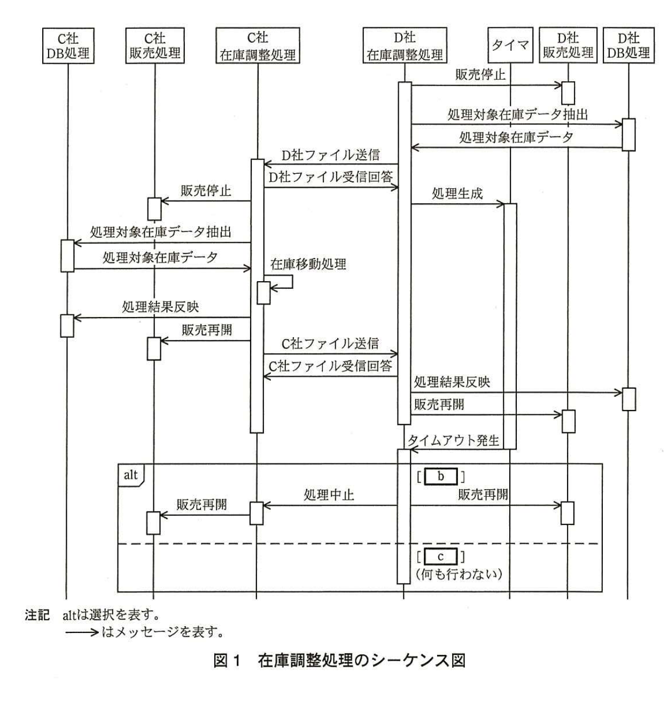

# 2015年春期（平成27年度）応用情報技術者試験 午後 問8（選択）
## 情報システム開発：チケット販売システムの在庫調整機能の開発（C社、D社）

---

## 問題文

**問8** チケット販売システムの在庫調整機能の開発に関する次の記述を読んで、設問1〜3に答えよ。

C社とD社は、インターネットを用いたチケット販売用Webサイトをそれぞれ運営している。C社、D社のWebサイトは、ともに複数の公演を取り扱い、24時間販売可能である。両社は、イベントの主催者であるV社の委託を受けて、チケットを販売している。

V社は、公演ごとに両社の売行きを予想し、販売開始前にC社、D社にチケット在庫を割り当てる。両社のWebサイトでは、それぞれ自社に割り当てられたチケット在庫だけを販売する。

近年、同じ公演のチケットが、一方のWebサイトでは売切れになっているにもかかわらず、他方のWebサイトではまだ販売されているという状況が多く見られる。そこでV社は、C社とD社に対して、販売開始後に在庫が多いWebサイトから少ないWebサイトへチケット在庫を移動する在庫調整機能の開発を依頼した。

C社、D社は依頼を受けて検討に着手した。C社は開発部門のE氏、D社は開発部門のF氏がそれぞれ設計を担当することになった。

---

### 〔V社の要望〕

在庫調整機能に関するV社の要望は、次のとおりである。

・在庫調整を行うかどうかは、公演ごとに決定し、販売開始後も変更可能とする。
・在庫調整は、利用者のアクセスが少ない時間帯を選び、1日に数回実施できる。
・在庫調整実施中の公演のチケットは、数分程度であれば一時的に販売不可となってもよい。
・公演ごとに、在庫調整を実施するチケット在庫数のしきい値を設定する。しきい値はC社WebサイトとD社Webサイトで同じ値とする。在庫調整を開始する時点でC社Webサイト、D社Webサイトのどちらか一方の販売可能なチケット在庫数がしきい値未満であった場合、チケット在庫を移動する。ただし、販売可能なチケット在庫数が、両方のWebサイトでしきい値以下の場合、チケット在庫の移動は実施しない。
・これらの要望を満たす実現方式の中で、できるだけ費用を掛けずに済む方式を採用したい。

---

### 〔V社チケット在庫のデータ項目〕

C社、D社で保持するV社チケット在庫のデータ項目（抜粋）を表1に示す。チケット在庫データは、公演の全席分をC社、D社の両社で保持する。データ項目は将来的にV社の意向によって追加される可能性がある。

### 表1 V社チケット在庫のデータ項目（抜粋）

| 項目名 | 内容例 | 説明 |
|---|---|---|
| 公演日時 | 2015-04-19 13:00 | 公演が行われる日時を示す。 |
| 席番 | ○列□□番 | 座席の位置を示す。 |
| 販売サイト | C社、D社 | C社、D社のどちらのサイトで販売するかを示す。 |
| 販売済フラグ | 販売済み、未販売 | 在庫が販売済みであるかどうかを示す（自社販売分だけ有効）。 |

---

### 〔在庫移動処理の検討〕

E氏とF氏は、チケット在庫を移動するための処理（在庫移動処理）の内容について検討した。しきい値を50席とした場合の在庫移動処理の内容を表2に示す。

### 表2 在庫移動処理の内容

| 項番 | 在庫数の状況 | 処理 |
|---|---|---|
| 1 | C社、D社ともに販売可能なチケット在庫が50席以下 | チケット在庫の移動は実施しない。 |
| 2 | C社、D社ともに販売可能なチケット在庫が50席以上 | チケット在庫の移動は実施しない。 |
| 3 | C社の販売可能なチケット在庫が50席未満、D社の販売可能なチケット在庫が51席以上 | C社の販売可能なチケット在庫が50席になるまで、販売サイト＝"D社"、販売済フラグ＝"未販売"の在庫に対し、販売サイトを"C社"に変更することでD社からC社へ在庫を移動する。ただし、処理途中でD社の販売可能なチケット在庫が50席となった場合、その時点で在庫移動処理を終了する。 |
| 4 | C社の販売可能なチケット在庫が51席以上、D社の販売可能なチケット在庫が50席未満 | D社の販売可能なチケット在庫が50席になるまで、販売サイト＝"C社"、販売済フラグ＝"未販売"の在庫に対し、販売サイトを"D社"に変更することでC社からD社へ在庫を移動する。ただし、処理途中でC社の販売可能なチケット在庫が50席となった場合、その時点で在庫移動処理を終了する。 |

---

### 〔システム処理方式の検討〕

E氏とF氏は、V社の費用面の要望も考慮した結果、D社システムがファイルを送信することによって処理を開始し、ファイルを受信したC社システムが在庫移動処理を実施した後、D社システムへ結果のファイルを送信するという、ファイルを用いた疎結合構成の在庫調整処理を採用することとした。

決定した処理方式の案は次のとおりである。

D社システムは、スケジューラによって1日に数回、在庫調整処理を起動する。D社Webサイトでその公演の販売停止を行った後、データベース（以下、DBという）から処理対象公演全席分のチケット在庫データを抽出し、一つのファイル（以下、I/Fファイルという）に編集してC社へ送信する。

C社システムは、D社からI/Fファイルを受信すると、在庫調整処理を開始する。C社Webサイトでその公演の販売停止を行った後、DBから処理対象公演全席分のチケット在庫データを抽出する。C社、D社のチケット在庫データを基に表2の在庫移動処理を行い、処理結果のチケット在庫データをDBに反映し、C社Webサイトでその公演の販売再開を行った後、処理対象公演全席分の在庫移動結果をI/Fファイルに編集してD社へ送信する。

D社システムは、C社からI/Fファイルを受信すると、処理結果のチケット在庫データをDBに反映した後、D社Webサイトでその公演の販売再開を行う。

通信の異常などで、C社からのI/Fファイル送信のエラーを検出した場合、又はD社側でI/Fファイル受信タイムアウトを検出した場合は、その時点でC社、D社とも在庫調整処理前のDBの状態で販売を再開する。

---

### 〔ファイル形式の検討〕

在庫調整処理で使用するI/Fファイルの形式として、"CSV形式"と"XML形式"を比較した。

検討の結果、`[　a　]`の追加によってデータ項目を追加できるという、"XML形式"のもつ拡張性に注目して、ファイル形式は"XML形式"を採用することにした。

---

### 〔シーケンス図の作成〕

E氏とF氏は、ここまでの検討を基に処理のシーケンス図を作成した。作成したシーケンス図を図1に示す。

> 図1の内容：D社在庫調整処理がD社販売処理に「販売停止」、D社DB処理に「処理対象在庫データ抽出」→「処理対象在庫データ」を実行後、C社在庫調整処理に「D社ファイル送信」。C社在庫調整処理は「D社ファイル受信回答」をD社に返し、C社販売処理に「販売停止」、C社DB処理に「処理対象在庫データ抽出」→「処理対象在庫データ」実行後、自身で「在庫移動処理」を行い、C社DB処理に「処理結果反映」、C社販売処理に「販売再開」を実行後、D社在庫調整処理に「C社ファイル送信」。D社在庫調整処理は「C社ファイル受信回答」をC社に返し、D社DB処理に「処理結果反映」、D社販売処理に「販売再開」を実行。並行してタイマが「処理生成」され、一定時間後「タイムアウト発生」がD社在庫調整処理に通知される。alt（選択）ブロックで、条件`[　b　]`の場合はC社在庫調整処理へ「処理中止」、C社販売処理へ「販売再開」、D社販売処理へ「販売再開」を実行。条件`[　c　]`（何も行わない）の場合は何もしない。（注記：altは選択を表す。矢印はメッセージを表す。）

図1中の"タイマ"オブジェクト、"処理生成"、及び"タイムアウト発生"以降のメッセージは、シーケンス図作成段階で、①"C社ファイル送信がエラーとなった場合にD社Webサイトで不具合が発生する"という問題に対応するために追加した処理である。

---

### 〔テストで見つかった不具合〕

在庫調整処理中に回線の不通によってC社ファイル送信がエラーとなる異常系のテストを行ったところ、あるチケット在庫に関するC社Webサイト、D社Webサイトでの販売状況に、シーケンス図の誤りに起因する不具合が発生した。

表2の項番3に該当するテストデータでは一部のチケット在庫がC社Webサイト、D社Webサイトの両方で`[　d　]`、表2の項番4に該当するテストデータでは一部のチケット在庫がC社Webサイト、D社Webサイトの両方で`[　e　]`となることが確認された。

E氏とF氏は、シーケンス図の不具合を修正するために、②C社在庫調整処理が呼び出す、又は受け取る"処理結果反映"、"販売再開"、"C社ファイル送信"、及び"C社ファイル受信回答"のメッセージの順序を見直した。

---

## 設問

### 設問1
本文中の`[　a　]`に入れる適切な字句を答えよ。

### 設問2
〔シーケンス図の作成〕について、(1)、(2)に答えよ。

(1) タイムアウト処理がない場合に発生する、本文中の下線①の不具合とはどのような内容か。20字以内で述べよ。

(2) 図1中の`[　b　]`、`[　c　]`に入れる分岐の条件は何か。図1中のメッセージ名称を用いた適切な字句を答えよ。

### 設問3
〔テストで見つかった不具合〕について、(1)、(2)に答えよ。

(1) 本文中の`[　d　]`、`[　e　]`に入れる適切な字句を答えよ。

(2) 本文中の下線②で"処理結果反映"、"販売再開"、"C社ファイル送信"、及び"C社ファイル受信回答"のメッセージの順序をどのように修正したか。修正後の処理順を解答群の記号を用いて答えよ。

解答群
- ア　処理結果反映
- イ　販売再開
- ウ　C社ファイル送信
- エ　C社ファイル受信回答

---

## 解答と解説

### 設問1

**正解例：要素**

XML形式は、タグによって表現される「**要素**」を自由に追加できる木構造のデータ形式であり、既存の要素を変更することなく新たな要素を追加することでデータ項目を拡張できる。この拡張性が、将来的にV社の意向によってデータ項目が追加される可能性がある本件に適していると判断された。

**IPA公式：要素**

### 設問2

**(1) 正解例：対象公演が販売停止のままとなる。**

タイムアウト処理（タイマによる監視）がない場合、C社ファイル送信がエラーとなってD社がI/Fファイルを受信できなかったとき、D社側はいつまでもC社からのファイルを待ち続けることになる。この間、D社Webサイトでは既に該当公演の販売停止が行われたままとなっており、販売を再開する処理が呼び出されないため、対象公演が販売停止のままとなってしまう不具合が発生する。

**IPA公式：対象公演が販売停止のままとなる。**

**(2) 正解：b＝C社ファイル受信回答未実施、c＝C社ファイル受信回答済み**

alt（選択）ブロックの分岐は、タイムアウト発生時点で、既にC社からD社への「C社ファイル受信回答」を受け取っているかどうかによって処理を変える必要がある。まだ受信回答を受け取っていない（＝C社側の処理が正常に完了していない可能性が高い）場合は、`[　b　]`＝「**C社ファイル受信回答未実施**」の条件でC社に処理中止を指示し、販売を再開する。既に受信回答を受け取っている（＝C社側の処理は完了しており、D社側だけが何らかの理由で遅延している）場合は、`[　c　]`＝「**C社ファイル受信回答済み**」の条件で何も行わない（二重処理を避ける）。

**IPA公式：b＝C社ファイル受信回答未実施、c＝C社ファイル受信回答済み**

### 設問3

**(1) 正解：d＝販売可能、e＝販売不可**

修正前のシーケンス図では、C社在庫調整処理が「販売再開」を実行してから「C社ファイル送信」を行っていた。この状態でC社ファイル送信がエラーとなり、D社側で処理を中止（在庫調整前の状態に戻す）した場合、既にC社側では在庫移動処理後の状態で販売が再開されてしまっているため、移動されたはずのチケットが**C社側もD社側も販売可能**（表2項番3のケース、D社から移動したチケットがC社で販売可能表示になっている一方、D社側は在庫調整前の状態に戻り同じチケットも販売可能のまま）となる不整合、あるいは逆に両サイトで**販売不可**（表2項番4のケース）となる不整合が発生した。

**IPA公式：d＝販売可能、e＝販売不可**

**(2) 正解：（ウ）→（エ）→（ア）→（イ）**

不具合の原因は、C社側が「処理結果反映」「販売再開」を行った後に「C社ファイル送信」「C社ファイル受信回答」を行っていたことで、D社側でエラーが検出されてタイムアウト処理により中止された場合に、C社側は既に販売再開済みという不整合な状態になっていたことである。これを解消するには、C社ファイル送信を行い、D社からの受信回答を確認できてから、DBへの処理結果反映と販売再開を行うように順序を入れ替える必要がある。したがって、修正後の順序は「**C社ファイル送信（ウ）→C社ファイル受信回答（エ）→処理結果反映（ア）→販売再開（イ）**」となる。

**IPA公式：（ウ）→（エ）→（ア）→（イ）**

---

## 参考：主要キーワード

| 用語 | 説明 |
|------|------|
| 疎結合構成 | システム間をファイル連携などで緩やかに結合し、互いの内部実装への依存を減らす構成方式。低コストで実現しやすい |
| XML形式 | タグで要素を表現する階層的なデータ形式。既存構造を変えずに要素（データ項目）を追加できる拡張性がある |
| シーケンス図 | オブジェクト間のメッセージのやり取りを時系列で表現するUML図。alt（選択）などの制御構造も表現できる |
| タイムアウト処理 | 一定時間内に応答がない場合に処理を打ち切り、異常系の対応（ロールバックなど）を行う仕組み |
| メッセージ順序の整合性 | 分散システム連携では、DB更新やサイト状態変更のタイミングを、通信の成否確認後に行うことで不整合を防ぐ必要がある |
