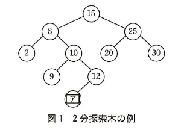

# 2015年秋期（平成27年度）応用情報技術者試験 午後 問3（選択）
## プログラミング：2分探索木

---

## 問題文

**問3** 2分探索木に関する次の記述を読んで、設問1〜4に答えよ。

2分探索木とは、全てのノードNに対して、次の条件が成立している2分木のことである。

・Nの左部分木にある全てのノードのキー値は、Nのキー値よりも小さい。

・Nの右部分木にある全てのノードのキー値は、Nのキー値よりも大きい。

ここで、ノードのキー値は自然数で重複しないものとする。2分探索木の例を図1に示す。図中の数はキー値を表している。



> 図1の内容：2分探索木の例。根が15、左子が8、右子が25。8の左子が2、右子が10。25の左子が20、右子が30。10の左子が9、右子が12。12の左子が`[　ア　]`（空欄のノード）。

### 図1 2分探索木の例

2分探索木を実現するために、ノードを表す構造体Nodeを定義する。構造体Nodeの構成要素を表1に示す。

### 表1 構造体Nodeの構成要素

| 構成要素 | 説明 |
|---|---|
| key | キー値 |
| left | 左子ノードへの参照 |
| right | 右子ノードへの参照 |

構造体の実体を生成するためには、次のように書く。

```
new Node(key)
```

生成した構造体への参照が戻り値となる。構造体の構成要素のうち、keyは引数keyの値で初期化され、leftとrightはnullで初期化される。

変数pが参照するノードをノードpという。ノードを参照する変数からそのノードの構成要素へのアクセスには"."を用いる。例えば、ノードpのキー値には、p.keyでアクセスできる。

なお、変数pの値がnullの場合、木は空である。

---

### 〔2分探索木でのノードの探索〕

与えられたキー値をもつノードを探索する場合、親から子の方向へ、木を順次たどりながら探索を行う。

探索する2分探索木にノードがない場合は、目的のノードが見つからず、探索は失敗と判断して終了する。探索する2分探索木にノードがある場合は、与えられたキー値と木の根のキー値を比較し、等しければ、目的のノードが見つかったので探索は成功と判断して終了する。与えられたキー値の方が小さければ左部分木に、大きければ右部分木に移動する。移動先の部分木でも同様に探索を続ける。

この手順によって探索を行う関数searchのプログラムを図2に示す。このプログラムでは、探索が成功した場合は見つかったノードへの参照を返し、失敗した場合はnullを返す。

### 図2 関数searchのプログラム

```
//ノードpを根とする2分探索木から、キー値がkであるノードを探索する
function search(k, p)
    if(pとnullが等しい)
        return null              //探索失敗
    elseif(kとp.keyが等しい)
        return p                 //探索成功
    elseif([　イ　])
        return search(k, p.left)   //左部分木を探索する
    else
        return search(k, p.right)  //右部分木を探索する
    endif
endfunction
```
---

### 〔2分探索木へのノードの挿入〕

2分探索木にノードを挿入する場合、探索と同様に、親から子の方向へ、木を順次たどりながら、適切な位置にノードを挿入する。

挿入する2分探索木にノードがない場合は、挿入するキー値のノードを作成する。挿入する2分探索木にノードがある場合は、挿入するキー値と木の根のキー値を比較し、挿入するキー値の方が小さければ左部分木に、大きければ右部分木に移動する。移動先の部分木でも同様の処理を続ける。

この手順によって挿入を行う関数addNodeのプログラムを図3に示す。このプログラムでは、挿入の結果として得られた2分探索木の根のノードへの参照を返す。ただし、このプログラムは、挿入するキー値と同じキー値をもつノードが2分探索木に既に存在するときは何もしない。

### 図3 関数addNodeのプログラム

```
//ノードpを根とする2分探索木に、キー値がkであるノードを挿入する
function addNode(k, p)
    if(pとnullが等しい)
        p ← [　ウ　]                        //ノードを生成する
    elseif(kとp.keyが等しくない)
        if([　イ　])
            p.left ← addNode(k, p.left)    //左部分木に移動し挿入を続ける
        else
            p.right ← addNode(k, p.right)  //右部分木に移動し挿入を続ける
        endif
    endif
    [　エ　]
endfunction
```

---

### 〔2分探索木からのノードの削除〕

2分探索木から、あるキー値をもつノードを削除する場合、次の(1)〜(3)の手順を行う。

(1) 2分探索木にノードがない場合は、何もしないで処理を終了する。

(2) 削除するキー値と木の根のキー値を比較し、削除するキー値の方が小さければ左部分木に、大きければ右部分木に移動する。移動先の部分木でも同様の処理を続ける。

(3) 削除するキー値と木の根のキー値が等しい場合、削除するキー値をもつノードを削除するため、次の(3-1)〜(3-3)を実行する。

(3-1) 削除するノードが子ノードをもたない場合、そのノードを削除する。

(3-2) 削除するノードが子ノードを一つだけもつ場合、削除するノードの位置にその子ノードを置く。

(3-3) 削除するノードが左右両方に子ノードをもつ場合、削除するノードの左部分木の中で最大のキー値をもつノードを左部分木から取り除き、削除するノードの位置に置く。

この手順を使って2分探索木からノードの削除を行う関数removeNodeのプログラムを図4に示す。このプログラムでは、削除した後の2分探索木の根のノードへの参照を返す。ただし、このプログラムは、削除するキー値をもつノードが2分探索木に存在しないときは何もしない。

図4中の関数extractMaxNodeは、引数で指定されたノードを根とする2分探索木の中で最大のキー値をもつノードを木から削除し、削除されたノードへの参照を大域変数extractedNodeに設定した上で、削除した後の2分探索木の根のノードへの参照を返す。関数extractMaxNodeのプログラムを図5に示す。

### 図4 関数removeNodeのプログラム

```
//ノードpを根とする2分探索木から、キー値がkであるノードを削除する
function removeNode(k, p)
    if(pとnullが等しくない)
        if(kがp.keyより小さい)
            p.left ← removeNode(k, p.left)
        elseif(kがp.keyより大きい)
            p.right ← removeNode(k, p.right)
        else
            if(p.leftとnullが等しい かつ p.rightとnullが等しい)
                p ← null                        //ノードを削除する
            elseif([　オ　]とnullが等しい)
                p ← p.right                      //右部分木を置く
            elseif([　カ　]とnullが等しい)
                p ← p.left                       //左部分木を置く
            else                                 //左部分木の中の最大ノードを置く
                p.left ← extractMaxNode(p.left)
                r ← extractedNode
                r.left ← p.left
                r.right ← p.right
                [　キ　]
            endif
        endif
    endif
    return p
endfunction
```

### 図5 関数extractMaxNodeのプログラム

```
//ノードpを根とする2分探索木から、最大のキー値をもつノードを削除し、削除された
//ノードへの参照を大域変数に格納する
function extractMaxNode(p)
    if(p.rightとnullが等しい)
        extractedNode ← p
        p ← p.left
    else
        p.right ← extractMaxNode(p.right)
    endif
    return p
endfunction
```

---

### 〔2分探索木の計算量〕

2分探索木における計算量は、木の高さに依存する。図2の関数searchを使ってn個のノードから成る2分探索木を探索する場合、想定される最大の計算量は、O(`[　ク　]`)である。木構造が完全2分木であれば、その計算量は最大でもO(`[　ケ　]`)である。

---

## 設問

### 設問1
図1中の`[　ア　]`に入れる適切な数を答えよ。

### 設問2
図2〜4中の`[　イ　]`〜`[　キ　]`に入れる適切な字句を答えよ。

### 設問3
本文中の`[　ク　]`、`[　ケ　]`に入れる適切な字句を答えよ。

### 設問4
次の順でキー値の挿入と削除を行った後でノードqを根とする2分探索木を答えよ。2分探索木は、図1の例に倣って表現すること。

```
q ← null
q ← addNode(5, q)     //5を挿入
q ← addNode(2, q)     //2を挿入
q ← addNode(7, q)     //7を挿入
q ← addNode(1, q)     //1を挿入
q ← addNode(8, q)     //8を挿入
q ← addNode(4, q)     //4を挿入
q ← addNode(3, q)     //3を挿入
q ← addNode(12, q)    //12を挿入
q ← removeNode(5, q)  //5を削除
q ← removeNode(7, q)  //7を削除
```

---

## 解答と解説

### 設問1

**正解：11**

2分探索木の条件より、ノード12の左部分木にあるノードのキー値は12より小さく、かつノード10の右部分木にあるので10より大きい必要がある。すなわち、10と12の間の値である**11**が入る。

**IPA公式：11**

### 設問2

**正解：イ＝kがp.keyより小さい、ウ＝new Node(k)、エ＝return p、オ＝p.left、カ＝p.right、キ＝p ← r**

`[　イ　]`（図2・図3で共通）は、キー値kと木の根のキー値p.keyを比較し、左部分木に移動すべき条件である。「与えられたキー値の方が小さければ左部分木に」移動するので、**kがp.keyより小さい**が入る。

`[　ウ　]`は、挿入する2分探索木にノードがない場合に生成する、キー値kをもつ新しいノードである。構造体の実体生成の書式に従い、**new Node(k)**が入る。

`[　エ　]`は、関数addNodeの末尾で、挿入の結果として得られた2分探索木の根のノードへの参照を返す処理である。**return p**が入る。

`[　オ　]`・`[　カ　]`は、削除するノードが子ノードを一つだけもつ場合の判定である。「`[　オ　]`とnullが等しい」場合に右部分木（p.right）を置くので、`[　オ　]`は左部分木の有無を判定する**p.left**が入る。同様に、「`[　カ　]`とnullが等しい」場合に左部分木（p.left）を置くので、`[　カ　]`は右部分木の有無を判定する**p.right**が入る。

`[　キ　]`は、削除するノードが左右両方に子ノードをもつ場合の最後の処理である。左部分木の最大ノードr（extractMaxNodeで取り除いたノード）にp.left・p.rightを設定した後、削除するノードの位置にrを置く必要があるので、**p ← r**が入る。

**IPA公式：イ＝kがp.keyより小さい、ウ＝new Node(k)、エ＝return p、オ＝p.left、カ＝p.right、キ＝p ← r**

### 設問3

**正解：ク＝n、ケ＝log n**

2分探索木の探索の計算量は木の高さに比例する。木構造に偏りがある最悪の場合（一直線に伸びた木、すなわち線形リストと同等の形状になる場合）、木の高さはノード数nに比例するため、想定される最大の計算量はO(**n**)となる。

一方、木構造が完全2分木（各段が均等に埋まった木）であれば、木の高さはノード数nに対して対数的（log₂n程度）になるため、その場合の計算量は最大でもO(**log n**)である。

**IPA公式：ク＝n、ケ＝log n**

### 設問4

**正解：**

```
        4
      /   \
     2     8
    / \   /
   1   3 12
```

各操作を順に適用して2分探索木を構築・更新すると、以下のようになる。

1. `addNode(5,2,7,1,8,4,3,12)`を順に挿入すると、根5、5の左部分木に2（さらに左1・右4のうち4は2の右、1は2の左に挿入され、4の左に3が入る）、5の右部分木に7（右に8、8の左に12ではなく、8の左に12が入る）という木ができる。具体的には、根＝5、5.left＝2（2.left＝1、2.right＝4、4.left＝3）、5.right＝7（7.left＝null、7.right＝8、8.left＝12）となる。

2. `removeNode(5, q)`：根5は左右両方に子ノードをもつため、(3-3)より、左部分木（2を根とする部分木：1, 2, 3, 4）の中で最大のキー値をもつノード（4）を左部分木から取り除き、根の位置に置く。取り除いた後の左部分木は、2（左1、右3）となる。これにより木は、根＝4、4.left＝2（2.left＝1、2.right＝3）、4.right＝7（7.right＝8、8.left＝12）となる。

3. `removeNode(7, q)`：ノード7は右部分木（8、及びその左12）のみをもち左部分木をもたないため、(3-2)より、ノード7の位置にその右部分木（8を根とする部分木：8, 12）を置く。

以上の結果、最終的な2分探索木は、根＝4、4.left＝2（左1、右3）、4.right＝8（左12）となる。

**IPA公式：（図示）根4、4の左子2（1と3を子にもつ）、4の右子8（左子12）**

---

## 参考：主要キーワード

| 用語 | 説明 |
|------|------|
| 2分探索木 | 各ノードについて、左部分木の全キー値がそのノードより小さく、右部分木の全キー値がそのノードより大きいという条件を満たす2分木 |
| ノードの削除（3パターン） | 子なし→削除、子1つ→その子を昇格、子2つ→左部分木の最大値（または右部分木の最小値）で置き換える |
| 再帰によるノード操作 | search・addNode・removeNodeはいずれも「根と比較し、部分木に移動して同じ処理を繰り返す」という再帰構造で実装される |
| 計算量と木の高さ | 2分探索木の探索・挿入・削除の計算量は木の高さに比例する。最悪の場合O(n)、平衡（完全2分木に近い）場合O(log n) |
| 完全2分木 | 全ての段が最下段を除いて完全に埋まっており、最下段は左詰めになっている2分木。高さがlog nのオーダーになる |

