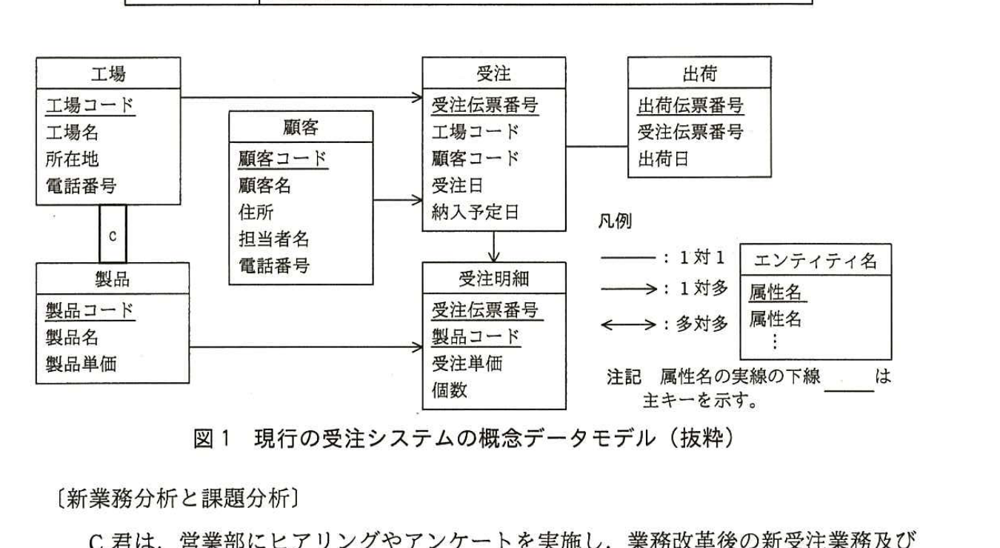
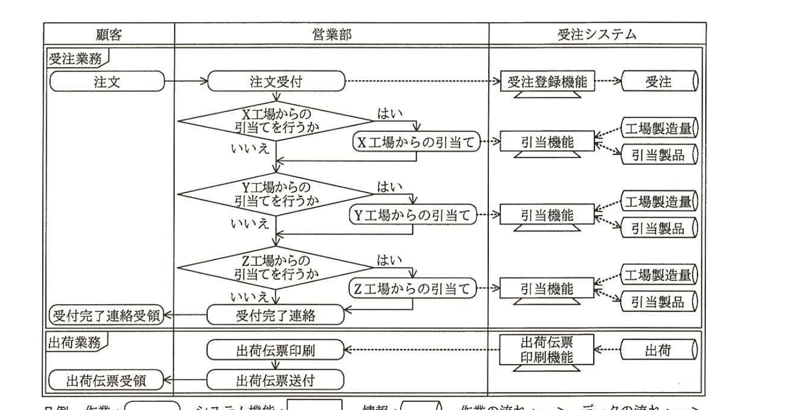
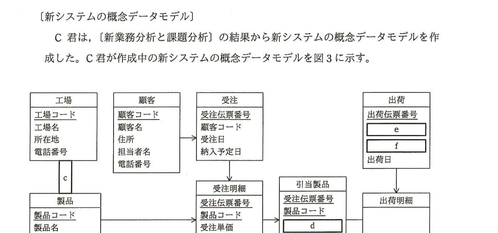

# 2015年秋期（平成27年度）応用情報技術者試験 午後 問4（選択）
## 情報システム開発：システム要件定義（A社）

---

## 問題文

**問4** システム要件定義に関する次の記述を読んで、設問1〜5に答えよ。

A社は、乳製品を製造・販売する会社であり、主な顧客はスーパーマーケットや小売店である。A社は首都圏近郊に三つの工場（X工場、Y工場、Z工場）をもち、牛乳、ヨーグルト、乳飲料など約30種類の製品を製造している。製品には、全ての工場で共通して生産する標準的な製品に加えて、それぞれの工場だけで生産するその地域限定の製品がある。また、1か月に1回製品価格の改定を行っており、顧客へは受注時点の製品価格で販売している。

現在は、工場近郊の顧客からの注文を工場内にある営業部が受注し、受注した工場で製品を製造して顧客に出荷している。しかし、近年、工場近郊の顧客数にばらつきが生じ、X工場の製造量は限界に達しているが、Y工場の製造量には余裕がある状態となっている。そこで、各工場内にある営業部を本社へ統合し、顧客からの注文を本社で一括して受注し、製造を各工場に割り当てる業務改革を実施することになった。

現在の受注システムは、各工場の営業部で受注することを前提に設計されており、業務改革に合わせて再構築が必要となった。再構築に当たり、システムインテグレータであるB社のC君がシステム要件定義を担当することになった。

---

### 〔システム要件定義の進め方の検討〕

C君は、まずシステム要件定義の進め方を検討し、次の①〜③の流れでシステム要件定義を進めることにした。

① 現行システム分析：現行システムの設計書やソースコードを基に、システムの現状をシステム機能一覧、`[　a　]`、概念データモデルなどにまとめる。

② 新業務分析：営業部にヒアリングやアンケートを実施し、業務改革後の新業務の概要を`[　b　]`、業務フロー、概念データモデルなどにまとめる。

③ 課題分析：現行システム分析と新業務分析の結果から、現行の受注システムの課題を分析する。

---

### 〔現行システム分析〕

C君は、現行システムの設計書を基に、現行の受注システムがもつテーブルを調査し、概念データモデルを作成した。現行の受注システムのテーブル構造（抜粋）を表1に、C君が作成した概念データモデル（抜粋）を図1に示す。表1において、下線は主キーを表す。

### 表1 現行の受注システムのテーブル構造（抜粋）

| テーブル名 | 列名 |
|---|---|
| 製品 | 製品コード、製品名、製品単価 |
| 工場 | 工場コード、工場名、所在地、電話番号 |
| 製造製品 | 工場コード、製品コード |
| 顧客 | 顧客コード、顧客名、住所、担当者名、電話番号 |
| 受注 | 受注伝票番号、工場コード、顧客コード、受注日、納入予定日 |
| 受注明細 | 受注伝票番号、製品コード、受注単価、個数 |
| 出荷 | 出荷伝票番号、受注伝票番号、出荷日 |

（下線は主キーを表す：製品コード、工場コード、工場コード＋製品コード、顧客コード、受注伝票番号、受注伝票番号＋製品コード、出荷伝票番号）

> 図1の内容：エンティティ「工場」（工場コード、工場名、所在地、電話番号）と「製品」（製品コード、製品名、製品単価）が`[　c　]`のリレーションシップで接続。「工場」→「受注」（1対多）。「顧客」（顧客コード、顧客名、住所、担当者名、電話番号）→「受注」（1対多）。「受注」（受注伝票番号、工場コード、顧客コード、受注日、納入予定日）→「受注明細」（受注伝票番号、製品コード、受注単価、個数）（1対多）。「製品」→「受注明細」（1対多）。「受注」―「出荷」（出荷伝票番号、受注伝票番号、出荷日）は1対1。凡例：実線は1対1、片矢印は1対多、両矢印は多対多。属性名の実線の下線は主キーを示す。

---

### 〔新業務分析と課題分析〕

C君は、営業部にヒアリングやアンケートを実施し、業務改革後の新受注業務及び新出荷業務の業務フローの作成を行った（図2）。また、現行の受注システムの課題を次のように分析した。

課題1：業務改革後は顧客からの注文を本社で一括して受注するが、現行の受注システムでは、本社で一括して受注した受注データを登録できない。受注データの管理単位を変更する必要がある。

課題2：1回の受注で受け付けた製品を複数の工場から出荷する場合に、出荷データを登録できない。同一工場から、同一顧客へ、同一出荷日の製品を一つの出荷として扱い、工場ごとに別々の出荷ができるように、出荷データの管理単位を変更する必要がある。

> 図2の内容：顧客・営業部・受注システムの3レーンからなる業務フロー図。〔受注業務〕顧客の「注文」→営業部「注文受付」→受注システム「受注登録機能」が"受注"データを生成。営業部は「X工場からの引当てを行うか」を判定し、はいならば「X工場からの引当て」→受注システム「引当機能」が"工場製造量"・"引当製品"を参照。いいえならば「Y工場からの引当てを行うか」を判定し、同様に「Y工場からの引当て」→「引当機能」。いいえならば「Z工場からの引当てを行うか」を判定し、同様に「Z工場からの引当て」→「引当機能」。いいえならば営業部「受付完了連絡」→顧客「受付完了連絡受領」。〔出荷業務〕受注システム「出荷」データ→「出荷伝票印刷機能」→営業部「出荷伝票印刷」→「出荷伝票送付」→顧客「出荷伝票受領」。

---

### 〔新システムの概念データモデル〕

C君は、〔新業務分析と課題分析〕の結果から新システムの概念データモデルを作成した。C君が作成中の新システムの概念データモデルを図3に示す。

> 図3の内容：エンティティ「工場」（工場コード、工場名、所在地、電話番号）、「顧客」（顧客コード、顧客名、住所、担当者名、電話番号）、「受注」（受注伝票番号、顧客コード、受注日、納入予定日）、「製品」（製品コード、製品名、製品単価）、「受注明細」（受注伝票番号、製品コード、受注単価、個数）、「引当製品」（受注伝票番号、製品コード、`[　d　]`、個数）、「出荷」（出荷伝票番号、`[　e　]`、`[　f　]`、出荷日）、「出荷明細」（属性は未定）。「工場」―「製品」間は`[　c　]`のリレーションシップ。「顧客」→「受注」（1対多）。「受注」→「受注明細」（1対多）。「受注明細」→「引当製品」。「出荷」→「出荷明細」。図1と異なり、現行の「受注」テーブルから工場コードが削除され、「引当製品」エンティティが新設されている。

---

## 設問

### 設問1
本文中の`[　a　]`、`[　b　]`に入れる適切な字句を解答群の中から選び、記号で答えよ。

**解答群：**
ア　課題問題点一覧　　イ　業務一覧
ウ　システム機能関連図　　エ　要求一覧

### 設問2
図1及び図3について、`[　c　]`に入れる適切なリレーションシップを解答群の中から選び、記号で答えよ。

**解答群：**
ア　｜（1対1）　　イ　↓（1対多、下向き矢印）
ウ　↑（1対多、上向き矢印）　　エ　⇕（多対多）

### 設問3
図1中の属性"製品単価"と"受注単価"の両方が必要な理由を20字以内で述べよ。

### 設問4
〔新業務分析と課題分析〕の課題1は、図1の概念データモデルにおいて、どのエンティティのどの属性が原因であるか。エンティティ名と属性名を答えよ。

### 設問5
〔新システムの概念データモデル〕について、(1)、(2)に答えよ。属性が主キーの一部となる場合は、実線の下線を付けること。

(1) 図3中の`[　d　]`に入れる適切な属性名を答えよ。

(2) 〔新業務分析と課題分析〕の課題2を解決するためには、"出荷"エンティティの属性を変更し、"出荷明細"エンティティを追加する必要がある。図3中の`[　e　]`、`[　f　]`に入れる適切な属性名を答えよ。さらに、"出荷明細"エンティティに追加すべき必要最小限の属性の属性名を、図1中の字句を用いて答えよ。

---

## 解答と解説

### 設問1

**正解：a＝ウ（システム機能関連図）、b＝イ（業務一覧）**

`[　a　]`は、現行システム分析において「現行システムの設計書やソースコードを基に、システムの現状をシステム機能一覧、`[　a　]`、概念データモデルなどにまとめる」ものである。システム機能一覧と並んで現行システムの構造を把握するための成果物としては、システムの機能同士の関連を図示した**システム機能関連図**（ウ）が適切である。

`[　b　]`は、新業務分析において「業務改革後の新業務の概要を`[　b　]`、業務フロー、概念データモデルなどにまとめる」ものである。業務フローと並んで新業務の概要を整理する成果物としては、業務の一覧である**業務一覧**（イ）が適切である。

**IPA公式：a＝ウ、b＝イ**

### 設問2

**正解：エ（⇕、多対多）**

「工場」と「製品」の間は、製造製品テーブル（工場コード、製品コード）という中間（連関）テーブルで関連付けられている。これは、1つの工場が複数の製品を製造し、1つの製品も複数の工場で製造され得る（標準的な製品は複数工場で共通生産、地域限定製品は特定工場のみ）ことを意味しており、**多対多**（エ）の関係である。

**IPA公式：エ**

### 設問3

**正解例：受注時点の製品価格で販売するから**

本文冒頭に「1か月に1回製品価格の改定を行っており、顧客へは受注時点の製品価格で販売している」とある。製品マスタの"製品単価"は改定のたびに更新される最新の単価であるのに対し、"受注単価"は各受注が行われた時点の単価を個別に記録しておく必要がある。したがって、両方の属性が必要な理由は、**受注時点の製品価格で販売するから**である。

**IPA公式：受注時点の製品価格で販売するから**

### 設問4

**正解例：エンティティ名＝受注、属性名＝工場コード**

課題1は「業務改革後は顧客からの注文を本社で一括して受注するが、現行の受注システムでは、本社で一括して受注した受注データを登録できない」というものである。図1の"受注"エンティティには"工場コード"という属性があり、これは1件の受注が単一の工場に紐付くことを前提とした設計である。業務改革後は、受注時点ではどの工場が製造・出荷を担当するか（引当て）が決まっていないため、"受注"エンティティの"工場コード"属性が原因となって受注データを登録できない。

**IPA公式：エンティティ名＝受注、属性名＝工場コード**

### 設問5

**(1) 正解：d＝工場コード**

課題1の解決のため、新システムでは"受注"エンティティから"工場コード"が削除され、代わりに受注明細と引当て結果を結び付ける"引当製品"エンティティが新設されている。"引当製品"は、受注明細（受注伝票番号、製品コード）の内容がどの工場に割り当てられたかを表すエンティティであるため、`[　d　]`には**工場コード**（主キーの一部ではないため下線なし）が入る。

**IPA公式：工場コード**

**(2) 正解：e＝顧客コード、f＝工場コード（e・f順不同）、追加属性名＝受注伝票番号、製品コード**

課題2は「同一工場から、同一顧客へ、同一出荷日の製品を一つの出荷として扱い、工場ごとに別々の出荷ができるように、出荷データの管理単位を変更する必要がある」というものである。すなわち、新しい"出荷"エンティティは、工場・顧客・出荷日の組合せ単位で管理される必要がある。現行の"出荷"は受注伝票番号に従属していたが、新システムでは"出荷"が複数の受注（や複数工場の引当て結果）にまたがりうるため、出荷の識別に必要な**顧客コード**（e）と**工場コード**（f）を新たに属性として持たせる必要がある（順不同）。

また、"出荷"から実際にどの受注のどの製品が出荷されたかを表すために"出荷明細"エンティティを追加する必要があり、これには図1の"受注明細"を特定するための**受注伝票番号**、**製品コード**の属性が必要最小限の属性として追加される。

**IPA公式：e＝顧客コード、f＝工場コード（順不同）、出荷明細に追加すべき属性名＝出荷伝票番号、受注伝票番号、製品コード**

---

## 参考：主要キーワード

| 用語 | 説明 |
|------|------|
| 概念データモデル | 業務で扱うデータをエンティティ・属性・リレーションシップとして抽象化して表現したモデル。現状分析や新システム設計の基礎となる |
| システム機能関連図 | 現行システムがもつ各機能同士のつながりを図示したもの。現行システム分析の成果物の一つ |
| 多対多（連関エンティティ） | 二つのエンティティ間で双方が複数対応する関係。中間に連関エンティティ（ここでは"製造製品"）を設けて1対多×2に分解して表現する |
| 単価の履歴管理 | 商品マスタの単価は改定されるため、取引時点の単価を別途記録しないと過去の取引金額が再現できなくなる |
| 業務改革に伴うデータモデルの見直し | 業務の管理単位（本問では受注の単位、出荷の単位）が変わると、それに対応してエンティティの属性やリレーションシップも見直す必要がある |

