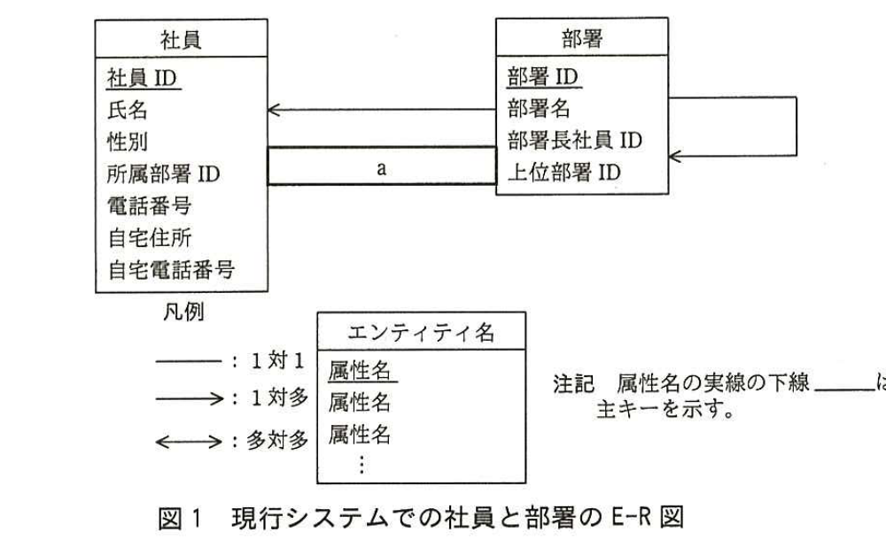
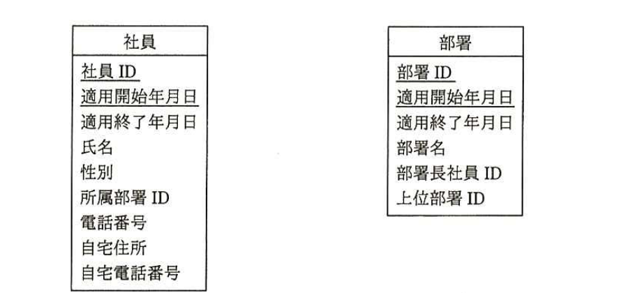
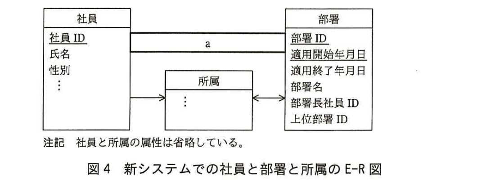

# 2015年秋期（平成27年度）応用情報技術者試験 午後 問6（選択）
## データベース：人事情報のデータ構造（R社）

---

## 問題文

**問6** 人事情報のデータ構造に関する次の記述を読んで、設問1〜3に答えよ。

R社では、人事システムの改善を検討している。現行システムでは、現時点での情報しか管理していないが、過去の履歴や将来の発令予定も管理できるようにしたいと考えている。

現行システムでの社員と部署のE-R図を図1に示す。部署の階層は木構造になっており、再帰リレーションシップで表現している。最上位は会社で、下に向かって本部、部、課などが配置されている。上位部署IDには、上位部署の部署IDを保持し、最上位である会社の上位部署IDにはNULLを設定する。社員は必ず一つの部署だけに所属している。部署には部署長が必ず一人存在するが、一人の社員が複数の部署の部署長を兼任している場合もある。また、各社員に携帯電話機を1台ずつ配布しており、電話番号は部署にではなく、社員に割り当てられている。



> 図1の内容：エンティティ「社員」（社員ID、氏名、性別、所属部署ID、電話番号、自宅住所、自宅電話番号）と「部署」（部署ID、部署名、部署長社員ID、上位部署ID）。「部署」→「社員」（矢印、`[　a　]`のリレーションシップ）。「部署」は自己参照（再帰リレーションシップ、上位部署IDが部署IDを参照）。凡例：実線は1対1、片矢印は1対多、両矢印は多対多。属性名の実線の下線は主キーを示す。

図1のリレーションシップが、どの属性と関連しているかを表1に示す。表1の1行目は、エンティティ"社員"の属性"所属部署ID"がエンティティ"部署"の属性"部署ID"を参照する外部キーとなっていて、"社員"と"部署"の間には多対1のリレーションシップがあることを示している。多対1のリレーションシップの多側が外部キーの属性、1側が主キーの属性と対応している。

### 表1 社員と部署のリレーションシップ

| エンティティ名と属性名 | | リレーションシップ | エンティティ名と属性名 | |
|---|---|---|---|---|
| 社員 | 所属部署ID | ← | 部署 | 部署ID |
| 社員 | 社員ID | `[　a　]` | 部署 | 部署長社員ID |
| 部署 | `[　b　]` | → | 部署 | `[　c　]` |

現行システムは、図1のE-R図のエンティティ名を表名に、属性名を列名にして、適切なデータ型で表定義した関係データベースによって、データを管理している。

指定した部署とその配下の全ての部署の部署ID、部署名、上位部署IDを出力するSQL文を図2に示す。ここで、":部署ID"は、指定した部署の部署IDを格納する埋込み変数である。

```sql
WITH RECURSIVE 関連部署(部署ID, 部署名, 上位部署ID) AS (
  SELECT 部署.部署ID, 部署.部署名, 部署.上位部署ID
    FROM 部署 WHERE 部署.部署ID = :部署ID
UNION ALL
  SELECT 部署.部署ID, 部署.部署名, 部署.上位部署ID
    FROM 部署, 関連部署 WHERE 部署.上位部署ID = 関連部署.部署ID
)
SELECT 部署ID, 部署名, 上位部署ID FROM 関連部署
```

### 図2 指定した部署配下の全ての部署を出力するSQL文

図2では、SQL:1999で導入されたWITH RECURSIVE構文を用いて再帰的なクエリを実現している。まず2、3行目のSELECTで、埋込み変数":部署ID"で指定した部署の部署ID、部署名、上位部署IDから成る1行の表"関連部署"が導出される。次に5、6行目のSELECTで、"関連部署"の中にある部署IDと一致する上位部署IDをもつ部署の部署ID、部署名、上位部署IDから成る行の集まりが新たに表"関連部署"として導出される。これが、表"関連部署"の新たな行がなくなるまで繰り返される。最後に8行目のSELECTで、それまで導出された"関連部署"の全ての行について部署ID、部署名、上位部署IDが出力される。

---

### 〔新システムでの履歴管理〕

新システムでは、(1)〜(4)の要件を実現したいと考えている。

(1) 指定した社員が、今までに所属していた部署の履歴が分かる。

(2) 指定した日の、会社全体の部署構造が分かる。

(3) 人事異動後の部署、所属の情報をあらかじめ入力しておき、異動が発生したらすぐに有効とする。

(4) 所属情報以外の社員の情報は履歴管理する必要はなく、最新の情報だけを管理すればよい。

これらの要件を実現するために、エンティティ"社員"と"部署"に、属性"適用開始年月日"と"適用終了年月日"を追加して、各タプルの有効期間を管理する方法を考えた。指定した日が適用開始年月日から適用終了年月日までの範囲内であれば、その日の時点で有効なタプルである。適用終了年月日が未定の場合は、'9999-12-31'を設定する。新しいエンティティ"社員"と"部署"を図3に示す。



> 図3の内容：エンティティ「社員」（社員ID、適用開始年月日、適用終了年月日、氏名、性別、所属部署ID、電話番号、自宅住所、自宅電話番号）と「部署」（部署ID、適用開始年月日、適用終了年月日、部署名、部署長社員ID、上位部署ID）。主キーは、社員が(社員ID、適用開始年月日)、部署が(部署ID、適用開始年月日)。

しかし、①図3のエンティティ"社員"は十分に正規化されていないとの指摘を受け、エンティティ"所属"を新たに追加し、エンティティ"社員"を第3正規形とした。新システムでの社員と部署と所属のE-R図を図4に示す。



> 図4の内容：エンティティ「社員」（社員ID、氏名、性別、…）、「部署」（部署ID、適用開始年月日、適用終了年月日、部署名、部署長社員ID、上位部署ID）、「所属」（属性省略、社員及び部署とそれぞれ1対多で接続）。「社員」―「部署」間は`[　a　]`のリレーションシップ。「社員」→「所属」（1対多）。「所属」⇔「部署」（多対多）。注記：社員と所属の属性は省略している。

要件(2)を実現するSQL文を図5に示す。ここで、":年月日"は、指定した日の日付を格納する埋込み変数である。

```sql
WITH RECURSIVE 関連部署(部署ID, 部署名, 上位部署ID) AS (
  SELECT 部署.部署ID, 部署.部署名, 部署.上位部署ID
    FROM 部署 WHERE 部署.上位部署ID [　d　]
      AND :年月日 BETWEEN 部署.適用開始年月日 AND 部署.適用終了年月日
UNION ALL
  SELECT 部署.部署ID, 部署.部署名, 部署.上位部署ID
    FROM 部署, 関連部署 WHERE 部署.上位部署ID = 関連部署.部署ID
      AND :年月日 BETWEEN 部署.適用開始年月日 AND 部署.適用終了年月日
)
SELECT 部署ID, 部署名, 上位部署ID FROM 関連部署
```

### 図5 指定した日の会社全体の部署構造を出力するSQL文

現時点での部署テーブルの内容を表2に示す。

### 表2 部署テーブルの内容

| 部署ID | 適用開始年月日 | 適用終了年月日 | 部署名 | 部署長社員ID | 上位部署ID |
|---|---|---|---|---|---|
| A000 | 2001-04-01 | 2006-03-31 | R有限会社 | 000001 | NULL |
| A000 | 2006-04-01 | 9999-12-31 | R株式会社 | 000010 | NULL |
| A100 | 2001-04-01 | 2012-09-30 | 第1本部 | 000002 | A000 |
| A100 | 2012-10-01 | 9999-12-31 | 新第1本部 | 000010 | A000 |
| A110 | 2001-04-01 | 9999-12-31 | 営業1部 | 000002 | A100 |
| A120 | 2001-04-01 | 2014-03-31 | 営業2部 | 000004 | A100 |
| A120 | 2014-04-01 | 9999-12-31 | 営業2部 | 000004 | A200 |
| A200 | 2001-04-01 | 9999-12-31 | 第2本部 | 000003 | A000 |
| J000 | 2001-04-01 | 9999-12-31 | 人事部 | 000009 | A000 |

埋込み変数":年月日"に`[　e　]`から`[　f　]`までの範囲の日付を設定して、表2の部署テーブルに対して図5のSQL文を実行すると、その結果は表3のとおりとなる。

### 表3 SQL文の実行結果

| 部署ID | 部署名 | 上位部署ID |
|---|---|---|
| A000 | R株式会社 | NULL |
| A100 | 新第1本部 | A000 |
| A200 | 第2本部 | A000 |
| J000 | 人事部 | A000 |
| A110 | 営業1部 | A100 |
| A120 | 営業2部 | A100 |

---

## 設問

### 設問1
現行システムについて、(1)、(2)に答えよ。

(1) 図1及び表1中の`[　a　]`に入れる適切なリレーションシップを答え、E-R図を完成させよ。図1の凡例に倣って解答すること。

(2) 表1中の`[　b　]`、`[　c　]`に入れる適切な属性名を答えよ。

### 設問2
新システムの要件を実現するためのエンティティについて、(1)、(2)に答えよ。

(1) 本文中の下線①で、エンティティ"社員"は第1正規形、第2正規形、第3正規形のうち、どこまで正規化されているか答えよ。また、その理由を30字以内で述べよ。

(2) 図4中のエンティティ"所属"の属性を、本文中又は図中の字句を用いて答えよ。属性が主キーの一部となる場合は、実線の下線を付けること。

### 設問3
新システムの要件(2)について、(1)、(2)に答えよ。

(1) 図5中の`[　d　]`に入れる適切な字句又は式を答えよ。

(2) 本文中の`[　e　]`、`[　f　]`に入れることのできる最大範囲の日付の組を答えよ。

---

## 解答と解説

### 設問1

**(1) 正解：a＝→（1対多）**

「部署には部署長が必ず一人存在するが、一人の社員が複数の部署の部署長を兼任している場合もある」とある。すなわち、1人の社員が複数の部署の部署長になり得るので、社員から部署へは1対多の関係となる。したがって、`[　a　]`には**→（1対多）**が入る。

**IPA公式：a＝→**

**(2) 正解：b＝部署ID、c＝上位部署ID**

表1の3行目は、部署の再帰リレーションシップ（部署の階層構造）を表す行である。上位部署IDが部署IDを参照する外部キーであるという関係から、多側（子の部署）の属性が`[　b　]`＝**部署ID**（表側の見出し）、1側（親の部署）の属性が`[　c　]`＝**上位部署ID**となる。表の構造に沿えば、"部署"の`[　b　]`（多側の主キー相当の並び位置）は部署ID、"部署"の`[　c　]`（1側）は上位部署IDである。

**IPA公式：b＝部署ID、c＝上位部署ID**

### 設問2

**(1) 正解：第1正規形。理由＝主キーの一部に関数従属している属性があるから**

図3のエンティティ"社員"の主キーは(社員ID、適用開始年月日)である。しかし、氏名、性別、所属部署ID、電話番号、自宅住所、自宅電話番号などの属性は、主キーの一部である"社員ID"だけに関数従属しており、主キー全体（社員ID、適用開始年月日）には従属していない（部分関数従属）。第2正規形は、主キーの一部にのみ従属する部分関数従属がないことを要求するため、この社員エンティティは第2正規形の条件を満たしておらず、**第1正規形**にとどまっている。理由は、**主キーの一部に関数従属している属性があるから**である。

**IPA公式：第1正規形。理由：主キーの一部に関数従属している属性があるから（別解：主キーに部分関数従属している属性があるから／社員IDだけに従属している属性があるから）**

**(2) 正解：社員ID、適用開始年月日、適用終了年月日、所属部署ID**

エンティティ"所属"は、社員の所属部署の履歴（いつからいつまでどの部署に所属していたか）を管理するために新設されたエンティティである。したがって、社員を特定する**社員ID**と、有効期間を表す**適用開始年月日**・**適用終了年月日**（(社員ID、適用開始年月日)が主キー）、及び所属先を示す**所属部署ID**の4つの属性で構成される。

**IPA公式：社員ID、適用開始年月日、適用終了年月日、所属部署ID**

### 設問3

**(1) 正解：IS NULL**

図5のSQLは、指定した日（:年月日）の会社全体の部署構造を出力するものである。再帰の起点となる最初のSELECTでは、指定日時点で最上位（会社）に当たる部署、すなわち上位部署IDがNULLである部署から出力を開始する必要がある。したがって、`[　d　]`には**IS NULL**が入る。

**IPA公式：IS NULL**

**(2) 正解：e＝2012-10-01、f＝2014-03-31**

表3の実行結果は、A100が「新第1本部」（2012-10-01〜9999-12-31の期間で有効な行）、A120が「営業2部」で上位部署IDがA100（2001-04-01〜2014-03-31の期間で有効な行）となっている。これらの結果が両方成立するためには、指定した日付が、A100の"新第1本部"が有効になる開始日である**2012-10-01**以降、かつA120の上位部署IDがA100である行が有効な終了日である**2014-03-31**以前でなければならない。したがって、":年月日"に設定できる最大範囲は`[　e　]`＝**2012-10-01**から`[　f　]`＝**2014-03-31**までである。

**IPA公式：e＝2012-10-01、f＝2014-03-31**

---

## 参考：主要キーワード

| 用語 | 説明 |
|------|------|
| 再帰リレーションシップ | 同一エンティティ内で親子関係（階層構造）を表現するリレーションシップ。本問では部署の上位部署IDが自身の部署IDを参照する |
| WITH RECURSIVE（再帰CTE） | SQL:1999で導入された再帰的な問合せを実現する構文。階層構造やグラフ構造をたどる処理に用いられる |
| 履歴管理（有効期間） | 各タプルに適用開始日・適用終了日を持たせ、指定日時点で有効な行を絞り込むことで、過去・現在・未来の状態を1つのテーブルで管理する手法 |
| 部分関数従属と正規化 | 主キーの一部だけに従属する属性がある状態（部分関数従属）は第2正規形の条件を満たさない。複合主キーを持つ場合に特に注意が必要 |
| 第1〜第3正規形 | 第1正規形：繰返し項目の排除。第2正規形：部分関数従属の排除。第3正規形：推移的関数従属の排除 |

