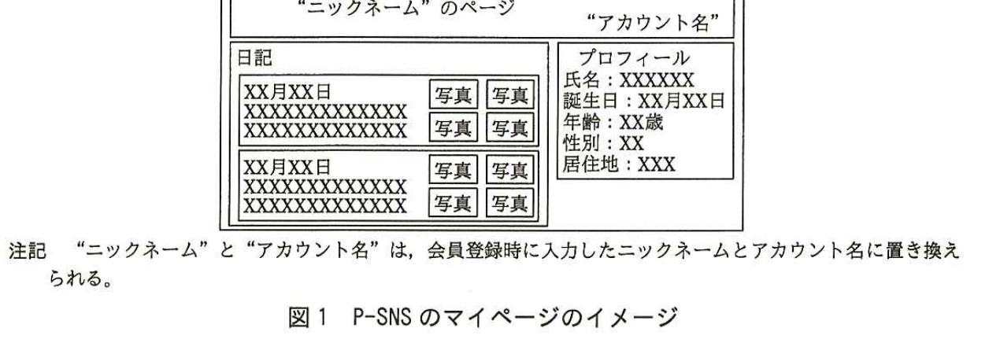
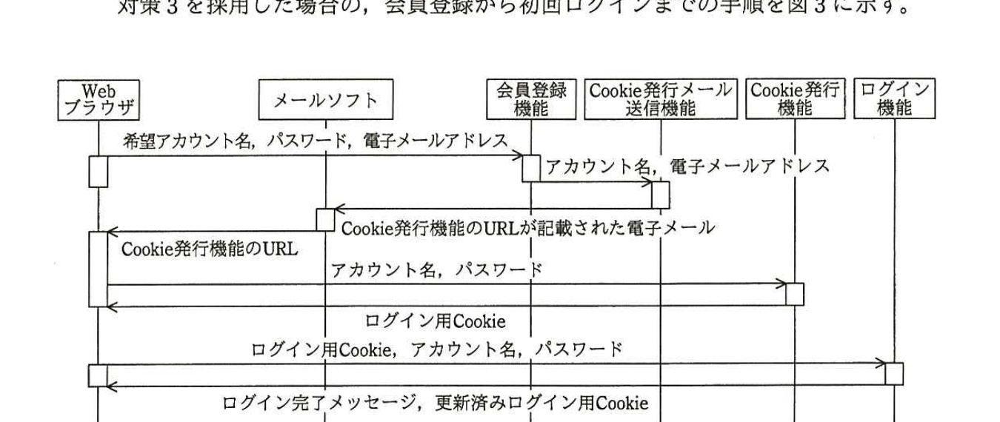

# 2015年秋期（平成27年度）応用情報技術者試験 午後 問1（必須）
## 情報セキュリティ：ソーシャルネットワーキングサービスのセキュリティ（P社）

---

## 問題文

**問1** ソーシャルネットワーキングサービスのセキュリティに関する次の記述を読んで、設問1〜3に答えよ。

P社は、ソーシャルネットワーキングサービスの運営会社である。P社のサービス（以下、P-SNSという）は、約30,000人の会員が利用している。PCやスマートフォンのWebブラウザから簡単に日記や写真を登録できることが人気で、会員数を伸ばしつつある。

---

### 〔P-SNSの利用方法〕

P-SNSの利用には、会員登録が必要である。利用を希望するユーザは、会員情報として希望するアカウント名とパスワード、電子メールアドレス、ニックネーム、プロフィール情報（氏名、誕生日、年齢、性別、居住地）を入力し会員登録を行う。会員登録をすると、P-SNS内にマイページが作成される。

会員登録後は、アカウント名とパスワードを用いてP-SNSにログインし、日記や写真を登録して、マイページを更新する。

P-SNSでは、マイページ内の日記や写真について、情報の公開範囲の設定が可能であり、P-SNS内に無制限に公開するか、特定の会員だけに公開するかを設定できる。ただし、日記や写真以外の情報については、公開範囲の設定ができず、P-SNS内に無制限に公開される。

日記と写真をP-SNS内に無制限に公開する設定にした場合、他の会員がPCのWebブラウザからアクセスしたときに見えるP-SNSのマイページのイメージを図1に示す。

> 図1の内容：マイページ画面のイメージ。上部に「"ニックネーム"のページ」「"アカウント名"」の表示。左側「日記」欄にXX月XX日の日記本文と写真アイコンが複数件表示。右側「プロフィール」欄に氏名・誕生日・年齢・性別・居住地が表示される。注記：ニックネームとアカウント名は会員登録時に入力した値に置き換えられる。

---

### 〔P-SNSのアカウント名とパスワードの設定ポリシ〕

P-SNSでは、アカウント名とパスワードの設定ポリシを図2のように定めており、設定ポリシを満たさないアカウント名やパスワードは設定できないように、会員登録時やパスワード変更時に入力チェックが行われる。

### 図2 アカウント名とパスワードの設定ポリシ

> アカウント名の設定ポリシ
> ・アカウント名長は、6文字以上32文字以下
> ・利用可能な文字は、半角英数字
> ・他の会員と重複したアカウント名の設定は不可
>
> パスワードの設定ポリシ
> ・パスワード長は、6文字以上32文字以下
> ・利用可能な文字は、半角英数字、記号文字
> ・英大文字、英小文字、数字のうち少なくとも2種を組み合わせた文字列

---

### 〔不正ログインの発覚〕

ある日、会員のQさんからP社に、"情報の公開範囲の設定が勝手に変更され、日記や写真が無制限に公開されている"とのクレームが入った。

そこで、P社カスタマサポート担当のR君が、Qさんのアカウントの利用状況調査を行うことになった。まず、R君がアクセスログからログイン状況を調査したところ、クレームの前日に、Qさんのアカウントでログインを試みるアクセスが100回あったことを確認した。そのうち、99回はパスワード誤りによってログインが拒否されており、最後の1回でログインが成功していた。また、Qさんへのヒアリングから、Qさん自身はこの日にログインしていないことが分かった。そこで、R君は、Qさんのアカウントが第三者による不正ログインに使用されたと判断し、Qさんのアカウントの利用を停止し、P-SNSの全会員に不正ログインの事件発生について注意喚起の案内を行った。

次にR君は、Qさんへのヒアリングから、設定されていたパスワードが氏名と誕生日を組み合わせた単純なものであったことが判明したので、今回の攻撃は`[　a　]`である可能性が高いと判断した。また、アカウント名とパスワードの組合せが第三者に知られたことから、`[　b　]`に備えて、P-SNSと同じパスワードを設定している他のサービスについてもパスワードを変更するように、Qさんにアドバイスした。

---

### 〔不正ログインに対する調査〕

R君は、Qさん以外の会員のアカウントに対する不正ログインについても調査を行った。その結果、Qさんの場合と同様の100回程度のログイン試行の記録が幾つか見つかった。

R君は、P-SNSのマイページには、①公開範囲の設定ができない情報の中にこれらの攻撃の足掛かりとなるものがあり、不正ログインにつながるリスクが高いと考えた。

---

### 〔不正ログイン対策の検討〕

R君は、不正ログイン対策として、次の三つの対策を検討した。

対策1：アカウント名とパスワードの設定ポリシを見直して、悪意をもった第三者がP-SNSに不正ログインしにくくする。

対策2：パスワード誤りによってログインが一定の回数拒否された場合、アカウントの利用を自動的に停止する機能を追加する。

対策3：悪意をもった第三者がP-SNSに不正ログインできないように、アカウント名とパスワードによる認証に加え、Cookieによる認証を追加する。

対策3を採用した場合の、会員登録から初回ログインまでの手順を図3に示す。

> 図3の内容：Webブラウザ、メールソフト、会員登録機能、Cookie発行メール送信機能、Cookie発行機能、ログイン機能の6主体間のシーケンス図。①Webブラウザ→会員登録機能：希望アカウント名，パスワード，電子メールアドレス。②会員登録機能→Cookie発行メール送信機能：アカウント名，電子メールアドレス。③Cookie発行メール送信機能→メールソフト：Cookie発行機能のURLが記載された電子メール。④メールソフト→Webブラウザ：Cookie発行機能のURL。⑤Webブラウザ→Cookie発行機能：アカウント名，パスワード。⑥Cookie発行機能→Webブラウザ：ログイン用Cookie。⑦Webブラウザ→ログイン機能：ログイン用Cookie，アカウント名，パスワード。⑧ログイン機能→Webブラウザ：ログイン完了メッセージ，更新済みログイン用Cookie。

ユーザがWebブラウザを用いて会員登録機能から会員登録を行うと、Cookie発行機能のURLが記載された電子メール（以下、メールという）がCookie発行メール送信機能から送信される。ユーザは、メールソフトを用いてメールを受信し、メール内に記載されたURLからCookie発行機能にWebブラウザを用いてアクセスする。ユーザがアカウント名とパスワードを入力し認証が完了すると、ログイン用Cookieが発行される。Cookie発行機能のURLは、登録した会員一人一人にメールを送信する都度、異なるものが発行され、メールの送信から1時間だけ有効である。また、発行されたログイン用Cookieの有効期間は半年間とし、ログインするたびに有効期間がその日から半年間に更新される。

会員がP-SNSにログインするときには、会員が入力するアカウント名とパスワードとともにログイン用Cookieがログイン機能へ送信される。ログイン機能では、送信されたログイン用Cookieがその会員に発行されたログイン用Cookieと異なる場合にはアクセスを拒否する。

会員が利用端末を変更したい場合やCookieの有効期間が過ぎた場合には、Cookie発行メール送信機能に対して、Cookie発行機能のURLが記載されたメールの送信を要求する。その後、会員登録時と同様にログイン用Cookieを入手する。

なお、P-SNSの通信は暗号化し、悪意をもった第三者が盗聴しても必要な情報を入手できないようにする。

その後R君は、アカウントへの不正ログインの足掛かりとなった情報を全会員のマイページから削除するとともに、Cookieによる認証機能の導入を行った。

---

## 設問

### 設問1
本文中の`[　a　]`、`[　b　]`に入れる適切な字句を解答群の中から選び、記号で答えよ。

**aに関する解答群：**
ア　DoS攻撃　　イ　サイドチャネル攻撃
ウ　標的型攻撃　　エ　類推攻撃

**bに関する解答群：**
ア　ゼロデイ攻撃　　イ　総当たり攻撃
ウ　パスワードリスト攻撃　　エ　フィッシング攻撃

### 設問2
本文中の下線①について、攻撃の足掛かりとなる情報とは何か。プロフィール情報とニックネームを除く情報の中から、10字以内で答えよ。

### 設問3
〔不正ログイン対策の検討〕について、(1)〜(4)に答えよ。

(1) 対策1について、Qさんのアカウントへの攻撃手法に対する対策として有効ではないものを、解答群の中から選び、記号で答えよ。

**解答群：**
ア　英和辞典にある英単語の利用禁止
イ　パスワード中に会員情報として登録した文字列を含めることの禁止
ウ　パスワードに記号文字を含めることの必須化
エ　半年以上ログイン実績がないアカウントの利用停止

(2) アカウント名とパスワードによる認証がユーザを認証するのに対し、Cookieによる認証は何を認証するものか。10字以内で答えよ。

(3) 図3の手順によって、今回のような悪意をもった第三者のログインが拒否される理由を25字以内で述べよ。

(4) 図3の手順を用いることで、会員登録時に入力した情報の有効性を確認できる。どの情報の有効性を確認できるか。15字以内で答えよ。

---

## 解答と解説

### 設問1

**正解：a＝エ（類推攻撃）、b＝ウ（パスワードリスト攻撃）**

`[　a　]`は、Qさんのパスワードが「氏名と誕生日を組み合わせた単純なもの」であったことから推測された攻撃手法である。氏名や誕生日など会員本人に関する情報から推測してパスワードを割り出す攻撃は**類推攻撃**（エ）である。

`[　b　]`は、「アカウント名とパスワードの組合せが第三者に知られたこと」を受けて、他のサービスでも同じパスワードを使い回している場合に狙われる攻撃である。窃取したアカウント名とパスワードの組合せを他のサービスへのログインに使い回す攻撃は**パスワードリスト攻撃**（ウ）である。

**IPA公式：a＝エ、b＝ウ**

### 設問2

**正解例：アカウント名**

図1のマイページでは、日記や写真は公開範囲の設定ができるが、プロフィール情報とニックネーム以外に画面上に表示される情報として"アカウント名"がある。攻撃者は、これを見ることで正規の会員の**アカウント名**を把握でき、あとはパスワードを類推・総当たりするだけで不正ログインを試行できる。したがって、公開範囲の設定ができない情報のうち攻撃の足掛かりとなるものは**アカウント名**である。

**IPA公式：アカウント名**

### 設問3

**(1) 正解：エ**

対策1は、アカウント名とパスワードの設定ポリシを見直すことで、類推攻撃（弱いパスワードの設定）を防止するものである。ア・イ・ウはいずれも類推されやすいパスワードの設定を制限する内容であり有効である。一方、エの「半年以上ログイン実績がないアカウントの利用停止」は、休眠アカウントへの対策であり、パスワードの強度や類推可能性とは無関係であるため、Qさんのアカウントへの攻撃手法（類推攻撃）に対する対策としては有効ではない。

**IPA公式：エ**

**(2) 正解例：Webブラウザ**

アカウント名とパスワードは「本人だけが知っている情報」によってユーザ本人を認証するものである。これに対し、Cookieによる認証は、以前ログインに成功した際に発行されたCookieを保持しているかどうかを確認するものであり、これは特定の**Webブラウザ**（利用端末）を認証していることになる。

**IPA公式：Webブラウザ**

**(3) 正解例：ログイン用Cookieの値を知らないから**

図3の手順では、ログイン時にアカウント名とパスワードに加えて、あらかじめ発行された**ログイン用Cookie**の送信が必要となる。悪意をもった第三者は、アカウント名とパスワードを知っていても、正規のCookie発行手順（メール受信とURLアクセス）を経ていないため、正しいログイン用Cookieの値を知らない。したがって、**ログイン用Cookieの値を知らないから**ログインが拒否される。

**IPA公式：ログイン用Cookieの値を知らないから**

**(4) 正解例：電子メールアドレス**

図3の手順では、会員登録時に入力された電子メールアドレス宛てにCookie発行機能のURLが記載されたメールが送信され、そのメールを受信できたユーザだけがCookieの発行手続（アカウント名・パスワードの入力）に進める。すなわち、この一連の手順によって、会員登録時に入力された**電子メールアドレス**が実際に本人が管理しているものであるかどうか（有効性）を確認できる。

**IPA公式：電子メールアドレス**

---

## 参考：主要キーワード

| 用語 | 説明 |
|------|------|
| 類推攻撃 | 氏名、誕生日など本人に関連する情報からパスワードを推測して不正ログインを試みる攻撃手法 |
| パスワードリスト攻撃 | あるサービスから窃取したアカウント名とパスワードの組合せを用いて、他のサービスへの不正ログインを試みる攻撃手法。パスワードの使い回しが原因で被害が拡大する |
| Cookieによる認証 | 過去の認証成功時に発行された固有の値（Cookie）を保持しているかどうかで、その端末（ブラウザ）を識別・認証する仕組み |
| メールによる本人確認 | 登録された電子メールアドレス宛てに送付したURLへアクセスさせることで、そのメールアドレスの実在性・所有者本人であることを確認する手法 |
| アカウントロック（利用停止） | パスワード誤りが一定回数連続した場合にアカウントを一時的に利用停止し、総当たり攻撃などによる不正ログインを防止する対策 |

