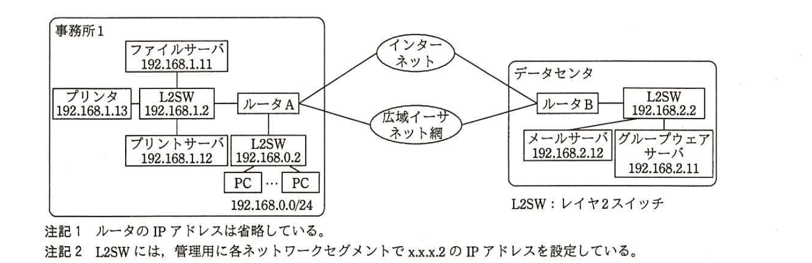
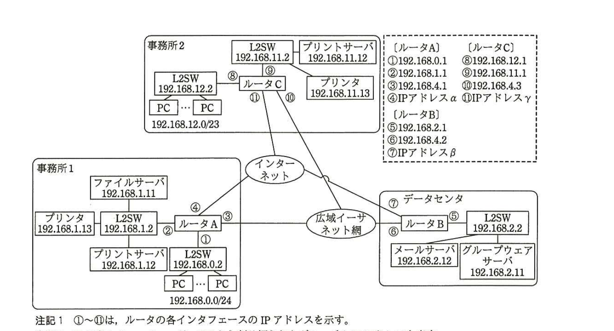

# 2015年秋期（平成27年度）応用情報技術者試験 午後 問5（選択）
## ネットワーク：ネットワークの設計（W社）

---

## 問題文

**問5** ネットワークの設計に関する次の記述を読んで、設問1〜4に答えよ。

W社は、首都圏で事務所向け家具販売を手掛ける、社員数約150人の中堅企業である。首都圏でのオフィス需要の増加を背景に、事業規模の拡大を目指している。これまでは、1か所の事務所（以下、事務所1という）及びサーバ類を設置するデータセンタで業務を行ってきたが、社員数の増加に伴い事務所スペースが足りなくなったので、2か所目の事務所（以下、事務所2という）を、事務所1とは別の地域に新設することにした。事務所2の新設に当たり、ネットワークの設計を企画部のXさんが担当することになった。

---

### 〔現状ネットワークの調査〕

Xさんは、現状ネットワークの利用状況を調査し、次のとおり整理した。

・PCは社員に一人1台ずつ配布されており、LANに接続されている。

・PCを利用して、電子メールの送受信、グループウェアの利用、ファイルの共有（ファイルサーバ及びグループウェアサーバの両方にアクセスして利用）、プリンタの利用、及びインターネット上のWebサイト閲覧を行っている。

・メールサーバ及びグループウェアサーバは、データセンタに設置されている。ファイルサーバ及びプリントサーバは、事務所1内のLAN上に設置されている。グループウェアサーバは、ファイル共有機能を利用するために、ファイルサーバにアクセスしている。

・事務所1及びデータセンタから広域イーサネット網へは、それぞれ広域イーサネット回線（30Mビット／秒）で接続している。

・インターネットには、事務所1及びデータセンタからそれぞれ光回線（100Mビット／秒）で接続している。

・ルータは、インターネットVPN機能をもっている。

・事務所1のPCには192.168.0.0/24からIPアドレスが割り当てられている。

W社の現状ネットワークの構成を図1に示す。

> 図1の内容：事務所1（ファイルサーバ192.168.1.11、プリンタ192.168.1.13、プリントサーバ192.168.1.12がL2SW 192.168.1.2に接続、L2SW 192.168.1.2はルータAに接続、ルータAはL2SW 192.168.0.2経由でPC群（192.168.0.0/24）に接続）とデータセンタ（ルータB、L2SW 192.168.2.2、メールサーバ192.168.2.12、グループウェアサーバ192.168.2.11）が、インターネット及び広域イーサネット網の両方を介してルータA・ルータB間で接続されている。注記1：ルータのIPアドレスは省略。注記2：L2SWには管理用に各セグメントでx.x.x.2のIPアドレスを設定。

---

### 〔新たなネットワークの設計方針〕

Xさんは、新たなネットワークを次の方針で設計することにした。

・データセンタ及び事務所1に設置されている機器の設置場所とIPアドレスは、現状のまま変更しない。

・事務所1とデータセンタの広域イーサネット回線、広域イーサネット網及び光回線は、現状のまま変更しない。

・事務所2に設置するルータは、インターネットVPN機能をもつものとする。

・事務所2からは、30Mビット／秒の広域イーサネット回線で、現在も使用している広域イーサネット網に接続し、事務所1及びデータセンタと通信可能とする。

・事務所2からは、光回線（100Mビット／秒）でインターネットに接続する。

・事務所2にプリンタ及びプリントサーバを設置し、各事務所では自事務所内のプリンタを用いて印刷を行う。

・事務所2には最大で300人程度まで収容可能な執務スペースがあるので、PCを300台設置できるように、PCには192.168.12.0/23からIPアドレスを割り当てる。

・業務効率向上のために、事務所1と事務所2の間でテレビ会議を利用する。テレビ会議は、両事務所のPCからグループウェアサーバにIP接続し、グループウェアのテレビ会議機能を用いて行う。PC間の直接通信は行わない。テレビ会議を行う場合、遅延なく良好なレスポンスを確保する必要がある。また、画像の乱れを発生させないために、1台のPC当たり5Mビット／秒の帯域が必要である。同時利用は両事務所で1台ずつを想定する。

これらの方針に基づくW社の新たなネットワーク構成を図2に示す。

> 図2の内容：事務所2（L2SW 192.168.11.2、プリントサーバ192.168.11.12、プリンタ192.168.11.13、ルータC、L2SW 192.168.12.2、PC群192.168.12.0/23）、事務所1（図1と同様）、データセンタ（図1と同様）の3拠点が、インターネット及び広域イーサネット網を介して、ルータA・ルータB・ルータCの三者間で接続されている。ルータの各インタフェースIPアドレス：ルータA（①192.168.0.1、②192.168.1.1、③192.168.4.1、④IPアドレスα）、ルータB（⑤192.168.2.1、⑥192.168.4.2、⑦IPアドレスβ）、ルータC（⑧192.168.12.1、⑨192.168.11.1、⑩192.168.4.3、⑪IPアドレスγ）。注記1：①〜⑪はルータの各インタフェースのIPアドレスを示す。注記2：IPアドレスα、β、γは、ISPから割り振られたグローバルIPアドレスを表す。注記3：インターネット接続におけるファイアウォール機能は、各ルータに含まれるものとする。

図2のネットワーク構成において、データセンタに設置したルータBのルーティングテーブル（抜粋）を表1に示す。

### 表1 ルータBのルーティングテーブル（抜粋）

| 宛先アドレス | サブネットマスク | ネクストホップ |
|---|---|---|
| 192.168.0.0 | 255.255.255.0 | 192.168.4.1 |
| `[　a　]` | 255.255.255.0 | 192.168.4.1 |
| 192.168.12.0 | `[　b　]` | `[　c　]` |

---

### 〔冗長化構成の検討〕

図2のネットワーク構成をレビューしたY部長は、次の点を考慮の上、考えられる冗長化の方式を検討するようにXさんに指示した。

・事務所の広域イーサネット回線が不通となった場合に備えて、事務所とデータセンタの間をインターネットVPNで接続して、事務所からデータセンタにアクセス可能となるようにしてほしい。

・①事務所の光回線が不通となった場合に備えて、広域イーサネット網の帯域の一部を使って、データセンタ経由でインターネットにアクセス可能となるようにしてほしい。

Xさんは Y部長の指示に従い、各ルータにおいて②隣接するルータとの回線のリンク状態を管理して経路制御を行うルーティングプロトコルを用いた設計を開始した。

---

## 設問

### 設問1
図2で、事務所2のPCに割り当てられるIPアドレスの最大数を答えよ。

### 設問2
業務上想定される事務所1と事務所2の間の通信について、通信する両端の機器名を、図2中から選択して答えよ。

### 設問3
表1中の`[　a　]`〜`[　c　]`に入れる適切な字句を答えよ。

### 設問4
〔冗長化構成の検討〕について、(1)〜(3)に答えよ。

(1) 広域イーサネット網とインターネットVPNのどちらを主経路として冗長化構成をすべきか。事務所間で利用するテレビ会議機能に着目して、主経路とその理由を25字以内で述べよ。

(2) 本文中の下線①で、事務所の光回線とデータセンタの光回線が同時に利用不可となる場合を少なくするために、光回線の提供事業者を選定する際に考慮すべき対策を30字以内で述べよ。

(3) 本文中の下線②について、該当する適切なプロトコル名を解答群の中から選び、記号で答えよ。

**解答群：**
ア　ARP　　イ　OSPF　　ウ　RIP　　エ　SNMP

---

## 解答と解説

### 設問1

**正解：508**

事務所2のPCには192.168.12.0/23が割り当てられる。/23はホスト部が9ビットであり、割り当て可能なホストアドレス数は2⁹－2＝512－2＝**508**個である（ネットワークアドレスとブロードキャストアドレスの2個を除く）。

**IPA公式：508**

### 設問2

**正解：事務所1＝ファイルサーバ、事務所2＝PC**

〔現状ネットワークの調査〕・〔新たなネットワークの設計方針〕より、事務所間で業務上想定される通信は、テレビ会議機能を除けば、ファイル共有機能の利用である。ファイル共有は「グループウェアサーバは、ファイル共有機能を利用するために、ファイルサーバにアクセスしている」とあるとおり、グループウェアサーバがファイルサーバにアクセスする形で実現される。事務所2のPCはグループウェアサーバ（データセンタ）にアクセスし、グループウェアサーバが事務所1の**ファイルサーバ**にアクセスすることでファイル共有が実現される。したがって、事務所1と事務所2の間で業務上想定される通信の両端の機器は、事務所1の**ファイルサーバ**と事務所2の**PC**である。

**IPA公式：事務所1＝ファイルサーバ、事務所2＝PC**

### 設問3

**正解：a＝192.168.1.0、b＝255.255.254.0、c＝192.168.4.3**

`[　a　]`は、1行目（192.168.0.0／255.255.255.0、ネクストホップ192.168.4.1）と同じネクストホップ（ルータAへの回線、インタフェース③）をもつ、事務所1のもう一つのセグメントである。事務所1にはPCセグメント（192.168.0.0/24）とファイルサーバ等のセグメント（192.168.1.0/24）の2つがあるため、`[　a　]`には**192.168.1.0**が入る。

`[　b　]`・`[　c　]`は、事務所2のPCセグメント（192.168.12.0/23）への経路である。宛先アドレスが192.168.12.0で、192.168.12.0/23のネットワークを示すサブネットマスクは**255.255.254.0**（`[　b　]`）である。また、事務所2への経路はルータC（インタフェース⑩：192.168.4.3）を経由するため、ネクストホップは**192.168.4.3**（`[　c　]`）である。

**IPA公式：a＝192.168.1.0、b＝255.255.254.0、c＝192.168.4.3**

### 設問4

**(1) 正解例：主経路＝広域イーサネット網、理由＝遅延が少なくテレビ会議機能に適しているから**

インターネットVPNは、公衆のインターネット回線を経由するため、経路上の混雑状況によって遅延やゆらぎが発生しやすい。一方、広域イーサネット網は帯域が確保された専用の通信網であり、遅延が少なく安定した通信が可能である。事務所間のテレビ会議機能は「遅延なく良好なレスポンスを確保する必要がある」ため、**広域イーサネット網**を主経路とすべきであり、その理由は**遅延が少なくテレビ会議機能に適しているから**である。

**IPA公式：主経路＝広域イーサネット網、理由＝遅延が少なくテレビ会議機能に適しているから**

**(2) 正解例：事務所とデータセンタでは異なる回線事業者と契約する。**

同一の光回線事業者を利用していると、その事業者の設備障害や工事などによって、事務所とデータセンタの両方の光回線が同時に利用不可となるリスクがある。このリスクを低減するためには、**事務所とデータセンタでは異なる回線事業者と契約する**ことが対策として考えられる。

**IPA公式：事務所とデータセンタでは異なる回線事業者と契約する。**

**(3) 正解：イ（OSPF）**

下線②は「隣接するルータとの回線のリンク状態を管理して経路制御を行うルーティングプロトコル」である。リンクステート型のルーティングプロトコルは**OSPF**（イ）である。RIP（ウ）は距離ベクトル型であり、ARP（ア）はIPアドレスからMACアドレスを求めるプロトコル、SNMP（エ）はネットワーク機器の監視・管理プロトコルであるため、いずれも該当しない。

**IPA公式：イ**

---

## 参考：主要キーワード

| 用語 | 説明 |
|------|------|
| サブネットマスクとホスト数 | /nのネットワークでは、ホスト部のビット数は(32－n)。割り当て可能なホストアドレス数は2^(32-n)－2（ネットワークアドレスとブロードキャストアドレスを除く） |
| 広域イーサネット網とインターネットVPN | 広域イーサネット網は帯域確保された専用網で低遅延・安定。インターネットVPNは公衆網を利用するため安価だが遅延・混雑の影響を受けやすい |
| 回線の冗長化と事業者分散 | 同一経路上の異なる区間で同一事業者の回線を使うと、その事業者の障害で同時に複数拠点が影響を受けるリスクがある。事業者を分散することでリスクを低減する |
| OSPF（Open Shortest Path First） | リンクステート型のルーティングプロトコル。各ルータが隣接ルータとのリンク状態（コストなど）の情報を交換し、最短経路を計算する |
| RIP（Routing Information Protocol） | 距離ベクトル型のルーティングプロトコル。ホップ数を基準に経路を選択する、比較的シンプルなプロトコル |

