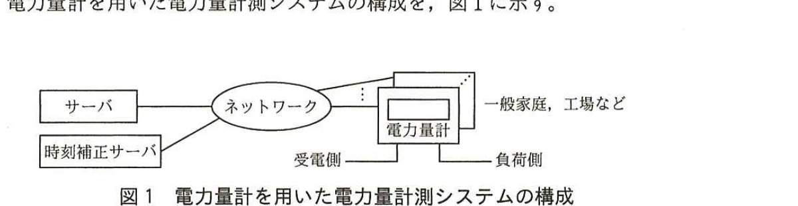

# 2015年秋期（平成27年度）応用情報技術者試験 午後 問7（選択）
## 組込みシステム開発：通信機能を内蔵したディジタル電力量計の設計（H社）

---

## 問題文

**問7** 通信機能を内蔵したディジタル電力量計の設計に関する次の記述を読んで、設問1〜4に答えよ。

H社は計測器のメーカである。今回、通信機能を内蔵したディジタル電力量計（以下、電力量計という）を設計することになった。この電力量計は、計測したデータを電力会社のサーバ（以下、サーバという）に自動で送信する。

---

### 〔電力量計の機能〕

電力量計を用いた電力量計測システムの構成を、図1に示す。

> 図1の内容：サーバ、時刻補正サーバがネットワークに接続。ネットワークは複数の電力量計（一般家庭、工場などに設置）と接続。各電力量計は受電側・負荷側の配線をもつ。

電力量計の機能は、次のとおりである。

(1) 電力量計は、一般家庭、工場などに設置され、電力量を計測し、記録する機能がある。また、内蔵した時計（以下、時計という）で時刻を計時する機能がある。内蔵バッテリを使用し、停電時にもこれらの機能を維持できる。

(2) 電力量計には通信機能があり、サーバと双方向通信ができる。通信は、携帯電話回線、インターネット、電力会社が敷設した専用線などのネットワークを使用して行う。

(3) 電力量計は、時刻補正サーバ又は検針員用の専用端末を利用し、時計を十分な精度で補正できる。

(4) 電力量計は、1秒ごとに1秒分の電力量を計測する。計測によって得られた電力量のデータには、年月日を含む秒単位の時刻情報（以下、タイムスタンプという）が付与される。このデータを1秒データといい、電力量計は最大70日分の1秒データを保持する。

(5) 電力量計は、毎時0分0秒から29分59秒までのタイムスタンプが付いた1秒データ、又は毎時30分0秒から59分59秒までのタイムスタンプが付いた1秒データ（以下、これらを電力量データという）をサーバに送信する。通常、電力量データは1,800個の1秒データから成るが、条件によっては1,800個とならないことがある。その場合、電力量計は電力量データ中の1秒データの個数が1,800個となるように補正する。

(6) 電力量計は、サーバに電力量データを送信するとき、電力量計の識別コード及びプログラムのバージョン番号を付与する。

(7) 検針員が出向いて検針し、データ収集することもできる。

---

### 〔電力量計のハードウェア構成〕

電力量計のハードウェア構成を表1に示す。この電力量計は計測部及び通信部から成る。

### 表1 電力量計のハードウェア構成

| 構成 | 機能など |
|---|---|
| 計測部 | ・MPU、RAM、フラッシュメモリ、A/Dコンバータ、リアルタイムクロック（以下、RTCという）、内蔵バッテリなどから成る。 ・A/Dコンバータを用いて電圧及び電流を常時計測し、計測結果から電力量を求める。 ・RTCは常に時刻を計時している。RTCは1秒ごとに割込みを発生し、割込みごとにソフトウェアで1秒データを計測する。RTCの誤差は1日当たり±0.7秒である。 |
| 通信部 | ・携帯電話回線、インターネット、電力会社が敷設した専用線などを使用し、サーバと通信を行う。 ・検針員用の専用端末と通信することができる近距離通信装置が内蔵されている。検針員が専用端末を電力量計にかざすと、近距離通信を用いて、時計の補正と、専用端末から指示された1か月分の電力量データの採取ができる（このデータを使用して、サーバのデータベース上で欠落した電力量データを補うことができる）。 |

---

### 〔サーバの機能〕

(1) 電力量データの収集

サーバから電力量計に対して、指定した時間帯の電力量データの通知要求を送る。サーバは、電力量計から送られてきた電力量計の識別コード、プログラムのバージョン番号を確認し、電力量データとともにデータベースに格納する。

(2) 検針員による検針の指示

サーバは、月初めのバッチ処理で、データベース上で電力量データに欠落がある電力量計一覧を出力する。検針員は電力量計一覧に従って検針し、データを収集する。

---

### 〔計測部のA/Dコンバータ〕

計測部は、電圧と電流を計測して電力を求める。このうち、電圧値を計測するA/Dコンバータは、最下位ビットが1／2,048ボルトの重みであり、負の値を2の補数表現として－1,024ボルト〜1,024－（1／2,048）ボルトの範囲の電圧を計測できる。このA/Dコンバータに必要な最小のビット数は、`[　a　]`ビットである。

---

### 〔電力量計のタスクの主な処理〕

電力量計のプログラムは、通信制御タスク及び管理タスクから成る。電力量計のタスクの主な処理は表2のとおりである。

### 表2 電力量計のタスクの主な処理

| タスク | 処理 |
|---|---|
| 通信制御タスク | ・サーバから電力量データの通知要求を受け取ると、指示された時間帯の電力量データを管理タスクのバッファから取り出し、電力量データ中の1秒データに過不足があるときは補正を行う。サーバには、電力量データ、`[　b　]`及び`[　c　]`を送る。 ・管理タスクから時刻補正要求を受け取り、ネットワークを使用した時刻補正を行う。 ・検針員の専用端末と近距離通信で接続したとき、専用端末から指示された1か月分のデータを専用端末に送り、専用端末を利用した時刻補正を行う。 |
| 管理タスク | ・RTCの割込みによって起動され、1秒データを作成し、バッファに格納する。 ・時刻の誤差が±0.5秒を超えないように、一定周期で通信制御タスクに時刻補正要求を送る。 |

---

## 設問

### 設問1
〔電力量計の機能〕について、電力量データの1秒データの個数が1,800個とならないのはどのようなときか、40字以内で述べよ。ただし、うるう秒及び新たに電力量計を設置した場合を除くものとする。

### 設問2
〔サーバの機能〕について、サーバのデータベース上で、電力量データの欠落を検出するのに使用するデータの情報を答えよ。

### 設問3
〔計測部のA/Dコンバータ〕について、本文中の`[　a　]`に入れる適切な数値を答えよ。

### 設問4
〔電力量計のタスクの主な処理〕について、(1)、(2)に答えよ。

(1) 表2中の`[　b　]`、`[　c　]`に入れる適切な字句を答えよ。

(2) RTCの時刻の誤差が±0.5秒を超えないように時刻を補正するには、最大何時間ごとに時刻補正を行わなければならないか。答えは、誤差が一定として、小数第1位を切り捨てて、整数で求めよ。

---

## 解答と解説

### 設問1

**正解例：時計の補正機能によって、時計の時刻が1秒以上変化したとき**

電力量データは、通常「毎時0分0秒から29分59秒まで」又は「毎時30分0秒から59分59秒まで」の30分間、すなわち1,800秒分の1秒データから構成される。ところが、〔電力量計の機能〕(3)にあるとおり、時計は時刻補正サーバや検針員用の専用端末を利用して補正される。この補正によって時計の時刻が1秒以上前後にずれると、当該30分間に計測される1秒データの個数が1,800個より多くなったり少なくなったりする。したがって、**時計の補正機能によって、時計の時刻が1秒以上変化したとき**に1,800個とならない。

**IPA公式：時計の補正機能によって、時計の時刻が1秒以上変化したとき**

### 設問2

**正解例：タイムスタンプ**

〔サーバの機能〕(2)にあるとおり、サーバは月初めのバッチ処理で「データベース上で電力量データに欠落がある電力量計一覧」を出力している。1秒データには年月日を含む秒単位の時刻情報である**タイムスタンプ**が付与されており、これを用いて連続する時系列の中で抜けている時刻を検出することで、電力量データの欠落を検出できる。

**IPA公式：タイムスタンプ**

### 設問3

**正解：22**

電圧値の計測範囲は－1,024ボルト〜1,024－（1／2,048）ボルトであり、幅は2,048ボルトである。最下位ビットの重みは1／2,048ボルトなので、必要なビット数nは、2ⁿ×(1／2,048) ＝ 2,048を満たす必要がある。すなわち、2ⁿ＝2,048×2,048＝2¹¹×2¹¹＝2²²であるから、n＝**22**ビットとなる。

**IPA公式：22**

### 設問4

**(1) 正解例：b＝電力量計の識別コード、c＝プログラムのバージョン番号（順不同）**

〔電力量計の機能〕(6)に「電力量計は、サーバに電力量データを送信するとき、電力量計の識別コード及びプログラムのバージョン番号を付与する」とあり、また〔サーバの機能〕(1)にも「サーバは、電力量計から送られてきた電力量計の識別コード、プログラムのバージョン番号を確認し」とある。これらから、通信制御タスクがサーバに送るのは、電力量データに加えて**電力量計の識別コード**と**プログラムのバージョン番号**である（順不同）。

**IPA公式：b＝電力量計の識別コード、c＝プログラムのバージョン番号（順不同）**

**(2) 正解：17（時間）**

RTCの誤差は1日（24時間）当たり±0.7秒である。時刻の誤差が±0.5秒を超えないようにするための最大補正間隔をt時間とすると、誤差が時間に比例して一定の割合で蓄積すると仮定して、
0.7秒 ／ 24時間 × t時間 ≦ 0.5秒
t ≦ 0.5 × 24 ／ 0.7 ＝ 12／0.7 ≒ 17.14…

小数第1位を切り捨てて整数で求めると、t＝**17**（時間）となる。

**IPA公式：17（時間）**

---

## 参考：主要キーワード

| 用語 | 説明 |
|------|------|
| タイムスタンプ | データに付与される年月日・時刻の情報。時系列データの欠落検出や整合性確認に利用される |
| RTC（Real Time Clock） | 常時時刻を計時するハードウェア。一定の誤差（ドリフト）があるため、定期的な補正が必要となる |
| A/Dコンバータの必要ビット数 | 計測すべき電圧・電流の範囲と最下位ビットの重み（分解能）から、2進数で表現するために必要なビット数を算出する |
| 2の補数表現 | 負の数を表現する方式の一つ。nビットで－2^(n-1)〜2^(n-1)－1の範囲を表現できる |
| バッチ処理による欠落検出 | 定期的（本問では月初め）にデータベースを走査し、期待されるデータが揃っていない対象を一覧化して後続処理（検針指示など）につなげる方式 |

