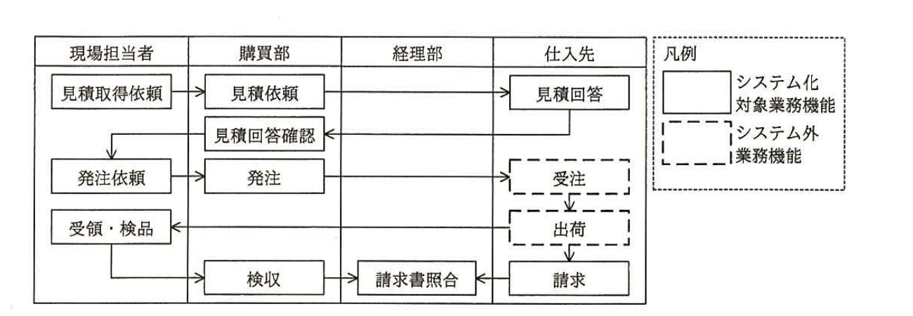
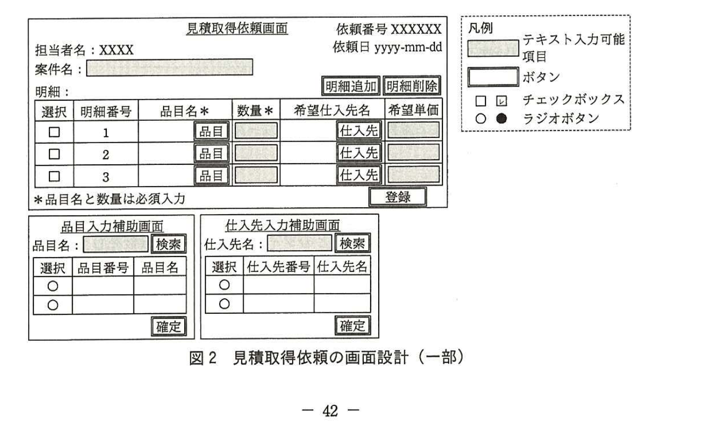
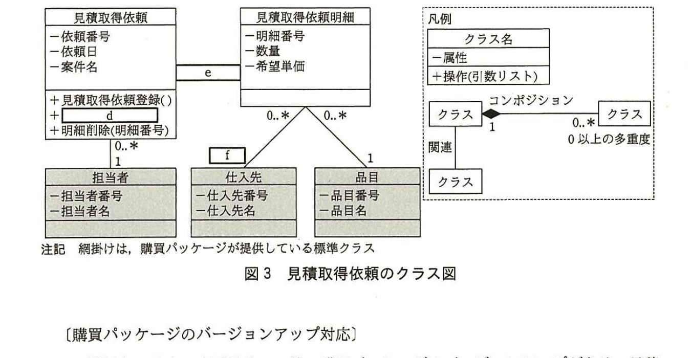

# 2015年秋期（平成27年度）応用情報技術者試験 午後 問8（選択）
## 情報システム開発：ソフトウェアパッケージの利用（K社）

---

## 問題文

**問8** ソフトウェアパッケージの利用に関する次の記述を読んで、設問1〜3に答えよ。

K社は、現行の購買システムの再構築のために、短期間で導入できる購買業務用ソフトウェアパッケージ（以下、購買パッケージという）の利用を検討している。現行業務を分析し改善要望を整理した結果を基に、業務機能を定義し、新業務フローを作成した。その上で、購買パッケージとのフィット＆ギャップ分析を行い、ギャップ部分についてはできるだけ購買パッケージに合わせることとし、重要度が高いギャップだけ、追加プログラムの開発を行う方針とした。

**(1) 改善要望の整理**

現行業務を分析し、改善要望を整理した。

・現在の見積りの業務では、現場担当者が仕入先に対して見積りを依頼している。仕入額の削減や発注遅延の防止を目的として、購買部から仕入先に対して見積りを依頼するようにしたい。

・仕入先とのやり取りの業務では、仕入先から受領した情報をシステムに入力する手間や、データの入力ミスが問題となっている。特に入力量が多い見積回答データや請求データについては、仕入先に直接入力させたい。

**(2) 業務機能の定義**

改善要望を整理した結果から、表1に示す業務機能を定義した。

### 表1 業務機能

| No. | 業務機能 | 内容 |
|---|---|---|
| 1 | 見積取得依頼 | 現場担当者が、購買部に見積取得を依頼する。 |
| 2 | 見積依頼 | 購買部が、現場担当者からの見積取得依頼を基に、仕入先に見積りを依頼する。 |
| 3 | 見積回答 | 仕入先が、見積回答を直接入力する。 |
| 4 | 見積回答確認 | 購買部が、見積回答を確認する。 |
| 5 | 発注依頼 | 現場担当者が、発注依頼内容を入力し、購買部に発注を依頼する。 |
| 6 | 発注 | 購買部が、現場担当者からの発注依頼を基に、仕入先に発注する。 |
| 7 | 受領・検品 | 現場担当者が、商品を受領した結果と検品した結果を入力する。 |
| 8 | 検収 | 購買部が、発注した商品について検品が合格であったことを確認し、検収を行い、買掛金を計上する。 |
| 9 | 請求 | 仕入先が、請求内容を直接入力する。 |
| 10 | 請求書照合 | 経理部が、仕入先からの請求データと購買部からの検収データを照合し、仕入先への支払金額を確定する。 |

**(3) 新業務フローの作成**

業務機能を定義した結果から、図1に示す新業務フローを作成した。

> 図1の内容：現場担当者・購買部・経理部・仕入先の4レーンからなる業務フロー。現場担当者「見積取得依頼」→購買部「見積依頼」→仕入先「見積回答」→購買部「見積回答確認」→現場担当者「発注依頼」→購買部「発注」→仕入先（システム外）「受注」→「出荷」→「請求」→経理部「請求書照合」（購買部の検収データとも照合）。現場担当者「受領・検品」→購買部「検収」→経理部「請求書照合」。凡例：実線枠＝システム化対象業務機能、破線枠＝システム外業務機能（受注・出荷は仕入先側の内部処理でシステム化対象外）。

---

### 〔購買パッケージの機能〕

導入を検討している購買パッケージの標準機能を表2に示す。

### 表2 購買パッケージの標準機能

| 機能名 | 機能概要 |
|---|---|
| 見積依頼 | 見積りを取得するための情報を入力し、仕入先へ送るための見積依頼書を発行する。 |
| 見積回答入力 | 仕入先から受領した見積回答書の内容を基に、見積金額を入力する。 |
| 見積回答照会 | 見積回答の内容を照会する。 |
| 発注依頼 | 発注依頼者が発注依頼内容を入力し、発注者に発注を依頼する。 |
| 発注 | 商品を購入するために、仕入先へ送る発注書を発行する。 |
| 受領・検品 | 商品を受領した結果と検品した結果を入力する。 |
| 検収 | 発注内容と、検品結果を確認し、検収処理を行い、買掛金を計上する。 |
| 請求書照合 | 仕入先から受領した請求書の請求内容と検収データを照合し、仕入先への支払金額を確定する。 |

---

### 〔フィット＆ギャップ分析〕

業務機能と購買パッケージの標準機能とのフィット＆ギャップ分析を行ったところ、表3の結果が得られた。

### 表3 業務機能とのフィット＆ギャップ分析の結果（ギャップのある業務機能だけ抜粋）

| No. | 業務機能 | 結果 | 検討内容 |
|---|---|---|---|
| 1 | 見積取得依頼 | ギャップ | 標準機能では、仕入先へ送るための見積依頼書を発行することが可能。現場担当者が購買部に対して見積取得を依頼する機能はなし。 |
| 3 | 見積回答 | ギャップ | 標準機能では、`[　a　]`することが可能。`[　b　]`する機能はなし。 |
| 9 | 請求 | ギャップ | `[　c　]`する機能はなし。 |

---

### 〔追加プログラムの外部設計〕

フィット＆ギャップ分析によってギャップと判定された業務機能のうち、見積回答と、請求については、購買パッケージに合わせて、仕入先から受領した情報をK社の社員がシステムに入力する運用を継続することにした。見積取得依頼については、現場担当者からの依頼に基づいて、購買部が仕入先から見積りを取得するという改善要望を優先することとし、購買パッケージに対して、K社独自の機能を追加プログラムとして開発することにした。

追加プログラムとして開発が必要な、現場担当者が入力する見積取得依頼の画面設計の一部を図2に、見積取得依頼のクラス図を図3に示す。追加プログラムは、購買パッケージが提供しているテーブル（パッケージテーブル）を直接参照せず、購買パッケージが提供しているプログラム（パッケージプログラム）を使用してパッケージテーブルにアクセスする。追加プログラムが必要とするデータでパッケージテーブルに存在しないデータは、K社独自のテーブルとして新たに作成する。

> 図2の内容：見積取得依頼画面（依頼番号、依頼日、担当者名、案件名、明細行（選択・明細番号・品目名・数量・希望仕入先名・希望単価）、明細追加／明細削除ボタン、登録ボタン）と、品目入力補助画面・仕入先入力補助画面（それぞれ検索・ラジオボタン選択・確定ボタン）。凡例：テキスト入力可能項目、ボタン、チェックボックス、ラジオボタン。

見積取得依頼画面のボタンとその機能を次に示す。

・品目名を入力する際、又は希望する仕入先があり希望仕入先名を入力する際は、品目ボタン又は仕入先ボタンを押すことによって、それぞれの入力補助画面へ遷移する。遷移先の入力補助画面でマスタ検索を行い、出力される品目又は仕入先をラジオボタンで選択し、確定ボタンを押すことによって、見積取得依頼画面の明細に、品目名又は希望仕入先名を指定する。

・明細追加ボタンを押すことによって、品目名、数量などを入力するための新たな明細行が追加される。

・選択欄のチェックボックスにチェックを入力した後、明細削除ボタンを押すことによって、選択した明細行が削除される。

・見積取得依頼画面で案件名及び明細行を入力し登録ボタンを押すことによって、見積取得依頼及びその明細が登録される。

> 図3の内容：クラス「見積取得依頼」（属性：依頼番号、依頼日、案件名。操作：見積取得依頼登録()、`[　d　]`、明細削除(明細番号)）とクラス「見積取得依頼明細」（属性：明細番号、数量、希望単価）が`[　e　]`のリレーションシップで接続。「見積取得依頼」1－0..*「担当者」（属性：担当者番号、担当者名、網掛け＝標準クラス）。「見積取得依頼明細」0..*－1「仕入先」（属性：仕入先番号、仕入先名、網掛け）に`[　f　]`の多重度で接続。「見積取得依頼明細」0..*－1「品目」（属性：品目番号、品目名、網掛け）。凡例：クラス名／属性／操作(引数リスト)の3段表記、コンポジション（◆）、関連、多重度の表記例。注記：網掛けは、購買パッケージが提供している標準クラス。

---

### 〔購買パッケージのバージョンアップ対応〕

購買システムの本番リリース後、購買パッケージのバージョンアップがあり、見積回答機能が強化されて、K社の業務機能（表1のNo.3）に合致するようになった。そこで、購買パッケージのバージョンアップを検討し、追加プログラムへの影響調査を実施した。購買パッケージにおいては、バージョンアップの際に既存のパッケージテーブルに対する変更は一切行われていないことを確認した。また、追加プログラムの開発に当たって、K社ではパッケージプログラムやパッケージテーブルに対する改修を一切行っていない。

念のため、テスト環境を用意して、購買パッケージのバージョンアップを行い、購買システムの動作検証を実施したところ、①追加プログラムが異常終了した。この原因を調査して追加プログラムの修正を実施し、本番環境のバージョンアップを無事に完了した。

---

## 設問

### 設問1
表3中の`[　a　]`〜`[　c　]`に入れる適切な機能内容について、それぞれ20字以内で述べよ。

### 設問2
図3について、(1)、(2)に答えよ。

(1) `[　d　]`、`[　f　]`に入れる適切な字句を答えよ。

(2) `[　e　]`に入れる適切な関連と多重度を答えよ。図3の凡例に倣って解答すること。

### 設問3
本文中の下線①の異常終了を予見できなかったのは、バージョンアップの影響調査において何が不足していたからか。調査が必要であった内容について40字以内で述べよ。

---

## 解答と解説

### 設問1

**正解例：a＝見積金額をシステムに入力、b＝仕入先が見積回答を直接入力、c＝仕入先が請求内容を直接入力**

`[　a　]`は、購買パッケージの標準機能「見積回答入力」（表2）の内容そのものである。標準機能では「仕入先から受領した見積回答書の内容を基に、見積金額を入力する」とあり、これはK社の担当者が仕入先からの見積回答書を見ながら**見積金額をシステムに入力**する運用を前提としている。

`[　b　]`は、K社の業務機能（表1のNo.3「見積回答」）の内容である「仕入先が、見積回答を直接入力する」ことを指す。標準機能には仕入先自身が直接入力する機能はないため、**仕入先が見積回答を直接入力**する機能はなし、というギャップになる。

`[　c　]`は、業務機能（表1のNo.9「請求」）の内容である「仕入先が、請求内容を直接入力する」ことである。購買パッケージの標準機能には請求関連の入力機能自体がなく、**仕入先が請求内容を直接入力**する機能はなし、というギャップになる。

**IPA公式：a＝見積金額をシステムに入力、b＝仕入先が見積回答を直接入力、c＝仕入先が請求内容を直接入力**

### 設問2

**(1) 正解：d＝明細追加()、f＝0..1**

`[　d　]`は、クラス「見積取得依頼」の操作の一つであり、他の操作（見積取得依頼登録()、明細削除(明細番号)）と並んで、図2の画面設計にある「明細追加ボタン」に対応する操作である。したがって、**明細追加()**が入る。

`[　f　]`は、見積取得依頼明細と仕入先の間の多重度である。図2の画面設計より、明細の"希望仕入先名"は必須入力ではなく、指定しない場合もある（任意入力）ため、1件の明細に対応する仕入先は0件または1件、すなわち**0..1**となる。

**IPA公式：d＝明細追加()、f＝0..1**

**(2) 正解：e＝1 － 1..＊（見積取得依頼側1、見積取得依頼明細側1..＊）**

見積取得依頼とその明細（見積取得依頼明細）は、コンポジション（全体・部分関係で、部分が全体に依存して存在する強い関連）で結ばれる。1件の見積取得依頼には、少なくとも1件以上の明細行が必要である（登録には明細行の入力が必須）ため、多重度は見積取得依頼側が**1**、見積取得依頼明細側が**1..＊**となる。図3の凡例のコンポジション表記（◆付きの実線）に倣って解答する。

**IPA公式：e＝1（見積取得依頼側）、1..＊（見積取得依頼明細側）**

### 設問3

**正解例：追加プログラムが使用するパッケージプログラムの変更内容**

本文には「購買パッケージにおいては、バージョンアップの際に既存のパッケージテーブルに対する変更は一切行われていないことを確認した」「K社ではパッケージプログラムやパッケージテーブルに対する改修を一切行っていない」とあるが、追加プログラムは「購買パッケージが提供しているプログラム（パッケージプログラム）を使用してパッケージテーブルにアクセスする」構造になっている。パッケージテーブル自体は変更されていなくても、パッケージプログラムの内部の処理内容（インタフェースの挙動や仕様）がバージョンアップによって変更されていれば、それを利用する追加プログラムに影響が及ぶ可能性がある。この調査が行われていなかったため、異常終了を予見できなかった。すなわち不足していたのは、**追加プログラムが使用するパッケージプログラムの変更内容**の調査である。

**IPA公式：追加プログラムが使用するパッケージプログラムの変更内容**

---

## 参考：主要キーワード

| 用語 | 説明 |
|------|------|
| フィット＆ギャップ分析 | 業務要件とパッケージソフトウェアの標準機能とを突き合わせ、合致する部分（フィット）と乖離する部分（ギャップ）を洗い出す手法 |
| 追加プログラム（アドオン） | パッケージソフトウェアの標準機能では満たせない要件を実現するために、個別に開発・追加するプログラム |
| コンポジション | UMLのクラス図における関連の一種。全体と部分の強い所有関係を表し、全体が削除されると部分も削除される（本問では見積取得依頼と見積取得依頼明細の関係） |
| 多重度（マルチプリシティ） | クラス間の関連において、一方のインスタンス1つに対応する他方のインスタンスの数の範囲を示す（例：0..1、1..＊） |
| パッケージのバージョンアップ影響調査 | パッケージ本体のテーブル構造だけでなく、追加プログラムが利用する標準プログラム（API相当）の仕様変更の有無も調査対象に含める必要がある |

