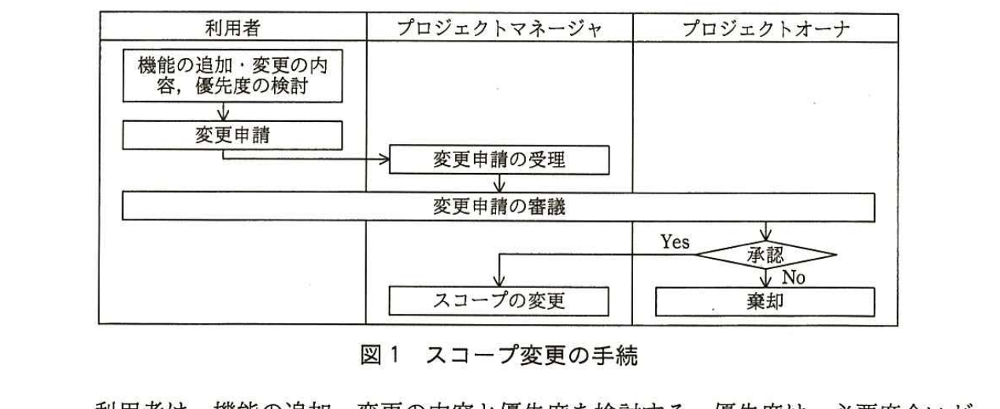

# 2015年秋期（平成27年度）応用情報技術者試験 午後 問9（選択）
## プロジェクトマネジメント：ソフトウェア開発プロジェクトのスコープ管理（C社）

---

## 問題文

**問9** ソフトウェア開発プロジェクトのスコープ管理に関する次の記述を読んで、設問1〜3に答えよ。

C社は、電気製品の販売会社であり、複数の販売店を運営している。C社では、商品の仕入れや販売など、C社の店頭での販売業務を支援する販売システムを導入している。商品の在庫が店頭にない場合は、顧客は商品を予約することができる。予約後に入荷した商品は、顧客が来店して持ち帰る場合と、販売店から顧客の住所へ発送する場合がある。販売員が、予約された商品の管理のために予約台帳を作成しているが、手作業によるミスが多発していた。C社では、次年度に大型店舗の新規開店と販売員の増強を予定しており、予約件数の大幅な増加が見込まれている。そこで、販売システムに、予約業務を支援する機能を新たに追加してミスを削減することにした。

追加開発プロジェクト（以下、プロジェクトという）が発足し、システム部のD君がプロジェクトマネージャに、利用者である販売管理部のE部長がプロジェクトオーナになった。システム部と販売管理部との協議の結果、追加開発の対象業務と主な機能、ファンクション数は表1のとおりとなった。ファンクション数とは、業務において利用者が利用できる画面や帳票の数である。システム部と販売管理部が、機能量を定量的に表す指標として、このファンクション数を用いることで合意している。

### 表1 追加開発の対象業務と主な機能、ファンクション数

| 番号 | 対象業務 | 主な機能 | ファンクション数 |
|---|---|---|---|
| 1 | 予約登録 | 予約の登録、商品送付先の登録 | 5 |
| 2 | 予約検索、変更 | 商品別／顧客別予約の検索、予約の変更 | 10 |
| 3 | 予約完了 | 予約の完了 | 3 |
| | ファンクション数合計 | | 18 |

次年度の新規開店によって、システムのトランザクション件数の増加が見込まれるが、機能が追加された販売システムでは、現状の応答時間を維持する必要がある。また、追加機能は、予算の制約から、1,000万円以内で開発し、本年度末までに稼働する必要がある。D君が表1の機能の開発費用を見積もったところ、総額は750万円であった。D君は、E部長と相談し、開発費用の上限値を1,000万円とし、見積りとの差は、プロジェクト予備費に充てることにした。

---

### 〔スコープ管理計画の立案〕

D君は、プロジェクトの開始に当たり、スコープ管理計画を次の手順で立案した。

・実現すべき機能の一覧など、プロジェクトの成果物である機能追加された販売システムの特性や要求事項を収集し、`[　a　]`を作成する。

・①機能要件の他に、プロジェクトが成功するために満たすべき条件をプロジェクト目標として定める。

・これらを基に、`[　b　]`を作成する。

・プロジェクト進行中に、表1以外の機能の追加・変更が発生した場合に備え、スコープ変更の手続を定める。

・プロジェクトにおいて必要な作業と成果物を定義し、`[　c　]`を作成する。

・以上の内容に、プロジェクト管理のための②ベースラインの定義を加えてスコープ管理計画としてまとめ、E部長の承認を得る。

---

### 〔スコープ変更の手続〕

D君は、スコープ変更の手続を、図1のように定義した。

> 図1の内容：利用者・プロジェクトマネージャ・プロジェクトオーナの3レーンからなるフロー図。利用者「機能の追加・変更の内容、優先度の検討」→「変更申請」→プロジェクトマネージャ「変更申請の受理」→（3者共通）「変更申請の審議」→プロジェクトオーナ「承認」判定。Yesの場合プロジェクトマネージャ「スコープの変更」、Noの場合プロジェクトオーナ「棄却」。

利用者は、機能の追加・変更の内容と優先度を検討する。優先度は、必要度合いが高いものから低いものまでを3段階に分け、業務上必須のものを優先度"高"、必須ではないものを優先度"低"、中間を優先度"中"とする。変更申請の審議は、利用者、プロジェクトマネージャ、プロジェクトオーナが行う。審議においては、追加・変更の内容と優先度を確認して、優先度"高"のものは原則として開発対象とし、優先度が"中"や"低"のものは、プロジェクトへの影響を考慮して、開発対象とするか、しないかを決定する。

---

### 〔変更申請の発生と対応〕

プロジェクト開始後、販売管理部のF課長が、表2の内容の変更申請を行った。

### 表2 変更申請の内容

| 番号 | 対象業務 | 機能 | 機能概要 | 優先度 |
|---|---|---|---|---|
| 1 | 入荷連絡 | メール送信 | 予約した顧客へメールを自動送信する。 | 高 |
| 2 | 予約キャンセル | 引取り期限設定 | 商品入荷後の引取り期限を設定する。 | 高 |
| 3 | 予約キャンセル | 指定予約キャンセル | 顧客の依頼などによって予約をキャンセルする。 | 高 |
| 4 | 予約キャンセル | 期限切れ予約検索 | 期限切れ予約を検索する。 | 高 |

変更申請の審議において、D君は、申請された機能が業務上必須であるかどうかを、F課長に再確認した。その結果、入荷連絡業務のメール送信機能は、現行のメールシステムで代用できるので、必須の機能とまでは言えないことが分かった。また、予約キャンセルは、顧客の依頼による場合と、商品入荷後も顧客が来店せず、引取り期限後に店側で予約キャンセルを判断する場合がある。これらの場合に、予約キャンセル業務の機能は必須となることが分かった。F課長が優先度を見直すことになり、変更申請は再審議されることになった。その後、D君は、表2の機能の開発費用を見積もり、表3の結果を得た。また、開発期間の見積りを行ったところ、開発期間は1か月で、開発要員を速やかに参加させれば、本年度末までに開発を完了できることが分かった。

### 表3 開発費用

| 番号 | 対象業務 | 機能 | ファンクション数 | 費用 |
|---|---|---|---|---|
| 1 | 入荷連絡 | メール送信 | 2 | 70万円 |
| 2 | 予約キャンセル | 引取り期限設定 | 1 | 50万円 |
| 3 | 予約キャンセル | 指定予約キャンセル | 3 | 100万円 |
| 4 | 予約キャンセル | 期限切れ予約検索 | 3 | 120万円 |
| | 合計 | | 9 | 340万円 |

D君は、表3の追加費用がプロジェクト予備費を上回るので、追加開発を極力減らしたいと考えた。そこで、予約キャンセル業務のための機能について、代替案の検討を行うことにし、F課長に検討を依頼した。すると、F課長から、検討結果として次の回答を得た。

・予約をキャンセルすると、その予約は一旦完了扱いとした上で、キャンセルされた予約の履歴データを保存する必要がある。指定予約キャンセル機能は、この予約履歴データ保存機能を含む。予約履歴データ保存機能を除けば、指定予約キャンセル機能は、表1の予約の完了機能によって代替できる。

・引取り期限設定機能と期限切れ予約検索機能は、代替できる機能がない。

D君は予約履歴データ保存機能の開発費用を30万円と見積もり、F課長に、機能の優先度の見直しと、代替案の採用を依頼した。そして、スコープ変更の再審議が行われることになった。

---

## 設問

### 設問1
本文中の下線①のプロジェクト目標を具体的に三つ挙げ、それぞれ20字以内で述べよ。

### 設問2
スコープ管理計画の立案について、(1)、(2)に答えよ。

(1) 本文中の`[　a　]`〜`[　c　]`に入れる適切な字句を解答群の中から選び、記号で答えよ。

**解答群：**
ア　WBS　　イ　開発見積書　　ウ　スコープ記述書
エ　成果物記述書　　オ　責任分担　　カ　体制図
キ　プロジェクト大日程　　ク　リスク定義書　　ケ　ワークパッケージ

(2) 本文中の下線②の承認を得る上で、システムの機能量全体の計画と実績の差異を定量的に管理するために、事前にE部長と合意すべきことは何か。30字以内で述べよ。

### 設問3
変更申請の発生と対応について、(1)、(2)に答えよ。

(1) 追加開発対象を、見直し後の優先度が"高"のものとし、代替案を採用すると、追加開発後のプロジェクト予備費の残額は何万円になるか、数値で答えよ。

(2) 変更申請の審議をより円滑に行うために、審議に先立って、開発費用の見積りを行っておくことが有効である。これ以外に、プロジェクトマネージャが変更申請を受理した後、審議に先立って行っておくべきことを二つ挙げ、それぞれ10字以内で答えよ。

---

## 解答と解説

### 設問1

**正解例：本年度末までの稼働／現状の応答時間の維持／1,000万円以内の費用での開発**

本文冒頭〔スコープ管理計画の立案〕の直前の段落に、機能要件以外の条件として「次年度の新規開店によって、システムのトランザクション件数の増加が見込まれるが、機能が追加された販売システムでは、現状の応答時間を維持する必要がある。また、追加機能は、予算の制約から、1,000万円以内で開発し、本年度末までに稼働する必要がある」とある。これらは機能要件（実現すべき機能）とは別に、プロジェクトが成功するために満たすべき制約条件であり、プロジェクト目標として、**本年度末までの稼働**、**現状の応答時間の維持**、**1,000万円以内の費用での開発**の三つが挙げられる。

**IPA公式：本年度末までの稼働／現状の応答時間の維持／1,000万円以内の費用での開発**

### 設問2

**(1) 正解：a＝エ（成果物記述書）、b＝ウ（スコープ記述書）、c＝ア（WBS）**

`[　a　]`は、「プロジェクトの成果物である機能追加された販売システムの特性や要求事項を収集」して作成するものである。成果物の特性や要求事項をまとめたものは**成果物記述書**（エ）である。

`[　b　]`は、成果物記述書とプロジェクト目標（下線①）を基に作成するものであり、プロジェクトのスコープ（成果物、境界、制約条件など）を包括的に記述する**スコープ記述書**（ウ）である。

`[　c　]`は、「プロジェクトにおいて必要な作業と成果物を定義し」て作成するものであり、プロジェクトの作業を階層的に分解して定義した**WBS**（Work Breakdown Structure、ア）である。

**IPA公式：a＝エ、b＝ウ、c＝ア**

**(2) 正解例：ファンクション数合計を機能量のベースラインにすること**

本文冒頭で「システム部と販売管理部が、機能量を定量的に表す指標として、このファンクション数を用いることで合意している」とある。スコープのベースライン（計画時点の基準値）を定めることで、その後の実績との差異を定量的に管理できるようになる。したがって、事前にE部長と合意すべきことは、**ファンクション数合計を機能量のベースラインにすること**である。

**IPA公式：ファンクション数合計を機能量のベースラインにすること**

### 設問3

**(1) 正解：50（万円）**

プロジェクト予備費は、当初の開発費用上限1,000万円と見積り750万円との差額であり、1,000－750＝250万円である。

見直し後、優先度"高"となる追加開発対象は、表3のうち「引取り期限設定」（50万円）と「期限切れ予約検索」（120万円）、及び代替案（指定予約キャンセルの代わりに予約完了機能を使い、予約履歴データ保存機能のみを開発）の「予約履歴データ保存機能」（30万円）である。一方、「メール送信」は必須ではないため優先度が下がり、開発対象から外れる。

追加開発費用の合計は、50＋120＋30＝200万円となる。したがって、プロジェクト予備費の残額は、250－200＝**50**（万円）となる。

**IPA公式：50（万円）**

**(2) 正解例：①開発期間の見積り、②代替案の検討**

審議をより円滑に行うためには、審議の場で判断に必要な情報を事前に揃えておくことが有効である。本文からは、開発費用の見積り（既に示されている）以外に、D君が実際に行った準備作業として、「開発期間の見積りを行ったところ、開発期間は1か月で…本年度末までに開発を完了できることが分かった」という**開発期間の見積り**、及び「予約キャンセル業務のための機能について、代替案の検討を行うことにし」という**代替案の検討**の二つが挙げられる。

**IPA公式：①開発期間の見積り、②代替案の検討**

---

## 参考：主要キーワード

| 用語 | 説明 |
|------|------|
| スコープ管理計画 | プロジェクトのスコープを定義・検証・管理する方法を定めた計画。成果物記述書、スコープ記述書、WBS、スコープ変更手続、ベースラインなどから構成される |
| 成果物記述書とスコープ記述書 | 成果物記述書は成果物自体の特性・要求事項を記述するもの。スコープ記述書はそれらとプロジェクト目標を踏まえ、プロジェクトの範囲（境界・制約）を記述するもの |
| WBS（Work Breakdown Structure） | プロジェクトで実施すべき作業を、成果物を単位として階層的に分解し、管理可能な単位（ワークパッケージ）まで細分化したもの |
| ベースライン | 計画時点で承認された基準値。その後の実績と比較することで、進捗や差異を定量的に管理するために用いられる |
| スコープ変更管理（変更管理プロセス） | プロジェクト進行中に発生する追加・変更要求を、優先度や影響度を踏まえて審議し、承認・却下を判断する一連の手続 |

