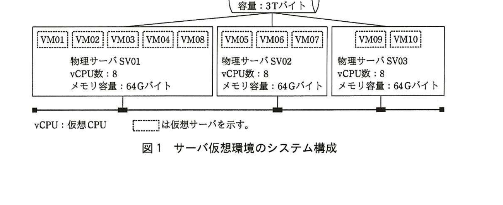

# 2015年秋期（平成27年度）応用情報技術者試験 午後 問10（選択）
## サービスマネジメント：サーバ仮想環境における運用管理（E社）

---

## 問題文

**問10** サーバ仮想環境における運用管理に関する次の記述を読んで、設問1、2に答えよ。

E社は、製造業を営む中堅企業である。E社の情報処理システムは、総務、人事、販売管理、生産管理などの各業務システムが稼働する複数のサーバと社内ネットワーク基盤から構成されており、E社の情報システム部が、この情報処理システムの運用管理を担当している。

E社では、今後3年間のシステム改善計画に基づき、情報処理システムを集約することによって費用の適正化を図ることにした。具体的には、これまで業務システムごとに1台以上の業務サーバが割り当てられていた稼働環境を、サーバ仮想化技術を適用して3台の物理サーバに統合することにし、現在、サーバ仮想環境に順次移行中である。

業務システムには、稼働停止が許されない業務上の重要性が高いシステム（販売管理及び生産管理）と、それ以外の数日間程度の停止であれば許されるシステムがあるので、それぞれの業務システムの可用性の要求水準に配慮してサーバ仮想環境への移行の作業方式と作業日数を設定した。これまでに10台の業務サーバをサーバ仮想環境の物理サーバに統合した。

3台の物理サーバは業務サーバと同じ社内LANに配置されている。3台の物理サーバに配置されているサーバ仮想環境のシステム構成を図1に、各仮想サーバのシステム資源（以下、リソースという）の割当てを表1にそれぞれ示す。

> 図1の内容：共用ストレージ（容量：3Tバイト）が3台の物理サーバに接続。物理サーバSV01（VM01,VM02,VM03,VM04,VM08、vCPU数:8、メモリ容量:64Gバイト）、物理サーバSV02（VM05,VM06,VM07、vCPU数:8、メモリ容量:64Gバイト）、物理サーバSV03（VM09,VM10、vCPU数:8、メモリ容量:64Gバイト）。

### 表1 仮想サーバのリソースの割当て

| 仮想サーバ名 | 業務システム名 | vCPU数(SV01) | vCPU数(SV02) | vCPU数(SV03) | メモリ容量(SV01) | メモリ容量(SV02) | メモリ容量(SV03) | 共用ストレージの割当て容量 |
|---|---|---|---|---|---|---|---|---|
| VM01 | 販売管理 | 2 | | | 4 | | | 300 |
| VM02 | 販売管理 | 2 | | | 4 | | | （VM01と共通） |
| VM03 | 生産管理 | 1 | | | 8 | | | 300 |
| VM04 | 生産管理 | 1 | | | 8 | | | （VM03と共通） |
| VM05 | 生産管理 | | 1 | | | 8 | | （VM03と共通） |
| VM06 | 会計 | | 1 | | | 20 | | 200 |
| VM07 | 人事 | | 2 | | | 16 | | 200 |
| VM08 | 顧客管理 | 2 | | | 4 | | | 200 |
| VM09 | 決裁回議 | | | 2 | | | 4 | 100 |
| VM10 | 総務 | | | 1 | | | 4 | 100 |
| 計 | | 8 | 4 | 3 | 28 | 44 | 8 | 1,400 |

各業務システムにおける仮想サーバの台数や仮想サーバに割り当てたリソース使用量（以下、リソース値という）は、システムの稼働に必要な最小値であり、リソース値が最小値未満となった場合は業務システムが稼働できなくなる。

物理サーバSV01〜03が割当て可能な最大のリソース値は、それぞれvCPU数が8、メモリ容量が64Gバイトである。このサーバ仮想環境では、最大のリソース値を超えた割当てはできない。

このサーバ仮想環境では、運用担当者の操作によって、稼働している物理サーバから他の物理サーバに仮想サーバを移動することができる。物理サーバに障害が発生した場合は、仮想サーバの移動機能が自動的に働いて、あらかじめ設定された別の物理サーバへ移動する。ただし、移動しようとした先の物理サーバで必要なvCPU数及びメモリ容量が割当てできない場合には、移動は行われない。

---

### 〔サーバ移行の計画立案〕

サーバ移行の計画立案を担当する情報システム部の運用担当者のF君は、次回の移行対象となる業務システムのサーバ仮想環境への移行計画を検討している。

対象の業務システム：在庫管理システム
現行の業務サーバ台数：2台

また、E社の在庫管理システムの稼働特性は次のとおりである。

・毎月最終週に業務ピーク日を迎える。
・年間を通じて業務ピーク月である6月の処理量が他の月と比べて多くなる傾向がある。

F君は、運用管理端末から在庫管理システムのリソースの使用状況を確認した。在庫管理システムのサーバ2台は同一の構成であり、その使用状況も同一である。在庫管理サーバでの先月（9月）の月間のリソース使用率を図2に、先月（9月）の業務ピーク日のリソース使用率を図3に示す。ここで、図2の日別のリソース使用率は、該当日の時間帯ごとのリソース使用率の平均値のことである。また、図3の時間別のリソース使用率は、時間帯ごとのリソース使用率のピーク値のことである。

> 図2の内容：9月1日〜30日の日別リソース使用率の折れ線グラフ（ストレージ・CPU・メモリ）。ストレージは月末にかけて緩やかに40%台から60%弱まで上昇傾向。CPU・メモリは30〜40%台で推移。
>
> 図3の内容：9月の業務ピーク日（1日〜24時）の時間別リソース使用率の折れ線グラフ。CPUが3時に約95%まで急上昇するピークがある。ストレージも早朝に80%近いピークがあり、日中は50〜60%台で推移。メモリは20〜30%台で推移。

F君は、図2と図3を見て、ストレージの使用量は増加する傾向と考えた。また、この傾向が今後1年間続いた場合には、ストレージの空き容量は不足する可能性が高いと考えた。

F君は、在庫管理システムのデータ量は事業規模に比例すると想定し、E社の今後3年間の事業計画を基に、必要となるリソース使用量は毎年2％ずつ増えると見込んだ。

F君は、これらの状況を考慮して、移行先の物理サーバに必要なリソース値を見積もった。見積もったリソース値を表2に示す。また、在庫管理システムの仮想サーバをVM11、12として、VM11、12の配置先を物理サーバSV02とし、障害が発生した場合の自動移動先を物理サーバSV03とした。

### 表2 見積もったリソース値

| 仮想サーバ名 | 業務システム名 | vCPU数 | メモリ容量（Gバイト） | 共用ストレージの割当て容量（Gバイト） |
|---|---|---|---|---|
| VM11 | 在庫管理 | 1 | 12 | 300 |
| VM12 | 在庫管理 | 1 | 12 | （VM11と共通） |

F君は在庫管理システムのサーバ仮想環境への移行計画書を作成し、上司のG部長に報告した。

---

### 〔移行計画書の見直し〕

移行計画書を見たG部長は、①仮想サーバの配置先に不備があるので、配置先を見直すように指示した。また、②物理サーバSV01〜03における仮想サーバの配置方法については検討が不十分であるので、更に検討するように指示した。

G部長は、物理サーバに障害が発生したとき、それまで稼働していた全ての仮想サーバを別の物理サーバに移動させようとしても、移動できない仮想サーバが発生することに気づいた。現行では物理サーバの割当て可能な最大のリソース値をすぐに増やすことができないので、当面の対応として、移動させる仮想サーバについて、③業務特性に応じた制限を加える必要があると考えた。その制限についても検討するように指示をした。

指示を受けたF君は、指摘事項を反映した移行計画書を作成し、G部長に報告した。

---

## 設問

### 設問1
〔サーバ移行の計画立案〕について、(1)、(2)に答えよ。

(1) 図2だけではなく図3の確認も必要である理由を、30字以内で述べよ。

(2) 在庫管理システムの稼働特性を考慮した場合、図2と図3以外に見るべき指標は何か。15字以内で答えよ。

### 設問2
〔移行計画書の見直し〕について、(1)〜(4)に答えよ。

(1) 本文中の下線①において、どのような不備があるかを35字以内で述べよ。

(2) 次の表3に、全ての仮想サーバが稼働可能となるように、VM11、12を物理サーバに配置する組合せ案を漏れなく整理したい。物理サーバ名を記入し、表を完成させよ。ただし、表の全ての記入欄が埋まるとは限らない。表中の不要な空欄には斜線を書くこと。障害時のことは考慮しないものとする。

### 表3 配置先の物理サーバの組合せ案

| 仮想サーバ | 案1 | 案2 | 案3 | 案4 | 案5 |
|---|---|---|---|---|---|
| VM11 | | | | | |
| VM12 | | | | | |

(3) 本文中の下線②において、最も適切な考え方を解答群の中から二つ選び、それぞれ記号で答えよ。

解答群
- ア　仮想サーバが必要とするリソース値は常に同じ値であるので、配置する物理サーバについての考慮は不要である。
- イ　仮想サーバへ割り当てたリソース値を業務量に応じて迅速に増やすためには、稼働する物理サーバのリソース値にある程度の余裕をもたせておく必要がある。
- ウ　物理サーバSV01〜03それぞれが仮想サーバに割り当てるリソース値の合計値を均等にするためには、仮想サーバはSV01へ優先的に配置する必要がある。
- エ　物理サーバのメモリについては最大リソース値を超えて割り当てることができるので、仮想サーバの配置先はvCPUのリソース値の考慮が不要である。
- オ　物理サーバのリソースの利用効率を高めるためには、仮想サーバの配置先はメモリとvCPUのリソース値の空き割合が偏らないように考慮する必要がある。

(4) 本文中の下線③について、制限の内容を30字以内で述べよ。

---

## 解答と解説

### 設問1

**(1) 正解例：リソース使用率の最大値を把握する必要があるから**

図2の日別リソース使用率は「該当日の時間帯ごとのリソース使用率の平均値」であり、時間帯ごとの瞬間的な負荷の高さは平均化されて見えなくなってしまう。一方、図3の時間別リソース使用率は「時間帯ごとのリソース使用率のピーク値」であり、実際に図3では深夜の時間帯にCPUが約95％まで急上昇するなど、平均値からは分からない瞬間的な最大値が現れている。移行先で必要なリソース値を過不足なく見積もるためには、平均だけでなく**リソース使用率の最大値を把握する必要がある**ため、図3の確認も必要となる。

**IPA公式：リソース使用率の最大値を把握する必要があるから**

**(2) 正解例：業務ピーク月のリソース使用率、6月のリソース使用率**

在庫管理システムの稼働特性として「年間を通じて業務ピーク月である6月の処理量が他の月と比べて多くなる傾向がある」ことが本文に示されている。図2・図3はいずれも先月（9月）のデータであり、9月が業務ピーク月である6月のデータではない。したがって、年間で最も負荷が高くなる**業務ピーク月（6月）のリソース使用率**を見ておく必要がある。

**IPA公式：・業務ピーク月のリソース使用率　・6月のリソース使用率**

### 設問2

**(1) 正解例：SV02上の仮想サーバに必要なメモリ容量の割当てができない。**

表1のとおり、SV02には既にVM05・VM06・VM07が配置されており、メモリ容量の割当て合計は44Gバイト（最大64Gバイトのうち残り20Gバイト）である。VM11・VM12はそれぞれメモリ12Gバイトを必要とするため、両方をSV02に配置すると合計24Gバイトが必要になり、SV02の残りリソース値（20Gバイト）を超えてしまう。したがって、**SV02上の仮想サーバに必要なメモリ容量の割当てができない**という不備がある。

**IPA公式：SV02上の仮想サーバに必要なメモリ容量の割当てができない。**

**(2) 正解：**

| 仮想サーバ | 案1 | 案2 | 案3 | 案4 | 案5 |
|---|---|---|---|---|---|
| VM11 | SV02 | SV03 | SV03 | ／ | ／ |
| VM12 | SV03 | SV02 | SV03 | ／ | ／ |

SV01は既にvCPU数の割当てが8（上限）に達しており、これ以上仮想サーバを配置できないため候補から除外される。SV02は残りvCPU数4、残りメモリ20Gバイトであり、VM11・VM12のうちどちらか1台（vCPU1、メモリ12）のみ配置可能。SV03は残りvCPU数5、残りメモリ56Gバイトであり、VM11・VM12の両方を配置しても余裕がある。この結果、組合せは「VM11＝SV02・VM12＝SV03」「VM11＝SV03・VM12＝SV02」「VM11＝SV03・VM12＝SV03（両方）」の3通りとなり、案4・案5は不要のため斜線を引く。

**IPA公式：（上表のとおり）**

**(3) 正解：イ、オ**

下線②の「物理サーバSV01〜03における仮想サーバの配置方法」について、現状は物理サーバの最大リソース値をすぐに増やせないという制約がある中で、業務量の増加への迅速な対応（イ）と、リソースの利用効率を高めるための配置バランス（オ）の両方の観点が必要である。ア・ウ・エはいずれも一部のリソース種別や配置の考慮を不要とする誤った考え方である。

**IPA公式：イ，オ**

**(4) 正解例：業務上の重要性の高さによって移動を制限する。**

〔移行計画書の見直し〕にあるとおり、物理サーバに障害が発生したとき、全ての仮想サーバを別の物理サーバへ移動させようとしても、移動先のリソース不足によって移動できない仮想サーバが発生する。この対応として、業務システムの可用性の要求水準（販売管理・生産管理のような稼働停止が許されない業務上の重要性の高いシステムを優先する）に応じて、移動させる仮想サーバに優先順位や制限を設けることが適切である。

**IPA公式：業務上の重要性の高さによって移動を制限する。**

---

## 参考：主要キーワード

| 用語 | 説明 |
|------|------|
| サーバ仮想化 | 1台の物理サーバ上に複数の仮想サーバ（VM）を稼働させ、リソースを柔軟に配分・集約する技術 |
| リソース値 | vCPU数、メモリ容量、ストレージ容量など、仮想サーバの稼働に必要なシステム資源の割当て量 |
| キャパシティ管理 | 将来の需要を見越して、システムに必要な処理能力・リソースを計画・確保する運用管理活動 |
| ピーク値と平均値 | 平均化されたデータでは瞬間的な負荷の高さが見えなくなるため、最大値（ピーク値）の把握が重要 |
| 自動フェイルオーバー | 物理サーバ障害時に仮想サーバを自動的に別の物理サーバへ移動する機能。移動先のリソース不足時は移動できない |
