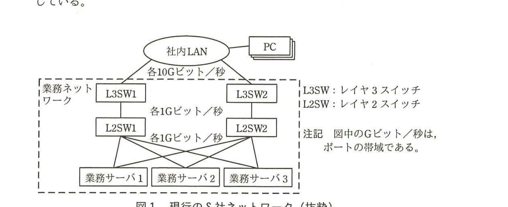
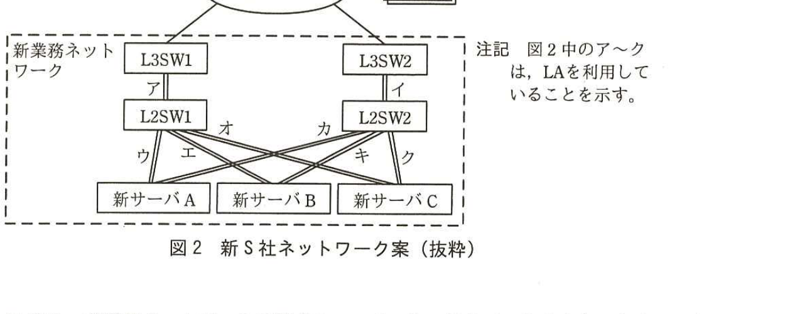

# 2016年春期（平成28年度）応用情報技術者試験 午後 問4（選択）
## システムアーキテクチャ：冗長構成をもつネットワーク（S社）

---

## 問題文

**問4** 冗長構成をもつネットワークに関する次の記述を読んで、設問1〜4に答えよ。

S社は商社であり、図1のような業務ネットワークを5年前に構築し、現在も利用している。

> 図1の内容：社内LAN（PC接続）から各10Gビット/秒でL3SW1、L3SW2に接続。L3SW1・L3SW2はそれぞれ各1Gビット/秒でL2SW1・L2SW2に接続。L2SW1・L2SW2は各1Gビット/秒で業務サーバ1、業務サーバ2、業務サーバ3の全てに交差接続されている（フルメッシュ）。

業務サーバで実行する処理は二つある。一つは、社内LANに接続しているPCから、L3SWとL2SWを経由して送られる在庫問合せや発注といった処理（以下、対話処理という）であり、業務サーバとL2SWの間のトラフィックは3台の業務サーバの間でほぼ均等になっている。もう一つは、3台の業務サーバの間でL2SWを経由して通信し実行する日次のバッチ処理（以下、バッチ処理という）である。バッチ処理中は対話処理を禁止している。

経路の障害でこれらの処理を滞らせないよう、①業務ネットワークでは、スイッチ類を稼働系及び待機系の冗長構成とし、稼働系のスイッチ（L3SW1、L2SW1）に障害が発生した場合に、待機系のスイッチ（L3SW2、L2SW2）を経由して対話処理やバッチ処理を行えるようにしている。各スイッチのスループットは、現行の各処理が必要とする通信量に見合っている。

現在、営業日の夜間に実行するバッチ処理に8.0時間を要している。バッチ処理が長引くと対話処理に使える時間が短くなるので、これ以上バッチ処理に要する時間を延ばせない。

また、対話処理についても、在庫問合せや発注の件数が5年前に比べて増え、営業日のピーク時には社内LANと業務ネットワークの間の通信量は0.3Gビット／秒に達している。

---

### 〔業務の改善〕

S社は、業務の改善を目的として、次の(1)、(2)に取り組むことにした。

(1) 商品や顧客に関して、より詳細なデータを取り扱えるようにする。

(2) 取り扱う商品の品目数や数量を増やせるようにする。

(1)、(2)を行うと、業務サーバで取り扱うデータ項目数が増加して1レコード当たりのデータサイズが拡大するだけでなく、処理対象のレコード数も増加する。その結果、処理データ量は次の5年間で現行の10倍に増え、バッチ処理に掛かる時間、及び対話処理に必要となる社内LANと業務ネットワークの間の通信量もそれぞれ10倍に増えると予測した。

S社は、②バッチ処理が次の5年間にわたって現在と同じ時間内に完了することを目標として、新業務ネットワークを構築するプロジェクトを立ち上げ、業務ネットワークの管理者であるT君が担当することになった。

---

### 〔業務サーバの更新検討〕

新サーバの候補を選定した。諸元（抜粋）を表1に示す。

### 表1 現行サーバと新サーバの諸元（抜粋）

| | 現行サーバ（1台当たり） | 新サーバ（1台当たり） |
|---|---|---|
| CPUのコア数 | 1コア／CPU | 2コア／CPU |
| サーバのCPU数 | 1CPU | 1CPU |
| メモリサイズ | 8Gバイト | 128Gバイト |

新サーバの実機を使ったバッチ処理の検証テストを行う前に、次の(1)〜(4)が成り立つものと仮定して、バッチ処理時間を机上で計算した。

(1) 新サーバのCPUの1コア当たりの処理速度は、現行サーバの2倍速い。さらに、内蔵するコア数に比例して速くなる。

(2) 新サーバのメモリの読み書き速度は、現行サーバの2倍速い。読み書き速度は、メモリサイズの違いによらない。

(3) サーバにおけるバッチ処理のスループットは、CPUの処理速度とメモリの読み書き速度のそれぞれの増加に比例して増加する。

(4) バッチ処理時間は、バッチ処理のスループットの増加に反比例して短くなる。

現行サーバで8.0時間を要していたバッチ処理時間は、机上計算の結果、新サーバでは短縮されて`[　a　]`時間になる。

---

### 〔業務サーバの更新に伴うネットワークの見直し〕

バッチ処理において、新サーバの性能を最大限発揮させるためには、サーバだけでなくネットワークも見直す必要がある。バッチ処理における新サーバ間の通信に必要な帯域を最大1.6Gビット／秒と試算した。

現行のL3SW、L2SW及び新サーバは、複数のリンクを論理的に束ねて1本のリンクとして扱うことができるリンクアグリゲーション機能（以下、LAという）を備えている。例えばLAを利用して2本のリンクで装置間を接続すると、その帯域は理論上2倍になる。T君は、図2のア〜クのように、L3SWとL2SWの間、及びL2SWと新サーバの間を、LAを利用して1Gビット／秒のリンク2本で接続することを考えた。

> 図2の内容：社内LANからL3SW1、L3SW2へ接続。L3SW1－L2SW1間がア（LA、1Gビット/秒×2本）、L3SW2－L2SW2間がイ（LA）。L2SW1・L2SW2と新サーバA・B・Cの間はウ・エ・オ・カ・キ・クの各リンク（フルメッシュ、それぞれLAで2本束ね）で接続。

T君は、新業務ネットワークの構成について、システムアーキテクトであるU氏に相談した結果、次の(ⅰ)、(ⅱ)のコメントを受けた。

(ⅰ) 図2中の新業務ネットワークも、スイッチ類は稼働系と待機系の冗長構成であるが、ア〜クのうち、営業日のピーク時に帯域不足となるリンクがある。

(ⅱ) 現行のL2SWについて確認しておくべき性能要件がある。確認の結果次第では、L2SWを更新する必要がある。

T君は、これらのコメントについて検討を加え、本プロジェクトを成功裏に完了させた。

---

## 設問

### 設問1 本文中の下線①について、(1)、(2)に答えよ。ここで、L3SW及びL2SWの稼働率はともにα（0＜α＜1）とし、L3SWとL2SW以外の機器の稼働率は1とする。

(1) L3SW、L2SWが1台ずつで冗長性がない構成の稼働率を答えよ。

(2) 図1のように、L3SW、L2SWが2系統に構成された業務ネットワークの稼働率を答えよ。

### 設問2 〔業務サーバの更新検討〕について、(1)、(2)に答えよ。

(1) 本文中の`[　a　]`に入れる適切な数値を答えよ。答えは、小数第2位を四捨五入して小数第1位まで求めよ。

(2) 新サーバの諸元は本文中の下線②の目標を満たしているか。満たしていない場合は1CPU当たりのコア数を最少幾つにすればよいか、2のべき乗数（4、8、16、32、…）で答えよ。満たしている場合は表1と同じ"2"と答えよ。

### 設問3 本文中のU氏のコメント(ⅰ)について、(1)、(2)に答えよ。

(1) どのリンクが帯域不足となるか。ア〜クの記号で全て答えよ。

(2) LAを利用する場合、1Gビット／秒のリンクを最少何本束ねればよいか。数字で答えよ。

### 設問4 本文中のU氏のコメント(ⅱ)について、確認しておくべき性能要件を20字以内で答えよ。

---

## 解答と解説

### 設問1

**(1) 正解：α2**

冗長性がない構成では、L3SW1台とL2SW1台が直列に接続される。それぞれの稼働率がαなので、システム全体の稼働率は**α2**（α×α）となる。

**(2) 正解：1－(1－α2)2**

2系統構成では、「L3SW1台とL2SW1台の直列（稼働率α2）」が2系統並列に接続されている。並列システムの稼働率は「1－（両系統とも故障している確率）」で求まるので、**1－(1－α2)2**となる。

**IPA公式：(1) α2　(2) 1－(1－α2)2**

---

### 設問2

**(1) 正解：1.0**

新サーバはCPU1コア当たりの処理速度が現行の2倍で、コア数が2倍（1→2コア）なので、CPU処理速度は2×2＝4倍。メモリ読み書き速度は2倍。スループットはCPU処理速度とメモリ読み書き速度のそれぞれの増加に比例するので、4×2＝8倍。バッチ処理時間はスループットに反比例するので、8.0時間÷8＝**1.0**時間となる。

**IPA公式：1.0**

**(2) 正解：4**

下線②の目標は「バッチ処理が次の5年間にわたって現在と同じ時間内に完了すること」である。5年後、処理データ量は10倍になると予測されているため、必要なスループットも10倍必要になる。新サーバ（2コア）でのスループット向上は8倍（設問2(1)より）であり、10倍に届かない。1CPU当たりのコア数をnコアとすると、CPU処理速度は2×n倍、スループットは(2×n)×2＝4n倍となる。4n≧10を満たす最小の2のべき乗はn＝**4**（4n＝16倍で10倍以上を満たす）である。

**IPA公式：4**

---

### 設問3

**(1) 正解：ア、イ**

ア、イはL3SW－L2SW間のリンクで、社内LANと業務ネットワークの間の対話処理通信を含む全トラフィック（バッチ処理はL2SW配下の新サーバ間で完結するためL3SWを通らないが、対話処理は5年後に0.3Gビット/秒×10＝3.0Gビット/秒に達する）を流す必要がある。LA2本束ねても2Gビット/秒までしか帯域を確保できず、3.0Gビット/秒には不足する。ウ〜クは新サーバ間のバッチ処理用リンクで、最大1.6Gビット/秒に対しLA2本（2Gビット/秒）で足りる。したがって帯域不足となるのは**ア、イ**である。

**IPA公式：ア，イ**

**(2) 正解：3（本）**

ア、イのリンクに必要な帯域は、対話処理の5年後の通信量3.0Gビット/秒である。1Gビット/秒のリンクをLAで束ねる場合、3.0Gビット/秒以上を確保するには最少で**3**本束ねる必要がある。

**IPA公式：3（本）**

---

### 設問4

**正解例：スループットが通信量に見合うこと**

L2SWは新サーバ間のバッチ処理と社内LAN側の対話処理の両方の通信を中継する。リンクの帯域を増強しても、L2SW自体のスイッチング性能（スループット）が増加後の通信量に対応できなければボトルネックとなるため、**スループットが通信量に見合うこと**を確認しておく必要がある。

**IPA公式：スループットが通信量に見合うこと**

---

## 参考：主要キーワード

| 用語 | 説明 |
|------|------|
| 冗長構成（稼働系・待機系） | 障害発生時にサービスを継続できるよう、機器を二重化し、稼働系の障害時に待機系へ切り替える構成。稼働率は直列・並列の組合せで計算する |
| 稼働率の計算 | 直列接続の稼働率は各構成要素の稼働率の積、並列（冗長）接続の稼働率は「1－(各系統の故障率の積)」で求める |
| リンクアグリゲーション（LA） | 複数の物理リンクを論理的に束ねて1本の高帯域リンクとして扱う技術。帯域は理論上、束ねた本数倍になる |
| スループットのボトルネック | ネットワークやサーバの性能は、CPU・メモリ・回線帯域などの各要素のうち最も遅い（弱い）部分に制約される。帯域増強だけでなくスイッチ自体の処理性能の確認が必要 |
| 処理性能の見積り（机上計算） | CPU・メモリなど複数の性能要素の改善率を掛け合わせてスループットの向上率を求め、処理時間の短縮を試算する手法 |
