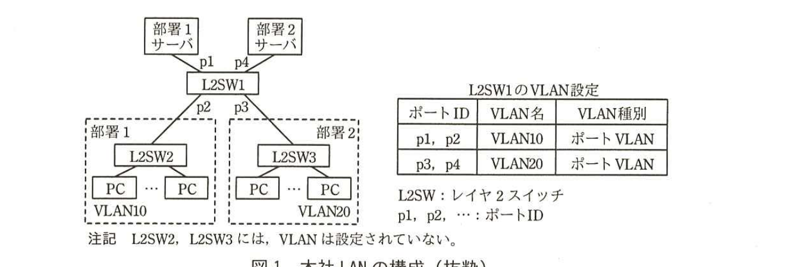
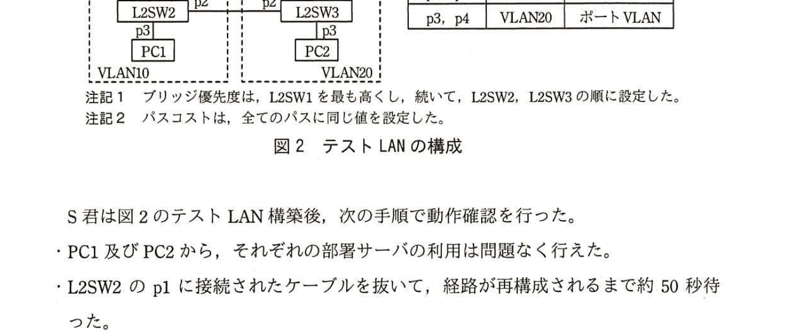
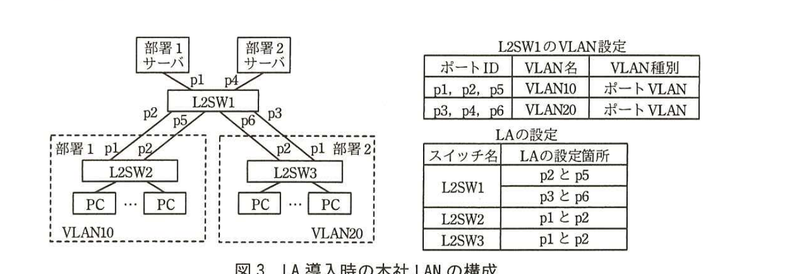

# 2016年春期（平成28年度）応用情報技術者試験 午後 問5（選択）
## ネットワーク：スイッチ間の接続経路の冗長化（R社）

---

## 問題文

**問5** スイッチ間の接続経路の冗長化に関する次の記述を読んで、設問1〜4に答えよ。

R社は、社員200名の医療機器の販売会社であり、本社で、部署1サーバと部署2サーバを運用している。本社LANの構成を図1に示す。

> 図1の内容：部署1サーバ（p1）、部署2サーバ（p4）がL2SW1に接続。L2SW1のp2は部署1のL2SW2に、p3は部署2のL2SW3に接続。L2SW2配下にPC群（VLAN10）、L2SW3配下にPC群（VLAN20）。L2SW1のVLAN設定：p1,p2＝VLAN10（ポートVLAN）、p3,p4＝VLAN20（ポートVLAN）。L2SW2、L2SW3にはVLANは設定されていない。

図1に示したように、L2SW1のp1とp2にはVLAN10が設定されており、部署1サーバは部署1のPCだけが利用できる。L2SW1のp3とp4にはVLAN20が設定されており、部署2サーバは部署2のPCだけが利用できる。

---

### 〔障害の発生と対応作業〕

月末の繁忙時、部署1のPCから部署1サーバが利用できなくなったと情報システム課に連絡があった。連絡を受けたS君が対応作業を行った。

S君は、まずL2SW1のLEDランプの状態を確認した。L2SW1の電源LEDランプは`[　a　]`していたが、p2のリンクLEDランプが消灯していたので、L2SW1と`[　b　]`の間の経路障害と判断した。そこで、p2に接続されたLANケーブルを、L2SW1の空きポートp10に接続し直したところ、p10のリンクLEDランプが点灯したので、障害が復旧したと考えた。しかし、部署1のPCから部署1サーバは利用できないままだった。S君は、①L2SW1に追加設定が必要であったことに気付き、追加設定を行って障害から復旧させ、後日、L2SW1を交換した。

このような障害を再発させないために、上司のT主任は、L2SW間の経路の冗長化を検討するようS君に指示した。S君は、STP（Spanning Tree Protocol）によるL2SW間の経路の冗長化について検討した。

---

### 〔STPの導入検討〕

L2SW間にLANケーブルを増設して経路を冗長化すると、経路が`[　c　]`構成になり、`[　d　]`ストームが発生する。STPは、`[　c　]`構成となった経路の一部をフレームが流れないようにブロックすることで論理的にツリー構成に変更して、経路の冗長化を可能にするプロトコルである。

S君は、L2SWを3台、サーバとPCを2台ずつ用意し、テストLANを構築してSTPの動作確認を行うことにした。テストLANの構成を図2に示す。

3台のL2SWに、図2中の注記に示す設定を行った。注記の設定によって、L2SW1がルートブリッジになり、L2SW2とL2SW3の間の経路がブロックされてツリー構成になる。各L2SWにサーバ又はPCを接続し、その後、L2SW間を接続してSTPを稼働させた。各サーバとPCには、それぞれ図1と同じネットワーク情報を設定した。なお、図2のテストLANの各機器は、本番環境を想定して図1と同一名称とした。

> 図2の内容：部署1サーバ（p1）、部署2サーバ（p4）がL2SW1に接続。L2SW1のp2－L2SW2のp1間、L2SW1のp3－L2SW3のp1間で接続。さらにL2SW2のp2とL2SW3のp2間を直接接続（冗長経路）。L2SW2のp3にPC1、L2SW3のp3にPC2が接続。注記1：ブリッジ優先度は、L2SW1を最も高くし、続いてL2SW2、L2SW3の順に設定した。注記2：パスコストは、全てのパスに同じ値を設定した。

S君は図2のテストLAN構築後、次の手順で動作確認を行った。

・PC1及びPC2から、それぞれの部署サーバの利用は問題なく行えた。

・L2SW2のp1に接続されたケーブルを抜いて、経路が再構成されるまで約50秒待った。

・PC1から部署1サーバまでの経路は、L2SW3経由で再構成されたが、②PC1から部署1サーバが利用できなかった。そこで、PC2をL2SW2のp3に接続し直して部署2サーバにアクセスしたところ、部署2サーバは利用できた。

図2中の設定によって、例えば、L2SW1のp2とL2SW2のp1を接続する経路に障害が発生しても、L2SW1のp5とL2SW2のp2を接続する経路だけを使って、部署1のPCは、継続して部署1サーバを利用できる。

テスト結果の報告を受けたT主任は、本社LANのL2SW間の経路を、STPを利用して図2の構成で冗長化するときは、新たなVLAN設定が必要になることをS君に説明した。T主任が説明した新たなVLAN設定を表1に示す。

### 表1 新たなVLAN設定

| スイッチ | ポートID | 現状のVLAN | 設定するVLAN名 | VLAN種別 |
|---|---|---|---|---|
| L2SW1 | p2 | VLAN10 | VLAN10、VLAN20 | タグVLAN |
| L2SW1 | p3 | VLAN20 | VLAN10、VLAN20 | タグVLAN |
| L2SW2 | p1, p2 | 設定なし | VLAN10、VLAN20 | タグVLAN |
| L2SW2 | p3 | 設定なし | `[　e　]` | ポートVLAN |
| L2SW3 | p1, p2 | 設定なし | VLAN10、VLAN20 | タグVLAN |
| L2SW3 | p3 | 設定なし | `[　f　]` | ポートVLAN |

（注記：タグVLANは、一つのポートに複数のVLANを共存させるとき使用される。）

STPを利用する場合、設定が複雑なので運用が困難になることが考えられた。そこで、S君は、別の方法を調査したところ、経路の冗長化にリンクアグリゲーション（以下、LAという）が利用できることが分かったので、LAの導入検討を行った。

---

### 〔LAの導入検討〕

LAは、複数のイーサネット回線を論理的に束ね、1本の回線であるかのように扱う技術である。使用中のL2SWを調べたところ、LAに対応していることが分かった。

LAを導入する場合は、図1中のVLAN設定に加え、L2SW1へのVLANの追加設定とLAの設定を行うことになる。LA導入時の本社LANの構成を図3に示す。

> 図3の内容：L2SW1のp2、p5がLAでL2SW2のp1、p2に接続。L2SW1のp3、p6がLAでL2SW3のp1、p2に接続。L2SW1のVLAN設定：p1,p2,p5＝VLAN10（ポートVLAN）、p3,p4,p6＝VLAN20（ポートVLAN）。LAの設定：L2SW1はp2とp5、p3とp6、L2SW2はp1とp2、L2SW3はp1とp2をそれぞれLA化。

図3中の設定によって、例えば、L2SW1のp2とL2SW2のp1を接続する経路に障害が発生しても、L2SW1のp5とL2SW2のp2を接続する経路だけを使って、部署1のPCは、継続して部署1サーバを利用できる。

以上の検討から、図1の本社LANでL2SW間の経路を冗長化する場合、③図3のLAの構成は、図2のSTPの構成に比べて利点が多いことが分かった。S君が検討結果をT主任に報告したところ、T主任からLAの導入を進めるよう指示を受けた。

---

## 設問

### 設問1 本文中の`[　a　]`〜`[　d　]`に入れる適切な字句を解答群の中から選び、記号で答えよ。

**解答群：**
ア　L2SW2　　イ　L2SW3　　ウ　消灯　　エ　スター　　オ　点灯　　カ　ブロードキャスト　　キ　ユニキャスト　　ク　ループ

### 設問2 本文中の下線①について、設定する内容を20字以内で述べよ。

### 設問3 〔STPの導入検討〕について、(1)、(2)に答えよ。

(1) 本文中の下線②において、PC1が部署1サーバのMACアドレスを取得するためにARPフレームを送信したとき、ARPフレームが到達するサーバ名を、図2中の名称で答えよ。また、PC1から部署1サーバが利用できなくなった理由を30字以内で述べよ。

(2) 表1中の`[　e　]`、`[　f　]`に入れる適切なVLAN名を答えよ。

### 設問4 本文中の下線③について、利点として適切なものを解答群の中から全て選び、記号で答えよ。

**解答群：**
ア　PCを異なる部署のL2SWに接続し、元の部署のPCとして利用する場合、追加設定が少ない。
イ　経路障害が発生したとき、通信が中断したとしても短時間で済む。
ウ　経路障害が発生しても、L2SW2及びL2SW3の負荷は増加しない。
エ　追加するケーブル本数が少ない。

---

## 解答と解説

### 設問1

**正解：a = オ（点灯）、b = ア（L2SW2）、c = ク（ループ）、d = カ（ブロードキャスト）**

電源LEDランプが「していたが」という文脈から、電源は正常であることを示す**点灯**（オ）が入る。

L2SW1のp2は、図1よりL2SW2に接続されているので、経路障害はL2SW1と**L2SW2**（ア）の間である。

L2SW間にケーブルを増設して経路を冗長化すると、経路が環状になり**ループ**（ク）構成になる。ループ構成では、ブロードキャストフレームが循環し続ける**ブロードキャスト**（カ）ストームが発生する。

**IPA公式：a=オ、b=ア、c=ク、d=カ**

---

### 設問2

**正解例：p10にVLAN10を設定する。**

障害復旧のためにp2のケーブルを空きポートp10に接続し直したが、L2SW1のp10にはp2で設定されていたVLAN10のポートVLAN設定がなされていなかった（初期状態ではVLAN未設定）。そのため、**p10にVLAN10を設定する**追加設定が必要であった。

**IPA公式：p10にVLAN10を設定する。**

---

### 設問3

**(1) 正解：サーバ名 = 部署2サーバ、理由 = PC1と部署1サーバが所属するVLANが異なるから**

L2SW2のp1ケーブルを抜いた後、STPによりPC1から部署1サーバまでの経路はL2SW3経由で再構成される。しかし、図2の構成ではL2SW2・L2SW3にVLAN設定がなく、L2SW1側のp3・p4にはVLAN20が設定されているため、再構成後の経路ではPC1（本来VLAN10所属）の通信がVLAN20側のポートに接続されている**部署2サーバ**に届いてしまう。ARPフレームは部署2サーバに到達するが、PC1と部署1サーバが本来所属すべきVLANが再構成後の経路上で一致しないため、**PC1と部署1サーバが所属するVLANが異なるから**部署1サーバを利用できなかった。

**IPA公式：サーバ名＝部署2サーバ／理由＝PC1と部署1サーバが所属するVLANが異なるから**

**(2) 正解：e = VLAN10、f = VLAN20**

L2SW2のp3にはPC1（部署1、VLAN10所属）が接続されているため、`[　e　]`には**VLAN10**が入る。L2SW3のp3にはPC2（部署2、VLAN20所属）が接続されているため、`[　f　]`には**VLAN20**が入る。

**IPA公式：e=VLAN10、f=VLAN20**

---

### 設問4

**正解：イ、ウ**

イ：LA構成では物理的に2本のリンクが並列に扱われ、1本の障害発生時には即座に残りのリンクへ切り替わるため、STPの再構成（数十秒程度の待ち時間）に比べて通信中断は短時間で済む。したがって適切。

ウ：LA構成では、経路（LAグループ内のリンク）の障害時もL2SW2・L2SW3を経由する経路自体は変わらないため、これらのスイッチの負荷は増加しない。したがって適切。

ア：LA導入はPCの接続部署変更とは無関係であり、この観点での利点ではない。

エ：LA構成（図3）では、STP構成（図2）と比較して、L2SW2－L2SW3間の直接リンクが不要になる一方、L2SW1側の追加ポート（p5、p6）へのケーブルが必要となるため、必ずしもケーブル本数が少ないとは言えない。

したがって、利点として適切なものは**イ、ウ**である。

**IPA公式：イ，ウ**

---

## 参考：主要キーワード

| 用語 | 説明 |
|------|------|
| STP（Spanning Tree Protocol） | ループ構成のネットワークにおいて、一部の経路を論理的にブロックしツリー構成に変更することで、ブロードキャストストームを防ぎつつ経路の冗長化を実現するプロトコル |
| ブロードキャストストーム | ループ構成のネットワークでブロードキャストフレームが永久に循環・増殖し、ネットワーク帯域を圧迫して通信不能に陥る現象 |
| VLAN（ポートVLAN／タグVLAN） | ポートVLANは1ポートに1つのVLANを割り当てる方式、タグVLANは1ポートに複数VLANのフレームを識別子（タグ）付きで共存させる方式。トランクポートで使用される |
| リンクアグリゲーション（LA） | 複数の物理リンクを論理的に束ねて1本の回線として扱う技術。帯域拡大に加え、リンク障害時の瞬時のフェイルオーバーによる冗長化にも利用される |
| ルートブリッジ／ブリッジ優先度 | STPにおいて、ネットワークの論理的なツリー構造の頂点となるスイッチをルートブリッジといい、ブリッジ優先度の値が小さい（高い）スイッチが選出される |
