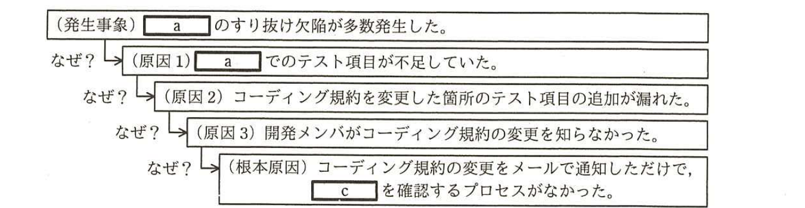

# 2016年春期（平成28年度）応用情報技術者試験 午後 問9（選択）
## プロジェクトマネジメント：品質評価（P社）

---

## 問題文

**問9** 品質評価に関する次の記述を読んで、設問1、2に答えよ。

P社は、衣料品を全国の店舗で販売している。P社の情報システム部は、競争力強化を目的とした販売アイテムの大幅な増加と販売ポイントサービスに関する機能の拡充のために、商品販売管理システムのサブシステムX、Y、Zへの追加機能の開発を、短期間で行うことになった。商品販売管理システムは、在庫管理システム、経理システムなどの社内システムとデータの送受信を行っている。情報システム部のQ課長は、今回の開発プロジェクトのプロジェクトマネージャ（PM）として、R主任を指名した。

---

### 〔プロジェクト開始準備〕

R主任は、サブシステムの開発に関わる詳細設計・詳細設計レビュー・コーディング・単体テスト・結合テストを請負契約で一括して開発請負会社に発注することにした。サブシステムX、Yの開発については、それぞれ、以前からP社の開発案件を受託しP社の業務仕様を理解しているL社、M社と契約し、サブシステムZの開発については、新規に参加するN社と契約した。N社の実施責任者に現在のコーディング規約を渡して、その内容を説明した。

R主任は、詳細設計書、ソースプログラム、単体テスト項目、結合テスト項目は、各社の手順書に従ってレビューするよう各社の実施責任者に依頼した。各社での結合テスト完了後に、各工程別のテスト成績書による品質判定と納品物の確認を行い、全ての結果が良好と判断された後に、総合テスト工程へ進むことにした。

各サブシステムは、開発規模が同程度の二つのモジュールで構成され、モジュール別の開発の難易度は、表1のとおりである。

### 表1 モジュール別の開発の難易度

| サブシステム | X | | Y | | Z | |
|---|---|---|---|---|---|---|
| モジュール | X1 | X2 | Y1 | Y2 | Z1 | Z2 |
| 難易度 | 高 | 低 | 中 | 中 | 中 | 低 |

詳細設計に着手する直前に、次の2項目に変更が入ったので、各社の実施責任者に変更箇所を電子メール（以下、メールという）で通知し、開発メンバに周知するように依頼した。

・在庫管理システムとのインタフェース

・コーディング規約

さらに、インタフェース仕様書は、他の関連システムにも改修があることから、仕様変更箇所を反映し、各社に再配布した。一方、コーディング規約は、インタフェース仕様書の変更に時間が掛かったことから、プロジェクト完了後に全体を修正することにしたので、再配布はしなかった。

情報システム部が手掛けてきた過去の開発実績のデータに基づき、基本となる工程別の品質判定基準を表2のとおり設定した。

### 表2 工程別の品質判定基準

| | テスト密度（項目数／kステップ）最小値 | テスト密度（項目数／kステップ）最大値 | 欠陥数（欠陥数／ページ、kステップ）最小値 | 欠陥数（欠陥数／ページ、kステップ）最大値 |
|---|---|---|---|---|
| 詳細設計レビュー | － | － | 3 | 7 |
| 単体テスト | 150 | 250 | 1 | 3 |
| 結合テスト | 50 | 100 | 0.5 | 2 |

（注：詳細設計レビューはページ当たり、単体テスト・結合テストはkステップ当たり）

R主任は、品質判定基準を盛り込んだ開発計画書を作成し、Q課長の承認を得てから、自社のプロジェクトメンバ及び各社の実施責任者に開発着手を指示した。

---

### 〔品質の評価〕

各社の結合テストが完了後、R主任は、プロジェクトの品質管理担当のメンバから、各社から提出された工程別の品質実績のデータをサブシステム別に整理した表3の報告を受けた。

### 表3 工程別の品質実績

| | テスト密度（項目数／kステップ）X | テスト密度（項目数／kステップ）Y | テスト密度（項目数／kステップ）Z | 欠陥数（欠陥数／ページ、kステップ）X | 欠陥数（欠陥数／ページ、kステップ）Y | 欠陥数（欠陥数／ページ、kステップ）Z |
|---|---|---|---|---|---|---|
| 詳細設計レビュー | － | － | － | 6.3 | 5.1 | 3.5 |
| 単体テスト | 235 | 182 | 118 | 2.8 | 2.6 | 1.2 |
| 結合テスト | 89 | 78 | 85 | 1.8 | 1.4 | 4.1 |

R主任は、表2の品質判定基準と表3の品質実績から、次のように考えた。

・サブシステムX及びYは、テスト密度及び欠陥数が、全ての工程で品質判定基準内であった。しかし、サブシステムXは、①表2の工程別の品質判定基準を適用して、追加の分析を行った上で品質を判定すべきである。

・サブシステムZは、`[　a　]`でのテスト項目不足、又は`[　b　]`の可能性がある。

そこで、R主任は、L社に、追加の分析を依頼した。L社は、分析結果を整理して次のとおりR主任に報告し、Q課長もその結果を了承した。

・モジュールX1：テスト密度は品質判定基準内であり、欠陥数は品質判定基準を超えているが、開発の難易度を考慮すると品質は良好である。

・モジュールX2：テスト密度と欠陥数は品質判定基準内であり、品質は良好である。

また、R主任は、N社に、欠陥を工程ごとに、開発メンバ別、モジュール別、本来抽出すべき工程別、作り込み原因別に分析して、その結果を報告するよう依頼した。N社は、分析結果を整理して次のとおりR主任に報告した。

・特定の開発メンバの力量不足が、欠陥の原因ではなかった。

・欠陥の82％はモジュールZ1であった。

・モジュールZ1の欠陥の作り込み原因別の分析では、コーディング規約の違反による欠陥が、単体テストで2件、結合テストで32件抽出された。

・モジュールZ1の欠陥の工程別分析結果は表4のとおりであった。

### 表4 モジュールZ1の欠陥の工程別分析結果（単位：件）

| 本来抽出すべき工程 | | 抽出した工程別の欠陥数：詳細設計レビュー | 抽出した工程別の欠陥数：単体テスト | 抽出した工程別の欠陥数：結合テスト |
|---|---|---|---|---|
| | 詳細設計レビュー | 30 | 4 | 2 |
| | 単体テスト | － | 18 | 41 |
| | 結合テスト | － | － | 21 |

---

### 〔原因分析と再発防止〕

R主任は、N社に対して、モジュールZ1の欠陥について改修し、原因に基づいて単体テストの項目を見直して、再テストを行うよう依頼した。さらに、モジュールZ2について、コーディング規約の違反が原因で発生した欠陥と同種の欠陥の摘出を行うことによって、品質の確保を行うよう依頼した。

その後、R主任が詳細を調査すると、今回の開発直前に変更した箇所に関係する欠陥が90％であることが判明したので、その結果をQ課長に報告した。

Q課長から、再発防止策を検討するよう指示があったので、まず、R主任は、根本原因分析の技法（以下、なぜなぜ分析という）を使って、分析を実施した。なぜなぜ分析の一部を図1に示す。

> 図1の内容：（発生事象）`[　a　]`のすり抜け欠陥が多数発生した。なぜ？→（原因1）`[　a　]`でのテスト項目が不足していた。なぜ？→（原因2）コーディング規約を変更した箇所のテスト項目の追加が漏れた。なぜ？→（原因3）開発メンバがコーディング規約の変更を知らなかった。なぜ？→（根本原因）コーディング規約の変更をメールで通知しただけで、`[　c　]`を確認するプロセスがなかった。

そこで、R主任は、根本原因の再発防止策として、コーディング規約などの変更を開発請負会社に通知した場合には、PMが、開発請負会社の実施責任者に、`[　c　]`を確認するよう、開発プロジェクトのルールとして定めることをQ課長に説明した。

Q課長は、次の点についても見直しを行うようR主任に指示した。

・結合テスト完了時に品質不足が発覚すると、詳細設計やコーディングにまで遡って対処する必要があるので、`[　d　]`や`[　e　]`を起こすおそれがある。したがって、今後、新規に開発に参加する会社と請負契約を締結する場合には、各工程が完了するごとに品質評価結果を提出させることを検討すること。

・品質が良好であるにもかかわらず、欠陥数が工程別の品質判定基準を超えてしまうという事象が発生した。適切に品質判定ができるよう、`[　f　]`と開発請負会社のスキルレベルを考慮した品質判定基準となるように見直すこと。

---

## 設問

### 設問1 〔品質の評価〕について、(1)〜(3)に答えよ。

(1) R主任がL社に、本文中の下線①を依頼した理由を40字以内で述べよ。

(2) 本文及び図1中の`[　a　]`に入れる適切な字句を10字以内で答えよ。

(3) 本文中の`[　b　]`に入れる適切な字句を15字以内で答えよ。

### 設問2 〔原因分析と再発防止〕について、(1)〜(3)に答えよ。

(1) 本文及び図1中の`[　c　]`に入れる適切な字句を20字以内で答えよ。

(2) 本文中の`[　d　]`、`[　e　]`に入れる適切な字句を10字以内で答えよ。

(3) 本文中の`[　f　]`に入れる適切な字句を15字以内で答えよ。

---

## 解答と解説

### 設問1

**(1) 正解例：モジュールごとに品質の偏りがないかどうかを確認する必要があるから**

サブシステム全体としてはテスト密度・欠陥数が品質判定基準内であっても、内部の2つのモジュール（例えばX1とX2）で品質にばらつきがある可能性がある。特にX1は難易度が「高」であり、品質に偏りがないか確認が必要である。したがって、R主任がL社に追加分析を依頼した理由は、**モジュールごとに品質の偏りがないかどうかを確認する必要があるから**である。

**IPA公式：モジュールごとに品質の偏りがないかどうかを確認する必要があるから**

**(2) 正解：単体テスト**

表3より、サブシステムZの単体テストのテスト密度は118であり、表2の品質判定基準（150〜250）を下回っている。したがって、`[　a　]`は**単体テスト**である。

**IPA公式：単体テスト**

**(3) 正解例：詳細設計での品質不足**

サブシステムZの結合テストの欠陥数は4.1で、品質判定基準（0.5〜2）を大きく超えている。単体テストでのテスト項目不足に加え、上流工程（詳細設計）での品質確保が不十分であった可能性、すなわち`[　b　]`は**詳細設計での品質不足**が考えられる。

**IPA公式：詳細設計での品質不足**

---

### 設問2

**(1) 正解例：開発メンバが正しく理解したこと**

図1の根本原因は「コーディング規約の変更をメールで通知しただけで、`[　c　]`を確認するプロセスがなかった」ことである。原因3「開発メンバがコーディング規約の変更を知らなかった」ことを踏まえると、単に通知するだけでなく、**開発メンバが正しく理解したこと**を確認するプロセスが必要であった。

**IPA公式：開発メンバが正しく理解したこと**

**(2) 正解：d = 開発コストの増大、e = 納期の遅延（順不同）**

結合テスト完了時（後工程）で品質不足が発覚し、詳細設計やコーディングまで手戻りが発生すると、追加の工数がかかることによる**開発コストの増大**、及びスケジュールの遅れによる**納期の遅延**（順不同）を引き起こすおそれがある。

**IPA公式：d=開発コストの増大、e=納期の遅延（順不同）**

**(3) 正解：モジュールの開発の難易度**

サブシステムXのモジュールX1（難易度「高」）の例のように、品質が良好であっても開発の難易度が高いモジュールでは欠陥数が基準を超えやすい。適切な品質判定のためには、一律の基準ではなく、**モジュールの開発の難易度**と開発請負会社のスキルレベルを考慮した基準に見直す必要がある。

**IPA公式：モジュールの開発の難易度**

---

## 参考：主要キーワード

| 用語 | 説明 |
|------|------|
| 品質判定基準（テスト密度・欠陥密度） | 工程ごとに、テスト項目数やレビュー・テストで検出された欠陥数を規模（ページ数・kステップ）当たりで評価し、品質のばらつきを判定する定量的基準 |
| なぜなぜ分析（根本原因分析） | 「なぜ」を繰り返し問うことで、表面的な事象から根本原因までを掘り下げて特定する原因分析手法。再発防止策の立案に用いる |
| 難易度を考慮した品質判定 | テスト密度・欠陥数が基準内外にあるかだけでなく、モジュールの開発難易度や開発者のスキルレベルを加味して品質の良否を総合的に判定する必要がある |
| 手戻り（後工程での品質不足発覚） | 後工程（結合テストなど）で品質問題が発覚すると、上流工程（詳細設計・コーディング）まで遡って修正が必要となり、コスト増大・納期遅延を招く |
| 変更管理と周知の徹底 | 仕様やコーディング規約などの変更を関係者に通知するだけでなく、正しく理解されたことを確認するプロセスを設けることで、変更漏れによる欠陥の混入を防止する |
