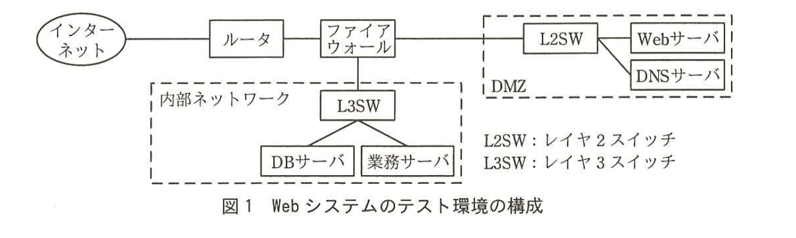

# 2016年春期（平成28年度）応用情報技術者試験 午後 問1（必須）
## 情報セキュリティ：Webサイトを用いた書籍販売システムのセキュリティ（K社）

---

## 問題文

**問1** Webサイトを用いた書籍販売システムのセキュリティに関する次の記述を読んで、設問1〜4に答えよ。

K社は技術書籍の大手出版社である。従来は全ての書籍を書店で販売していたが、顧客からの要望によって、高額書籍を自社のWebサイトでも販売することになった。K社システム部のL部長は、Webサイトを用いた書籍販売システム（以下、Webシステムという）の開発のためのプロジェクトチームを立ち上げ、開発課のM課長をリーダに任命した。L部長は、情報セキュリティ確保のための対策として、サイバー攻撃によるWebシステムへの侵入を想定したテスト（以下、侵入テストという）を実施するようにM課長に指示した。M課長は、開発作業が結合テストまで完了した段階で、Webシステムのテスト環境を利用して侵入テストを実施することにした。

---

### 〔Webシステムのテスト環境〕

Webシステムは、高額書籍を購入する顧客の氏名、住所、購入履歴などの個人情報（以下、顧客情報という）を内部ネットワーク上のデータベースサーバ（以下、DBサーバという）に保存し、WebサーバがDBサーバ、業務サーバにアクセスして販売処理を行う。Webシステムのテスト環境の構成を図1に示す。

> 図1の内容：インターネットからルータ、ファイアウォールを経由し、DMZ内のL2SW（レイヤ2スイッチ）にWebサーバとDNSサーバが接続される。ファイアウォールは内部ネットワークのL3SW（レイヤ3スイッチ）にも接続され、L3SW配下にDBサーバと業務サーバが接続されている。

### 〔Webシステムの認証と通信〕

顧客がWebシステムを利用する際、利用者IDとパスワードで認証する。また、顧客との通信には、インターネット標準として利用されている`[　a　]`による暗号化通信を用いる。

サーバ管理者は、各サーバやファイアウォールのログを定期的にチェックすることによって、Webシステムにおける不正なアプリケーションの稼働を監視する。

---

### 〔侵入テストの実施〕

M課長は、社外のセキュリティコンサルタントのN氏に侵入テストの実施を依頼した。N氏は、表1に示す侵入テストのテスト項目を作成し、M課長に提出した。

### 表1 テスト項目（抜粋）

| 項番 | 内容 |
|---|---|
| 1 | 攻撃者が、Webサーバの構成情報の調査結果からWebシステムの脆弱性を確認することが可能か。 |
| 2 | Webシステムへの攻撃によって、Webシステム内に侵入した後、Webサーバの管理者権限の奪取が可能か。 |
| 3 | Webアプリケーションの脆弱性を意図的に利用した攻撃が可能か。 |

### 〔結果〕

N氏は、テスト項目に沿って侵入テストを実施し、その結果と改善項目をM課長に報告した。テスト結果と改善項目を表2に示す。

### 表2 テスト結果と改善項目（抜粋）

| 項番 | テスト結果 | 改善項目 |
|---|---|---|
| 1 | Webシステムのサービスに必要がないポートが、インターネットに公開されていた。インターネットからWebサーバの構成情報を調査できた。 | Webシステムのサービスに必要なポートだけをインターネットに公開する。Webサーバが必要のない問合せに応答しないようにする。 |
| 2 | Webサーバの脆弱性を利用して、Webサーバを`[　b　]`にし、そこを中継点として内部ネットワークに侵入できた。 | セキュリティ機器を導入して、Webサーバへの不正アクセスを防御し、脆弱性の存在自体が広く公表される前にそれを悪用する`[　c　]`攻撃のリスクを軽減する。ファイアウォールとサーバのログ管理を強化する。 |
| 3 | Webアプリケーションを対象とした次の攻撃について、対処されていないので、Webアプリケーションを誤作動させることが可能であった。 ・バッファオーバフロー ・SQLインジェクション さらに、DBサーバに不正アクセスし、顧客情報の奪取や改ざんが可能であった。 | 開発課で開発したWebアプリケーションの脆弱性の原因となっているセキュリティホールを修正する。 |

---

### 〔改善項目とその対策〕

M課長とN氏は、Webシステムの侵入テストの結果と、セキュリティ上の改善項目について、表1と表2を基にしてL部長に報告した。

N氏　：現在のWebシステムには、サイバー攻撃に対して多くの脆弱性が存在します。

L部長：項番1について説明してください。

N氏　：攻撃者は①Webサーバの構成情報の調査によって、攻撃するために有用な情報を得ることで、Webサーバの脆弱性を探ってきます。

L部長：どのような対策が有効ですか。

N氏　：②ポートスキャンについては、Webサーバやファイアウォールの設定で防止する必要があります。Webサーバの構成情報の調査については、Webサーバの設定情報を変更して、必要のない問合せに応答しないようにすることで対処します。

L部長：項番2で、Webサーバについて改善項目がありますが、どのような対策が必要ですか。

N氏　：③Webサーバへの攻撃の疑いがあるアクセスを遮断するセキュリティ機器の導入が効果的です。保護する対象をWebアプリケーションに特化しており、Webサーバ上で使用するアプリケーションに潜む未知の脆弱性を突く攻撃を、プロトコルの異常などによって検知し、遮断できるようになります。

L部長：項番3のバッファオーバフローとSQLインジェクションについては、どのような対策が必要ですか。

N氏　：ソースコードをチェックするツールを使用して、Webアプリケーションの脆弱性を調査し、その結果に基づいたソースコードの修正が必要です。バッファオーバフローは、バッファにデータを保存する際に`[　d　]`を常にチェックすることで防ぐことができます。SQLインジェクションは、データをSQLに埋め込むところで、データの特殊文字を適切に`[　e　]`することで防ぐことができます。

M課長：改善項目に対応するようWebアプリケーションのソースコードを修正します。

N氏　：Webシステムの構成にも問題点があります。攻撃者が、攻撃の発見を遅らせるために、Webシステム内でログを消去するおそれがあります。

L部長：対策方法はありますか。

N氏　：各サーバやファイアウォールのログを集中して保存する専用のサーバを設置し、ログが消去されることを防ぎます。また、④ログをリアルタイムにチェックするツールを導入します。

N氏の指摘に基づいて、開発課がWebシステムを改善し、L部長はWebシステムの総合テストの実施を承認した。

---

## 設問

### 設問1 本文中の`[　a　]`及び表2中の`[　b　]`、`[　c　]`に入れる適切な字句をそれぞれ4字以内で答えよ。

### 設問2 本文中の`[　d　]`、`[　e　]`に入れる適切な字句をそれぞれ解答群の中から選び、記号で答えよ。

**解答群：**
ア　エスケープ　　イ　データサイズ　　ウ　マイグレーション　　エ　リダイレクト　　オ　ルートクラック

### 設問3 〔改善項目とその対策〕について、(1)〜(3)に答えよ。

(1) 本文中の下線①について、Webサーバの構成情報の調査によって得られる、Webサーバを攻撃するために有用な、アプリケーションに関する情報を二つ挙げ、それぞれ7字以内で答えよ。

(2) 本文中の下線②について、Webサーバへのポートスキャンの対策として効果的な方策は何か。15字以内で答えよ。

(3) 本文中の下線③で、N氏が導入を推奨するセキュリティ機器とは何か。アルファベット3字で答えよ。

### 設問4 本文中の下線④について、ログのリアルタイムでのチェックで、サイバー攻撃の可能性があると判断される痕跡を解答群の中から全て選び、記号で答えよ。

**解答群：**
ア　DNSを使用せずURLの中にIPアドレスを直接書き込んで通信している。
イ　URLフィルタのホワイトリストに一致した通信が発生している。
ウ　送られてくるファイルの拡張子が偽装されている。
エ　業務時間外に内部ネットワークから業務サーバへのアクセスが減少している。
オ　通信元のIPアドレスが、想定した範囲から外れている。

---

## 解答と解説

### 設問1

**正解：a = TLS、b = 踏み台、c = ゼロデイ**

顧客との通信の暗号化には、インターネット標準として広く利用されている**TLS**（Transport Layer Security）が使われる。

Webサーバの脆弱性を利用して侵入された後、そのサーバを経由して内部ネットワークへの攻撃の中継点として悪用される状態を**踏み台**という。

脆弱性の存在自体が広く公表される前にその脆弱性を悪用する攻撃を**ゼロデイ**攻撃という。

**IPA公式：a=TLS、b=踏み台、c=ゼロデイ**

---

### 設問2

**正解：d = イ（データサイズ）、e = ア（エスケープ）**

バッファオーバフローは、確保されたバッファの容量を超えるデータが書き込まれることで発生する。したがって、データを保存する際に**データサイズ**（イ）を常にチェックすることで防止できる。

SQLインジェクションは、入力データに含まれるシングルクォートなどの特殊文字がSQL文の一部として解釈されてしまうことで発生する。したがって、特殊文字を適切に**エスケープ**（ア）処理することで防止できる。

**IPA公式：d=イ、e=ア**

---

### 設問3

**(1) 正解例：種類、バージョン**

Webサーバの構成情報の調査によって、攻撃者はOSやミドルウェア、Webアプリケーションなどの**種類**及び**バージョン**の情報を得ることができる。既知の脆弱性は特定の種類・バージョンに紐づいているため、この情報が攻撃に有用となる。

**IPA公式：種類／バージョン**

**(2) 正解例：必要なポートだけ開ける。**

表2項番1の改善項目にあるとおり、Webシステムのサービスに必要なポートだけをインターネットに公開し、それ以外のポートを閉じることで、ポートスキャンによる構成情報の調査を防止できる。

**IPA公式：必要なポートだけ開ける。**

**(3) 正解：WAF**

Webアプリケーションを保護対象とし、プロトコルの異常などによって未知の脆弱性を突く攻撃を検知・遮断するセキュリティ機器は**WAF**（Web Application Firewall）である。

**IPA公式：WAF**

---

### 設問4

**正解：ア、ウ、オ**

ア：正規のDNS解決を経ずにIPアドレスを直接指定した通信は、マルウェアの通信（C&C通信など）に見られる不審な挙動であり、攻撃の兆候となる。

イ：ホワイトリストに一致した通信は許可された正常な通信であり、攻撃の兆候ではない。

ウ：ファイルの拡張子の偽装は、マルウェアを正規のファイルに見せかける典型的な手口であり、攻撃の兆候となる。

エ：業務時間外の業務サーバへのアクセスが「減少」することは通常の状態であり、不審な兆候ではない（増加であれば兆候となり得る）。

オ：想定範囲外のIPアドレスからの通信は、不正アクセスの兆候となる。

したがって、サイバー攻撃の可能性があると判断される痕跡は**ア、ウ、オ**である。

**IPA公式：ア，ウ，オ**

---

## 参考：主要キーワード

| 用語 | 説明 |
|------|------|
| TLS（Transport Layer Security） | インターネット標準の暗号化通信プロトコル。SSLの後継として広く利用され、Webサイトとの通信の機密性・完全性を確保する |
| ポートスキャン | 攻撃対象のホストに対して複数のポートへ順にアクセスを試み、稼働しているサービスや脆弱性の有無を調査する手法。攻撃の準備段階として行われる |
| ゼロデイ攻撃 | 脆弱性の修正プログラム（パッチ）が提供される前、あるいは脆弱性が公表される前にその脆弱性を悪用して行われる攻撃 |
| WAF（Web Application Firewall） | Webアプリケーションを対象とした通信内容を検査し、SQLインジェクションやバッファオーバフローなど不正な攻撃パターンを検知・遮断するセキュリティ機器 |
| バッファオーバフロー／SQLインジェクション | バッファオーバフローは確保領域を超えるデータ書込みによる脆弱性、SQLインジェクションは特殊文字未処理によりSQL文が改ざんされる脆弱性。いずれも入力値検証・エスケープ処理で防止する |
| 踏み台攻撃 | 侵入したサーバを経由して、別のシステムへの攻撃や不正アクセスの中継地点として悪用される攻撃形態 |
