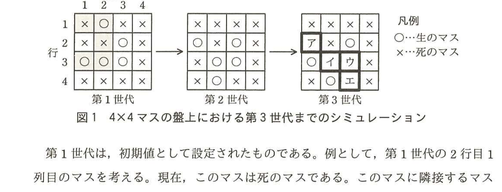

# 2016年春期（平成28年度）応用情報技術者試験 午後 問3（選択）
## プログラミング：ライフゲーム

---

## 問題文

**問3** ライフゲームに関する次の記述を読んで、設問1〜5に答えよ。

ライフゲームとは、数学者コンウェイが考案した、生命の誕生、生存、死滅などを再現したシミュレーションゲームである。マス目状の盤上の各マスに生命が存在でき、そのマス自身及び隣接するマスの状態によって次世代の誕生、生存、死滅が決まる。その条件を表1に示す。

なお、隣接するマスには、斜め方向のマスも含む。また、生命が存在するマスを"生のマス"、生命が存在しないマスを"死のマス"と呼ぶ。

### 表1 誕生、生存、死滅の条件

| 条件名 | 条件 |
|---|---|
| 誕生 | 死のマスに隣接する生のマスが三つならば、死のマスは次の世代では生のマスとなる。（死のマスに隣接する生のマスが二つ以下又は四つ以上ならば、死のマスは次の世代でも死のマスである。） |
| 生存 | 生のマスに隣接する生のマスが二つ又は三つならば、生のマスは次の世代でも生のマスである。 |
| 過疎 | 生のマスに隣接する生のマスが一つ以下ならば、生のマスは過疎によって次の世代では死のマスとなる。 |
| 過密 | 生のマスに隣接する生のマスが四つ以上ならば、生のマスは過密によって次の世代では死のマスとなる。 |

---

### 〔4×4マスのシミュレーション〕

4×4マスの盤上における第3世代までのシミュレーションを図1に示す。



> 図1の内容：第1世代（1行2列と3行1列、3行2列、3行3列、2行3列が生のマス）→第2世代（2行1列、2行3列、3行2列、3行3列、4行2列が生のマス）→第3世代（1行1列=ア、1行3列、2行1列、2行2列=イ、2行3列=ウ、3行2列、3行3列=エが該当マス）。凡例：○＝生のマス、×＝死のマス。

第1世代は、初期値として設定されたものである。例として、第1世代の2行目1列目のマスを考える。現在、このマスは死のマスである。このマスに隣接するマスを網掛けで示す。これら五つのマスの中に生のマスが三つある。これは表1の"誕生"の条件に該当するので、第2世代の2行目1列目のマスは生のマスになる。同様に、第1世代の各マスについて、そのマス自身及び隣接するマスの状態を確認することで第2世代が決まる。次の世代への状態の更新は、全てのマスについて同時に行われる。

---

### 〔盤上のマスのデータ構造〕

N×Nマスの盤上の状態を表現するデータ構造を考える。多次元配列が利用できないプログラム言語を考慮し、盤上の各マスの生死状態を管理するデータ構造として1次元配列mを用いる。配列mのデータ構造のイメージを図2に示す。

### 図2 配列mのデータ構造のイメージ

配列mは、盤の1行目からN行分を順に連結した1次元配列であり、1行目のN個のマスがm[1]〜m[N]、2行目のN個のマスがm[N+1]〜m[2×N]というように格納される。行k、列jのマスは、配列mの要素`m[　オ　]`に対応する。

---

### 〔配列mを次世代に更新するプログラム〕

使用する定数、配列及び関数を表2に、配列mを次世代に更新する関数updateを図3に示す。

なお、関数に配列を引数として渡すときの方式は参照渡しである。

### 表2 使用する定数、配列及び関数

| 名称 | 種類 | 説明 |
|---|---|---|
| N | 定数 | 盤の一辺の大きさ。3以上の整数が入る。 |
| m | 配列 | N×Nマスの生死状態を管理する1次元配列。生の場合は1が、死の場合は0が入る。 |
| temp | 配列 | 配列mと同じ大きさの1次元配列。 |
| copy(array1, array2) | 関数 | 配列array1の全ての要素を配列array2にコピーする。 |
| clear(array) | 関数 | 配列arrayの全ての要素の値を0にする。 |

### 図3 関数updateのプログラム

```
function update(m)
  copy(m, temp)         // 配列mを配列tempにコピーして退避する
  clear(m)              // 配列mの全ての要素の値を0にする
  for( iを1からN×Nまで1ずつ増やす )

    if( i-1がNで割り切れる )     ┐
      a ← 0                      │
      b ← 1                      │
    elseif( iがNで割り切れる )    ├ α
      a ← -1                     │
      b ← 0                      │
    else                         │
      a ← -1                     │
      b ← 1                      ┘
    endif

    e ← 0
    for( yを-1から1まで1ずつ増やす )
      for( xをaからbまで1ずつ増やす )
        if( (yと0が等しくない) or (xと0が等しくない) )
          c ← i + y×N + x
          if( (cが1以上) and (cがN×N以下) )
            if(     カ     )
              e ← e+1
            endif
          endif
        endif
      endfor
    endfor

    // 生死を判定する
    if(     キ     )
      m[i] ← 1
    elseif( (temp[i]と1が等しい) and ( (eと2が等しい) or (eと3が等しい) ) )
        ク
    endif

  endfor
endfunction
```

---

### 〔テストプログラム〕

図3のプログラムをテストするために、配列mに第1世代が与えられたときの第p世代が、机上で作成した正しい結果である配列rと等しいことを確認するプログラムを作成した。作成した関数shouldBeを図4に示す。ここで、pには2以上の整数が入る。

### 図4 関数shouldBeのプログラム

```
1: function shouldBe( m, p, r )
2:   for( iを1からpまで1ずつ増やす )
3:     update(m)
4:   endfor
5:   for( iを1からN×Nまで1ずつ増やす )
6:     if( m[i]とr[i]が等しくない )
7:       return false   // テスト失敗
8:     endif
9:   endfor
10:  return true         // テスト成功
11: endfunction
```

図3のプログラムが正しく動作する状態で図4のプログラムを実行したところ、テストが失敗した。原因を調査した結果、図4の`[　ケ　]`行目に問題があることが判明したので、①プログラムを修正してテストを成功させることができた。

---

## 設問

### 設問1 図1中の`[　ア　]`〜`[　エ　]`に入れる適切な生死状態を、図1の凡例に倣い答えよ。

### 設問2 図2中の`[　オ　]`に入れる適切な字句を答えよ。

### 設問3 図3中の`[　カ　]`〜`[　ク　]`に入れる適切な字句を答えよ。

### 設問4 図3中のαの二つの条件のいずれかを満たすのはどのような場合か。単語"盤"及び"マス"を用いて30字以内で述べよ。

### 設問5 〔テストプログラム〕について、(1)、(2)に答えよ。

(1) 本文中の`[　ケ　]`に入れる適切な数値を答えよ。

(2) 本文中の下線①の修正後の`[　ケ　]`行目のプログラムを答えよ。

---

## 解答と解説

### 設問1

**正解：ア = ×、イ = ×、ウ = ○、エ = ○**

第2世代の各マスに隣接する生のマス数を数え、表1の条件を適用する。

第3世代の1行1列（ア）：第2世代の1行1列は死のマスで、隣接する生のマスは1行2列と2行1列の2つ。誕生条件（3つ必要）を満たさないので**死のマス（×）**。

第3世代の2行2列（イ）：第2世代の2行2列は死のマスで、隣接する生のマス数を数えると2つ以下となり誕生条件を満たさないので**死のマス（×）**。

第3世代の2行3列（ウ）：第2世代の2行3列は生のマスで、隣接する生のマスが2つ又は3つの生存条件を満たすので**生のマス（○）**。

第3世代の3行3列（エ）：第2世代の3行3列は生のマスで、隣接する生のマスが2つ又は3つの生存条件を満たすので**生のマス（○）**。

**IPA公式：ア=×、イ=×、ウ=○、エ=○**

---

### 設問2

**正解：(k－1)×N＋j**

配列mは、盤の1行目からN行分を順に連結した1次元配列である。k行目の先頭要素は、それより前の(k－1)行分（各N個）を飛ばした位置、すなわち(k－1)×N＋1に対応する。したがって、k行j列のマスは、配列の要素**(k－1)×N＋j**に対応する。

**IPA公式：(k－1)×N＋j**

---

### 設問3

**正解：カ = temp[c]と1が等しい、キ = ( temp[i]と0が等しい ) and ( eと3が等しい )、ク = m[i] ← 1**

`カ`：内側の二重ループは、着目マスiの周囲8マス（yとxの組合せから自マス(y=0,x=0)を除く）のうち、盤内に収まるマス（c）について、隣接する生のマスの数eを数える処理である。したがって、cが指す退避前の状態`temp[c]と1が等しい`場合にeをインクリメントする。

`キ`：誕生条件は「死のマス（temp[i]が0）に隣接する生のマスが3つ（eが3）」であるので、`( temp[i]と0が等しい ) and ( eと3が等しい )`が真のとき誕生し、m[i]←1となる。

`ク`：直前のelseif文の条件（生存条件：生のマス(temp[i]=1)かつ隣接生マス数が2又は3）が真の場合、次世代でも生のマスのままなので、`m[i] ← 1`となる。

**IPA公式：カ=temp[c]と1が等しい、キ=( temp[i]と0が等しい ) and ( eと3が等しい )、ク=m[i] ← 1**

---

### 設問4

**正解例：チェックするマスが盤の第1列又は第N列の場合**

αの条件（i-1がNで割り切れる、又はiがNで割り切れる）は、それぞれ着目マスが行の左端（第1列）又は右端（第N列）に位置する場合に該当する。この場合、盤の外（隣の行の反対側の列）を誤って隣接マスとして参照しないよう、x方向の走査範囲（a、b）を調整する必要がある。したがって、条件を満たすのは**チェックするマスが盤の第1列又は第N列の場合**である。

**IPA公式：チェックするマスが盤の第1列又は第N列の場合**

---

### 設問5

**(1) 正解：2**

図4の6行目`if( m[i]とr[i]が等しくない )`のiは、5行目の`for( iを1からN×Nまで1ずつ増やす )`のループ変数であり、この時点でmは既に第p世代に更新済みである。しかし、2行目の`for( iを1からpまで1ずつ増やす )`もループ変数にiを再利用しているため、ループ変数iの競合（同じ変数名iを2つのforループで使用）が問題の原因であり、図4の**2**行目に問題がある。

**IPA公式：2**

**(2) 正解：for( iを2からpまで1ずつ増やす )**

問題は、2行目のforループの変数iが、5行目以降のforループの変数iと同じ名前であるため、2行目のループが終わった後もiの値がN×Nの手前で止まらず、意図しない挙動を招くことである（正しくは、開始値を1ではなく処理上重複しない値に、あるいは別変数にすべきところ、本問の解答例では開始値の修正で対応する）。修正後は、`for( iを2からpまで1ずつ増やす )`とする。

**IPA公式：for( iを2からpまで1ずつ増やす )**

---

## 参考：主要キーワード

| 用語 | 説明 |
|------|------|
| ライフゲーム（コンウェイのライフゲーム） | 盤上の各マスの生死が、隣接する8マスの生死状態によって規則的に次世代へ遷移するセル・オートマトンの代表例 |
| 1次元配列による2次元データの表現 | 多次元配列が使えない言語環境で、行×列の2次元的な位置を(k－1)×N＋jのような式で1次元配列のインデックスに変換して管理する手法 |
| 参照渡し（call by reference） | 関数に配列などを渡す際、実体（アドレス）を渡すことで、関数内での変更が呼び出し元にも反映される引数渡し方式 |
| ループ変数の競合 | 異なるforループで同じ変数名を使い回すことで、内側・外側のループが互いの変数を書き換えてしまい、意図しない動作を引き起こすバグ |
| 境界条件（盤端の処理） | 2次元盤を1次元配列で扱う際、行の最左端・最右端では隣接マスの計算が盤の反対側にはみ出さないよう、走査範囲を特別に調整する必要がある |
