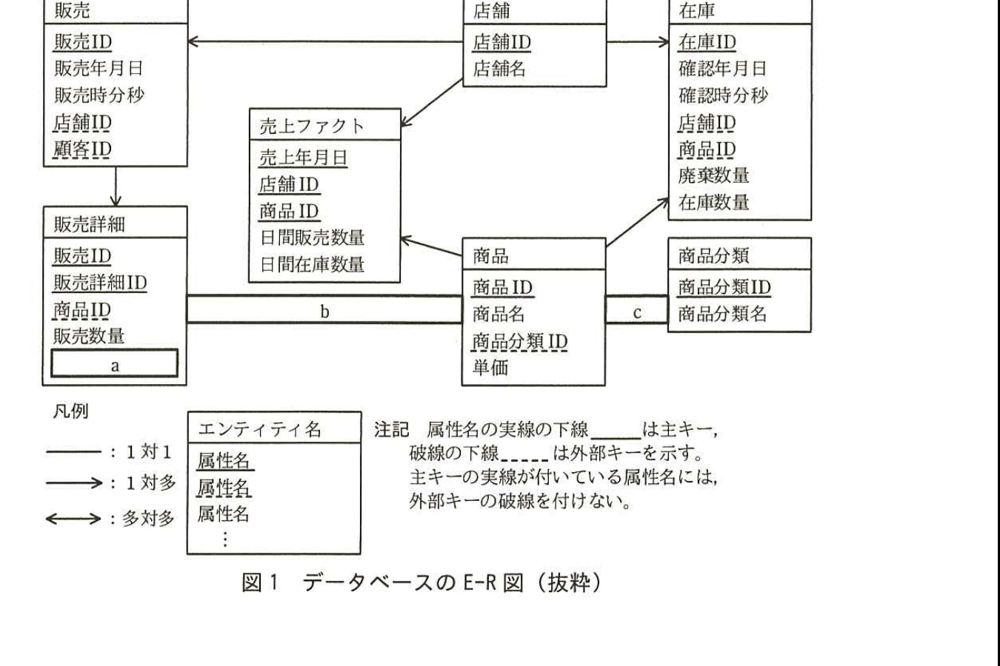

# 2016年春期（平成28年度）応用情報技術者試験 午後 問6（選択）
## データベース：コンビニエンスストアにおけるデータウェアハウス構築及び分析（W社）

---

## 問題文

**問6** コンビニエンスストアにおけるデータウェアハウス構築及び分析に関する次の記述を読んで、設問1〜4に答えよ。

W社は、コンビニエンスストアを全国展開する企業である。店舗ごとの売上を分析するために、データウェアハウスを構築することになった。

---

### 〔売上ファクト表の作成〕

売行きが悪い商品を見つけるために、販売実績と在庫実績のデータを1日単位で集計して売上ファクト表を作成する。

販売実績と在庫実績のデータは一つのデータベースによって管理されており、新たに追加するデータウェアハウスのデータも同じデータベース内に格納する。データベースのE-R図の抜粋を図1に、各エンティティの概要を表1に示す。



> 図1の内容：販売（販売ID、販売年月日、販売時分秒、店舗ID、顧客ID）は店舗から1対多の矢印を受ける。販売から販売詳細（販売ID、販売詳細ID、商品ID、販売数量、`[　a　]`）へ1対多。店舗（店舗ID、店舗名）から売上ファクト、在庫へそれぞれ1対多。売上ファクト（売上年月日、店舗ID、商品ID、日間販売数量、日間在庫数量）と商品の間は関連`[　b　]`。商品（商品ID、商品名、商品分類ID、単価）と販売詳細の間も関連`[　b　]`。商品分類（商品分類ID、商品分類名）と商品の間は関連`[　c　]`。在庫（在庫ID、確認年月日、確認時分秒、店舗ID、商品ID、廃棄数量、在庫数量）は店舗・商品からそれぞれ1対多を受ける。

### 表1 各エンティティの概要

| エンティティ名 | 概要 |
|---|---|
| 店舗 | コンビニエンスストアの店舗マスタ |
| 商品分類 | 弁当、清涼飲料、雑誌などの商品分類マスタ |
| 商品 | 商品の単価や商品分類などを管理する商品マスタ |
| 販売 | 顧客に商品を販売した実績を記録 |
| 販売詳細 | 顧客に販売した商品の数量や販売時単価を記録 |
| 在庫 | 1日3回、商品の入荷及び廃棄を行い、店舗が取り扱う商品の一覧と照らして、廃棄数量と在庫数量を記録 |
| 売上ファクト | 販売実績と在庫実績のデータを1日単位で集計したデータを記録 |

このデータベースでは、E-R図のエンティティ名を表名にし、属性名を列名にして、適切なデータ型で表定義した関係データベースによって、データを管理する。

売上ファクト表に挿入するデータを抽出するSQL文を図2に示す。

なお、店舗に在庫はあるが販売実績がない商品は日間販売数量を0とする。関数COALESCE(A, B)は、AがNULLでないときはAを、AがNULLのときはBを返す。

### 図2 売上ファクト表に挿入するデータを抽出するSQL文

```sql
SELECT ST.確認年月日, ST.店舗ID, ST.商品ID, COALESCE(SS.日間販売数量, 0),
  ST.日間在庫数量
FROM
  (SELECT SC.確認年月日, SC.店舗ID, SC.商品ID,
     AVG(SC.在庫数量) AS 日間在庫数量
   FROM 在庫 SC
   GROUP BY SC.確認年月日, SC.店舗ID, SC.商品ID) ST     ┐
                                                          ├ α
       d                                                 ┘
  (SELECT SL.販売年月日, SL.店舗ID, SD.商品ID,
     SUM(SD.販売数量) AS 日間販売数量
   FROM 販売 SL
     INNER JOIN 販売詳細 SD ON SL.販売ID = SD.販売ID
   GROUP BY SL.販売年月日, SL.店舗ID, SD.商品ID) SS       ┐
    ON ST.確認年月日 = SS.販売年月日                       ├ β
    AND     e                                             │
    AND     f                                             ┘
```

---

### 〔売行きが悪い商品分類の一覧の作成〕

店舗ごとの月間の売行きが悪い商品分類の一覧を作成するために、図3のSQL文を作成した。一覧は、売上年月が新しいものから、店舗IDを昇順にして、平均在庫数量が多い順に表示させる。

なお、関数TO_YYYYMMは日付型の引数を受け、年月を6文字の文字列として返す。

### 図3 売行きが悪い商品分類の一覧を作成するSQL文

```sql
SELECT SF.売上年月, SF.店舗ID, IT.商品分類ID,
  AVG(SF.日間販売数量) AS 平均販売数量, AVG(SF.日間在庫数量) AS 平均在庫数量
FROM
  (SELECT TO_YYYYMM(SA.売上年月日) AS 売上年月, SA.店舗ID, SA.商品ID,
     SA.日間販売数量, SA.日間在庫数量
   FROM 売上ファクト SA) SF
  INNER JOIN 商品 IT ON SF.商品ID = IT.商品ID
GROUP BY SF.売上年月, SF.店舗ID, IT.商品分類ID
    g
```

---

### 〔売行きが悪い商品分類の一覧を作成するSQL文の不具合〕

図3のSQL文を、過去の実績データを用いてテストしたところ、複数の商品分類の平均販売数量に誤った値が見つかった。そこで、幾つかの店舗における販売及び在庫管理の運用方法を確認したところ、店舗や商品によって在庫数量を記録する頻度にばらつきがあることが判明した。ある店舗では、販売実績が少ない商品は1日3回ではなく、1週間に1回だけ、在庫数量を記録していた。この点に注目して、処理を見直すことにした。まず、①図2中のある副問合せを抜き出して、その結果を新たに作成した表に格納する。次に、この表に②不足しているデータを追加する。図2中のある副問合せをこうして得られた表と置き換えることで、問題を解決することができた。

---

## 設問

### 設問1 図1のE-R図中の`[　a　]`〜`[　c　]`に入れる適切なエンティティ間の関連及び属性名を答え、E-R図を完成させよ。

なお、エンティティ間の関連及び属性名の表記は、図1の凡例に倣うこと。

### 設問2 図2中の`[　d　]`〜`[　f　]`に入れる適切な字句又は式を答えよ。

なお、表の列名には必ずその表の別名を付けて答えよ。

### 設問3 図3中の`[　g　]`に入れる適切な字句又は式を答えよ。

なお、表の列名には必ずその表の別名を付けて答えよ。

### 設問4 〔売行きが悪い商品分類の一覧を作成するSQL文の不具合〕について、(1)、(2)に答えよ。

(1) 本文中の下線①に該当する副問合せは図2中のどの位置にあるか。α又はβで答えよ。

(2) 本文中の下線②とはどのようなデータか。40字以内で述べよ。

なお、販売及び在庫管理の運用方法は変更しないこと。

---

## 解答と解説

### 設問1

**正解：a = 販売時単価、b = ←（1対多、商品→販売詳細／商品→売上ファクト）、c = ←（1対多、商品分類→商品）**

販売詳細エンティティの概要（表1）に「顧客に販売した商品の数量や**販売時単価**を記録」とあるので、`[　a　]`は**販売時単価**である。

商品エンティティと販売詳細・売上ファクトエンティティの関連は、1つの商品が複数の販売詳細・売上ファクトのレコードに対応する1対多の関係であり、矢印は商品側から販売詳細・売上ファクト側（左方向）に向く。したがって`[　b　]`は**←**（1対多、商品側が「1」）。

商品分類エンティティと商品エンティティの関連も、1つの商品分類に複数の商品が属する1対多の関係であり、矢印は商品分類側から商品側（左方向）に向く。したがって`[　c　]`は**←**（1対多、商品分類側が「1」）。

**IPA公式：a=販売時単価、b=←、c=←**

---

### 設問2

**正解：d = INNER JOIN、e = ST.店舗ID = SS.店舗ID（順不同）、f = ST.商品ID = SS.商品ID**

`[　d　]`は、在庫データの副問合せ（ST）と販売データの副問合せ（SS）を結合する句である。両方の副問合せに存在するキー（確認年月日／販売年月日、店舗ID、商品ID）で結合し、在庫はあるが販売実績がない商品も日間販売数量0として残すために外部結合とする必要がある。ONの後ろに続くAND条件（e、f）と合わせて考えると、`[　d　]`は**LEFT OUTER JOIN**である（在庫側STを基準に、販売側SSを左外部結合）。

`[　e　]`、`[　f　]`は結合条件であり、店舗ID同士、商品ID同士を一致させる必要があるので、それぞれ**ST.店舗ID = SS.店舗ID**、**ST.商品ID = SS.商品ID**（順不同）となる。

**IPA公式：d=LEFT OUTER JOIN、e=ST.店舗ID = SS.店舗ID（順不同）、f=ST.商品ID = SS.商品ID**

---

### 設問3

**正解：g = ORDER BY SF.売上年月 DESC, SF.店舗ID ASC, 平均在庫数量 DESC**

一覧は「売上年月が新しいものから（降順）、店舗IDを昇順にして、平均在庫数量が多い順（降順）に表示させる」という要件であるため、`[　g　]`には**ORDER BY SF.売上年月 DESC, SF.店舗ID ASC, 平均在庫数量 DESC**が入る。

**IPA公式：ORDER BY SF.売上年月 DESC, SF.店舗ID ASC, 平均在庫数量 DESC**

---

### 設問4

**(1) 正解：α**

αの副問合せ（在庫データを確認年月日・店舗ID・商品IDで集計しSTとする部分）は、実際には店舗・商品によって在庫を記録する頻度が異なる（1日3回、又は1週間に1回）ため、記録がない日のデータが欠落しており、この欠落が平均販売数量・平均在庫数量の誤差の原因となる。したがって、修正が必要な副問合せは**α**である。

**IPA公式：α**

**(2) 正解例：在庫数量を記録していない日の商品の在庫数量を実績から導出したデータ**

在庫数量の記録頻度が少ない商品（例：1週間に1回）については、記録がない日の在庫数量のデータが欠落しているため、平均を計算する際の母数（日数）が実態と合わず誤差が生じる。この問題を解決するには、**在庫数量を記録していない日の商品の在庫数量を実績から導出したデータ**を補完して追加する必要がある。

**IPA公式：在庫数量を記録していない日の商品の在庫数量を実績から導出したデータ**

---

## 参考：主要キーワード

| 用語 | 説明 |
|------|------|
| データウェアハウス（DWH） | 複数の業務データを統合・蓄積し、分析目的で利用するデータの集合体。本問の売上ファクト表はDWHの中核となる集計テーブル |
| E-R図（実体関連図） | エンティティ（実体）間の関連（1対1、1対多、多対多）を図示したデータモデル。主キー・外部キーの表記により正規化されたDB構造を表す |
| 外部結合（OUTER JOIN） | 結合条件に一致しないレコードも欠損側をNULLとして残して結合する方式。片方にしか存在しないデータ（本問では在庫はあるが販売実績がない商品）を欠落させずに集計する際に使用する |
| COALESCE関数 | 複数の引数を評価し、最初にNULLでない値を返す関数。外部結合の結果NULLとなった値をデフォルト値（本問では0）に置き換える際に使用する |
| データの記録頻度の不整合 | 店舗や商品によって実績データの記録頻度が異なる場合、単純な集計では実態と異なる平均値が算出される。欠落分を補完するデータの追加が必要となる |
