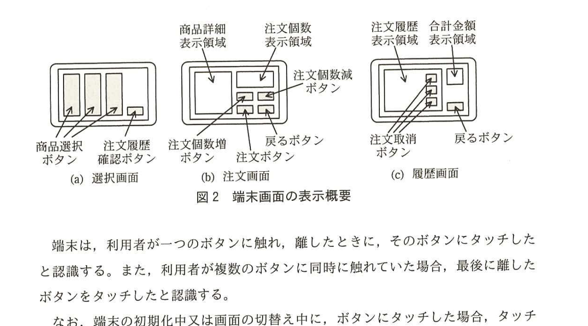
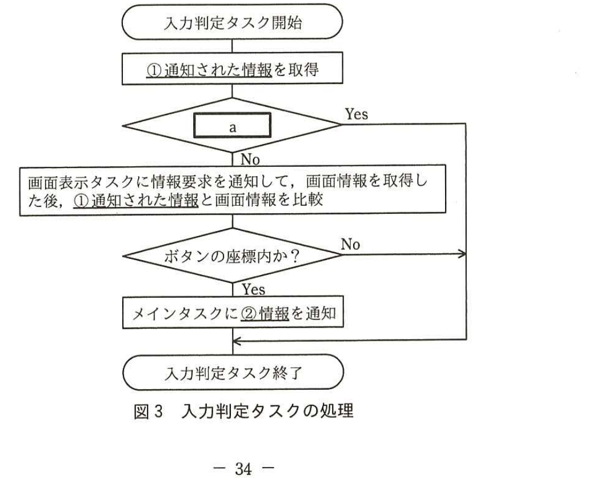

# 2016年春期（平成28年度）応用情報技術者試験 午後 問7（選択）
## 組込みシステム開発：飲食店向けタッチ式注文端末（G社）

---

## 問題文

**問7** 飲食店向けタッチ式注文端末に関する次の記述を読んで、設問1〜4に答えよ。

G社は、飲食店向けのタッチ式注文端末（以下、端末という）を開発している。飲食店向けタッチ式注文システムのシステム構成を図1に示す。管理システムは、ネットワークのアドレスを利用して、端末を識別する。

> 図1の内容：端末1〜端末n（それぞれ画面をもつ）が無線LANで管理システムに接続される。

---

### 〔端末の画面操作〕

端末の画面はタッチパネルになっている。利用者は、ボタンの領域（以下、ボタンという）にタッチして端末を操作する。画面には、選択画面、注文画面及び履歴画面の3種類がある。端末画面の表示概要を図2に示す。

> 図2の内容：(a)選択画面：商品選択ボタン（複数）と注文履歴確認ボタン。(b)注文画面：商品詳細表示領域、注文個数表示領域、注文個数増ボタン、注文個数減ボタン、注文ボタン、戻るボタン。(c)履歴画面：注文履歴表示領域、合計金額表示領域、注文取消ボタン（複数）、戻るボタン。

端末は、利用者が一つのボタンに触れ、離したときに、そのボタンにタッチしたと認識する。また、利用者が複数のボタンに同時に触れていた場合、最後に離したボタンをタッチしたと認識する。

なお、端末の初期化中又は画面の切替え中に、ボタンにタッチした場合、タッチは無効とする。

---

### 〔端末の動作概要〕

端末の主な機能の動作概要を表1に示す。

### 表1 端末の主な機能の動作概要

| 機能 | 動作概要 |
|---|---|
| 注文 | ・選択画面で利用者が商品選択ボタンにタッチすると、注文画面に遷移する。 ・注文画面で、利用者は、注文個数増ボタン又は注文個数減ボタンにタッチして、注文個数を指定した後、注文ボタンにタッチして、商品を注文する。 ・利用者が商品を注文すると、注文情報として注文ID、商品名及び注文個数を注文履歴に保存する。注文IDは、端末ごとに、1から始まる連番として生成される。 ・注文画面で、利用者が戻るボタンにタッチすると、選択画面に戻る。 |
| 注文履歴確認 | ・選択画面で、利用者が注文履歴確認ボタンにタッチすると、履歴画面に遷移する。履歴画面では、注文履歴を閲覧することができる。 ・履歴画面で、利用者が戻るボタンにタッチすると、選択画面に戻る。 |
| 注文取消 | ・履歴画面で、利用者が注文取消ボタンにタッチすると、注文履歴から当該の注文情報を削除し、画面表示を更新する。 |

---

### 〔端末－管理システム間の通信〕

注文ボタンへのタッチを認識すると、端末は、管理システムに注文メッセージを送信する。管理システムは、注文メッセージを受信すると、一定時間後に、端末に注文確定メッセージを送信する。

端末は、注文確定メッセージを受信すると、注文履歴の中から対応する注文を確定し、管理システムに注文確定完了メッセージを送信する。ただし、対応する注文が注文履歴の中に存在しなかった場合、端末は注文確定メッセージを破棄する。

管理システムは、注文確定メッセージを送信後、一定時間内に端末から注文確定完了メッセージを受信できなかった場合、注文が取り消されたものとして扱う。

注文取消ボタンへのタッチを認識すると、当該の注文が確定していない場合に限り、端末は、管理システムに注文取消メッセージを送信する。

---

### 〔端末－管理システム間のメッセージの構成〕

注文メッセージは、メッセージの種別を示すデータ、注文ID及び注文情報から構成される。それ以外のメッセージは、メッセージの種別を示すデータ及び注文IDから構成される。

---

### 〔端末のソフトウェア〕

端末は、イベントドリブンプリエンプション方式のリアルタイムOSを使用する。

**・端末の初期化**

端末の電源を入れると、初期化プログラムが動作する。初期化プログラムは、ハードウェアの初期化、メモリの初期化、端末制御プログラムのRAMへの転送、及びOSの起動を行う。端末制御プログラムのRAMへの転送速度は1Mバイト／秒、ハードウェア及びメモリの初期化から端末制御プログラムの転送開始までの所要時間は0.2秒であり、OSの起動には0.3秒掛かる。

**・タスクの機能概要**

主なタスクの機能概要を表2に、入力判定タスクの処理を図3に示す。

### 表2 主なタスクの機能概要

| タスク名 | 機能概要 | 優先度 |
|---|---|---|
| メイン | ・端末全体を制御する。 | 中 |
| 画面表示 | ・メインタスクから指示された画面の表示を行う。画面切替え中は、切替えフラグを1にする。 ・情報要求の通知を受け取ると、画面種別及びボタンの座標から成る画面情報を、要求元に通知する。 | 低 |
| タッチパネル | ・タッチしたと認識すると起動し、必要情報を入力判定タスクに通知する。 | 高 |
| 入力判定 | ・タッチパネルタスクから通知された情報と、画面表示タスクから通知された画面情報を基に、タッチの有効性を判断する。有効な場合、メインタスクに通知する。 | 高 |

> 図3の内容：入力判定タスク開始→①通知された情報を取得→分岐判定`[　a　]`（Yesならメインタスクに②情報を通知する処理へ、Noなら画面表示タスクに情報要求を通知して画面情報を取得した後、①通知された情報と画面情報を比較）→「ボタンの座標内か？」判定（Noなら入力判定タスク終了へ、Yesならメインタスクに②情報を通知）→入力判定タスク終了。

---

## 設問

### 設問1 端末の動作について、(1)〜(3)に答えよ。

(1) 200kバイトの端末制御プログラムの場合、初期化プログラムの動作開始からOSの起動完了まで何秒掛かるか。答えは小数第2位を四捨五入して、小数第1位まで求めよ。ここで、1Mバイト＝1,000kバイト、1kバイト＝1,000バイトとし、初期化プログラムの各処理の移行に必要な時間は無視できるものとする。

(2) 注文IDだけでは実現できないことを解答群の中から選び、記号で答えよ。

**解答群：**
ア　注文を確定するときに、確定すべき注文を選択する。
イ　注文を取り消すときに、注文履歴内の取り消すべき注文を選択する。
ウ　注文を取り消すときに、当該の注文を取り消してよいかを判断する。
エ　利用者が注文した順に、履歴画面に注文情報を並べる。

(3) 管理システムが端末に注文確定メッセージを送信してから、端末が受信するまでの間に、端末が、当該の注文の注文取消メッセージを送信した場合の、端末の動作として適切なものを解答群の中から選び、記号で答えよ。

**解答群：**
ア　管理システムと端末の情報に矛盾が生じ、異常な処理が実行される。
イ　そのときの端末の状態によって異なる。
ウ　注文確定メッセージが優先され、注文を取り消すことはできない。
エ　当該の注文の注文情報を削除する。

### 設問2 図3中の下線①について、(1)、(2)に答えよ。

(1) 通知してきたタスク名を答えよ。

(2) 通知された情報を答えよ。

### 設問3 図3中の`[　a　]`に入れる適切な内容を、15字以内で答えよ。

### 設問4 図3中の下線②の情報は二つあり、一つは画面種別である。もう一つの情報を答えよ。

---

## 解答と解説

### 設問1

**(1) 正解：0.7（秒）**

ハードウェア及びメモリの初期化から端末制御プログラムの転送開始までの所要時間0.2秒＋端末制御プログラムの転送時間（200kバイト÷1Mバイト/秒＝200kバイト÷1,000kバイト/秒＝0.2秒）＋OSの起動時間0.3秒＝0.2＋0.2＋0.3＝**0.7**秒。

**IPA公式：0.7（秒）**

**(2) 正解：ウ**

注文IDは、注文を一意に識別するための情報であり、確定・取消・履歴表示の対象を特定する（ア、イ、エ）ためには十分である。しかし、当該の注文を取り消してよいか（既に確定済みでないか）を判断する（ウ）には、注文IDだけでなく、注文の確定状態（確定済みかどうか）という別の情報が必要である。

**IPA公式：ウ**

**(3) 正解：エ**

本文に「注文取消ボタンへのタッチを認識すると、当該の注文が確定していない場合に限り、端末は、管理システムに注文取消メッセージを送信する」とある。したがって、端末が注文取消メッセージを送信した時点で、その注文はまだ端末側では確定していない状態である。その後に注文確定メッセージが端末に到着しても、本文に「対応する注文が注文履歴の中に存在しなかった場合、端末は注文確定メッセージを破棄する」とあるとおり、既に注文情報が削除されていれば確定メッセージは破棄される。したがって、端末の動作として適切なのは**当該の注文の注文情報を削除する**（エ）である。

**IPA公式：エ**

---

### 設問2

**(1) 正解：タッチパネルタスク**

表2より、タッチしたと認識すると起動し、必要情報を入力判定タスクに通知するのは**タッチパネルタスク**である。

**IPA公式：タッチパネルタスク**

**(2) 正解：タッチされた座標情報**

タッチパネルタスクが入力判定タスクに通知する「必要情報」とは、ボタンの座標内かどうかを判定するために必要な**タッチされた座標情報**である。

**IPA公式：タッチされた座標情報**

---

### 設問3

**正解例：画面切替え中か**

表2の画面表示タスクの機能概要に「画面切替え中は、切替えフラグを1にする」とあり、本文の〔端末の画面操作〕に「端末の初期化中又は画面の切替え中に、ボタンにタッチした場合、タッチは無効とする」とある。したがって、図3の`[　a　]`の判定は、この切替えフラグを確認する**画面切替え中か**という判定であり、Yes（切替え中）の場合はタッチを無効として直ちに入力判定タスクを終了する。

**IPA公式：画面切替え中か**

---

### 設問4

**正解例：有効なボタンの座標情報**

図3では、通知された座標情報が画面切替え中でなく、かつボタンの座標内であることを確認した上で、メインタスクに通知している。したがって、下線②の情報のうち画面種別以外のもう一つは、タッチが有効と判定された**有効なボタンの座標情報**である。

**IPA公式：有効なボタンの座標情報**

---

## 参考：主要キーワード

| 用語 | 説明 |
|------|------|
| イベントドリブンプリエンプション方式 | イベント（割込みや通知）の発生に応じてタスクを起動し、優先度の高いタスクが低いタスクを中断（プリエンプト）して実行できるリアルタイムOSの制御方式 |
| タスク間通信 | 複数のタスクが情報をやり取りしながら協調動作する仕組み。本問ではタッチパネルタスク→入力判定タスク→メインタスクという通知の流れで処理が連携する |
| 状態管理と排他制御 | 画面切替え中や注文確定処理中など、特定の状態においては入力を無効化することで、処理の整合性（矛盾した状態遷移）を防ぐ設計手法 |
| メッセージのタイミング制御（非同期通信の整合性） | ネットワーク経由の非同期メッセージ交換では、メッセージの送受信タイミングのずれにより矛盾が生じ得るため、受信側で存在確認や状態確認を行い矛盾を吸収する設計が必要 |
| 処理時間の見積り（初期化シーケンス） | 転送速度・データサイズ・固定処理時間などから、シーケンシャルな処理全体に要する時間を積算して見積もる基本的な計算手法 |
