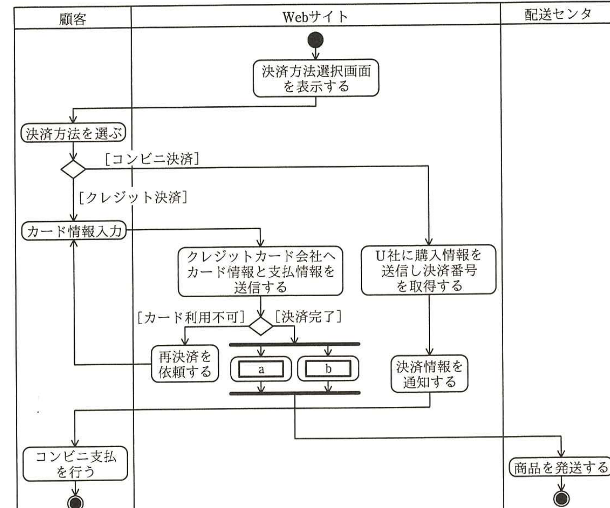
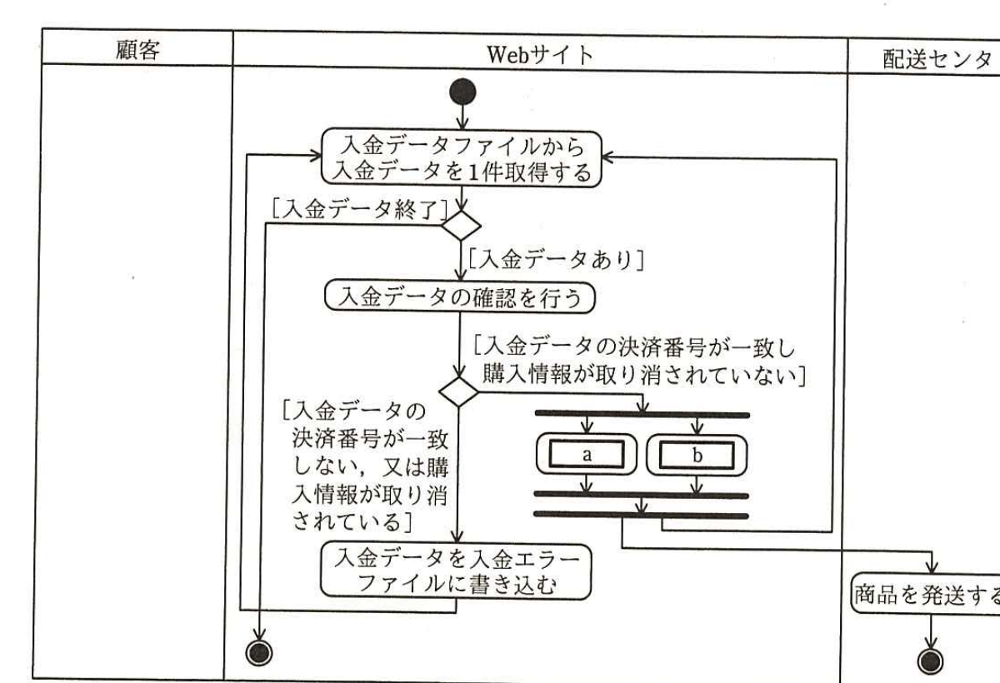
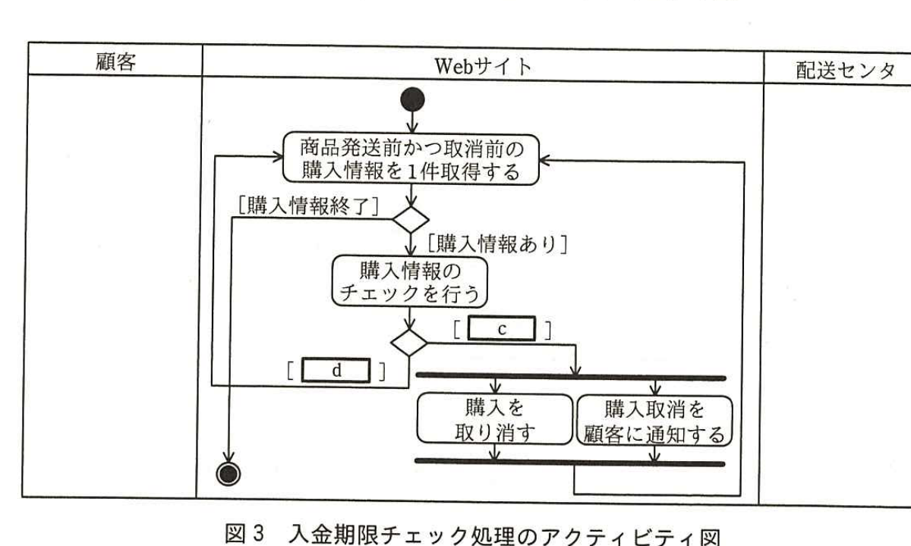
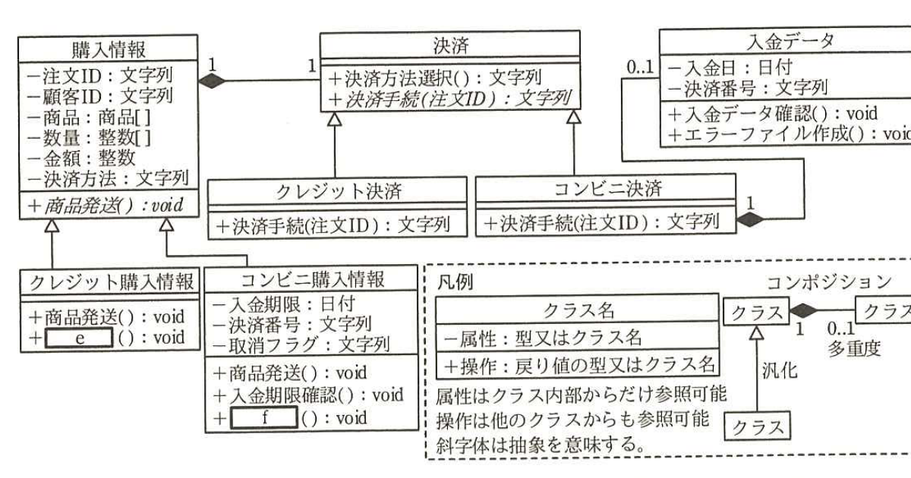

# 2016年春期（平成28年度）応用情報技術者試験 午後 問8（選択）
## 情報システム開発：通信販売用Webサイトにおける決済処理の設計（T社）

---

## 問題文

**問8** 通信販売用Webサイトにおける決済処理の設計に関する次の記述を読んで、設問1〜4に答えよ。

T社ではインターネットを用いた通信販売を行っている。通信販売用Webサイト（以下、Webサイトという）で利用できる決済方法は、クレジットカードを利用して決済するクレジット決済だけであったが、顧客の利便性向上を目的に、新たにU社が運営するコンビニエンスストア（以下、コンビニという）での支払（以下、コンビニ決済という）の導入を検討することになった。

顧客は、購入する商品を選択し、顧客IDを入力して商品の配送先を指定した後、決済方法選択画面から希望する決済方法を選択することが可能となる。

WebサイトでのクレジットL決済処理の処理内容を表1に、コンビニ決済処理の処理内容を表2、表3に示す。

### 表1 クレジット決済処理の処理内容

| 処理名称 | 処理内容 |
|---|---|
| 決済方法選択 | 顧客は、Webサイトが表示する決済方法選択画面で、決済方法としてクレジット決済を選択する。 |
| カード情報入力 | 顧客は、購入代金の決済に使用するクレジットカードのカード情報（カード番号、有効期限、カード名義、セキュリティコード）を入力する。 |
| カード情報送信 | Webサイトは、クレジットカード会社へカード情報と支払情報を送信し、決済処理を依頼する。その後、Webサイトは、クレジットカード会社から、決済完了かカード利用不可かの回答を取得する。 |
| 商品発送 | Webサイトは、クレジットカード会社の回答が決済完了の場合、配送センタに商品の発送を指示し、同時にWebサイトの画面で顧客に商品の発送を通知する。 |
| 再決済依頼 | Webサイトは、クレジットカード会社の回答がカード利用不可の場合、再度カード情報入力の画面を表示する。 |

### 表2 コンビニ決済処理の処理内容（リアルタイム処理）

| 処理名称 | 処理内容 |
|---|---|
| 決済方法選択 | 顧客は、Webサイトが表示する決済方法選択画面で、決済方法としてコンビニ決済を選択する。 |
| 決済番号取得 | Webサイトは、U社に購入情報（金額、入金期限日）を送信し、U社から決済番号を取得する。 |
| 決済情報通知 | Webサイトは、U社から回答された決済番号と金額、入金期限日の情報（以下、決済情報という）を電子メール（以下、メールという）で顧客に通知する。 |
| コンビニ支払 | 顧客は、U社コンビニへ行き、店頭で決済番号を提示して支払を行う。 |

### 表3 コンビニ決済処理の処理内容（バッチ処理）

| 処理グループ | 処理名称 | 処理内容 |
|---|---|---|
| 入金データチェック | 入金データ確認 | Webサイトは、U社から1時間に1回送信される入金データファイルを1件ずつ読み込み、入金データの決済番号がWebサイトで保持している決済番号と一致するかどうかを確認する。 |
| 入金データチェック | 商品発送 | 決済番号が一致し、決済番号に該当する購入情報が購入取消処理によって取り消されていない場合、Webサイトは、配送センタに商品の発送を指示し、同時にメールで顧客に商品の発送を通知する。 |
| 入金データチェック | エラーファイル作成 | 決済番号が一致しない、又は決済番号に該当する購入情報が取り消されている場合、Webサイトは、入金データの情報を入金エラーファイルに書き込む。 |
| 入金期限チェック | 入金期限確認 | Webサイトは、1日に1回、商品発送前かつ取消前の購入情報を1件ずつ読み込み、入金期限のチェックを行う。 |
| 入金期限チェック | 購入取消 | Webサイトは、入金期限日が過ぎても入金されていない購入情報を取り消して、メールで顧客に通知する。 |

---

### 〔アクティビティ図〕

現在のアクティビティ図を基に、コンビニ決済処理（リアルタイム処理）を加えたアクティビティ図を図1に、入金データチェック処理のアクティビティ図を図2に、入金期限チェック処理のアクティビティ図を図3に示す。

> 図1の内容：顧客が決済方法を選ぶ→[クレジット決済]ならカード情報入力→クレジットカード会社へカード情報と支払情報を送信する→[カード利用不可]なら再決済を依頼する（カード情報入力へ戻る）、[決済完了]なら並行処理で`[　a　]`と`[　b　]`を実行。→[コンビニ決済]ならU社に購入情報を送信し決済番号を取得する→決済情報を通知する。両フローが合流後、顧客はコンビニ支払を行う（コンビニ決済の場合）か終了。配送センタは商品を発送する。

> 図2の内容：入金データファイルから入金データを1件取得する（ループ）→[入金データ終了]なら終了、[入金データあり]なら入金データの確認を行う→[入金データの決済番号が一致し購入情報が取り消されていない]なら並行処理で`[　a　]`と`[　b　]`を実行、[入金データの決済番号が一致しない、又は購入情報が取り消されている]なら入金データを入金エラーファイルに書き込む（ループ先頭へ）。配送センタは商品を発送する。

> 図3の内容：商品発送前かつ取消前の購入情報を1件取得する（ループ）→[購入情報終了]なら終了、[購入情報あり]なら購入情報のチェックを行う→[`[　c　]`]なら並行処理で「購入を取り消す」と「購入取消を顧客に通知する」を実行（ループ先頭へ）、[`[　d　]`]ならそのままループ先頭へ戻る。

---

### 〔クラス図〕

現在のクラス図を基に、コンビニ決済処理を加えた決済処理に関連するクラス図を図4に示す。

> 図4の内容：購入情報クラス（注文ID、顧客ID、商品[]、数量[]、金額、決済方法、商品発送()：void抽象）と決済クラス（決済方法選択()：文字列、決済手続(注文ID)：文字列 抽象）が1対1でコンポジション関係。決済クラスの汎化サブクラスとしてクレジット決済クラス、コンビニ決済クラス（それぞれ決済手続(注文ID)：文字列を実装）。購入情報クラスの汎化サブクラスとしてクレジット購入情報クラス（商品発送()：void、`[　e　]`()：void）、コンビニ購入情報クラス（入金期限：日付、決済番号：文字列、取消フラグ：文字列、商品発送()：void、入金期限確認()：void、`[　f　]`()：void）。入金データクラス（入金日：日付、決済番号：文字列、入金データ確認()：void、エラーファイル作成()：void）はコンビニ決済クラスと0..1対1でコンポジション関係。

---

### 〔入金期限チェック処理の処理タイミング〕

図2の入金データチェック処理と図3の入金期限チェック処理の処理タイミングについて考察する。

日付が変わった後、入金期限チェック処理の前には必ず入金データチェック処理を実施する必要がある。これは、①入金期限チェック処理が入金データチェック処理よりも先に実施された場合に発生する不具合を防止するためである。

---

## 設問

### 設問1 図1、2中の`[　a　]`、`[　b　]`に入れる適切な処理内容を20字以内で答えよ。また、図3中の`[　c　]`、`[　d　]`に入れる適切な条件を15字以内で答えよ。

### 設問2 図4中の`[　e　]`、`[　f　]`に入れる適切な操作名を解答群の中から選び、記号で答えよ。

**解答群：**
ア　カード情報送信　　イ　カード情報入力　　ウ　決済情報通知　　エ　購入取消　　オ　コンビニ支払　　カ　再決済依頼

### 設問3 図4中の決済クラスの操作"決済手続"は抽象操作（抽象メソッド）であり、処理の実体を含まない。そのサブクラスであるコンビニ決済クラスの"決済手続"に含まれる処理名称を表1〜3の中から選び、全て答えよ。

### 設問4 本文中の下線①の不具合について、その内容を30字以内で述べよ。

---

## 解答と解説

### 設問1

**正解：a = 配送センタへ商品の発送を指示する、b = 顧客に商品の発送を通知する（順不同）、c = 入金期限日を過ぎている、d = 入金期限日を過ぎていない**

図1、図2は共に「クレジットカード会社の回答が決済完了」又は「入金データの決済番号が一致し購入情報が取り消されていない」場合に並行で実行される処理を示している。表1・表3の「商品発送」の処理内容「Webサイトは、配送センタに商品の発送を指示し、同時にメールで顧客に商品の発送を通知する」から、この処理は2つの並行アクティビティ`[　a　]`（**配送センタへ商品の発送を指示する**）と`[　b　]`（**顧客に商品の発送を通知する**）に分解される。

図3の分岐条件は、表3の「購入取消」の処理内容「入金期限日が過ぎても入金されていない購入情報を取り消して」に基づき、`[　c　]`は**入金期限日を過ぎている**、`[　d　]`は**入金期限日を過ぎていない**である。

**IPA公式：a=配送センタへ商品の発送を指示する（順不同）、b=顧客に商品の発送を通知する、c=入金期限日を過ぎている、d=入金期限日を過ぎていない**

---

### 設問2

**正解：e = カ（再決済依頼）、f = エ（購入取消）**

クレジット購入情報クラスは、表1のクレジット決済処理のうち、商品発送以外にクレジットカードの利用不可時に行う処理を持つ必要がある。したがって`[　e　]`は**再決済依頼**（カ）である。

コンビニ購入情報クラスは、表3の入金期限チェック処理のうち、入金期限確認以外に、入金期限切れ時に行う処理を持つ必要がある。したがって`[　f　]`は**購入取消**（エ）である。

**IPA公式：e=カ、f=エ**

---

### 設問3

**正解：決済番号取得、決済情報通知**

コンビニ決済クラスの"決済手続"操作は、表2のコンビニ決済処理（リアルタイム処理）のうち、決済方法選択（既にWebサイト側で行われ決済クラスの決済方法選択()に対応）とコンビニ支払（顧客側の行為）を除いた、Webサイト側が"決済手続"として実行する処理である**決済番号取得**、**決済情報通知**が含まれる。

**IPA公式：決済番号取得，決済情報通知**

---

### 設問4

**正解例：入金されている購入情報が取り消されてしまう。**

入金データチェック処理より先に入金期限チェック処理が実行されると、実際には既にコンビニで入金済みであるにもかかわらず、その日に届いた入金データがまだWebサイト側の購入情報に反映されていない状態で入金期限のチェックが行われることになる。この場合、入金済みであっても入金期限日を過ぎていれば購入取消の対象と判定されてしまい、**入金されている購入情報が取り消されてしまう**という不具合が発生する。

**IPA公式：入金されている購入情報が取り消されてしまう。**

---

## 参考：主要キーワード

| 用語 | 説明 |
|------|------|
| アクティビティ図（UML） | 処理の流れや分岐、並行処理をスイムレーンで表現する図。本問では顧客・Webサイト・配送センタの3レーンで処理の流れを可視化している |
| クラス図（UML）とコンポジション／汎化 | クラス図は属性・操作とクラス間の関係を表す。コンポジションは「全体と部分」の強い結合関係、汎化は継承（is-a）関係を表す |
| 抽象操作（抽象メソッド） | 親クラスで宣言されるが実装を持たず、サブクラスでオーバーライドされて実装される操作。図4の"決済手続"はその例 |
| バッチ処理の実行順序制約 | 複数のバッチ処理間にデータの前提関係がある場合、実行順序を誤ると、まだ反映されていないデータに基づいて誤った判定・処理が行われる不具合が生じる |
| リアルタイム処理とバッチ処理の組合せ | 決済番号取得などの即時応答が必要な処理はリアルタイム処理、大量データの定期的な確認・照合はバッチ処理として設計し分担する |
