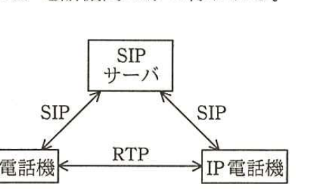
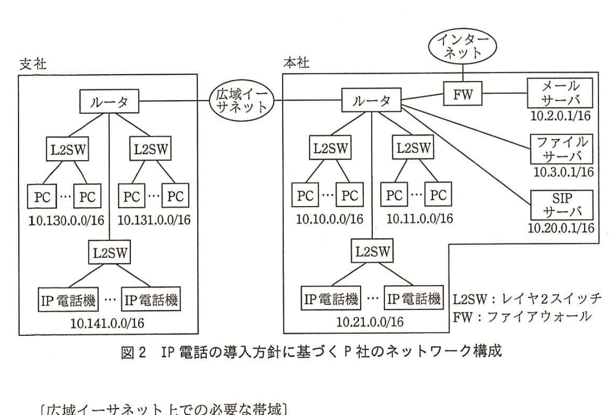

# 2016年秋期（平成28年度）応用情報技術者試験 午後 問5（選択）
## ネットワーク：IP電話の導入（P社）

---

## 問題文

**問5** IP電話の導入に関する次の記述を読んで、設問1〜3に答えよ。

P社は、中堅の商社であり、東京の本社と大阪の支社の2拠点に約200名の社員が勤務している。社内の内線電話で使用しているPBX（構内電話交換機）が老朽化し、製品の保守期限が近づいているので、新システムへの更改が必要となっている。P社では、PBX更改コストと運用コストを抑制するため、IP電話の導入を検討している。

P社の社内LANは、電子メールとファイル共有、社外Webサイトへのアクセスに利用されている。拠点内のLANは100Mビット／秒のイーサネットで構築されており、本社と支社の間は広域イーサネットで接続されている。利用している広域イーサネットのサービス品目には、1Mビット／秒から10Mビット／秒まで1Mビット／秒ごとに10種類あり、現在は2Mビット／秒の品目で契約している。

---

### 〔IP電話の仕組み〕

IP電話は、発信や着信、応答、切断などの呼制御にSIP（Session Initiation Protocol）を、通話にRTP（Real-time Transport Protocol）を使用して実現される。発信時は、IP電話機からSIPサーバを介して相手のIP電話機と接続し、接続が確立された後の通話はIP電話機間で直接行う。RTPで使用するポート番号は、SIPサーバからの呼制御時に動的に値が割り当てられる。IP電話機とSIPサーバの関係を図1に示す。なお、IP電話による通話はIP電話機間だけで行われる。

> 図1の内容：SIPサーバとIP電話機（左）、IP電話機（右）が三角形に接続。SIPサーバとIP電話機間はそれぞれSIPで接続。IP電話機同士はRTPで直接接続。

P社では、通話中の音声をディジタル化するコーデックにITU-T G.711規格を採用する。今回使用するコーデックでは、1パケットの音声データは160バイトで、付加されるヘッダはイーサネットヘッダ18バイト、IPヘッダ20バイト、UDPヘッダ8バイト、RTPヘッダ12バイトである。このパケットが20ミリ秒ごとに送出される。

---

### 〔IP電話の導入方針〕

情報システム部のQ君がIP電話の導入について検討することになり、方針を次のとおり整理した。

・電話機はVoIP（Voice over Internet Protocol）に対応したIP電話機を使用し、本社にSIPサーバを設置する。

・同時接続数は、拠点内では最大で50、本社と支社の間では最大で10とする。

・本社と支社の間で、IP電話以外の通常の利用に必要なネットワーク帯域は2Mビット／秒とする。

Q君が設計した、IP電話の導入方針に基づくP社のネットワーク構成を図2に示す。

> 図2の内容：支社にルータ、L2SW×2（それぞれPC群、10.130.0.0/16と10.131.0.0/16）、さらにL2SW配下にIP電話機群（10.141.0.0/16）。支社ルータは広域イーサネット経由で本社ルータに接続。本社にルータ、L2SW×2（PC群、10.10.0.0/16と10.11.0.0/16）、さらにL2SW配下にIP電話機群（10.21.0.0/16）。本社ルータはFW経由でインターネット、及びメールサーバ（10.2.0.1/16）、ファイルサーバ（10.3.0.1/16）、SIPサーバ（10.20.0.1/16）に接続。

---

### 〔広域イーサネット上での必要な帯域〕

1パケット当たりのデータサイズは、音声データとヘッダをあわせて`[　a　]`バイトである。20ミリ秒ごとにパケットを送出するので、1秒当たりのパケット数は`[　b　]`となり、必要な広域イーサネット上での帯域は1通話当たり`[　c　]`kビット／秒である。

本社と支社の間で必要な広域イーサネット上での帯域は、

IP電話以外で必要な帯域＋IP電話で必要な帯域
＝2Mビット／秒＋`[　c　]`kビット／秒×`[　d　]`
＝`[　e　]`kビット／秒

となり、サービス品目を最低限`[　f　]`Mビット／秒に変更する必要がある。

---

### 〔QoS（Quality of Service）の考慮〕

図2のネットワーク構成について、Q君は上司のR氏から次の指摘を受けた。

・本社と支社の間でファイル転送が集中した際に、RTPによる音声データの通信が影響を受けて、本社と支社の間での通話中に音声の途切れや遅延が発生するおそれがあるので、QoSの考慮が必要である。

そこで、Q君は図2のネットワーク構成をチェックして、指摘への対応を考えた。

・図2で、LANと広域イーサネットとを接続する（帯域が狭くなる）箇所で、広域イーサネットに流入するデータ量が通信回線の許容量を超えて、輻輳が発生すると、パケットが破棄されたり、その配送が遅延したりする場合がある。その際にRTPパケットが破棄されたり、その配送が遅延したりすると、IP電話の音声の途切れや遅延が発生する。

・P社のルータには、送信元IPアドレス、送信元ポート番号、宛先IPアドレス、宛先ポート番号の任意の組合せで優先度を設定する機能がある。IPアドレスは、サブネットマスクの指定によって、ネットワークアドレスで指定することが可能であるが、ポート番号は範囲での指定はできず、個々に指定する必要がある。

これを踏まえてQ君は、ルータにおいて①音声データのパケットが破棄されないように、IPアドレスによって優先度を設定すればよいと考えた。

また、拠点内については、`[　g　]`という点と、IP電話による通話で必要な帯域が確保されているという点から、QoSの設定は不要と考えた。

Q君は、QoSの設定についてR氏に提案し、採用された。

---

## 設問

### 設問1 本文中の`[　a　]`〜`[　f　]`に入れる適切な数値を答えよ。計算結果は、四捨五入などせず、結果をそのまま記載せよ。なお、1kビット／秒は1,000ビット／秒、1Mビット／秒は1,000kビット／秒とする。

### 設問2 本文中の下線①について、(1)、(2)に答えよ。

(1) 優先度の設定に、ポート番号ではなく、IPアドレスを使用した理由を20字以内で述べよ。

(2) 優先度を高く設定する送信元IPアドレスとサブネットマスク、宛先IPアドレスとサブネットマスクの組合せを、ドット付き10進表記で全て答えよ。

### 設問3 拠点内でのQoSについて、本文中の`[　g　]`に入れる適切な字句を30字以内で述べよ。

---

## 解答と解説

### 設問1

**正解：a = 218、b = 50、c = 87.2、d = 10、e = 2,872、f = 3**

`[　a　]`は、1パケット当たりのデータサイズであり、音声データ160バイトに、イーサネットヘッダ18バイト＋IPヘッダ20バイト＋UDPヘッダ8バイト＋RTPヘッダ12バイトを加えると、160＋18＋20＋8＋12＝**218**バイトである。

`[　b　]`は、20ミリ秒ごとにパケットを送出するので、1秒（1,000ミリ秒）÷20ミリ秒＝**50**パケット／秒である。

`[　c　]`は、1通話当たりの帯域であり、218バイト×8ビット×50パケット／秒＝87,200ビット／秒＝**87.2**kビット／秒である。

`[　d　]`は、本社と支社の間の同時接続数の最大値であり、本文の導入方針に「本社と支社の間では最大で10とする」とあるので、**10**である。

`[　e　]`は、IP電話以外に必要な帯域2Mビット／秒（＝2,000kビット／秒）とIP電話に必要な帯域（87.2kビット／秒×10）の合計であり、2,000＋872＝**2,872**kビット／秒である。

`[　f　]`は、現在の広域イーサネットのサービス品目が1Mビット／秒刻みで用意されていることから、必要な帯域2,872kビット／秒（＝2.872Mビット／秒）以上を満たす最小のサービス品目を選ぶ必要があり、現在契約している2Mビット／秒では不足するため、最低限**3**Mビット／秒に変更する必要がある。

**IPA公式：a=218、b=50、c=87.2、d=10、e=2,872、f=3**

---

### 設問2

**(1) 正解例：ポート番号は動的に決定されるから**

本文に「RTPで使用するポート番号は、SIPサーバからの呼制御時に動的に値が割り当てられる」とある。ポート番号が通話のたびに動的に変わるため、ルータで固定的にポート番号を指定して優先度を設定することができない。したがって、優先度の設定には、通話のたびに変わらないIPアドレスを使用した。すなわち**ポート番号は動的に決定されるから**である。

**IPA公式：ポート番号は動的に決定されるから**

**(2) 正解：送信元IPアドレス＝10.21.0.0、サブネットマスク＝255.255.0.0、宛先IPアドレス＝10.141.0.0、サブネットマスク＝255.255.0.0、及びその逆（送信元＝10.141.0.0、宛先＝10.21.0.0、共にサブネットマスク255.255.0.0）**

本社と支社の間のIP電話の通話は、本社のIP電話機群（10.21.0.0/16）と支社のIP電話機群（10.141.0.0/16）の間で行われる。したがって、本社ルータでは、本社→支社方向（送信元10.21.0.0／255.255.0.0、宛先10.141.0.0／255.255.0.0）と、支社→本社方向（送信元10.141.0.0／255.255.0.0、宛先10.21.0.0／255.255.0.0）の両方向について優先度を高く設定する必要がある。

**IPA公式：送信元IPアドレス10.21.0.0 サブネットマスク255.255.0.0 宛先IPアドレス10.141.0.0 サブネットマスク255.255.0.0、及び送信元IPアドレス10.141.0.0 サブネットマスク255.255.0.0 宛先IPアドレス10.21.0.0 サブネットマスク255.255.0.0**

---

### 設問3

**正解例：IP電話機間の通信は他の通信の影響を受けない**

図2では、拠点内において、PCが接続されるL2SWとIP電話機が接続されるL2SWが分離されている。すなわち、IP電話機は専用のL2SWに接続されており、PCのファイル転送などのトラフィックと物理的にネットワークが分離されている。そのため、拠点内では**IP電話機間の通信は他の通信の影響を受けない**という点から、QoSの設定は不要と考えられる。

**IPA公式：IP電話機間の通信は他の通信の影響を受けない**

---

## 参考：主要キーワード

| 用語 | 説明 |
|------|------|
| SIP（Session Initiation Protocol） | IP電話の発信・着信・応答・切断などの呼制御を行うプロトコル。実際の音声データの伝送には使用しない |
| RTP（Real-time Transport Protocol） | 音声や映像などのリアルタイムデータをIPネットワーク上で伝送するためのプロトコル。IP電話機間で直接通信される |
| コーデック（G.711）とパケットサイズ計算 | 音声データをディジタル化する方式。1パケット当たりのデータ量とヘッダサイズ、送出間隔から必要な帯域を計算する基本手法 |
| QoS（Quality of Service） | ネットワークにおいて特定の通信（本問では音声データ）を優先的に扱うことで、輻輳時の遅延やパケット破棄の影響を軽減する技術 |
| ルータでの優先度設定（IPアドレスとポート番号） | ポート番号が動的に変わる通信ではIPアドレス（ネットワークアドレス）を用いた優先度設定が必要になる、という設計上の制約 |

