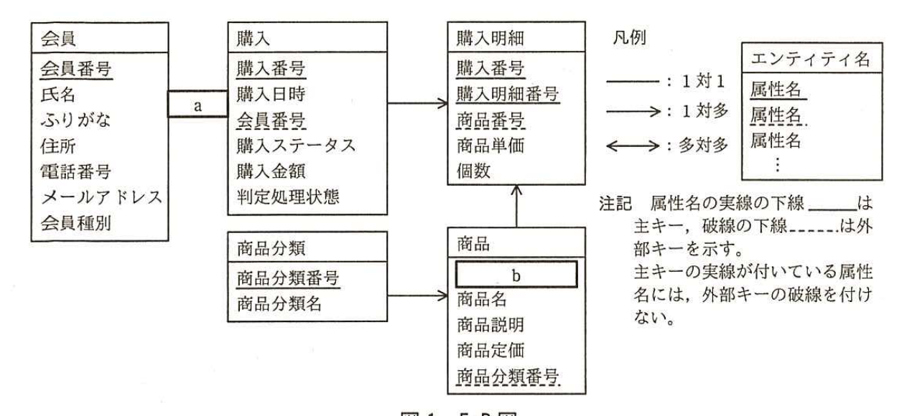

# 2016年秋期（平成28年度）応用情報技術者試験 午後 問6（選択）
## データベース：ネットショップの会員管理（W社）

---

## 問題文

**問6** ネットショップの会員管理に関する次の記述を読んで、設問1〜4に答えよ。

W社は、日用雑貨の製造・販売事業を国内で展開する中堅企業である。自社直営店やデパートなどでの販売に加えて、一般消費者向けにネットショップでも自社製品を販売している。

ネットショップでは、購入者は会員登録を行う必要がある。会員に対しては、購入の履歴から会員の嗜好を把握してダイレクトメールを発送し、さらに購入金額の合計に応じた会員種別を付与している。

会員種別には一般会員と特別会員があり、特別会員は購入時に5%の割引が適用される。一般会員と特別会員の判定は、月末日のメンテナンス時間（23時30分〜23時59分）のバッチ処理（以下、会員種別判定バッチ処理という）によって行われ、当月の購入金額の合計が5万円以上であれば翌月の初めから月末までは特別会員、5万円未満であれば一般会員となる。

W社では、1回の購入金額が少額である日用雑貨の性質から、頻繁に購入する会員（リピータ）を獲得することが重要と考え、リピータが特別会員の資格を維持しやすくなる判定ルールを取り入れた。具体的には、購入の履歴中の1回ごとの購入を購入単位として、その日時の古いものから順に調べて購入金額の合計が5万円に達したら、それより後の日時の購入単位は繰越し扱いとし、翌月以降の会員種別判定バッチ処理の対象に回すことにした。

---

### 〔データベースの設計〕

ネットショップの会員管理システム（以下、本システムという）について、E-R図を図1に示す。

購入エンティティの購入ステータス属性は、購入が完了しているか否かを表す。"受注"、"入金済み"、"完了"のいずれかの値をもち、"完了"となったものだけが会員種別判定バッチ処理の対象となる。購入者は、購入単位ごとに代金を支払う。W社は、入金が確認された後に商品を発送し、購入ステータス属性を"完了"とする。

購入エンティティの判定処理状態属性は、"未処理"、"判定処理済み"、"繰越し"のいずれかの値をもつ。

会員エンティティの会員種別属性は、入会時には"一般会員"の値をもち、会員種別判定バッチ処理のたびに、"一般会員"か"特別会員"のいずれかの値が格納される。会員エンティティの会員番号属性には、1以上の整数が格納される。

商品エンティティの商品定価属性には、その商品の定価が格納される。一方、購入明細エンティティの商品単価属性には、会員種別による割引を考慮した販売時の単価が格納される。また、購入エンティティの購入金額属性には、関連する購入明細の商品単価と個数の積を合算した金額が格納される。

なお、本システムでは、E-R図のエンティティ名を表名に、属性名を列名にして、適切なデータ型で表定義した関係データベースによって、データを管理する。



> 図1の内容：会員（会員番号、氏名、ふりがな、住所、電話番号、メールアドレス、会員種別）と購入（購入番号、購入日時、会員番号、購入ステータス、購入金額、判定処理状態）の間は関連`[　a　]`。購入から購入明細（購入番号、購入明細番号、商品番号、商品単価、個数）へ1対多。商品分類（商品分類番号、商品分類名）から商品（`[　b　]`、商品名、商品説明、商品定価、商品分類番号）へ1対多。商品から購入明細へ1対多。（主キーは実線の下線、外部キーは破線の下線で示す。主キーの実線が付いている属性名には外部キーの破線を付けない。）

---

### 〔会員の嗜好の把握〕

会員の嗜好を把握してダイレクトメールを発送するために、過去1年分の購入の履歴から、各会員がその1年間に購入した商品の商品分類名と商品分類ごとの購入金額合計の一覧（過去の購入済み商品分類一覧）を表示する図2のSQL文を作成した。

なお、":一年前"は、1年前の日時を表す埋込み変数である。

### 図2 過去の購入済み商品分類一覧を表示するSQL文

```sql
SELECT t1.会員番号, t1.氏名, t6.商品分類番号,
  t6.商品分類名, [　c　] AS 購入金額合計
FROM 会員 t1
  INNER JOIN (SELECT t2.購入番号, t2.会員番号
    FROM 購入 t2 WHERE [　d　] > :一年前) t3 ON t1.会員番号 = t3.会員番号
  INNER JOIN 購入明細 t4 ON t3.購入番号 = t4.購入番号
  INNER JOIN 商品 t5 ON t4.商品番号 = t5.商品番号
  INNER JOIN 商品分類 t6 ON t5.商品分類番号 = t6.商品分類番号
GROUP BY t1.会員番号, t1.氏名, t6.商品分類番号, t6.商品分類名
```

---

### 〔会員種別の判定〕

カーソルを使用した会員種別判定バッチ処理を行う図3のプログラムを作成した。

会員種別判定バッチ処理では、会員の購入の履歴を会員番号と購入日時の昇順に処理を行い、特別会員と判定されるまでの購入の履歴は購入単位ごとに"判定処理済み"とするが、特別会員と判定された後の購入の履歴は購入単位ごとに"繰越し"として、翌月以降の会員種別判定バッチ処理の対象にする。購入の履歴中の購入金額の合計が5万円未満の場合は、全ての購入の履歴を"判定処理済み"とする。

なお、":判定対象期限"は判定対象である月の最終日時を表す埋込み変数である。また、変数kounyu_no、kounyu_kingaku、kaiin_no、goukei、current_kaiin_no、update_flagはそれぞれ適切な型で宣言されているものとする。LOOPからEND LOOPまでは処理の繰返し範囲を表す。FETCH文でカーソルから行を取り出して処理を続け、取り出す行がない場合には処理の繰返しを抜ける。

### 図3 カーソルを使用した会員種別判定バッチ処理を行うプログラム（一部）

```sql
DECLARE cur CURSOR FOR
  SELECT t2.会員番号, t2.購入番号, t2.購入金額
  FROM 購入 t2
  WHERE [　e　]
  AND t2.購入日時 <= :判定対象期限
  AND t2.判定処理状態 <> '判定処理済み'
  [　f　] ;
UPDATE 会員 t1 SET t1.会員種別 = '一般会員';
SET current_kaiin_no = 0;
SET goukei = 0;
OPEN cur;
fetch_loop: LOOP
  FETCH cur INTO kaiin_no, kounyu_no, kounyu_kingaku;
  IF kaiin_no <> current_kaiin_no THEN
    SET current_kaiin_no = kaiin_no;
    SET update_flag = 0;
    SET goukei = 0;
  END IF;
  IF update_flag = 0 THEN
    SET goukei = goukei + kounyu_kingaku;
    UPDATE 購入 t2 SET t2.判定処理状態 = '判定処理済み'
      WHERE t2.購入番号 = kounyu_no;
    IF [　g　] THEN
      UPDATE 会員 t1 [　h　] WHERE t1.会員番号 = kaiin_no;
      SET update_flag = 1;
    END IF;
  ELSE
    UPDATE 購入 t2 SET t2.判定処理状態 = '繰越し' WHERE t2.購入番号 = kounyu_no;
  END IF;
END LOOP fetch_loop;
CLOSE cur;
```

---

### 〔会員種別の履歴の確認〕

会員種別について、会員から"自身の会員種別の履歴を確認したい"という要望が多数寄せられた。当該機能を実現するために、図1のE-R図に対して、既存のエンティティとの間に1対多の関連をもつ新しいエンティティを一つ追加し、会員種別の判定後、その結果の適用日時を含めて記録するようにした。

---

## 設問

### 設問1 〔データベースの設計〕について、(1)、(2)に答えよ。

(1) 図1中の`[　a　]`に入れる適切なエンティティ間の関連を解答群の中から選び、記号で答えよ。

**解答群：**
ア　―　　イ　→　　ウ　←　　エ　⟷

(2) 図1中の`[　b　]`に入れる適切な属性名を答えよ。なお、属性名の表記は、図1の凡例に倣うこと。

### 設問2 図2中の`[　c　]`、`[　d　]`に入れる適切な字句又は式を答えよ。なお、表の列名には必ずその表の別名を付けて答えよ。

### 設問3 図3中の`[　e　]`〜`[　h　]`に入れる適切な字句又は式を答えよ。なお、表の列名には必ずその表の別名を付けて答えよ。

### 設問4 〔会員種別の履歴の確認〕について、(1)、(2)に答えよ。

(1) 追加するエンティティとの間に多対1の関連をもたせる既存のエンティティのエンティティ名を答えよ。

(2) 追加するエンティティに含めるべき属性名を全て答えよ。なお、主キーや外部キーであることを示す下線は付けなくてよい。

---

## 解答と解説

### 設問1

**(1) 正解：イ（→）**

会員エンティティと購入エンティティの関連は、1人の会員が複数回の購入を行う1対多の関係であり、矢印は会員側から購入側（右方向）に向く。したがって`[　a　]`は**イ（→）**である。

**IPA公式：イ**

**(2) 正解：商品番号**

商品エンティティは、購入明細エンティティから外部キーとして商品番号で参照される主キーをもつ必要がある。図の凡例より主キーは実線の下線で示されるので、`[　b　]`は**商品番号**である。

**IPA公式：商品番号**

---

### 設問2

**正解：c = SUM(t4.商品単価 * t4.個数)、d = t2.購入日時**

`[　c　]`は、購入金額合計を求める式であり、購入明細エンティティ（t4）の商品単価と個数の積を、商品分類ごとにグループ化して合計する必要があるので、**SUM(t4.商品単価 * t4.個数)**である。

`[　d　]`は、過去1年分の購入の履歴を抽出する条件であり、購入エンティティ（t2）の購入日時が1年前より後であることを判定する必要があるので、**t2.購入日時**である。

**IPA公式：c=SUM(t4.商品単価 * t4.個数)、d=t2.購入日時**

---

### 設問3

**正解：e = t2.購入ステータス = '完了'、f = ORDER BY t2.会員番号, t2.購入日時、g = goukei >= 50000、h = SET t1.会員種別 = '特別会員'**

`[　e　]`は、会員種別判定バッチ処理の対象となる購入の履歴を絞り込む条件であり、本文に「"完了"となったものだけが会員種別判定バッチ処理の対象となる」とあるので、**t2.購入ステータス = '完了'**である。

`[　f　]`は、カーソルで取得する行の並び順であり、本文に「会員の購入の履歴を会員番号と購入日時の昇順に処理を行い」とあるので、**ORDER BY t2.会員番号, t2.購入日時**である。

`[　g　]`は、その会員が特別会員と判定されるかどうかの条件であり、本文に「当月の購入金額の合計が5万円以上であれば翌月の初めから月末までは特別会員」とあるので、累計購入金額を表す変数goukeiが5万円（50000）以上であるかを判定する**goukei >= 50000**である。

`[　h　]`は、特別会員と判定された会員の会員種別を更新する処理であり、**SET t1.会員種別 = '特別会員'**である。

**IPA公式：e=t2.購入ステータス = '完了'、f=ORDER BY t2.会員番号, t2.購入日時、g=goukei >= 50000、h=SET t1.会員種別 = '特別会員'**

---

### 設問4

**(1) 正解：会員**

追加するエンティティは「会員種別の判定後、その結果の適用日時を含めて記録する」ものであり、各会員について複数回の判定結果の履歴を持つことになるため、既存の**会員**エンティティとの間に1対多（新エンティティ側から見ると多対1）の関連をもたせる必要がある。

**IPA公式：会員**

**(2) 正解：会員番号、会員種別、適用日時**

追加するエンティティには、どの会員の履歴かを示す外部キー**会員番号**、判定結果である**会員種別**、及びその判定結果が適用される日時である**適用日時**の属性を含める必要がある。

**IPA公式：会員番号，会員種別，適用日時**

---

## 参考：主要キーワード

| 用語 | 説明 |
|------|------|
| E-R図と多重度 | エンティティ間の関連を1対1、1対多、多対多で表現するデータモデリング手法。本問では会員と購入が1対多の関係にある |
| カーソル（CURSOR） | SQLのSELECT結果を1行ずつ順に処理するためのデータベース言語の仕組み。FETCH文で1行ずつ取り出し、繰返し処理を行う |
| 累積計算による判定ロジック | 購入履歴を古い順に処理しながら累計金額を求め、閾値（5万円）に達した時点で以降を「繰越し」として翌月に回す設計 |
| 派生属性（購入金額、商品単価） | 購入エンティティの購入金額や購入明細の商品単価のように、他のデータから計算・決定される属性を指す |
| 履歴管理のためのエンティティ追加 | ある属性の値の変遷を記録したい場合、元のエンティティに対して1対多の関連をもつ履歴用エンティティを新設し、適用日時とともに記録する設計パターン |

