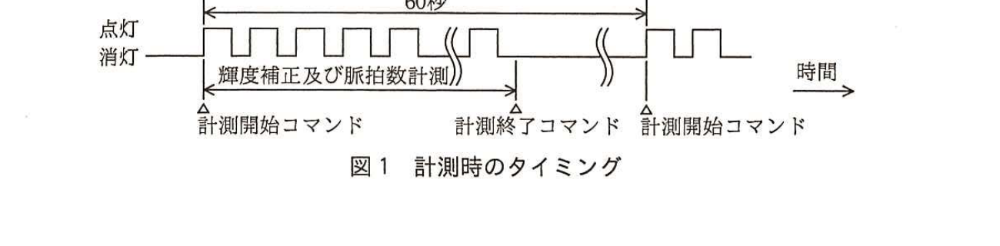
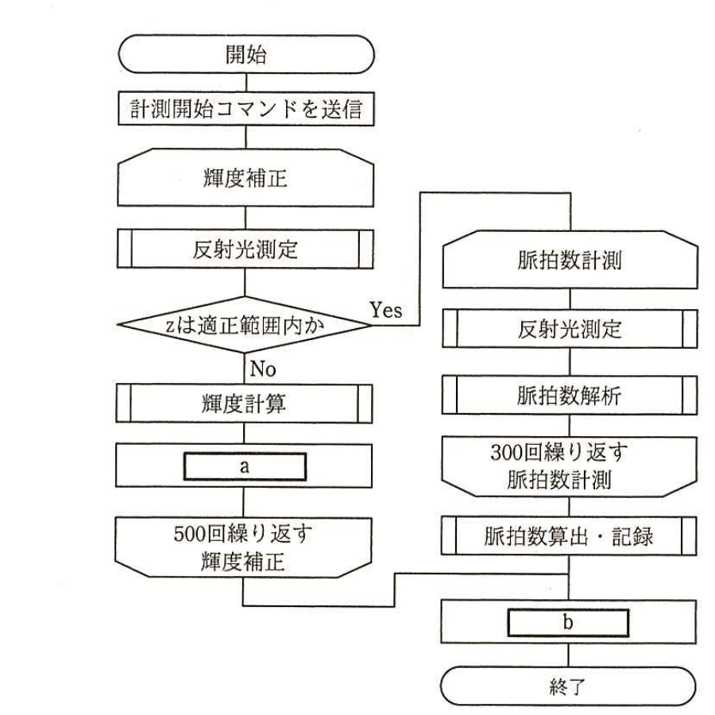

# 2016年秋期（平成28年度）応用情報技術者試験 午後 問7（選択）
## 組込みシステム開発：腕時計型脈拍計の設計（M社）

---

## 問題文

**問7** 腕時計型脈拍計の設計に関する次の記述を読んで、設問1〜3に答えよ。

M社は電子計測機器メーカであり、このたび単機能の腕時計型脈拍計（以下、脈拍計という）を開発することになった。この脈拍計は、LEDとセンサを手首に密着させて、長時間脈拍数を計測・記録するというものである。

---

### 〔脈拍数の計測〕

手首など、体表近くに動脈が存在する部位では、皮膚に照射した光の反射量が脈拍に同期して変化することが知られている。脈拍計はこれを利用して光学的に脈拍を検出する。

・光源となるLEDと、入射光の光量に比例した出力が得られる光センサ（以下、センサという）から成る計測ヘッドを手首に密着させ、一定周期でLEDを点滅させて皮膚に光を照射する。

・LED点灯時のセンサの入射光を測定する。この入射光には、皮膚からの反射光に、計測ヘッドと手首の隙間から入り込む室内光、太陽光などの外乱光が重畳している。

・LED消灯時にもセンサの入射光を測定する。LED消灯時及び点灯時の測定値を用いて外乱光の影響を除いたものを、反射光の測定値とする。

---

### 〔脈拍数計測の方法〕

1分間に1回、脈拍数を計測して記録する。

・1回の脈拍数計測は6秒間で行い、終了後はLEDを消灯する。

・6秒間の反射光の測定値の変化を解析し、1分間の脈拍数を算出して記録する。

・皮膚の状態などによって反射光の光量が変化する。そのため、脈拍数計測に先立ってLEDの輝度補正を行い、反射光の測定値があらかじめ想定した範囲（以下、適正範囲という）内であることを確認してから脈拍数計測を開始する。ここで、脈拍数計測の時間に輝度補正の時間が加わっても、1回の計測に要する時間は1分以内に収まるものとする。

---

### 〔脈拍計のシステム構成要素〕

脈拍計のシステム構成要素を表1に示す。脈拍計は、制御部及び測定部から構成される。

### 表1 脈拍計のシステム構成要素

| システム構成要素 | 機能 |
|---|---|
| 制御部 | ・測定部にコマンドを送信し、測定部を制御する。 ・測定部から測定値を受信する。 ・LEDの輝度補正を行い、測定値を解析し、脈拍数を算出して記録する。 |
| 測定部 | ・LEDとセンサを制御する。 ・制御部からのコマンドに従って、センサで反射光を測定し、測定値を制御部に送信する。 |

---

### 〔コマンド〕

制御部から測定部に送られるコマンドの一覧を表2に示す。

### 表2 コマンドの一覧

| コマンド | 内容 |
|---|---|
| 点灯時間設定 | 点滅している期間における、LEDが1回点灯する時間（ミリ秒）を設定する。 |
| 消灯時間設定 | 点滅している期間における、LEDが1回消灯する時間（ミリ秒）を設定する。 |
| 輝度設定 | LEDの輝度を設定する。値が大きいほど輝度は高い。 |
| 計測開始 | 輝度補正及び脈拍数計測を開始する。 |
| 計測終了 | 輝度補正及び脈拍数計測を終了する。 |

---

### 〔コマンド及びタイミング〕

図1に計測時のタイミングを示す。

> 図1の内容：60秒周期で「計測開始コマンド」を起点にLEDが点灯・消灯を繰り返す（輝度補正及び脈拍数計測の期間）。「計測終了コマンド」で消灯し、次の60秒後に再度「計測開始コマンド」から繰り返す。

(1) 制御部は、あらかじめ点灯時間設定、消灯時間設定及び輝度設定の各コマンドを送信する。

(2) 制御部の動作モードには、輝度補正モードと脈拍数計測モードの二つがある。

(3) 制御部は1分ごとに計測開始コマンドを送信する。計測開始コマンドの送信直後には輝度補正モードになる。

(4) 測定部は、計測開始コマンドを受信すると、点灯時間設定コマンドで設定された時間だけLEDを点灯し、消灯時間設定コマンドで設定された時間だけLEDを消灯する動作を計測終了するまで繰り返す。ここで、点滅の周波数は50Hzとし、点灯時間と消灯時間の比は6：4とする。

(5) 点灯時のLEDの輝度は、輝度設定コマンドで設定された値とする。

(6) 測定部は、LEDを点灯した後、センサの入射光を1回測定し、測定値xとして制御部に送信する。また、LEDを消灯した後、センサの入射光を1回測定し、測定値yとして制御部に送信する。

(7) 制御部は、続けて受信した測定値x、yから反射光の測定値zを算出し、そのときのモードに従って次の①、②のいずれかを行う。

① 輝度補正モードの場合は、zが適正範囲内であるかを判定し、範囲内であれば輝度補正モードを終了して脈拍数計測モードに移行する。範囲内でなければ適切な輝度を計算し、輝度設定コマンドを用いて次の点灯時までに輝度を補正する。所定の回数だけ輝度の補正を行ってもzが適正範囲内に収まらない場合は、脈拍数計測モードに移行せず、計測終了コマンドを送信して、その回の計測を終了する。

② 脈拍数計測モードの場合は、反射光の測定値zを用いて、脈拍数解析を行う。所定の回数だけ脈拍数解析を行ったら、解析データから脈拍数を算出して記録し、計測終了コマンドを送信してその回の計測を終了する。

(8) 測定部は、計測終了コマンドを受信すると、LEDの点滅及びセンサの入射光の測定を終了する。

---

### 〔計測時における制御部の処理〕

図2に計測時における制御部の処理を示す。

> 図2の内容：開始→計測開始コマンドを送信→〔輝度補正〕反射光測定→zは適正範囲内か（Yes：脈拍数計測へ、No：輝度計算→`[　a　]`→500回繰り返す輝度補正へ戻る）→〔脈拍数計測〕反射光測定→脈拍数解析→300回繰り返す脈拍数計測→脈拍数算出・記録→`[　b　]`→終了。

処理手順は次のとおりである。

(1) 制御部は、計測開始コマンドを送信する。

(2) 反射光測定では、測定部からLED点灯時の測定値x、LED消灯時の測定値yを受信し、外乱光の影響を除去した値zを算出する。

(3) zが適正範囲内であれば、輝度補正を終了して脈拍数計測に入る。zが適正範囲内になければ、適切な輝度を計算し、`[　a　]`する。

(4) 輝度補正は最大500回とし、500回繰り返してもzが適正範囲内になければ、輝度補正を終了し、`[　b　]`して終了する。

(5) 脈拍数解析を300回行った後、解析データから脈拍数を算出して記録し、`[　b　]`して終了する。

---

## 設問

### 設問1 〔コマンド及びタイミング〕について、LEDの点灯時間設定コマンド及び消灯時間設定コマンドによる設定値は、それぞれ何ミリ秒か答えよ。

### 設問2 〔計測時における制御部の処理〕の図2について、(1)〜(3)に答えよ。

(1) 図2及び本文中の`[　a　]`、`[　b　]`に入れる適切な字句を答えよ。

(2) zの算出式を解答群の中から選び、記号で答えよ。

**解答群：**
ア　x＋y　　イ　x－y　　ウ　x／y　　エ　y／x

(3) 図2の開始から終了までの最短所要時間及び最長所要時間はそれぞれ何秒か。小数点以下を四捨五入して、整数で答えよ。ここで、制御部における、繰返し判定、測定部からの測定値受信及び外乱光の影響を除去した値zの算出、適正範囲内判定、コマンドの送信、輝度計算、脈拍数解析、脈拍数算出・記録の各処理時間、測定部における各処理時間は無視できるものとする。

### 設問3 〔計測時における制御部の処理〕について、輝度補正中の測定値zを脈拍数解析に使用しない理由を、40字以内で述べよ。

---

## 解答と解説

### 設問1

**正解：点灯時間設定コマンド = 12（ミリ秒）、消灯時間設定コマンド = 8（ミリ秒）**

本文(4)に「点滅の周波数は50Hzとし、点灯時間と消灯時間の比は6：4とする」とある。周波数50Hzより、1周期＝1,000ミリ秒÷50＝20ミリ秒である。この20ミリ秒を6：4に分けると、点灯時間＝20×6/10＝**12**ミリ秒、消灯時間＝20×4/10＝**8**ミリ秒である。

**IPA公式：点灯時間設定コマンド12、消灯時間設定コマンド8**

---

### 設問2

**(1) 正解：a = 輝度設定コマンドを送信、b = 計測終了コマンドを送信**

`[　a　]`は、輝度補正でzが適正範囲内でなかった場合の処理であり、本文(7)①に「適切な輝度を計算し、輝度設定コマンドを用いて次の点灯時までに輝度を補正する」とあるので、**輝度設定コマンドを送信**である。

`[　b　]`は、輝度補正が500回に達してもzが適正範囲内にならなかった場合、及び脈拍数解析を300回行い脈拍数を算出・記録した場合の両方から到達する処理であり、本文(7)①・②に共通して「計測終了コマンドを送信して、その回の計測を終了する」とあるので、**計測終了コマンドを送信**である。

**IPA公式：a=輝度設定コマンドを送信、b=計測終了コマンドを送信**

**(2) 正解：イ（x－y）**

〔脈拍数の計測〕に「LED消灯時及び点灯時の測定値を用いて外乱光の影響を除いたものを、反射光の測定値とする」とある。LED点灯時の測定値xには反射光＋外乱光が、LED消灯時の測定値yには外乱光のみが含まれるため、反射光の測定値zは、点灯時の測定値から消灯時の測定値を差し引いた**x－y**（イ）で求められる。

**IPA公式：イ**

**(3) 正解：最短所要時間 = 6（秒）、最長所要時間 = 16（秒）**

1回の点灯・消灯（LED点滅1周期）は20ミリ秒であり、輝度補正1回、脈拍数解析（計測）1回とも、この20ミリ秒の点滅周期ごとに行われる。

最短所要時間は、輝度補正が1回でzが適正範囲内となり、脈拍数計測（300回×20ミリ秒＝6,000ミリ秒＝6秒）だけで完了する場合であり、輝度補正1回分（20ミリ秒）は四捨五入の結果に影響しないため、**6**秒となる。

最長所要時間は、輝度補正が上限の500回行われた場合（500×20ミリ秒＝10,000ミリ秒＝10秒）に、脈拍数計測6秒を加えた10＋6＝**16**秒となる。

**IPA公式：最短所要時間6、最長所要時間16**

---

### 設問3

**正解例：輝度補正終了前までのzは適正範囲を外れており、脈拍数算出には不適切だから**

輝度補正モードにおける測定値zは、まだLEDの輝度が適切に調整されておらず、適正範囲外の値も含まれる。適正範囲外の反射光測定値は、脈拍数解析に用いると誤った解析結果を招くため、輝度補正終了前（適正範囲内と判定される前）までの測定値zは、**輝度補正終了前までのzは適正範囲を外れており、脈拍数算出には不適切だから**脈拍数解析に使用しない。

**IPA公式：輝度補正終了前までのzは適正範囲を外れており，脈拍数算出には不適切だから**

---

## 参考：主要キーワード

| 用語 | 説明 |
|------|------|
| 光電式脈波（PPG）センサ | LEDで皮膚に光を照射し、血流変化による反射光量の変化から脈拍を検出する光学式センサ方式。ウェアラブル脈拍計で広く使われる |
| 外乱光除去（LED点灯時／消灯時の差分） | LED点灯時の測定値から消灯時（外乱光のみ）の測定値を差し引くことで、外乱光の影響を除いた純粋な反射光成分を求める手法 |
| 輝度補正（フィードバック制御） | 反射光の測定値が適正範囲に収まるように、LEDの輝度を繰り返し調整するフィードバック制御の仕組み |
| 点滅周波数と点灯・消灯時間の比 | 周波数から1周期の時間を求め、点灯：消灯の比率に応じて各時間配分を計算する基本的な時間計算 |
| 最短・最長所要時間の見積り | 繰返し処理（輝度補正・脈拍数計測）の最小回数・最大回数のケースを想定して、処理全体の所要時間の範囲を算出する設計手法 |

