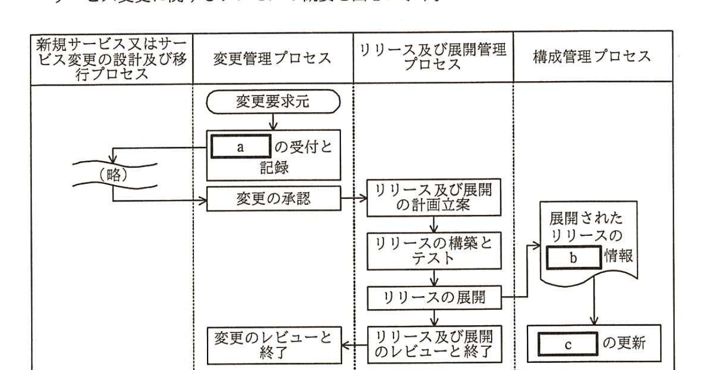

# 2016年秋期（平成28年度）応用情報技術者試験 午後 問10（選択）
## サービスマネジメント：販売管理サービスの変更（K社）

---

## 問題文

**問10** 販売管理サービスの変更に関する次の記述を読んで、設問1〜3に答えよ。

K社は、中堅の食品卸売業者であり、飲食店に食品の材料を販売している。K社のシステム部は、K社販売部向けに販売管理サービスを提供している。販売部員は販売部のPCから販売管理システムに、販売データをオンラインで入力している。販売部のPCでは、販売管理システムに接続するためのソフトウェア（以下、接続ソフトウェアという）が稼働している。販売管理システムで使用するアプリケーションは、自社で開発したものである。

システム部と販売部で合意している販売管理サービスのSLA（以下、社内SLAという）の一部を表1に示す。

### 表1 社内SLA（抜粋）

| 種別 | サービスレベル項目 | 目標値 |
|---|---|---|
| 可用性 | サービス提供時間 | 毎日6時から24時まで（保守のための計画停止時間を除く） |
| 可用性 | サービス稼働率 | 99.9% |
| 性能 | オンライン応答時間 | 5秒以内（ピーク時間帯）、3秒以内（それ以外） |
| 信頼性 | インシデントの解決時間 | 4時間 |

現在稼働している販売管理システムのサーバは社内に設置しているが、運用費用が増大し、管理業務も煩雑になっていた。そこで、システム部では、クラウド事業者のL社が提供するPaaSに移行することを決めた。当該PaaSはL社の運用センタで稼働するサービスであり、L社とK社とは専用線で接続する。システム部のM君は、販売管理サービスの変更及びL社との調整を担当している。

---

### 〔K社とL社の間のSLA〕

今回、L社が提供するサービスの範囲と品質を明確にするために、K社とL社との間でSLAを含んだ契約を締結することにした。そこで、M君は、K社の要求事項として表1と同一の内容をSLA案としてL社に提示し、打診した。すると、L社から、"①オンライン応答時間については、サービスレベル項目とすることはできない。その他のサービスレベル項目は、目標値を含めてSLAの内容とすることは可能である。"との回答があった。M君は、L社の回答を妥当と判断し、オンライン応答時間を除いてSLA案とし、社内のレビューを行った。

社内レビューで、"SLA案には問題点がある。②PaaSで障害が発生したとき、社内SLAを遵守できない場合が残る。"と指摘された。その後、M君は、問題点の対応を行い、SLA案の内容を修正した。K社は、L社と修正内容について調整を行い、契約の締結に至った。

---

### 〔サービス変更のプロセス〕

PaaSへの移行を支障なく行うために、M君は、社内の関連する規程を確認した。サービス変更に関するプロセスの概要を図1に示す。

> 図1の内容：4つのプロセス列（新規サービス又はサービス変更の設計及び移行プロセス／変更管理プロセス／リリース及び展開管理プロセス／構成管理プロセス）。「新規サービス又は～」列は（略）と変更管理プロセスの「`[　a　]`の受付と記録」「変更の承認」を経由してリリース及び展開管理プロセスへ流れる。変更管理プロセス：変更要求元→`[　a　]`の受付と記録→変更の承認→（リリース及び展開管理プロセスへ）。リリース及び展開管理プロセス：リリース及び展開の計画立案→リリースの構築とテスト→リリースの展開→（構成管理プロセスへ、また変更管理プロセスの「変更のレビューと終了」へ）→リリース及び展開のレビューと終了→変更のレビューと終了。構成管理プロセス：展開されたリリースの`[　b　]`情報→`[　c　]`の更新。

変更管理プロセスは、変更要求元から`[　a　]`を受け付ける。今回のように、サービス又は顧客に重大な影響を及ぼす可能性がある変更の場合は、新規サービス又はサービス変更の設計及び移行プロセスを実施する。`[　a　]`は、変更管理プロセスで評価され、承認される。変更が承認されたら、リリース及び展開管理プロセスで、リリース及び展開の計画（以下、システム切替計画という）を立案し、リリースを展開する。展開が成功すると、構成管理プロセスでは、展開されたリリースの`[　b　]`情報を受け取り、`[　c　]`の更新を行う。

---

### 〔システム切替計画〕

販売管理サービスの変更に伴うシステム切替計画を立案するに当たって、M君は、上司のN部長から、次のように指示された。

(1) K社規程の次のサービス変更方針に従うこと。

・事前にサービスの利用部門と調整を行い、必要であれば計画停止時間を設けて切替えを行う。

・サービスの利用部門が利用する前に、サービスの稼働を確認する。

・展開作業中にインシデントが発生するなどの不測の事態に備えて、必要な作業項目を設けて計画を立案する。

(2) システム部が今までに実施したシステム切替作業では、次のような苦労を経験したので、今回は同じような苦労をしなくて済むようにすること。

・インシデントが発生したときの事業に与える影響範囲を局所化できるので、段階的移行方式を採る場合が多かった。しかし、新旧のシステム間や他システムとのデータの整合性を確保するのに苦労した。

・切替計画書に基づいて、関係者による机上での確認を事前に行っていた。しかし、システム切替作業を実施すると、計画書の内容不備が発見されたり、計画書には書かれていない想定外の事態が発生したりして、それらの対応に苦労した。

これを受け、M君は、次のシステム切替計画案を作成した。

(1) 過去に苦労した経験を踏まえて、次のように切替えを行う。

① 今回のシステム切替えは、`[　d　]`しやすい一斉移行方式を採る。

② 切替計画に不備がないことを確認するために、システム切替作業の実施日よりも前に、移行ツールなどのテストとは別に、`[　e　]`を実施する。

(2) M君は、切替えのための計画停止時間について販売部と調整したところ、業務上の都合から、通常のサービス提供時間内の停止は避けてほしいと言われた。そこで、システム切替えは、サービス提供時間外の深夜0時から6時までの時間帯を利用して実施する。

(3) 切替日の前までに実施する準備作業は次のとおりである。

① 切替日の前までに、既存のサーバを停止しなくても実施可能なシステムの導入作業を完了させる。L社側で必要なシステムの導入や設定作業も、切替日の前までに完了させる。

② 切替日以降は販売部のPCからL社に接続できるように、販売部のPCの接続ソフトウェアを更新する。更新は、切替日の前日に販売部員がそれぞれのPCを使い終わった後で、システム部員が順次行い、24時までに完了する。

(4) 切替日に必要な作業は、データの移行作業及び稼働確認作業である。データの移行作業は5時間、稼働確認作業は1時間が必要である。切替日は6時にサービスが開始できるように、切替日の作業は、前日のサービス処理終了後の深夜0時から開始する。

N部長は、システム切替計画案をレビューした。N部長は、M君に"③システム切替計画で考慮しておくべき作業が漏れている。サービス変更方針に沿って計画を修正すること。"と指摘した。

---

## 設問

### 設問1 〔K社とL社の間のSLA〕について、(1)、(2)に答えよ。

(1) 本文中の下線①の理由を、35字以内で具体的に述べよ。

(2) 本文中の下線②の"社内SLAを遵守できない場合"とはどのような場合か、40字以内で具体的に述べよ。

### 設問2 図1及び本文中の`[　a　]`〜`[　c　]`に入れる適切な字句を解答群の中から選び、記号で答えよ。

**解答群：**
ア　CAB　　イ　CI　　ウ　CMDB
エ　OODB　　オ　PIR　　カ　RDBMS
キ　RFC　　ク　RFI　　ケ　RFP

### 設問3 〔システム切替計画〕について、(1)〜(3)に答えよ。

(1) 本文中の`[　d　]`に入れる適切な字句を15字以内で答えよ。

(2) 本文中の`[　e　]`に入れる適切な字句を10字以内で答えよ。

(3) 本文中の下線③について、考慮すべき作業を35字以内で答えよ。

---

## 解答と解説

### 設問1

**(1) 正解例：アプリケーションはL社が提供するPaaSの範囲外であるから**

PaaS（Platform as a Service）は、OSやミドルウェアなどのプラットフォームを提供するサービスであり、その上で稼働するアプリケーションは利用者（K社）側の責任範囲である。「オンライン応答時間」は、K社が自社開発したアプリケーションの処理性能に依存する項目であり、**アプリケーションはL社が提供するPaaSの範囲外であるから**、L社はサービスレベル項目として保証できない。

**IPA公式：アプリケーションはL社が提供するPaaSの範囲外であるから**

**(2) 正解例：障害復旧後にK社が行うアプリケーションの稼働確認の時間が確保できない場合**

社内SLAの「インシデントの解決時間4時間」は、K社内での対応（アプリケーションの稼働確認を含む）まで完了する時間を指す。しかし、L社とのSLAでは、PaaS基盤部分の障害復旧時間のみが保証対象であり、そこからK社がアプリケーションの稼働確認を行う時間を含めると、社内SLAで定めた4時間以内に収まらない可能性がある。すなわち、**障害復旧後にK社が行うアプリケーションの稼働確認の時間が確保できない場合**に、社内SLAを遵守できない。

**IPA公式：障害復旧後にK社が行うアプリケーションの稼働確認の時間が確保できない場合**

---

### 設問2

**正解：a = キ（RFC）、b = イ（CI）、c = ウ（CMDB）**

`[　a　]`は、変更管理プロセスが変更要求元から受け付けるものであり、変更要求を表す**RFC**（Request for Change、キ）である。

`[　b　]`は、リリースが展開された結果、構成管理プロセスが受け取る情報であり、構成品目を表す**CI**（Configuration Item、イ）である。

`[　c　]`は、CI情報を基に更新される構成管理プロセス側のデータベースであり、構成管理データベースを表す**CMDB**（Configuration Management Database、ウ）である。

**IPA公式：a=キ、b=イ、c=ウ**

---

### 設問3

**(1) 正解例：データの整合性を確保**

〔システム切替計画〕(2)に「段階的移行方式を採る場合が多かった。しかし、新旧のシステム間や他システムとのデータの整合性を確保するのに苦労した」とある。段階的移行方式ではなく一斉移行方式を採ることで、この苦労を避けられる。すなわち、一斉移行方式は**データの整合性を確保**しやすい方式である。

**IPA公式：データの整合性を確保**

**(2) 正解例：試行、移行リハーサル**

〔システム切替計画〕(2)に「切替計画書に基づいて、関係者による机上での確認を事前に行っていた。しかし、システム切替作業を実施すると、計画書の内容不備が発見されたり…対応に苦労した」とある。机上確認だけでなく、実際に本番同様の手順を試すことで不備を事前に発見できるようにするため、移行ツールなどのテストとは別に、**試行**（**移行リハーサル**）を実施する必要がある。

**IPA公式：・試行　・移行リハーサル**

**(3) 正解例：展開作業中に発生するインシデントに備えた切り戻し作業**

サービス変更方針には「展開作業中にインシデントが発生するなどの不測の事態に備えて、必要な作業項目を設けて計画を立案する」とあるが、M君の切替計画案にはこれに対応する作業が含まれていない。したがって、考慮すべき作業は**展開作業中に発生するインシデントに備えた切り戻し作業**である。

**IPA公式：展開作業中に発生するインシデントに備えた切り戻し作業**

---

## 参考：主要キーワード

| 用語 | 説明 |
|------|------|
| PaaS（Platform as a Service） | OSやミドルウェアなどのプラットフォーム機能を提供するクラウドサービス形態。その上で稼働するアプリケーションは利用者側の責任範囲となる |
| RFC（Request for Change） | ITILにおける変更管理プロセスで、変更要求元から提出される正式な変更要求のこと |
| CI（Configuration Item）とCMDB | CIは構成管理の対象となる個々の構成品目、CMDBはCIの情報を一元管理するデータベース。リリース展開後にCMDBを更新する |
| 一斉移行方式と段階的移行方式 | システム切替方式の代表例。段階的移行はリスクの影響範囲を局所化できる一方、新旧混在期間のデータ整合性維持が課題になる。一斉移行はその課題を回避しやすい |
| 移行リハーサル（試行） | 本番のシステム切替え前に、実際の手順に沿って模擬的に切替え作業を行い、計画書の不備や想定外の事態を事前に洗い出す取組み |

