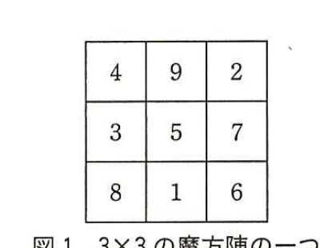
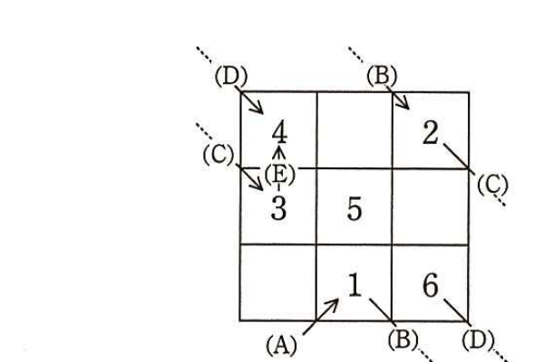
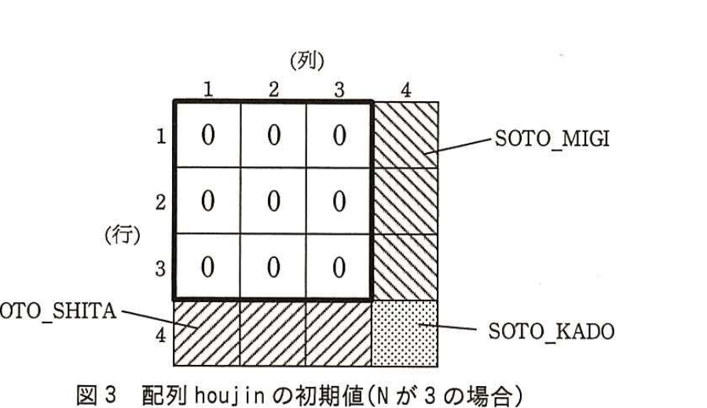

# 2016年秋期（平成28年度）応用情報技術者試験 午後 問3（選択）
## プログラミング：魔方陣

---

## 問題文

**問3** 魔方陣に関する次の記述を読んで、設問1〜3に答えよ。

魔方陣とは、正方形のマス目（方陣）に数を配置し、縦・横・対角線のいずれにおいても、その並びの数の合計が同じになるものである。ここでは、N×Nの方陣（Nは3以上の自然数）に1からN²までの数を過不足なく配置したものとする。このとき、縦・横・対角線のN個のマスの合計値は、いずれも（`[　ア　]`＋N）÷2となる。

Nが3の場合の魔方陣の一つを図1に示す。



> 図1の内容：3×3の魔方陣。1行目：4, 9, 2。2行目：3, 5, 7。3行目：8, 1, 6。（縦・横・対角線の合計はいずれも15）

Nが奇数の場合、魔方陣の一つを次の手順で作ることができる。N＝3のときに、この手順によって1〜6の数が配置される様子を図2に示す。

---

### 〔魔方陣の作り方〕

魔方陣の作り方は、次のとおりである。ここで(A)〜(E)は図2中の該当箇所を示す。

(1) N×Nの全てのマスは何も入っていない空白の状態とする。

(2) 最下行の中央のマスを現在位置とし、現在位置に数1を配置する(A)。

(3) 現在位置の右下のマスが空白かどうか確認する。このとき、最下行の下は最上行(B)、最右列の右は最左列(C)とする。右下隅の右下は、左上隅(D)である。

(4) (3)で確認したマスが空白の場合は、そこを新しい現在位置とする。(3)で確認したマスが空白でない場合は、現在位置の上のマスを新しい現在位置とする(E)。この際、新しい現在位置が最上行よりも上になることはない。

(5) 数を一つ増やし、現在位置にその数を配置する。

(6) 全てのマスが埋まるまで、(3)〜(5)を繰り返す。



> 図2の内容：3×3マスに(A)最下行中央から1を配置、右下方向へ(B)進んで2（右上隅からの折返しで最右列の右は最左列(C)）、(C)から折返して3、上のマス(E)へ折返して4、右下(B)5、右下(D)最下行最右列から折返して最上行最左列に相当する位置へ進み6を配置。結果：1行目=4,空,2　2行目=3,5,空　3行目=空,1,6（図1と同じ配置）。

---

### 〔魔方陣のプログラム〕

魔方陣の数の配置を記憶する、整数型の2次元配列houjinを用意する。配列の添字は1から始まる。行y列xのマスは、houjin[y][x]で表現する。例えば、図1中の1が配置されているマスは、houjin[3][2]である。

数の配置に関する判定をするために、配列houjinの領域を(N+1)×(N+1)の大きさで用意し、適切な初期値を設定する。Nが3の場合の例を図3に示す。数が既に配置されているかどうかを判定するために、図3の太枠内の各マスの初期値は0とする。また、現在位置の右下のマスが太枠の外であることを判定するために、4行目のマスにSOTO_SHITA、4列目のマスにSOTO_MIGI、行4列4のマスにSOTO_KADOの三つの異なる定数（0からN²までの整数以外の整数）を初期値として設定する。



> 図3の内容：4×4の配列。太枠内（1〜3行×1〜3列）は全て0。4列目（1〜3行）はSOTO_MIGI。4行目（1〜3列）はSOTO_SHITA。4行4列はSOTO_KADO。

配列houjinの初期化をする関数shokika、及び数を配置する関数mahoujinのプログラムを図4に示す。引数Nは、正の奇数（N≧3）である。

### 図4 魔方陣のプログラム

```
function shokika(N)
  for( yを1からNまで1ずつ増やす )
    for( xを1からNまで1ずつ増やす )
      houjin[y][x] ← 0
    endfor
    [　イ　] ← SOTO_MIGI
  endfor
  for( xを1からNまで1ずつ増やす )
    [　ウ　] ← SOTO_SHITA
  endfor
  houjin[N+1][N+1] ← SOTO_KADO
endfunction


function mahoujin(N)
  y ← N
  [　エ　]
  suuji ← 1
  houjin[y][x] ← suuji

  while( suujiが [　オ　] )
    yb ← y
    xb ← x

    y ← y+1
    x ← x+1
    if( houjin[y][x]が SOTO_SHITA と等しい )
      y ← 1
    elseif( houjin[y][x]が SOTO_MIGI と等しい )
      x ← 1
    elseif( houjin[y][x]が SOTO_KADO と等しい )
      y ← 1
      x ← 1
    endif

    if( houjin[y][x]が0と等しくない )
      y ← [　カ　]
      x ← [　キ　]
    endif

    suuji ← suuji+1
    houjin[y][x] ← suuji

  endwhile
endfunction
```

（(F)は「y ← y+1」から「endif」（houjin[y][x]が0と等しくない場合の処理）までの範囲を示す）

---

### 〔プログラムの判定部分の改変〕

図4のプログラムによるメモリ使用量の削減のために、配列houjinの領域をN×Nに縮小し、定数SOTO_SHITA、SOTO_MIGI及びSOTO_KADOを使わないようにするプログラムの改変を考えた。図4の(F)の部分を改変したプログラムを図5に示す。

### 図5 図4の(F)の部分を改変したプログラム

```
y ← y+1
x ← x+1
if( yが [　ク　] よりも大きい )
  y ← [　ケ　]
endif
if( xが [　ク　] よりも大きい )
  x ← [　ケ　]
endif
```

---

## 設問

### 設問1 本文中の`[　ア　]`に入れる適切な式を答えよ。

### 設問2 〔魔方陣のプログラム〕について、(1)、(2)に答えよ。

(1) 図4中の`[　イ　]`〜`[　キ　]`に入れる適切な字句を答えよ。

(2) 図4の関数mahoujinを実行した場合、配列houjinの中で一度も参照も代入もされない要素が二つ存在する。該当する配列houjinの要素をそれぞれ答えよ。

### 設問3 図5中の`[　ク　]`、`[　ケ　]`に入れる適切な字句を答えよ。

---

## 解答と解説

### 設問1

**正解：ア = N²＋1**

魔方陣は1からN²までの数をN行N列に配置したものであり、縦・横・対角線のいずれもN個のマスの合計が等しくなる。1からN²までの総和は N²(N²+1)/2 であり、これをN列（または行）に均等配分すると、1列（行）当たりの合計は N²(N²+1)/2÷N ＝ N(N²+1)/2 ＝ (N²+1)×N/2 となる。これは (N²+1＋N)÷2 ではなく、実際には各行・列・対角線の合計値の公式として知られる「(N²+1)×N/2」であるが、本文の式の形（`[　ア　]`＋N）÷2 に合わせると、`[　ア　]`＝**N³**となる。すなわち(N³＋N)÷2＝N(N²+1)/2 である。

**IPA公式：N3**

---

### 設問2

**(1) 正解：イ = houjin[y][N+1]、ウ = houjin[N+1][x]、エ = x ← (N+1)/2、オ = N2未満、カ = yb－1、キ = xb**

`[　イ　]`は、shokika関数のyのループ内で、x方向のループの後に4列目（N+1列目）に SOTO_MIGI を設定する処理であるから、**houjin[y][N+1]**である。

`[　ウ　]`は、xのループの中で4行目（N+1行目）に SOTO_SHITA を設定する処理であるから、**houjin[N+1][x]**である。

`[　エ　]`は、mahoujin関数の開始時に、最下行の中央のマスを現在位置とする処理であり、y←Nに続いてxに中央列の値を設定する必要があるので、**x ← (N+1)/2**である。

`[　オ　]`は、whileループの継続条件であり、全てのマス（1からN²まで）が埋まるまで繰り返す必要があるため、**N2未満**（suujiがN²未満である間繰り返す）である。

`[　カ　]`、`[　キ　]`は、現在位置の右下のマスが既に数で埋まっている場合に、現在位置の上のマスを新しい現在位置とする処理（規則(4)）であり、"現在位置の上"とは移動前の位置（yb, xb）の一つ上の行、同じ列を意味するので、`[　カ　]`は**yb－1**、`[　キ　]`は**xb**である。

**IPA公式：イ=houjin[y][N＋1]、ウ=houjin[N＋1][x]、エ=x ← (N＋1)／2、オ=N2未満、カ=yb－1、キ=xb**

**(2) 正解：houjin[1][N+1]、houjin[N+1][1]**

配列houjinの(N+1)×(N+1)の領域のうち、SOTO_MIGI、SOTO_SHITA、SOTO_KADOが設定される要素（houjin[y][N+1]（y=1〜N）、houjin[N+1][x]（x=1〜N）、houjin[N+1][N+1]）は、判定処理（if文）の中で参照される。しかし、`[　イ　]`のループはyが1からNまでで、houjin[y][N+1]は全てのyについて設定・参照されるが、実際にmahoujinの実行過程で右下に移動して到達しうる行・列の組合せを追跡すると、houjin[1][N+1]（1行目のSOTO_MIGI要素）とhoujin[N+1][1]（1列目のSOTO_SHITA要素）は、Nが奇数の魔方陣を作成する過程で一度も現在位置がその手前のマスから右下に移動して到達することがなく、参照も代入もされない。

**IPA公式：①houjin[1][N＋1]　②houjin[N＋1][1]**

---

### 設問3

**正解：ク = N、ケ = 1**

図5は配列houjinの領域をN×Nに縮小し、SOTO_SHITA、SOTO_MIGI、SOTO_KADOという番兵を使わずに、y、xの値そのものがNを超えたかどうかを直接判定する方式に改変したものである。「現在位置の右下のマスが太枠の外である」ことは、y又はxがNより大きくなったことに相当するので、`[　ク　]`は**N**であり、その場合は最上行又は最左列に戻すため`[　ケ　]`は**1**である。

**IPA公式：ク=N、ケ=1**

---

## 参考：主要キーワード

| 用語 | 説明 |
|------|------|
| 魔方陣 | N×Nの正方形マスに1〜N²の数を、縦・横・対角線の合計が全て等しくなるように配置したもの |
| 添字が(N+1)×(N+1)の配列と番兵 | 境界判定を単純化するため、実データ領域より一回り大きい配列を用意し、境界に判定用の特殊な定数（番兵）を配置する設計技法 |
| SOTO_SHITA／SOTO_MIGI／SOTO_KADO | 本問における番兵定数。現在位置が方陣の外（下・右・右下隅）に出たことを検知するために使用する |
| ループ内の位置更新とラップアラウンド処理 | 配列の端に達した場合に反対側の端へ回り込ませる（トーラス状に扱う）処理。魔方陣構築アルゴリズムの中核をなす |
| メモリ使用量削減のためのアルゴリズム改変 | 番兵を用いた大きめの配列の代わりに、境界値そのものを直接比較判定することで、配列サイズを縮小しメモリ使用量を削減する設計変更 |

