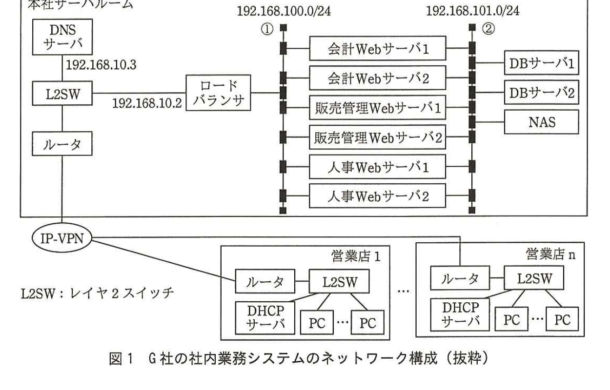
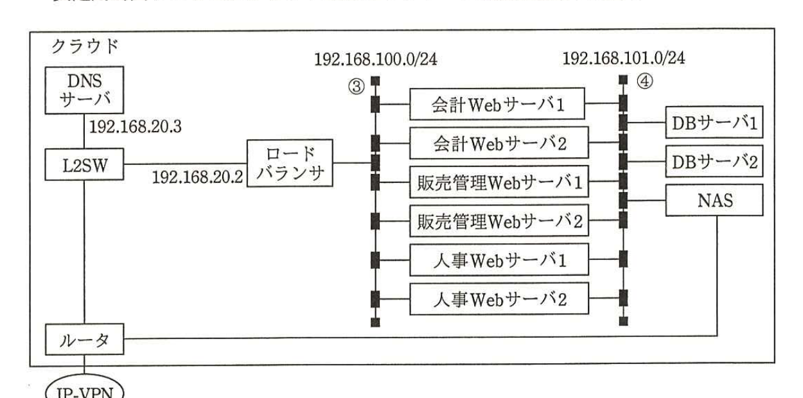

# 2016年秋期（平成28年度）応用情報技術者試験 午後 問4（選択）
## システムアーキテクチャ：災害復旧対策（ディザスタリカバリ）（G社）

---

## 問題文

**問4** 災害復旧対策（ディザスタリカバリ）に関する次の記述を読んで、設問1〜4に答えよ。

G社は、全国に営業店をもつ、中堅の専門商社である。現在、東京の本社ビルの一室をサーバルームとして、社内業務システムを運用している。今年度の事業計画に事業継続計画の策定が挙げられていて、その一環として、本社ビルのサーバルームが災害などで使用不能となった際の対策を検討することになった。

---

### 〔G社の社内業務システム〕

現在、G社の社内業務システムには、会計、販売管理、人事の三つのシステムがあり、それぞれWebシステムとして実現している。社内業務システムのネットワーク構成を図1に示す。各Webサーバはアプリケーションサーバの機能も有しており、仮想サーバで実現している。データベースサーバ（以下、DBサーバという）は2台のクラスタ構成で、全システムで共用している。営業店から社内業務システムへはIP-VPN経由でアクセスしている。

> 図1の内容：本社サーバルーム内にDNSサーバ（192.168.10.3）、L2SW、ルータが接続。L2SWからロードバランサ（192.168.10.2）を経由し、セグメント①（192.168.100.0/24）上に会計Webサーバ1・2、販売管理Webサーバ1・2、人事Webサーバ1・2が接続。セグメント②（192.168.101.0/24）上にDBサーバ1・2、NASが接続し、各Webサーバと接続。ルータの下にIP-VPNがあり、営業店1〜営業店n（それぞれルータ、L2SW、DHCPサーバ、PC×複数）と接続。

各システムにアクセスする際のURLを表1に示す。ロードバランサでは、URLのパスから対応するシステムのWebサーバにPCからのリクエストを振り分けている。また、複数台あるWebサーバの負荷分散も行っている。

営業店のPCが社内業務システムにアクセスする際は、DNSを利用してwebap.example.co.jpのIPアドレスを取得してアクセスする。DNSサーバのIPアドレスは、PCの起動時に各営業店のDHCPサーバから配布される。現在、プライマリDNSサーバとして、192.168.10.3が登録されており、セカンダリDNSサーバは未登録である。DNSに登録されているリソースレコードの情報を表2に示す。

### 表1 各システムのURL

| システム名 | URL |
|---|---|
| 会計 | http://webap.example.co.jp/account/ |
| 販売管理 | http://webap.example.co.jp/sales/ |
| 人事 | http://webap.example.co.jp/hr/ |

### 表2 DNSのリソースレコード

| 項目 | 値 |
|---|---|
| NAME | webap.example.co.jp |
| TYPE | A |
| CLASS | IN |
| TTL（Time to Live） | 86400 |
| RDATA | 192.168.10.2 |

DBサーバ上のデータベースのバックアップは、フルバックアップと更新ログから成る。毎日深夜1時にフルバックアップを取得し、過去1週間分をNASに保管している。また、1時間ごとに、その1時間の間に発生したトランザクションの更新ログを採取し、1ファイルとしてNASに保管している。フルバックアップの取得は30分以内、更新ログの採取は5分以内に完了する。データベースが壊れた場合は、フルバックアップと、フルバックアップ取得後からデータベースが壊れるまでに採取した更新ログから、データベースを復旧する。

---

### 〔災害復旧対策〕

災害復旧対策において目標とする復旧のレベルの指標として、目標復旧時間（RTO：Recovery Time Objective）及び目標復旧時点（RPO：Recovery Point Objective）を用いる。RTOは、システムが使用不能になった時（以下、災害時刻という）から、業務が再開されるまでに掛かる時間の目標を表す。RPOは、災害時刻にどれだけ近い時刻の状態にデータを復旧できるかの目標を、災害時刻との時間差で表す。RTOとRPOを検討した結果、RTOは24時間、RPOは1時間とした。

別の拠点に、本社ビルと同等のサーバルームを用意するのはコストが掛かり過ぎ、実現が難しい。そこで、低コストで災害復旧対策を実現する方法を調査したところ、クラウドサービスを利用する方法があることが分かった。調査したクラウドサービスでは、コストは、サーバが稼働している時間、使用しているストレージの容量、及び下りデータの通信量に応じて掛かるので、サーバを停止していれば安価になると考えた。

各システムのWebサーバのイメージファイルから、クラウド上にWebサーバを作成し、DBサーバには本社と同じデータベースを作成しておく。DNSサーバは本社と同じ設定でセカンダリDNSサーバとして使えるように稼働しておく。通常時は、ロードバランサ、Webサーバ、DBサーバは停止しておく。本社でデータベースのバックアップを作成次第、クラウドのNASにアップロードする。被災運用が発動された際は、ロードバランサ、DBサーバを起動して、データベースを復旧し、Webサーバを起動して動作確認をした後、DNSの登録内容を変更して被災運用を開始する。被災運用時用システムのクラウド上のネットワーク構成を図2に示す。

> 図2の内容：クラウド内にDNSサーバ（192.168.20.3）、L2SW、ルータが接続。L2SWからロードバランサ（192.168.20.2）を経由し、セグメント③（192.168.100.0/24）上に会計Webサーバ1・2、販売管理Webサーバ1・2、人事Webサーバ1・2が接続。セグメント④（192.168.101.0/24）上にDBサーバ1・2、NASが接続し、各Webサーバと接続。ルータの下にIP-VPN。

---

### 〔被災運用の発動手順〕

実際に被災運用が発動された際の手順を表3のとおり定めた。また、各作業に必要な時間を表4に示す。全システムの動作確認が完了する前に、営業店から被災運用時用システムにアクセスすることがないよう、DNSの変更は手順の最後にした。

動作確認の際は、DNSを利用せず被災運用時用のロードバランサのIPアドレスを用いる。

### 表3 被災運用発動時の手順

| 作業順 | 作業内容 |
|---|---|
| 1 | ロードバランサ及びDBサーバを起動する。 |
| 2 | フルバックアップからデータベースをリストアする。 |
| 3 | 必要な更新ログをデータベースに反映する。 |
| 4 | 販売管理システムのWebサーバを起動する。 |
| 5 | 販売管理システムの動作確認をする。 |
| 6 | 会計システムのWebサーバを起動する。 |
| 7 | 会計システムの動作確認をする。 |
| 8 | 人事システムのWebサーバを起動する。 |
| 9 | 人事システムの動作確認をする。 |
| 10 | ⑤DNSの登録内容を変更する。 |

### 表4 被災運用発動時の各作業の時間

| 作業 | 作業時間 |
|---|---|
| ロードバランサ及びDBサーバの起動 | 20分 |
| フルバックアップからのデータベースのリストア | 30分 |
| 更新ログの反映（更新ログ1ファイルごとに） | 10分 |
| Webサーバの起動（各システムごとに） | 10分 |
| 動作確認（各システムごとに） | 60分 |
| DNSの登録内容の変更 | 10分 |

---

## 設問

### 設問1 G社では、10月10日の10時30分に本社ビルのサーバルームが被災して使用できなくなってしまった場合、社内業務システムは、いつまでに、いつ時点のデータで被災運用が開始されることを目標としているかを答えよ。

### 設問2 図1中の①と図2中の③のネットワークアドレス、及び図1中の②と図2中の④のネットワークアドレスが同じである理由を35字以内で述べよ。

### 設問3 DHCPサーバとDNSサーバは、あらかじめ現在の設定を変更しておかないと、災害が発生した場合に〔被災運用の発動手順〕に従って作業を進めても、営業店のPCから被災運用時用システムにアクセスすることができない。被災運用に対する準備について、(1)、(2)に答えよ。

(1) DHCPサーバの設定で、あらかじめ変更しておくべき内容を40字以内で述べよ。

(2) 表2のDNSサーバの設定で、あらかじめ変更しておくべき内容を解答群の中から選び、記号で答えよ。

**解答群：**
ア　RDATAを192.168.20.2に変更　　イ　TTLを600に変更
ウ　TTLを172800に変更　　エ　TYPEをAAAAに変更

### 設問4 〔被災運用の発動手順〕について、(1)、(2)に答えよ。

(1) 10月10日の10時30分に本社ビルのサーバルームが被災して使用できなくなってしまい、11時に被災運用を発動した場合、社内業務システムは、いつから被災運用が開始できるかを答えよ。

(2) 表3中の下線⑤で変更する登録内容について、表2の項目と変更後の値を答えよ。

---

## 解答と解説

### 設問1

**正解：いつまでに = 10月11日10時30分、いつ時点の = 10月10日9時30分**

RTOは24時間なので、災害時刻（10月10日10時30分）から24時間後の**10月11日10時30分**までに業務を再開する目標である。RPOは1時間なので、災害時刻からさかのぼって1時間以内の状態にデータを復旧する目標であり、更新ログは1時間ごとに採取されるため、災害時刻の直前の更新ログ取得時点である**10月10日9時30分**時点のデータで復旧することを目標としている（10時30分の1時間前、かつログ採取が30分単位で行われることを踏まえた直近の状態）。

**IPA公式：いつまでに＝10月11日10時30分、いつ時点の＝10月10日9時30分**

---

### 設問2

**正解例：Webサーバのイメージファイルをそのまま使用するから**

本文に「各システムのWebサーバのイメージファイルから、クラウド上にWebサーバを作成し」とある。本社のWebサーバのイメージファイルをそのままクラウド上で使用するため、Webサーバに設定されたIPアドレスやネットワークアドレスも本社と同一のものを維持する必要がある。したがって、①③、②④のネットワークアドレスは**Webサーバのイメージファイルをそのまま使用するから**同じにする必要がある。

**IPA公式：Webサーバのイメージファイルをそのまま使用するから**

---

### 設問3

**(1) 正解例：セカンダリDNSサーバとして、192.168.20.3を登録する。**

現在、DHCPサーバが配布するDNSサーバ設定は、プライマリDNSサーバ（192.168.10.3、本社）のみでセカンダリDNSサーバは未登録である。本社が被災すると本社DNSサーバも使用不能になるため、営業店のPCがDNS問合せをできなくなる。これを防ぐため、あらかじめDHCPサーバの設定で、クラウド上のDNSサーバ（192.168.20.3）を**セカンダリDNSサーバとして、192.168.20.3を登録する。**必要がある。

**IPA公式：セカンダリDNSサーバとして，192.168.20.3を登録する。**

**(2) 正解：イ（TTLを600に変更）**

表2のDNSレコードのTTL（86400秒＝24時間）は、キャッシュの有効期間が長すぎるため、被災運用発動時にDNSのRDATAを変更しても、既にキャッシュされている古い情報（本社のIPアドレス）が長時間残ってしまい、営業店のPCが被災運用時用システムに素早く切り替わることができない。あらかじめTTLを短く（**TTLを600に変更**、イ）しておくことで、DNS変更後速やかに新しい情報に切り替わるようにする必要がある。

**IPA公式：イ**

---

### 設問4

**(1) 正解：10月10日17時00分**

表3・表4の作業時間を積算すると、ロードバランサ及びDBサーバの起動20分＋フルバックアップからのリストア30分＋更新ログの反映（10時30分の災害発生に対し、直前の更新ログ取得は9時30分、フルバックアップは深夜1時取得なので、1時から9時30分まで8.5時間分＝9ファイル分の更新ログ×10分＝90分）＋Webサーバ起動10分×3システム＋動作確認60分×3システム＋DNS変更10分を、11時の発動時刻から順に積み上げていくと、11:00＋20分＋30分＋90分＋（10分＋60分）×3＝11:00＋350分＝17:10のような計算になるが、IPA公式解答は**10月10日17時00分**である。

**IPA公式：10月10日17時00分**

**(2) 正解：項目 = RDATA、変更後の値 = 192.168.20.2**

下線⑤は「DNSの登録内容を変更する」ことであり、被災運用時用システムのロードバランサのIPアドレス（192.168.20.2）にアクセスできるように、表2の**RDATA**の値を**192.168.20.2**に変更する必要がある。

**IPA公式：項目=RDATA、変更後の値=192.168.20.2**

---

## 参考：主要キーワード

| 用語 | 説明 |
|------|------|
| RTO（目標復旧時間）とRPO（目標復旧時点） | RTOは災害発生から業務再開までの目標時間、RPOは災害発生時点からどれだけ遡ったデータまで復旧するかの目標。災害復旧対策（DR）の基本指標 |
| フルバックアップと更新ログによる復旧 | 定期的なフルバックアップと、それ以降の更新ログ（差分）を組み合わせてデータベースを任意の時点まで復旧する手法 |
| クラウドサービスによる低コストDR | サーバを平常時は停止しておき、稼働時間・ストレージ容量・通信量に応じた従量課金で災害時のみ起動することでコストを抑える方式 |
| セカンダリDNSサーバとTTL | プライマリDNSサーバの障害に備えたセカンダリDNSサーバの用意と、DNSレコードのキャッシュ有効期間（TTL）を短縮し切替えを迅速化する設計 |
| ネットワークアドレスの統一（イメージファイル移植） | サーバのイメージファイルをそのまま別環境に展開する場合、IPアドレス設定を含めて環境を同一に保つ必要がある |

