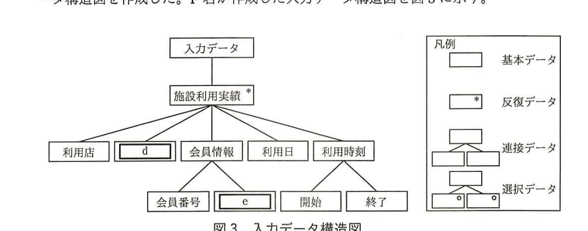
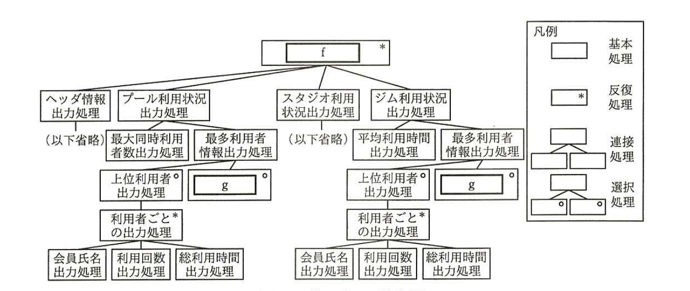
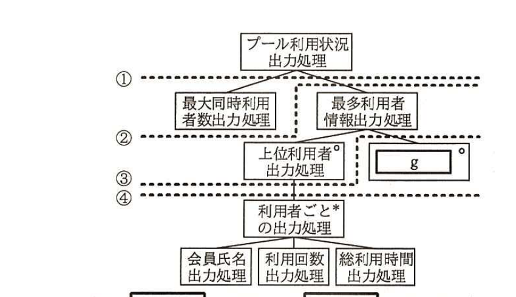

# 2016年秋期（平成28年度）応用情報技術者試験 午後 問8（選択）
## 情報システム開発：モジュール分割（E社）

---

## 問題文

**問8** モジュール分割に関する次の記述を読んで、設問1〜4に答えよ。

E社は、英会話教室や料理教室などのカルチャースクール向けにSaaSを提供する会社である。E社のサービスは、画面デザインやシステム機能を顧客向けにカスタマイズできる点が人気を集めており、約100社の顧客が利用している。E社のサービスを提供するシステムには、顧客向けのカスタマイズを容易にするために、システム機能の部品化による高い再利用性が求められている。

E社では、ビジネス拡大を目的としてスポーツクラブ向けの施設利用状況管理サービスを提供することになった。施設利用状況管理サービスを提供するシステム（以下、新システムという）の開発は、E社開発部のF君が担当することになった。

---

### 〔新システムの概要〕

新システムは、会員管理機能、利用管理機能、利用状況集計機能の三つの機能を提供する。会員管理機能は、会員の氏名や連絡先などの情報を登録・更新・削除する機能である。利用管理機能は、スポーツクラブの店に設置する受付機を用いて、会員の利用施設や利用開始・終了日時などの施設利用実績を記録する機能である。利用状況集計機能は、各施設の利用状況を集計してレポート出力する機能である。

---

### 〔新システムのプログラムの開発方針〕

F君は、E社のサービス提供方法を考慮したプログラムの開発方針を策定し、上司の承認を得た。F君が策定したプログラム開発方針を図1に示す。

### 図1 プログラム開発方針

```
・顧客向けのカスタマイズが容易となるように、また、特定モジュールへのカスタマイズ
　が他のモジュールに与える影響が最小となるように、モジュール分割を行う。
・特定顧客向けに開発したモジュールが他顧客にも利用できるように、共通機能をモジュ
　ール化し、モジュール強度を高め、モジュール結合度を下げる。
```

---

### 〔モジュール分割手法の選定〕

F君は、新システムのモジュール設計を行うに当たり、モジュール分割手法の調査を行った。モジュール分割手法には、データを処理するトランザクションに着目して一連の処理をトランザクション単位にまとめてモジュールに分割する`[　a　]`、データの流れに着目してデータの入力・変換・出力の観点からモジュールに分割する`[　b　]`、データ構造に着目して入力データ構造と出力データ構造の対応関係からモジュールに分割する`[　c　]`などがあることが分かった。

F君は、新システムは、会員の施設利用実績データを蓄積し、それを集計した結果をレポート出力するので、`[　c　]`が最適な手法であることを調査報告書にまとめ、上司の承認を得た。

---

### 〔利用状況集計機能の入出力データ分析〕

利用状況集計機能のプログラムは、施設利用実績データを集計し、店ごとに施設の利用状況をレポート出力する。

プログラムへの入力は、受付機で記録した施設利用実績データである。プログラムからの出力は、店ごとの施設の月間利用者数、最多利用者情報などを記載した施設利用レポートである。施設利用実績データの例を表1に、施設利用レポートの例を図2に示す。

### 表1 施設利用実績データの例（抜粋）

| 利用店 | 施設名 | 会員番号 | 会員氏名 | 利用日 | 利用開始時刻 | 利用終了時刻 |
|---|---|---|---|---|---|---|
| A | プール | 0010 | Z | 2016-09-05 | 14:10 | 18:10 |
| A | ジム | 0001 | W | 2016-09-01 | 10:00 | 12:00 |
| A | ジム | 0001 | W | 2016-09-03 | 10:30 | 13:00 |
| B | プール | 0002 | X | 2016-09-15 | 17:30 | 19:00 |
| B | プール | 0010 | Z | 2016-09-10 | 15:10 | 16:10 |
| C | プール | 0002 | X | 2016-09-19 | 18:10 | 20:30 |
| C | スタジオ | 0003 | Y | 2016-09-26 | 19:50 | 21:10 |

### 図2 施設利用レポートの例

```
施設利用レポート（月間）
□ヘッダ情報
・店名：A
・対象月：2016年09月
・月間利用者数：1,200名
□プールの利用状況              □スタジオの利用状況         □ジムの利用状況
・最大同時利用者数：40名        ・平均利用者数：0名／日     ・平均利用時間：2.0時間／人
・最多利用者情報（上位5名）      ・最多利用者情報（上位5名）  ・最多利用者情報（上位5名）
| 会員氏名 | 利用回数 | 総利用時間 |  ※当月のスタジオ利用者なし  | 会員氏名 | 利用回数 | 総利用時間 |
|---|---|---|                                              |---|---|---|
| Z | 20 | 40時間 |                                          | W | 20 | 40時間 |
| ： | | |                                                  | ： | | |
```

> 注記：当月の施設の利用者がいないときは、最多利用者情報（上位5名）の表の位置に"※当月の＜施設名＞利用者なし"という利用者なし表示を出力する。ここで、＜施設名＞は、施設名に置換される。

F君は、プログラムへの入出力データの分析を行い、入力データ構造図及び出力データ構造図を作成した。F君が作成した入力データ構造図を図3に示す。



> 図3の内容：入力データ→施設利用実績（反復データ*）→利用店、`[　d　]`（基本データ）、会員情報、利用日、利用時刻。会員情報→会員番号、`[　e　]`（基本データ）。利用時刻→開始、終了（連接データ）。凡例：基本データ（四角）、反復データ（*付き四角）、連接データ（上位1つに下位2つを線で連結）、選択データ（○付き四角同士）。

---

### 〔利用状況集計機能のプログラム構造の設計〕

F君は、〔利用状況集計機能の入出力データ分析〕の結果を基に、プログラム構造の設計を行った。F君が設計したプログラム構造図を図4に示す。



> 図4の内容：`[　f　]`（反復処理*）→ヘッダ情報出力処理（以下省略）、プール利用状況出力処理、スタジオ利用状況出力処理（以下省略）、ジム利用状況出力処理。プール利用状況出力処理→最大同時利用者数出力処理、最多利用者情報出力処理。最多利用者情報出力処理→上位利用者出力処理（反復○）、`[　g　]`（選択○）。上位利用者出力処理→利用者ごとの出力処理（反復*）→会員氏名出力処理、利用回数出力処理、総利用時間出力処理。ジム利用状況出力処理も同様の構造（平均利用時間出力処理、最多利用者情報出力処理、上位利用者出力処理、利用者ごとの出力処理…）。凡例：基本処理（四角）、反復処理（*付き四角）、連接処理（上位1つに下位複数を連結）、選択処理（○付き四角同士）。

---

### 〔利用状況集計機能のモジュール分割〕

F君は設計したプログラム構造図を基に、プログラム開発方針に従ってモジュール分割の検討を行った。F君が検討したプール利用状況出力処理のモジュール分割案を図5に示す。図5中の①〜④の破線は、モジュール分割案を示している。



> 図5の内容：プール利用状況出力処理を頂点に、①の破線がその直下（最大同時利用者数出力処理・最多利用者情報出力処理）で分割、②の破線が上位利用者出力処理・`[　g　]`の下で分割、③・④の破線がさらにその下（利用者ごとの出力処理）で分割。注記：`[　g　]`には図4中の`[　g　]`と同じ字句が入る。

F君は、利用状況集計機能以外の機能についてもモジュール分割を行い、モジュール設計を完了させた。

---

## 設問

### 設問1 本文中の`[　a　]`〜`[　c　]`に入れる適切な字句を解答群の中から選び、記号で答えよ。

**解答群：**
ア　STS分割　　イ　TR分割　　ウ　オブジェクト指向
エ　共通機能分割　　オ　ジャクソン法　　カ　ワーニエ法

### 設問2 図3中の`[　d　]`、`[　e　]`に入れる適切な字句を表1中の字句を使って答えよ。

### 設問3 図4中の`[　f　]`、`[　g　]`に入れる適切な字句を20字以内で答えよ。

### 設問4 〔利用状況集計機能のモジュール分割〕について、(1)、(2)に答えよ。

(1) 図5中の②の破線の下の処理を複数の施設の利用状況出力処理で共通して利用するモジュールとする場合、モジュールの結合度は何結合となるか、解答群の中から選び記号で答えよ。

**解答群：**
ア　データ結合　　イ　スタンプ結合　　ウ　制御結合
エ　外部結合　　オ　共通結合　　カ　内容結合

(2) 図5中の処理をプログラム開発方針に従って、モジュール強度を高め、モジュール結合度を下げるようにモジュール分割するとき、最適な分割を図5中の①〜④の番号を用いて答えよ。また、その理由を40字以内で述べよ。

---

## 解答と解説

### 設問1

**正解：a = イ（TR分割）、b = ア（STS分割）、c = オ（ジャクソン法）**

`[　a　]`は「トランザクションに着目して一連の処理をトランザクション単位にまとめてモジュールに分割する」手法であり、これは**TR分割**（イ）である。

`[　b　]`は「データの流れに着目してデータの入力・変換・出力の観点からモジュールに分割する」手法であり、これは**STS分割**（ア）である（Source-Transform-Sink）。

`[　c　]`は「データ構造に着目して入力データ構造と出力データ構造の対応関係からモジュールに分割する」手法であり、これは**ジャクソン法**（オ）である。

**IPA公式：a=イ、b=ア、c=オ**

---

### 設問2

**正解：d = 施設名、e = 会員氏名**

図3の入力データ構造図で、施設利用実績の直下には「利用店、`[　d　]`、会員情報、利用日、利用時刻」が並ぶ。表1の列名（利用店、施設名、会員番号、会員氏名、利用日、利用開始時刻、利用終了時刻）と照らし合わせると、利用店の次に位置するのは**施設名**であるから`[　d　]`は**施設名**である。

会員情報の直下には「会員番号、`[　e　]`」が並ぶが、表1では会員番号の次に会員氏名があるので、`[　e　]`は**会員氏名**である。

**IPA公式：d=施設名、e=会員氏名**

---

### 設問3

**正解：f = 店ごとの施設利用レポート出力処理、g = 利用者なし表示出力処理**

`[　f　]`は、プログラム構造図の最上位（頂点）であり、反復（*）付きで、ヘッダ情報出力処理・プール利用状況出力処理・スタジオ利用状況出力処理・ジム利用状況出力処理を配下にもつ。施設利用レポートは店ごとに出力されるレポートであることから、`[　f　]`は**店ごとの施設利用レポート出力処理**である。

`[　g　]`は、最多利用者情報出力処理の配下で、上位利用者出力処理と選択（○）の関係にある処理である。図2の注記に「当月の施設の利用者がいないときは、最多利用者情報（上位5名）の表の位置に"※当月の＜施設名＞利用者なし"という利用者なし表示を出力する」とあることから、`[　g　]`は**利用者なし表示出力処理**である。

**IPA公式：f=店ごとの施設利用レポート出力処理、g=利用者なし表示出力処理**

---

### 設問4

**(1) 正解：ウ（制御結合）**

図5中の②の破線の下の処理（上位利用者出力処理、`[　g　]`）は、呼び出し元の最多利用者情報出力処理から、施設種別（プール／ジムなど）によってどちらの処理を実行するかの動作を制御する引数（フラグ）を渡す必要があると考えられる。このように、モジュール間で処理の実行を制御するための情報（機能を制御するフラグなど）を受け渡す結合を**制御結合**（ウ）という。

**IPA公式：ウ**

**(2) 正解：分割④、理由：データ結合のモジュールに分割でき、再利用やカスタマイズが容易となるから**

プログラム開発方針（図1）は「特定モジュールへのカスタマイズが他のモジュールに与える影響が最小となるように」「共通機能をモジュール化し、モジュール強度を高め、モジュール結合度を下げる」ことを求めている。①〜④のうち、**④**（利用者ごとの出力処理の直下、すなわち会員氏名出力処理・利用回数出力処理・総利用時間出力処理を含まない最小単位での分割）で分割すると、受け渡すデータが単純なデータ項目（データ結合）で済むモジュールに分割でき、他の施設の利用状況出力処理からも共通して再利用しやすくなる。すなわち、**データ結合のモジュールに分割でき、再利用やカスタマイズが容易となるから**である。

**IPA公式：分割④、理由＝データ結合のモジュールに分割でき，再利用やカスタマイズが容易となるから**

---

## 参考：主要キーワード

| 用語 | 説明 |
|------|------|
| STS分割・TR分割・ジャクソン法 | 代表的なモジュール分割手法。STS分割はデータの流れ（入力・変換・出力）、TR分割はトランザクション種別、ジャクソン法は入出力データ構造の対応関係に着目する |
| モジュール強度とモジュール結合度 | モジュール強度はモジュール内の機能的なまとまりの強さ、モジュール結合度はモジュール間の依存の強さ。強度は高く、結合度は低くすることが良い設計とされる |
| データ結合・制御結合 | モジュール間の代表的な結合度の種類。データ結合は単純なデータ項目のみの受渡しで最も結合度が低く、制御結合はモジュールの動作を制御するフラグなどを渡すためデータ結合より結合度が高い |
| データ構造図（ジャクソン法の記法） | 基本データ・反復データ（*）・連接データ・選択データ（○）の4種類の記号で、データの階層構造を表現する表記法 |
| プログラム構造図とモジュール分割の観点 | プログラム構造図上のどの階層でモジュールを分割するかによって、モジュール間の結合度や再利用性が変化するため、開発方針に沿った適切な分割単位を選ぶ必要がある |

