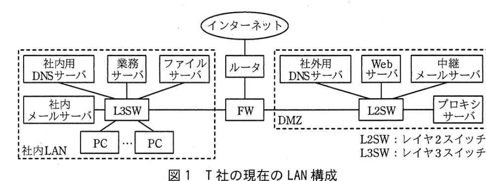

# 2017年春期（平成29年度）応用情報技術者試験 午後 問1（必須）
## 情報セキュリティ：マルウェア対策（T社）

---

## 問題文

**問1** マルウェア対策に関する次の記述を読んで、設問1〜5に答えよ。

T社は、社員60名の電子機器の設計開発会社であり、技術力と実績によって顧客の信頼を得ている。社内のサーバには、設計資料や調査研究資料など、営業秘密情報を含む資料が多数保管されている。

T社の社員は、社内LANのPCからインターネット上のWebサイトにアクセスして、情報収集を日常的に行っている。ファイアウォール（以下、FWという）には、業務上必要となる最少の通信だけを許可するパケットフィルタリングルールが設定されており、社内LANからのインターネットアクセスは、DMZのプロキシサーバ経由だけが許可されている。T社の現在のLAN構成を図1に示す。

> インターネット－ルータ－FW－（社内LAN側）L3SW（社内用DNSサーバ・業務サーバ・ファイルサーバ・社内メールサーバ・PC…PC）／FWの先（DMZ側）L2SW（社外用DNSサーバ・Webサーバ・中継メールサーバ・プロキシサーバ）。社内LANからのインターネットアクセスはDMZのプロキシサーバ経由だけが許可されている。

T社では、マルウェアの感染を防ぐために、PCとサーバでウイルス対策ソフトを稼働させ、情報セキュリティ運用規程にのっとり、最新のウイルス定義ファイルとセキュリティパッチを適用している。

---

### 〔マルウェア対策の見直し〕

最近、秘密情報の流出など、情報セキュリティを損ねる予期しない事象（以下、インシデントという）による被害に関する報道が多くなっている。この状況に危機感を抱いたシステム課のM課長は、運用担当のS君に、情報セキュリティ関連のコンサルティングを委託しているY氏の支援を受けて、マルウェア対策を見直すよう指示した。

S君から相談を受けたY氏がT社の対策状況を調査したところ、マルウェアの活動を抑止する対策が十分でないことが分かった。Y氏はS君に、特定の企業や組織内の情報を狙ったサイバー攻撃（以下、標的型攻撃という）の現状と、T社が実施すべき対策について説明した。Y氏が説明した内容を次に示す。

---

### 〔標的型攻撃の現状と対策〕

最近、標的型攻撃の一つである`[　a　]`攻撃が増加している。`[　a　]`攻撃は、攻撃者が、攻撃対象の企業や組織が日常的に利用するWebサイトの`[　b　]`を改ざんし、Webサイトにアクセスしたパソコンをマルウェアに感染させるものである。これを回避するには、Webブラウザやオペレーティングシステム(OS)のセキュリティパッチを更新して、最新の状態に保つことが重要である。しかし、ゼロデイ攻撃が行われた場合は、マルウェアの感染を防止できない。

マルウェアは、PCに侵入すると、攻撃者がマルウェアの遠隔操作に利用するサーバ（以下、攻撃サーバという）との間の通信路を確立した後、企業や組織内のサーバへの侵入を試みることが多い。サーバに侵入したマルウェアは、攻撃サーバから送られる攻撃者の指示を受け、サーバに保管された情報の窃取、破壊などを行うことがある。①マルウェアと攻撃サーバの間の通信（以下、バックドア通信という）は、HTTPで行われることが多いので、マルウェアの活動を発見するのは容易ではない。

Y氏は、このようなマルウェアの活動を抑止するために、次の3点の対応策をS君に提案した。

- DMZに設置されているプロキシサーバとPCでの対策の実施
- ログ検査の実施
- インシデントへの対応体制の構築

---

### 〔DMZに設置されているプロキシサーバとPCでの対策の実施〕

S君は、プロキシサーバとPCで、次の3点の対策を行うことにした。

- プロキシサーバで、遮断するWebサイトをT社が独自に設定できる`[　c　]`機能を新たに稼働させる。
- プロキシサーバで利用者認証を行い、攻撃サーバとの通信路の確立を困難にする。
- プロキシサーバでの利用者認証時に、②PCの利用者が入力した認証情報がマルウェアによって悪用されるのを防ぐための設定を、Webブラウザに行う。

---

### 〔ログ検査の実施〕

S君は、標的型攻撃を受けた際に被害拡大を防止できるよう、ログ検査の準備を進めることにした。まず、③複数の機器のログを突き合わせて調査できるように、社内の各機器の時刻をNTPサーバと同期させることにした。表1にFWに追加するパケットフィルタリングルールを示す。

### 表1 FWに追加するパケットフィルタリングルール

| 項番 | 送信元 | 宛先 | プロトコル | 動作 |
|---|---|---|---|---|
| 1 | 社内LANのサーバ | `[　d　]`のNTPサーバ | NTP | 許可 |
| 2 | `[　d　]`のNTPサーバ | `[　e　]`のNTPサーバ | NTP | 許可 |

ログ検査で重点的に確認すべき点は、次の2点である。

- プロキシサーバでの利用者認証の試行が短時間に大量に繰り返されていないか（`[　f　]`攻撃の可能性の発見）。
- バックドア通信の特徴に基づくログ内容の調査。

---

### 〔インシデントへの対応体制の構築〕

Y氏は、S君に、④インシデントによる情報セキュリティ被害の発生、拡大、再発を最小限に抑えるために社内に構築すべき対応体制について説明した。S君はY氏の説明を踏まえて改善案を作成した。改善案は承認され、実施に移すことになった。

---

## 設問

### 設問1 本文中の`[　a　]`〜`[　c　]`、`[　f　]`に入れる適切な字句を解答群の中から選び、記号で答えよ。

**解答群：**
ア　DDoS　　イ　IPアドレス　　ウ　URLフィルタリング
エ　Webページ　　オ　キーワードフィルタリング　　カ　総当たり
キ　フィッシング　　ク　水飲み場型　　ケ　レインボー

### 設問2 本文中の下線①の理由について、最も適切なものを解答群の中から選び、記号で答えよ。

**解答群：**
ア　バックドア通信の通信相手を特定する情報は、ログに記録されないから
イ　バックドア通信の通信プロトコルは、特殊なので解析できないから
ウ　バックドア通信は大量に行われるので、ログを保存しきれないから
エ　バックドア通信は通常のWebサーバとの通信と区別できないから

### 設問3 本文中の下線②の設定内容を、25字以内で述べよ。

### 設問4 〔ログ検査の実施〕について、(1)、(2)に答えよ。

(1) 本文中の下線③について、NTPを稼働させなかったときに発生するおそれがある問題を、35字以内で述べよ。

(2) 表1中の`[　d　]`、`[　e　]`に入れる適切な字句を、図1中の名称で答えよ。

### 設問5 本文中の下線④の対応体制について、適切なものを解答群の中から二つ選び、記号で答えよ。

**解答群：**
ア　インシデント発見者がインシデントの内容を報告する窓口の設置
イ　原因究明から問題解決までを社外に頼らず独自に行う体制の構築
ウ　社員向けの情報セキュリティ教育及び啓発活動を行う体制の構築
エ　情報セキュリティ被害発生後の事後対応に特化した体制の構築
オ　発生したインシデントの情報を社内外に漏らさない管理体制の構築

---

## 解答と解説

### 設問1

**正解：a = ク（水飲み場型）、b = エ（Webページ）、c = ウ（URLフィルタリング）、f = カ（総当たり）**

標的型攻撃の一種で、標的が日常的に訪れるWebサイトを改ざんして待ち構える手口は**水飲み場型**（a）攻撃と呼ばれる。改ざんの対象は当該Webサイトの**Webページ**（b）である。プロキシサーバで遮断先を自組織独自に設定できる機能は**URLフィルタリング**（c）機能である。認証の試行が短時間に大量に繰り返される攻撃は**総当たり**（f、ブルートフォース）攻撃である。

**IPA公式：a=ク、b=エ、c=ウ、f=カ**

---

### 設問2

**正解：エ（バックドア通信は通常のWebサーバとの通信と区別できないから）**

下線①では、バックドア通信がHTTPで行われることが多いため発見が容易でないと述べられている。HTTPは通常のWebアクセスにも広く使われるプロトコルであるため、バックドア通信の通信内容だけを見ても、正規のWebサーバとの通信と区別が付きにくい。

**IPA公式：エ**

---

### 設問3

**正解例：オートコンプリート機能を無効にする。**

下線②は、PCの利用者がプロキシサーバの利用者認証時に入力した認証情報（ID・パスワード）がマルウェアに悪用されるのを防ぐための、Webブラウザ側の設定を問うている。Webブラウザに保存された入力履歴（オートコンプリート）から認証情報が読み取られることを防ぐには、**オートコンプリート機能を無効にする**設定を行えばよい。

**IPA公式：オートコンプリート機能を無効にする。**

---

### 設問4

**(1) 正解例：各機器のログに記録された事象の時系列の把握が困難になる。**

下線③はNTPによる時刻同期の目的（複数機器のログを突き合わせて調査できるようにすること）を述べている。NTPを稼働させず各機器の時刻がずれたままだと、各機器のログに記録された事象の前後関係・時系列が正しく把握できなくなり、インシデント発生時の調査に支障が出る。

**IPA公式：各機器のログに記録された事象の時系列の把握が困難になる。**

**(2) 正解：d = DMZ、e = インターネット**

社内LANのサーバは、まずDMZに設置されたNTPサーバと時刻同期し、そのDMZのNTPサーバがインターネット上の上位NTPサーバと同期する構成が一般的である。したがって、d＝**DMZ**、e＝**インターネット**となる。

**IPA公式：d=DMZ、e=インターネット**

---

### 設問5

**正解：ア、ウ**

インシデントによる被害の発生・拡大・再発を最小限に抑えるための対応体制としては、**ア　インシデント発見者がインシデントの内容を報告する窓口の設置**（発見時に速やかに報告させ初動対応につなげる）と、**ウ　社員向けの情報セキュリティ教育及び啓発活動を行う体制の構築**（インシデントの発生自体や再発を予防する）が適切である。イは社外の専門家の支援を排除してしまい実効性を欠き、エは事前予防を欠く片手落ちの体制であり、オは被害の隠蔽につながりかねず不適切である。

**IPA公式：ア，ウ**

---

## 参考：主要キーワード

| 用語 | 説明 |
|------|------|
| 標的型攻撃 | 特定の企業や組織を狙って行われるサイバー攻撃の総称。水飲み場型攻撃や標的型メール攻撃などの手口がある |
| 水飲み場型攻撃 | 標的が日常的に閲覧するWebサイトを改ざんし、アクセスしたPCをマルウェアに感染させる攻撃手口 |
| ゼロデイ攻撃 | 脆弱性の修正パッチが提供される前に、その脆弱性を悪用して行われる攻撃。パッチ適用だけでは防げない |
| バックドア通信 | マルウェアが感染後、外部の攻撃サーバと確立する遠隔操作用の通信路。HTTP等の正規プロトコルを悪用し発見が困難 |
| URLフィルタリング | 特定のURL（Webサイト）へのアクセスを許可・遮断するよう設定できる、プロキシサーバ等の機能 |
| NTP（Network Time Protocol） | ネットワーク機器の時刻を同期するプロトコル。複数機器のログを時系列で突き合わせて調査するために重要 |
| 総当たり（ブルートフォース）攻撃 | ID・パスワードの組合せを機械的に総当たりで試行し、認証突破を試みる攻撃 |
| インシデント対応体制 | 発見者からの報告窓口の設置、教育・啓発活動など、被害の発生・拡大・再発を防止するための社内体制 |
