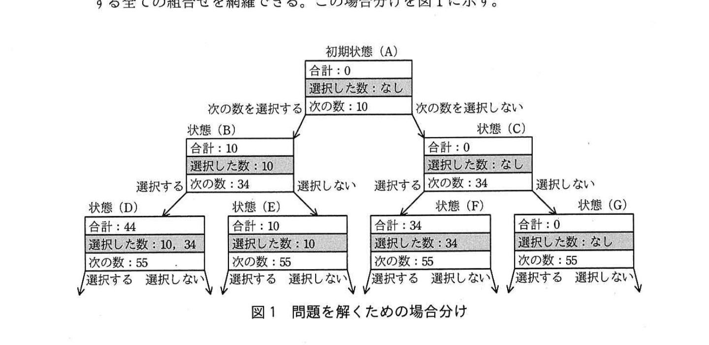

# 2017年春期（平成29年度）応用情報技術者試験 午後 問3（選択）
## プログラミング：探索アルゴリズム

---

## 問題文

**問3** 探索アルゴリズムに関する次の記述を読んで、設問1〜5に答えよ。

1個ずつの重さが異なる商品を組み合わせ、合計の重さが指定された値になるようにしたい。

この問題を次のように簡略化し、解法を考える。

**〔問題〕**
指定されたn個の異なる数（自然数）の中から任意の個数の数を選択し、それらの合計が指定された目標Xに最も近くなる数の組合せを1組選択する。その際、合計はXより大きくても小さくてもよい。ただし、同じ数は1回しか選択できないものとする。

例えば、指定されたn個の数が(10, 34, 55, 77)、目標Xが100とすると、選択した数の組合せは(10, 34, 55)、選択した数の合計（以下、合計という）は99となる。

この問題を解くためのアルゴリズムを考える。

指定されたn個の数の中から任意の個数を選択することから、各数に対して、選択する、選択しない、の二つのケースがある。数を一つずつ調べて、次の数がなくなるまで"選択する"、"選択しない"の分岐を繰り返すことで、任意の個数を選択する全ての組合せを網羅できる。この場合分けを図1に示す。



> 木構造の場合分け。初期状態(A)（合計:0、選択した数:なし、次の数:10）から「次の数を選択する」で状態(B)（合計:10、選択した数:10、次の数:34）、「次の数を選択しない」で状態(C)（合計:0、選択した数:なし、次の数:34）に分岐。状態(B)からは「選択する」で状態(D)（合計:44、選択した数:10,34、次の数:55）、「選択しない」で状態(E)（合計:10、選択した数:10、次の数:55）。状態(C)からは「選択する」で状態(F)（合計:34、選択した数:34、次の数:55）、「選択しない」で状態(G)（合計:0、選択した数:なし、次の数:55）。D,E,F,Gからもさらに「選択する」「選択しない」の分岐が続く。

---

### 〔データ構造の検討〕

図1の場合分けをプログラムで実装するために、必要となるデータ構造を検討する。

まず、図1の場合分けを木構造とみなしたときの各ノード（状態）を構造体Statusで表す。構造体Statusは要素として"合計"、"選択した数"、"次の数"をもつ必要がある。

プログラムで使用する配列、変数及び構造体を表1に示す。

### 表1 プログラムで使用する配列、変数及び構造体

| 名称 | 種類 | 内容 |
|---|---|---|
| numbers[ ] | 配列 | 問題で指定されるn個の数を格納する配列。配列の添字は1から始まる。 |
| target | 変数 | 問題で指定される目標Xを格納する変数。 |
| Status | 構造体 | 次の三つの要素をもつ構造体。状態を表す。<br>・total：合計を表す変数。初期値は0。<br>・selectedNumbers[ ]：選択した数を表す配列。各要素の初期値はnullとする。配列の添字は1から始まる。<br>・nextIndex：次の数のnumbers[ ]における添字を格納する変数。初期値は1。次の数がない場合は0。<br>構造体の要素は"."を使った表記で表す。"."の左に、構造体全体を表す変数を書き、"."の右に、要素名を書く。 |
| currentStatus | 変数 | 構造体Statusの値を格納する変数。"取得した状態"を表す。 |
| ansStatus | 変数 | 構造体Statusの値を格納する変数。"現時点での解答の候補"（以下、"解答の候補"という）を表す。初期値はnullとする。 |

---

### 〔探索の手順〕

図1に示した場合分けの初期状態(A)からの探索手順を、次の(1)〜(3)に示す。①これから探索する状態を格納しておくためのデータ構造として、キューを使用する場合とスタックを使用する場合で、探索の順序が異なる。また、②データ構造によってメモリの使用量も異なる。ここではキューを使用することにする。

(1) 初期状態(A)を作成し、キューに格納する。キューが空になるまで(2)、(3)を繰り返す。

(2) キューに格納されている状態を一つ取り出す。これを"取得した状態"と呼ぶ。"取得した状態"の評価を行う（状態を評価する手順は次の〔"取得した状態"の評価〕に示す）。

(3) "取得した状態"に次の数がある場合、次の数を選択した状態と、次の数を選択しない状態をそれぞれ作成し、順にキューに格納する。

---

### 〔"取得した状態"の評価〕

"取得した状態"を評価し、"解答の候補"を設定する手順を、次の(1)、(2)に示す。

(1) "解答の候補"がnullの場合、"取得した状態"を"解答の候補"にする。

(2) "解答の候補"がnullでない場合、"解答の候補"の合計と"取得した状態"の合計をそれぞれ目標Xと比較して、後者の方が目標Xに近い場合、"取得した状態"を"解答の候補"にする。

探索の手順が終了した時点の"解答の候補"を解答とする。

探索を行うための関数を表2に示す。

### 表2 探索を行うための関数

| 名称 | 内容 |
|---|---|
| enqueue(s) | 引数として与えられる構造体Statusの値sをキューに追加する。 |
| dequeue( ) | キューから構造体Statusの値を取り出して返す。 |
| isEmpty( ) | キューが空かどうかを判定する。キューが空ならば1を、そうでなければ0を返す。 |
| nextStatus1(s) | 引数として与えられる構造体Statusの値sに対して、次の数を選択した状態を表す構造体Statusの値を返す。戻り値の各要素に次の内容を設定する。<br>・total：s.total+numbers[s.nextIndex]を設定する。<br>・selectedNumbers[ ]：s.selectedNumbers[ ]にnumbers[s.nextIndex]を追加した配列を設定する。<br>・nextIndex：s.nextIndexがnならば0を、そうでなければs.nextIndex+1を設定する。 |
| nextStatus2(s) | 引数として与えられる構造体Statusの値sに対して、次の数を選択しない状態を表す構造体Statusの値を返す。戻り値の各要素に次の内容を設定する。<br>・total：s.totalを設定する。<br>・selectedNumbers[ ]：s.selectedNumbers[ ]を設定する。<br>・nextIndex：s.nextIndexがnならば0を、そうでなければs.nextIndex+1を設定する。 |
| abs(n) | 引数として与えられる数nの絶対値を返す。 |

---

### 〔探索処理関数 treeSearch〕

探索処理を実装した関数treeSearchのプログラムを図2に示す。ここで、表1で定義した配列及び変数は、グローバル変数とする。

```
function treeSearch()
  currentStatusを初期化する            //初期状態を作成する
  enqueue(currentStatus)               //初期状態をキューに格納する
  while(  [　ア　]  )
    currentStatus ← dequeue()          //キューから状態を取り出す
    if(ansStatusがnullである)
      [　イ　]
    elseif(abs(target-ansStatus.total)がabs(target-currentStatus.total)よりも大きい)
      [　ウ　]
    endif                              ◄(α)
    if(  [　エ　]  )                    ◄(β)
      enqueue(nextStatus1(currentStatus))  //次の数を選択した状態をキューに追加する
      enqueue(nextStatus2(currentStatus))  //次の数を選択しない状態をキューに追加する
    endif
  endwhile
endfunction
```

### 〔探索回数の削減〕

関数treeSearchで実装した方法では、nが大きくなるにつれて"取得した状態"を評価する回数（以下、探索回数という）も増大するが、不要な探索処理を行わないようにすることによって、③探索回数を削減することができる。探索回数の削減のために、探索を継続するかどうかを示すフラグを新たに用意し、次の(1)〜(3)の処理を追加することにした。

(1) "取得した状態"の合計が目標X以上の場合、以降の状態で数を選択しても合計は目標Xから離れてしまい、"解答の候補"にはならない。以降の状態の探索を不要とするために、フラグを探索中止に設定する。

(2) (1)以外の場合、フラグを探索継続に設定する。

(3) フラグが探索中止の場合、"取得した状態"からの分岐を探索しないようにする。

探索回数の削減のために追加する変数を表3に示す。

### 表3 探索回数の削減のために追加する変数

| 名称 | 種類 | 内容 |
|---|---|---|
| nextFlag | 変数 | "Y"のとき探索継続、"N"のとき探索中止を表す。 |

探索回数の削減を実装するために、図2中の(α)の行と(β)の行の間に図3のプログラムを追加し、(β)を"if(`[　エ　]`、かつ、nextFlagが"Y"である)"に修正した。

```
if(currentStatus.totalがtarget以上である)
  nextFlag ← [　オ　]
else
  nextFlag ← [　カ　]
endif
```

---

## 設問

### 設問1 図2中の`[　ア　]`〜`[　エ　]`に入れる適切な字句を答えよ。

### 設問2 図3中の`[　オ　]`、`[　カ　]`に入れる適切な字句を答えよ。

### 設問3 本文中の下線①について、次の(1)、(2)の場合の評価の順序を、図1中の状態の記号(A)〜(G)を用いてそれぞれ答えよ。ここで、分岐の際は左側のノードから先にデータ構造に格納することとする。本問では(D)、(E)、(F)、(G)の後の状態は考慮しなくてよい。

(1) 〔探索の手順〕での記述どおり、データ構造にキューを使用した場合

(2) 本文中のキューを全てスタックに置き換えた場合

### 設問4 本文中の下線②について、データ構造にキューを使用した場合に、キューが必要とするメモリ使用量の最大値として適切な字句を解答群の中から選び、記号で答えよ。ここで、問題における数の個数をn、キューに状態を一つ格納するために必要なメモリ使用量をmとする。

**解答群：**
ア　2ⁿm　　イ　2nm　　ウ　nm　　エ　n²m　　オ　(n+1)m

### 設問5 本文中の下線③における探索回数の削減を更に効率的に行うために、"指定されたn個の数"に実施しておくことが有効な事前処理の内容を20字以内で、その理由を25字以内でそれぞれ述べよ。

---

## 解答と解説

### 設問1

**正解：ア = isEmpty()が0である、イ = ansStatus ← currentStatus、ウ = ansStatus ← currentStatus、エ = currentStatus.nextIndexが0ではない**

whileループはキューが空になるまで繰り返すので、条件は「キューが空でない」こと、すなわち**isEmpty()が0である**（ア）となる。ansStatusがnullの場合（初回）は、〔"取得した状態"の評価〕(1)より無条件で**ansStatus ← currentStatus**（イ）とする。ansStatusがnullでなく、"取得した状態"の方が目標Xに近い場合も、(2)より同様に**ansStatus ← currentStatus**（ウ）とする。次の数がある場合だけキューに追加処理を行うので、判定条件は**currentStatus.nextIndexが0ではない**（エ、nextIndex=0は次の数がないことを表す）となる。

**IPA公式：ア=isEmpty( )が0である、イ=ansStatus ← currentStatus、ウ=ansStatus ← currentStatus、エ=currentStatus.nextIndexが0ではない**

---

### 設問2

**正解：オ = "N"、カ = "Y"**

〔探索回数の削減〕(1)より、合計が目標X以上の場合は以降の探索が不要になるためフラグを探索中止（"N"）に設定する。したがって、currentStatus.totalがtarget以上である場合はnextFlag←**"N"**（オ）、そうでない場合（探索を続ける必要がある場合）はnextFlag←**"Y"**（カ）となる。

**IPA公式：オ="N"、カ="Y"**

---

### 設問3

**正解：(1) (A)→(B)→(C)→(D)→(E)→(F)→(G)、(2) (A)→(C)→(G)→(F)→(B)→(E)→(D)**

**(1) キューを使用した場合（幅優先探索・BFS）：** 左側のノードから先に格納するので、(A)を取り出した後、(B)、(C)の順にキューへ格納・取り出しが行われ、続けて(B)から(D)、(E)、(C)から(F)、(G)の順に格納される。キュー（先入れ先出し）なので、評価順序は**(A)→(B)→(C)→(D)→(E)→(F)→(G)**となる。

**(2) キューをスタックに置き換えた場合（深さ優先探索・DFS）：** (A)評価後、(B)、(C)の順にスタックへ格納すると、後入れ先出しのスタックでは(C)が先に取り出される。続けて(C)から(F)、(G)の順に格納すると(G)が先に取り出され、次に(F)、その後スタックに残っていた(B)が取り出され、(B)から(D)、(E)の順に格納すると(E)が先に取り出され最後に(D)となる。したがって評価順序は**(A)→(C)→(G)→(F)→(B)→(E)→(D)**となる。

**IPA公式：(1) (A)→(B)→(C)→(D)→(E)→(F)→(G)、(2) (A)→(C)→(G)→(F)→(B)→(E)→(D)**

---

### 設問4

**正解：ア（2ⁿm）**

キューを使用する幅優先探索では、木の各階層（深さ）のノードがキューに同時に存在し得る。n個の数に対する組合せの木は深さnまで広がり、最下層（深さn）には最大2ⁿ個の状態が存在する。幅優先探索では、ある深さの全ノードを取り出す前に次の深さのノードがキューに追加されるため、最下層付近ではキューに最大2ⁿ個の状態が同時に保持され得る。各状態が占めるメモリ量をmとすると、必要なメモリ使用量の最大値は**2ⁿm**（ア）である。

**IPA公式：ア**

---

### 設問5

**正解例：内容＝数を降順にソートしておく。　理由＝早い段階で探索を打ち切ることができる。**

〔探索回数の削減〕の仕組みは、"取得した状態"の合計が目標X以上になった時点で以降の探索を打ち切るというものである。数をあらかじめ**数を降順にソートしておく**ことで、大きい数から先に選択候補として調べることになり、より早い段階で合計が目標X以上に達しやすくなるため、**早い段階で探索を打ち切ることができる**ようになり、探索回数をより効率的に削減できる。

**IPA公式：内容　数を降順にソートしておく。　理由　早い段階で探索を打ち切ることができる。**

---

## 参考：主要キーワード

| 用語 | 説明 |
|------|------|
| 木構造探索 | 各要素について「選択する／しない」の分岐を繰り返して全組合せを網羅する探索手法。組合せ最適化問題の解法として広く使われる |
| キュー（幅優先探索） | 先入れ先出し（FIFO）のデータ構造。木構造探索に用いると、根に近い階層から順に幅優先で評価が行われる |
| スタック（深さ優先探索） | 後入れ先出し（LIFO）のデータ構造。木構造探索に用いると、一つの経路を深さ優先で先に評価し尽くしてから他の経路に移る |
| 枝刈り（探索回数の削減） | 解になり得ないと判明した時点で以降の探索を打ち切る手法。事前にデータをソートしておくことで枝刈りの効果を高められる |
| メモリ使用量のオーダー | データ構造（キュー／スタック）や探索方式によって、同時に保持する必要のある状態数、すなわち必要メモリ量が変わる |
