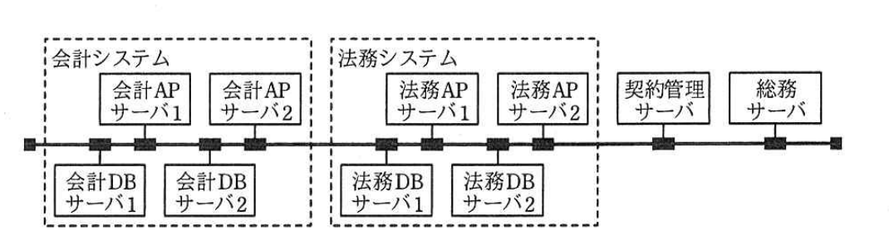
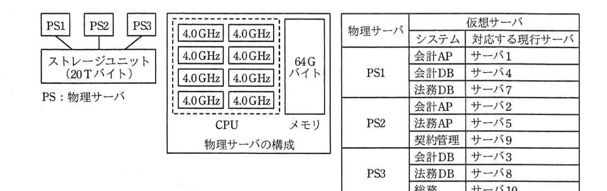

# 2017年春期（平成29年度）応用情報技術者試験 午後 問4（選択）
## システムアーキテクチャ：仮想環境の構築（N会計事務所）

---

## 問題文

**問4** 仮想環境の構築に関する次の記述を読んで、設問1〜4に答えよ。

N会計事務所は、数十人の公認会計士、税理士、司法書士を有する、中堅の公認会計士事務所である。所内では、業務用の会計システム、法務システム、契約管理システム及び総務システムが稼働している。業務拡大に合わせて所内システムの改修を行ってきたが、サーバ類の老朽化が顕著になってきたことから、サーバなどの業務システム基盤を再構築することになった。

---

### 〔現行システムの構成〕

N会計事務所の所内システムは、各業態の顧客経理支援業務に利用されるので24時間稼働している。業務要件として、会計システムは24時間無停止での稼働が必要で、業務が集中したときでも一定の性能が求められる。法務システムは30分以内の停止が許容されている。

会計システムと法務システムは、それぞれアプリケーションサーバ（以下、APサーバという）とデータベースサーバ（以下、DBサーバという）の2種類のサーバで構成されており、契約管理システムと総務システムは、それぞれAPサーバとDBサーバを兼用するサーバで構成されている。会計APサーバは負荷分散装置によるアクティブ／アクティブ方式、法務APサーバは手動によるアクティブ／スタンバイ方式で冗長化され、DBサーバは両システムともアクティブ／アクティブ方式のクラスタリング構成となっている。会計APサーバで処理するトランザクションは、会計APサーバ1と会計APサーバ2に均等に分散される。法務APサーバで現用系サーバが故障した場合、20分以内に待機系を手動で起動し、アクティブな状態にできる。現行システムの構成を図1に示す。

> 会計システム（会計APサーバ1・2、会計DBサーバ1・2）と法務システム（法務APサーバ1・2、法務DBサーバ1・2）、契約管理サーバ、総務サーバが、共通のネットワークバスに接続された構成。

システム課のB課長は、現行システムのそれぞれのサーバの稼働状況を調査した。現行システムは、10台のサーバから構成されており、いずれのサーバもCPU数は1でコア数が2の機器である。現行システムのリソース使用状況を表1に示す。

### 表1 現行システムのリソース使用状況

| | システム | サーバ種類 | 周波数(GHz) | 平均使用率(%) | メモリ容量(Gバイト) | メモリ平均使用率(%) | ストレージ容量(Tバイト) | ストレージ平均使用率(%) |
|---|---|---|---|---|---|---|---|---|
| サーバ1 | 会計 | AP | 3 | 60 | 8 | 70 | 2 | 70 |
| サーバ2 | 会計 | AP | 3 | 60 | 8 | 70 | 2 | 70 |
| サーバ3 | 会計 | DB | 3 | 60 | 6 | 60 | 4 | 65 |
| サーバ4 | 会計 | DB | 3 | 60 | 6 | 60 | 4 | 65 |
| サーバ5 | 法務 | AP | 2 | 70 | 8 | 70 | 2 | 70 |
| サーバ6 | 法務 | AP | 2 | 5 | 8 | 5 | 2 | 70 |
| サーバ7 | 法務 | DB | 2 | 60 | 6 | 60 | 4 | 50 |
| サーバ8 | 法務 | DB | 2 | 60 | 6 | 60 | 4 | 50 |
| サーバ9 | 契約管理 | AP,DB | 2 | 50 | 8 | 70 | 2 | 40 |
| サーバ10 | 総務 | AP,DB | 2 | 50 | 8 | 70 | 2 | 40 |

（周波数は1コア当たりの値）

---

### 〔仮想化システムの機能〕

B課長は、仮想化システムを利用して仮想サーバ環境を構築し、現行サーバ群を仮想サーバ上で稼働させることを検討した。各現行サーバは、再構築後の仮想サーバ環境において、いずれかの物理サーバに仮想サーバとして割り当てる。このとき仮想化システムの機能である、複数の物理サーバのリソースをグループ化して管理するリソースプールと呼ぶ仕組みを利用する。例えば、ある仮想サーバにCPUやメモリといったリソースを追加する場合、1台の物理サーバのリソースの制限にとらわれることなく、リソースプールからリソースを割り当てればよい。表2は、仮想化システムの機能の説明を抜粋したものである。

### 表2 仮想化システムの機能の説明（抜粋）

| 機能名 | 説明 |
|---|---|
| オーバコミット | 各仮想サーバに割り当てるリソース量の合計が、物理サーバに搭載された物理リソース量の合計を超えることができるようにする機能である。 |
| 自動再起動 | 物理サーバに障害が発生した場合に、その物理サーバ上で稼働していた仮想サーバを、別の物理サーバで自動的に再起動させる機能である。再起動には数分の時間を要する。処理中のトランザクションは破棄される。 |
| ライブマイグレーション | 稼働中の仮想サーバを、停止させることなく別の物理サーバ上に移動させる機能である。 |
| シンプロビジョニング | ストレージを仮想化することによって、実際に使用している量だけを割り当てる機能である。この機能を利用することによって、物理的な容量を超えるストレージ容量を仮想サーバに割り当てることができる。 |

仮想化システムでは、各仮想サーバに割り当てるリソース量に上限値と下限値を設定できる。上限値を設定した場合は、設定されたリソース量までしか使用できない。下限値を設定した場合は、設定されたリソース量を確保し、占有して使用できる。上限値も下限値も設定しない場合は、起動時にリソースを均等に分け合う。

---

### 〔業務システム基盤の構成〕

B課長は仮想化システムの処理能力を次のように仮定して、業務システム基盤の構成を設計した。

- 物理サーバで仮想サーバを動作させるための仮想化システムに必要なCPUとメモリは、十分な余裕をもたせて、物理サーバのCPUとメモリ全体の50%と想定する。CPUとメモリ以外のリソースの消費は無視する。
- 仮想サーバのCPUの1コア1GHz当たりの処理能力は、現行システムのCPUの1コア1GHz当たりの処理能力と同等とする。
- CPUの処理能力は、コア数に比例する。
- CPU使用量は処理能力とその平均使用率の積とする。これをGHz相当として表す。

B課長は、業務システム基盤の拡張性を考慮し、クロック周波数が4.0GHzの8コアプロセッサを1個と64Gバイトのメモリを搭載した物理サーバを3台同一機種で用意することにした。また、2台以上の物理サーバが同時に停止しない限りは、システム性能の低下は発生させないことにし、全業務無停止でのメンテナンスを可能とする。現行システムの業務要件を踏襲し、今回導入する仮想サーバの構成から、各物理サーバのCPUとメモリの使用率は、65%以下の目標値を定めた。

共有ディスクは、RAID5構成のストレージユニットとし、20Tバイトの実効容量をもたせることにした。

会計システムの冗長化構成は維持する。具体的には会計システムを負荷分散装置によるアクティブ／アクティブ方式の構成とする。法務APサーバの待機系であるサーバ6は廃止する。サーバ6以外の全ての仮想サーバのリソース使用量は、対応する現行サーバと同じとするが、上限値と下限値の設定は行わずに、仮想サーバに移行することにした。B課長の考えた業務システム基盤の構成案を図2に示す。

> PS1〜PS3の3台の物理サーバ（各4.0GHz×8コア、メモリ64Gバイト）が共有のストレージユニット(20Tバイト)に接続される構成。右表は各物理サーバに割り当てる仮想サーバとその対応する現行サーバ：PS1＝会計AP(サーバ1)・会計DB(サーバ4)・法務DB(サーバ7)、PS2＝会計AP(サーバ2)・法務AP(サーバ5)・契約管理(サーバ9)、PS3＝会計DB(サーバ3)・法務DB(サーバ8)・総務(サーバ10)。

---

### 〔CPU、メモリの使用率について〕

(1) 業務システム基盤は、仮想化システムの稼働に必要なリソースを差し引いて、CPUの処理能力の合計が48GHz相当、メモリ容量の合計が96Gバイトのリソースプールで構成される。現行システムのCPU使用量は26.2GHz相当、メモリ使用量は42.8Gバイトとなるが、サーバ6を廃止することからリソースプールの使用率は、CPU使用率が`[　a　]`%、メモリ使用率が`[　b　]`%となる。

(2) ストレージユニットは物理サーバの共有ディスクとして接続する。各仮想サーバには現行システムと同容量をストレージユニットから割り当てるので、各仮想サーバに割り当てるストレージ容量の合計はストレージユニットの容量を超える。

---

### 〔資産査定システムの追加について〕

B課長が業務システム基盤の構成の設計を完了した後に、会計業務を統括する事務所長から、資産査定システムの追加を検討してほしいとの要望があった。B課長は資産査定システムを会計システムと同様なサーバ構成で構築することにし、必要なリソース量を調査した。資産査定システムのリソース使用量の見込みを表3に示す。

### 表3 資産査定システムのリソース使用量の見込み

| 追加サーバ | システム | サーバ種類 | CPU使用量(GHz相当) | メモリ使用量(Gバイト) | ストレージ使用量(Tバイト) |
|---|---|---|---|---|---|
| サーバ11 | 資産査定 | AP | 1.2 | 6.5 | 1 |
| サーバ12 | 資産査定 | AP | 1.2 | 6.5 | 1 |
| サーバ13 | 資産査定 | DB | 1.2 | 6.5 | 1 |
| サーバ14 | 資産査定 | DB | 1.2 | 6.5 | 1 |
| 合計 | | | 4.8 | 26 | 4 |

資産査定システムを業務システム基盤に加えた場合、メモリ使用量は68.4Gバイトとなることから、リソースプールのメモリ使用率が`[　c　]`%となり、物理サーバが1台停止すると、N会計事務所の全システムの処理性能が低下してしまうことが判明した。B課長は、当面の間、会計以外のシステムについては、障害発生時の性能低下を容認し、①1台の物理サーバが停止したとしても、物理サーバの増設やリソースの拡張をせずに、会計システムの性能を低下させないための対策を採ることにした。

---

## 設問

### 設問1 業務システム基盤の次の(1)〜(4)の各項目について、仮想化システムの機能を利用して実現している項目はその機能名を、それ以外の方法で実現している項目はその方法を、表2又は本文中の用語を用いて答えよ。

(1) 全業務無停止でのメンテナンス

(2) 会計システムの24時間無停止稼働

(3) 法務APサーバ（サーバ6）の廃止

(4) ストレージユニットの容量を超えた各仮想サーバへのストレージ容量の割当て

### 設問2 本文中の`[　a　]`〜`[　c　]`に入れる適切な数値を答えよ。答えは小数第1位を四捨五入して、整数で求めよ。

### 設問3 図2の業務システム基盤の構成案の右表について、物理サーバと各システムの組合せを採用した理由を解答群の中から全て選び、記号で答えよ。

**解答群：**
ア　CPUの負荷を最小化する。
イ　各物理サーバのリソース使用量を平均化する。
ウ　ストレージユニットの容量を最小化する。
エ　物理サーバの障害時に備えてシステムを冗長化する。
オ　物理サーバの増設を容易にする。

### 設問4 本文中の下線①について、資産査定システム追加後も会計システムの性能を低下させない適切な対応方法を、40字以内で述べよ。

---

## 解答と解説

### 設問1

**正解：(1) ライブマイグレーション、(2) アクティブ／アクティブ方式、(3) 自動再起動、(4) シンプロビジョニング**

(1) 全業務無停止のメンテナンスは、稼働中の仮想サーバを停止させずに別の物理サーバへ移動できる**ライブマイグレーション**機能によって実現される。

(2) 会計システムの24時間無停止稼働は、仮想化システムの機能ではなく、会計APサーバを負荷分散装置による**アクティブ／アクティブ方式**で冗長化することによって実現されている。

(3) 法務APサーバ（サーバ6）を廃止しても、物理サーバに障害が発生した際は、その物理サーバ上の仮想サーバを別の物理サーバで自動的に再起動させる**自動再起動**機能によって代替が可能である。

(4) ストレージユニットの容量を超えた各仮想サーバへのストレージ容量の割当ては、実使用量分だけを割り当てる**シンプロビジョニング**機能によって実現される。

**IPA公式：(1) ライブマイグレーション、(2) アクティブ／アクティブ方式、(3) 自動再起動、(4) シンプロビジョニング**

---

### 設問2

**正解：a = 54、b = 44、c = 71**

CPU使用率(a) = 現行CPU使用量26.2GHz ÷ リソースプールのCPU処理能力48GHz × 100 ≈ **54.6→54**%

メモリ使用率(b)：サーバ6（メモリ使用率5%、容量8Gバイトなのでメモリ使用量0.4Gバイト）を廃止するため、現行メモリ使用量42.8Gバイトから0.4Gバイトを差し引いて42.4Gバイト。42.4 ÷ 96 × 100 ≈ **44.2→44**%

メモリ使用率(c)：資産査定システム追加後のメモリ使用量は68.4Gバイト（本文記載の値）。68.4 ÷ 96 × 100 ≈ **71.25→71**%

**IPA公式：a=54、b=44、c=71**

---

### 設問3

**正解：イ、エ**

図2の割当ては、各物理サーバ（PS1〜PS3）に会計・法務・契約管理・総務の各システムの仮想サーバをバランスよく分散配置しており、これは**イ　各物理サーバのリソース使用量を平均化する**ことに該当する。また、会計APサーバ1・2、会計DBサーバ1〜4などをそれぞれ異なる物理サーバ（PS1とPS2、あるいはPS1とPS3）に分散配置しており、1台の物理サーバに障害が発生しても同一システムの冗長構成の両系統が同時に失われないようにしている。これは**エ　物理サーバの障害時に備えてシステムを冗長化する**ことに該当する。ア・ウ・オはこの組合せの採用理由として本文や構成から読み取れない。

**IPA公式：イ，エ**

---

### 設問4

**正解例：会計システムを構成する各サーバに割り当てるリソースの下限値を設定する。**

現在の構成では、全ての仮想サーバ（サーバ6を除く）に上限値・下限値を設定していないため、物理サーバが1台停止して残りの物理サーバに仮想サーバが自動再起動された場合、リソースが不足し、会計システムを含む全システムのリソースが均等に分け合われて性能が低下してしまう。物理サーバの増設やリソースの拡張をせずに会計システムの性能低下を防ぐには、**会計システムを構成する各サーバに割り当てるリソースの下限値を設定する**ことで、障害時にも会計システム用のCPU・メモリを優先的に確保できるようにすればよい。

**IPA公式：会計システムを構成する各サーバに割り当てるリソースの下限値を設定する。**

---

## 参考：主要キーワード

| 用語 | 説明 |
|------|------|
| リソースプール | 複数の物理サーバのCPU・メモリなどのリソースをグループ化して管理する仮想化システムの仕組み。1台の物理サーバの制限にとらわれずリソースを割り当てられる |
| ライブマイグレーション | 稼働中の仮想サーバを停止させることなく別の物理サーバへ移動させる機能。無停止メンテナンスの実現に利用される |
| 自動再起動 | 物理サーバの障害時に、その上で稼働していた仮想サーバを別の物理サーバで自動的に再起動させる機能。処理中のトランザクションは失われる |
| シンプロビジョニング | ストレージを仮想化し、実使用量分だけを割り当てる機能。物理容量を超えるストレージ容量を仮想サーバに割り当てられる |
| リソースの上限値・下限値 | 仮想サーバに割り当てるリソース量の制限（上限）や占有確保（下限）の設定。下限値設定により障害時にも特定システム用のリソースを優先確保できる |
| オーバコミット | 仮想サーバへの割当てリソース量の合計が、物理サーバの物理リソース量の合計を超えることを許容する機能 |
