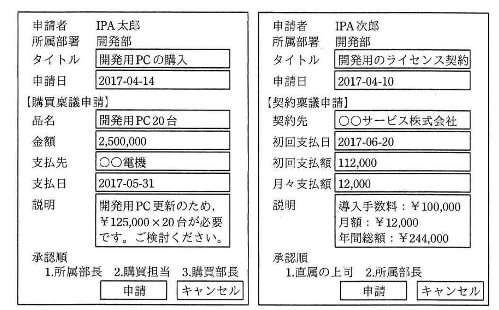
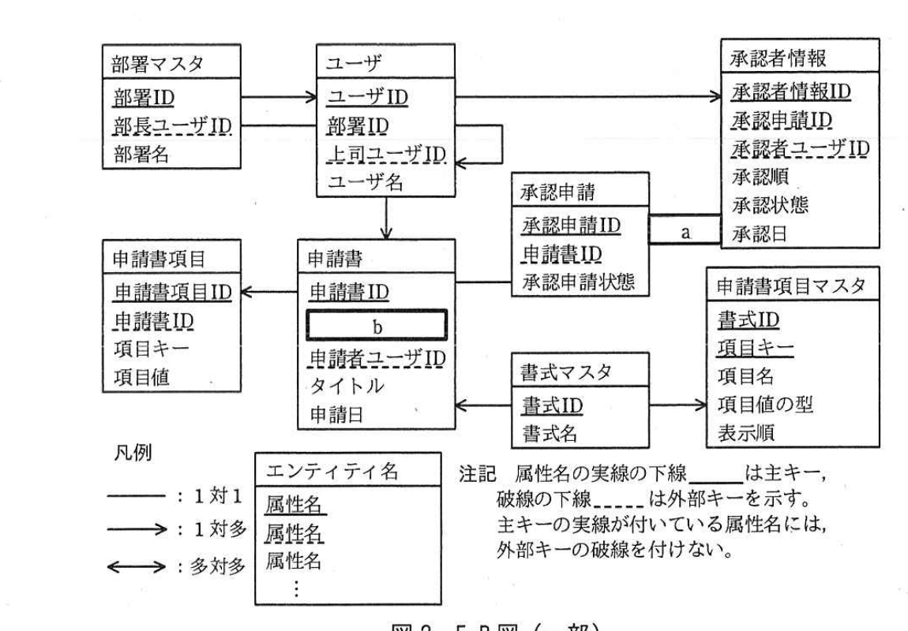

# 2017年春期（平成29年度）応用情報技術者試験 午後 問6（選択）
## データベース：稟議申請システム（S社）

---

## 問題文

**問6** 稟議申請システムに関する次の記述を読んで、設問1〜4に答えよ。

S社では、機器の購入や他社との契約の金額が10万円を超える場合には、承認権をもつ者による承認が必要である。承認を得る際、担当者は決まった書式に従った稟議申請書を作成し、稟議申請をする。

稟議申請には、大きく分けて購買稟議と契約稟議がある。購買稟議の場合は、申請者の所属部署の部長、購買部の担当者、購買部の部長の順で、承認が必要となる。また、契約稟議の場合は、申請者の直属の上司、所属部署の部長の順で、承認が必要となる。稟議申請書の書式は、購買稟議と契約稟議とで異なり、書式の種類は今後増える可能性がある。ただし、申請者自身が承認者になるような稟議申請は行えない。

S社では、これまで紙の帳票で稟議申請を行っていたが、社内業務を効率化するために、稟議申請システムを開発して、Webシステム上で稟議を行うことにした。

---

### 〔稟議申請システムの概要〕

稟議申請システムには、ログイン画面、作成画面、一覧画面及び詳細画面の四つの画面がある。

ログイン画面では、利用者がユーザIDとパスワードを入力し、ログインする。

作成画面では、申請者が稟議申請に必要な事項を入力し、申請する。

一覧画面では、現在申請されている稟議申請を一覧の形式で見ることができる。稟議申請の一覧には、自分が申請した稟議申請と、自分が承認者に含まれている稟議申請が表示される。一覧から稟議申請を選択すると詳細画面が表示される。

詳細画面では、稟議申請の内容と現在の承認の状態を確認できる。承認者が詳細画面を参照すると、稟議申請の内容のほかに承認入力欄が表示され、承認又は否認の入力を行うことができる。

---

### 〔作成画面〕

稟議申請は、書式ごとに必要な入力項目が一部異なる。申請者は、あらかじめ書式を選択してから内容を入力する。作成画面のレイアウトを図1に示す。

申請者は、稟議申請の内容を入力した後、申請を行う。承認の申請先は定義に従ってシステムが自動で設定するので、申請者が指定する必要はない。



> 購買稟議申請の作成画面例（申請者:IPA太郎、所属部署:開発部、タイトル:開発用PCの購入、申請日:2017-04-14、品名:開発用PC20台、金額:2,500,000、支払先:○○電機、支払日:2017-05-31、説明、承認順:1.所属部長 2.購買担当 3.購買部長）と、契約稟議申請の作成画面例（申請者:IPA次郎、所属部署:開発部、タイトル:開発用のライセンス契約、申請日:2017-04-10、契約先:○○サービス株式会社、初回支払日:2017-06-20、初回支払額:112,000、月々支払額:12,000、説明、承認順:1.直属の上司 2.所属部長）。

稟議申請の入力項目は申請書項目と呼ばれ、書式ごとに項目を一意に識別する項目キーと、項目値の組合せで管理される。項目の定義を表1に示す。

### 表1 申請書項目と項目キー

**購買稟議申請**

| 項目名 | 項目キー |
|---|---|
| 品名 | name |
| 金額 | amount |
| 支払先 | payee |
| 支払日 | pay_date |
| 説明 | description |

**契約稟議申請**

| 項目名 | 項目キー |
|---|---|
| 契約先 | contractor |
| 初回支払日 | start_date |
| 初回支払額 | pay_initial |
| 月々支払額 | pay_monthly |
| 説明 | description |

---

### 〔詳細画面〕

詳細画面では、図1の内容が編集不可の状態で表示される。また、現在ログイン中の利用者に承認順が回ってきている稟議申請の場合は、画面に承認コメントの入力欄と、承認・否認のボタンが表示される。

承認者は、稟議申請の内容を確認し検討した上で、必要に応じてコメントを入力し、承認又は否認のボタンを押す。稟議申請は、承認者全員が承認すると可決となり、承認者のうち1人が否認した時点で否決となる。稟議申請が否決された場合、申請者は内容を修正して再度申請するか、申請を取りやめるかを判断する。

---

### 〔データベースの設計〕

稟議申請システムのデータベースの設計を行った。設計したデータベースのE-R図を図2に、エンティティの概要を表2に示す。



> 部署マスタ（部署ID、部長ユーザID、部署名）→ユーザ（ユーザID、部署ID、上司ユーザID、ユーザ名）。ユーザは自己参照（上司ユーザID）をもつ。ユーザ→申請書（申請書ID、`[　b　]`、申請者ユーザID、タイトル、申請日）。申請書→申請書項目（申請書項目ID、申請書ID、項目キー、項目値）。申請書→承認申請（承認申請ID、申請書ID、承認申請状態）。承認申請`[　a　]`承認者情報（承認者情報ID、承認申請ID、承認者ユーザID、承認順、承認状態、承認日）。ユーザ→承認者情報。書式マスタ（書式ID、書式名）→申請書、書式マスタ→申請書項目マスタ（書式ID、項目キー、項目名、項目値の型、表示順）。凡例：実線は1対1、矢印線（→）は1対多、両矢印線（←→）は多対多。属性名の実線の下線は主キー、破線の下線は外部キーを示す。

### 表2 エンティティの概要（一部）

| エンティティ | 説明 |
|---|---|
| ユーザ | ユーザの情報を管理する。上司ユーザIDには、直属の上司のユーザIDを設定する。 |
| 申請書 | 1件の稟議申請についての情報を格納する。書式によらず共通の項目はこのエンティティにもち、書式ごとに異なる項目は申請書項目にもつ。 |
| 申請書項目 | 稟議申請の書式ごとに異なる項目の内容を、書式ごとに一意に特定する項目キーと、項目値の組合せで格納する。項目値は全て文字列で格納し、アプリケーション側で必要に応じて型を変換して用いる。 |
| 承認者情報 | 稟議申請の承認者の情報を管理する。承認状態には未承認、承認、否認があり、承認状態が未承認で、承認順の値が最も小さい承認者が、現在承認順が回ってきている承認者になる。 |
| 承認申請 | 稟議申請の承認申請状態を格納する。承認申請状態には承認中、可決、否決がある。 |

例えば図1の購買稟議申請の金額欄の場合、申請書項目マスタには、項目キーが'amount'、項目名が'金額'、項目値の型が'整数'のタプルが、申請書項目には、項目キーが'amount'、項目値が'2500000'のタプルが登録される。

このデータベースでは、E-R図のエンティティ名を表名にし、属性名を列名にして、適切なデータ型で表定義した関係データベースによって、データを管理する。

---

### 〔一覧画面〕

稟議申請の一覧画面には、申請書ID、タイトル、申請日、申請者のユーザ名及び所属部署名を表示する。画面に表示する情報を検索するSQL文を図3に示す。ログイン中の利用者のユーザIDは、埋込み変数":ユーザID"に設定されている。

```sql
SELECT 申請書.申請書ID, 申請書.タイトル, 申請書.申請日, ユーザ.ユーザ名, 部署マスタ.部署名
FROM 申請書 INNER JOIN 承認申請 ON 申請書.申請書ID = 承認申請.申請書ID
           INNER JOIN ユーザ ON 申請書.申請者ユーザID = ユーザ.ユーザID
           INNER JOIN 部署マスタ ON ユーザ.部署ID = 部署マスタ.部署ID
WHERE (承認申請.承認申請状態 NOT IN ('可決','否決')) AND
((申請書.申請者ユーザID = :ユーザID) OR
 (申請書.申請書ID IN (SELECT DISTINCT 申請書ID FROM 承認者情報 INNER JOIN 承認申請
   ON [　c　] WHERE [　d　] )))
```

図3 稟議申請を検索するSQL文

また、経理部からの要望で、可決された稟議申請について、金額と支払日の一覧を出力できる機能を追加することになった。ただし、契約稟議については初回支払額だけ出力されればよい。金額と支払日の一覧を検索するSQL文を図4に示す。購買稟議申請の書式IDは'購買'、契約稟議申請の書式IDは'契約'である。

```sql
SELECT 申請書.申請書ID, 申請書.タイトル, [　e　] AS 金額, [　f　] AS 支払日
FROM 申請書 INNER JOIN 申請書項目 t1 ON [　g　]
           INNER JOIN 申請書項目 t2 ON [　h　] ,承認申請
WHERE
((申請書.書式ID = '購買' AND t1.項目キー = 'amount' AND t2.項目キー = 'pay_date') OR
 (申請書.書式ID = '契約' AND t1.項目キー = 'pay_initial' AND t2.項目キー = 'start_date'))
AND (承認申請.申請書ID = 申請書.申請書ID AND 承認申請.承認申請状態 = '可決')
```

図4 金額と支払日の一覧を検索するSQL文

---

### 〔組織の改廃〕

運用開始後、利用者の部署異動や部署名の変更が行われることが想定されるが、システムの画面上で過去の稟議申請を参照した際には、申請時の情報が表示される必要がある。しかし、図2の設計では①この要件を満たせない部分があるので、あるエンティティに属性を追加すると同時に図3のSQL文も修正することにした。

---

## 設問

### 設問1 図2のE-R図中の`[　a　]`、`[　b　]`に入れる適切なエンティティ間の関連及び属性名を答え、E-R図を完成させよ。ここで、エンティティ間の関連及び属性名の表記は図2の凡例に倣うこと。

### 設問2 図3中の`[　c　]`、`[　d　]`に入れる適切な字句又は式を答えよ。

### 設問3 図4中の`[　e　]`〜`[　h　]`に入れる適切な字句又は式を答えよ。

### 設問4 本文中の下線①について、どのエンティティに何の属性を追加したかを答えよ。

---

## 解答と解説

### 設問1

**正解：a = →（承認申請から承認者情報への1対多）、b = 書式ID**

承認申請1件に対して承認者情報は複数（承認順に複数の承認者）存在するので、承認申請と承認者情報の関連は1対多であり、**a = →**（承認申請→承認者情報）である。申請書は、どの書式（書式マスタ）で作成されたかを特定する必要があるため、申請書エンティティには書式マスタの主キーである**書式ID**（b）を外部キーとしてもつ必要がある。

**IPA公式：a=→、b=書式ID**

---

### 設問2

**正解：c = 承認者情報.承認申請ID = 承認申請.承認申請ID、d = 承認者情報.承認者ユーザID = :ユーザID**

このサブクエリは、ログイン中のユーザが承認者に含まれている稟議申請の申請書IDを取得するものである。承認者情報と承認申請を結合する条件は、承認者情報がどの承認申請に属するかを表す**承認者情報.承認申請ID = 承認申請.承認申請ID**（c）である。抽出条件は、ログイン中のユーザが承認者であることを示す**承認者情報.承認者ユーザID = :ユーザID**（d）である。

**IPA公式：c=承認者情報.承認申請ID = 承認申請.承認申請ID、d=承認者情報.承認者ユーザID = :ユーザID**

---

### 設問3

**正解：e = t1.項目値、f = t2.項目値、g = 申請書.申請書ID = t1.申請書ID、h = 申請書.申請書ID = t2.申請書ID**

購買稟議では金額(amount)と支払日(pay_date)、契約稟議では初回支払額(pay_initial)と初回支払日(start_date)を、それぞれ申請書項目テーブルを2回結合（t1、t2のエイリアス）することで取得する。金額に相当する列は**t1.項目値**（e）、支払日に相当する列は**t2.項目値**（f）である。t1、t2ともに申請書項目テーブルなので、申請書との結合条件はそれぞれ**申請書.申請書ID = t1.申請書ID**（g）、**申請書.申請書ID = t2.申請書ID**（h）となる。

**IPA公式：e=t1.項目値、f=t2.項目値、g=申請書.申請書ID = t1.申請書ID、h=申請書.申請書ID = t2.申請書ID**

---

### 設問4

**正解：エンティティ = 申請書、属性 = 申請時部署名**

組織改廃（部署異動・部署名変更）が発生しても、過去の稟議申請の画面には申請当時の所属部署名が表示される必要がある。しかし、図2の設計では、申請者の所属部署名はユーザ→部署マスタの現在の関連からその都度取得されるため、部署異動や部署名変更後には申請時と異なる部署名が表示されてしまう。そこで、**申請書**エンティティに、申請時点の部署名を保持する**申請時部署名**属性を追加し、以降は申請書に格納された値を表示するようにSQL文（図3）も修正する必要がある。

**IPA公式：エンティティ　申請書／属性　申請時部署名**

---

## 参考：主要キーワード

| 用語 | 説明 |
|------|------|
| EAV（Entity-Attribute-Value）型設計 | 書式ごとに異なる項目を、項目キーと項目値の組合せで汎用的に格納する設計手法。書式の追加に柔軟に対応できる |
| E-R図とカーディナリティ | エンティティ間の関連の多重度（1対1、1対多、多対多）を表す図。承認申請と承認者情報のように「1件に対して複数」の関係は1対多で表現する |
| サブクエリ（IN句） | あるクエリの結果をWHERE句の条件として利用するSQLの技法。「自分が承認者に含まれる稟議申請」のような間接的な絞り込みに使われる |
| 履歴情報のスナップショット | 参照先のマスタデータが変更されても、申請時点の情報を正しく表示するために、申請時の値を別途保持しておく設計上の工夫（正規化を崩してでも履歴を残す） |
| テーブルの自己結合（エイリアス） | 同一テーブルを異なる項目キーの条件で2回結合するために、t1・t2のようなエイリアス（別名）を用いる手法 |
