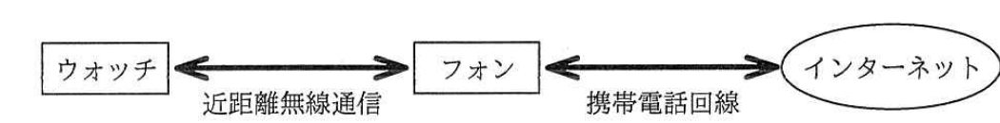
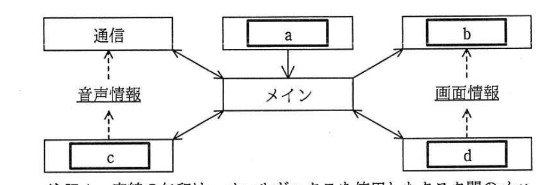

# 2017年春期（平成29年度）応用情報技術者試験 午後 問7（選択）
## 組込みシステム開発：スマートウォッチ（G社）

---

## 問題文

**問7** スマートウォッチに関する次の記述を読んで、設問1〜3に答えよ。

G社は、腕時計型のスマートウォッチ（以下、ウォッチという）を開発している。ウォッチは、スマートフォン（以下、フォンという）と連携して、電子メール（以下、メールという）の内容表示などを行う。ウォッチとフォンから成るシステムの構成を図1に示す。ウォッチは、フォンを経由してインターネットに接続できる。

> ウォッチ ←（近距離無線通信）→ フォン ←（携帯電話回線）→ インターネット

---

### 〔ウォッチの構成〕

ウォッチは、MPU及び日付時刻用タイマを内蔵しており、マイク、通信部、画面表示部及び音声入力スイッチを備えている。画面表示部には、タッチパネルが付随している。

---

### 〔ウォッチの機能〕

ウォッチは、タッチパネルへのタッチとマイクへの音声入力によって、機能を切り替えることができる。ウォッチの機能を表1に示す。

### 表1 ウォッチの機能

| 機能 | 概要 |
|---|---|
| 時計 | 現在の日付及び時刻を表示する。 |
| メール表示 | フォンが受信したメールの内容を表示する。 |
| 着信情報表示 | フォンに着信した電話の発信者情報を表示する。 |
| 天気予報 | 天気予報情報を表示する。天気予報情報は、フォンから送信される。 |

---

### 〔ウォッチの動作仕様〕

ウォッチは、利用者の操作及びフォンからの通信によって、次のとおり動作する。

- 電源が投入されると、時計機能を実行する。
- フォンから時計表示指示、メール受信通知、電話着信通知又は天気予報表示指示を受信すると、対応する表1中の機能を実行する。
- タッチパネルへのタッチを認識すると、機能選択画面を表示する。機能選択画面では、"時計"及び"天気予報"の二つのボタンが表示される。ボタンへのタッチを認識すると、対応する表1中の機能を実行する。
- 機能選択画面では、ボタン以外の部分へのタッチは無効である。
- 利用者が音声入力スイッチを押すと、フォンに対して音声受付開始通知を送信し、利用者が音声入力スイッチを押し続けている間は、音声受付状態となる。音声受付状態では、音声受付画面を表示し、マイクが感知した音声を、フォンに送信する。利用者が音声入力スイッチを離すと、音声受付状態は解除される。
- 音声受付状態では、タッチパネルへのタッチは無効である。
- 音声受付状態で、フォンから各種通知又は指示を受信した場合は、音声受付状態は解除され、受信した通知又は指示に対応する、表1中の機能を実行する。この一連の処理の間、利用者が音声入力スイッチを離さずに押し続けていたとしても、音声受付状態は解除されたままである。再びウォッチを音声受付状態にするには、利用者は、一度、音声入力スイッチを離して、再度、押す必要がある。

---

### 〔フォンにおける音声処理〕

フォンは、ウォッチから音声受付開始通知を受信すると、音声処理アプリケーションを起動して、ウォッチからの音声情報の受信を待つ。

ウォッチから音声情報を受信すると、音声処理アプリケーションは、受信した音声情報を解析する。解析の結果、"時計"という音声を認識した場合には、ウォッチに時計表示指示を送信する。"天気"という音声を認識した場合には、ウォッチに天気予報表示指示を送信する。いずれの音声も認識できなかった場合には何もしない。

---

### 〔ウォッチのソフトウェア構成〕

ウォッチは、イベントドリブンプリエンプション方式のリアルタイムOSを使用する。ウォッチのタスク構造を図2に、ウォッチのタスク一覧を表2に、ウォッチの割込みハンドラ一覧を表3に、それぞれ示す。

> メインタスクを中心に、通信タスク・`[　a　]`タスク（上）・`[　b　]`タスク・`[　c　]`タスク・`[　d　]`タスクが実線矢印（メールボックスによるタスク間メッセージ通信）と破線矢印（メモリへの書込み／読出し：音声情報、画面情報）で接続される。通信タスクとメインタスク間は音声情報のメモリを介して`[　c　]`タスクとも連携し、`[　b　]`タスクとメインタスク間は画面情報のメモリを介して`[　d　]`タスクとも連携する。

### 表2 ウォッチのタスク一覧

| タスク名 | 処理概要 |
|---|---|
| メイン | ・ウォッチ全体を制御し、ウォッチの機能を実行する。 －画面の更新が必要な場合、必要な情報を画面作成タスクに通知する。 －画面作成タスクから画面作成完了通知を受けると、画面更新指示を画面表示タスクに通知する。 －画面入力タスクから受けた座標情報に応じた処理を行う。 －適切なタイミングで、タッチ操作割込みのマスクを解除する。 －音声入力開始通知を受けると、音声情報送信開始指示を通信タスクに通知する。 －音声入力終了通知を受けると、音声情報送信終了指示を通信タスクに通知する。 －フォンからの通知又は指示を受信すると、音声入力終了指示を音声入力タスクに通知する。 |
| 画面作成 | ・メインタスクから受けた情報を基に、表示画面を作成し、画面情報に書き込む。その後、画面作成完了通知をメインタスクに通知する。 |
| 画面表示 | ・画面情報の内容を基に、画面の更新を行う。 |
| 通信 | ・フォンとの通信を管理する。 |
| 画面入力 | ・タッチを認識した箇所の座標情報を、メインタスクに通知する。 |
| 音声入力 | ・割込みハンドラから起床されると、音声入力開始通知をメインタスクに通知し、音声情報書込処理を開始する。 ・音声情報書込処理では、入力された音声を、サンプリング周波数8kHz、量子化ビット数16ビット、チャネル数1チャネルのデータとして、音声情報に書き込む。 ・音声情報書込処理を実行中に、音声入力スイッチが離されたことを検知すると、音声情報書込処理を終了し、音声入力終了通知をメインタスクに通知する。 ・音声入力終了指示を受けると、音声情報書込処理を終了する。 |

### 表3 ウォッチの割込みハンドラ一覧

| ハンドラ名 | 処理概要 |
|---|---|
| タッチ操作 | ・タッチパネルへのタッチによって起動される。 ・タッチ操作割込みをマスクし、画面入力タスクを起床する。 |
| 音声入力スイッチ | ・音声入力スイッチが押されると、起動される。 ・タッチ操作割込みをマスクし、音声入力タスクを起床する。 |
| 受信 | ・フォンから各種通知又は指示を受信したとき、起動される。 ・タッチ操作割込みをマスクし、通信タスクを起床する。 |

---

## 設問

### 設問1 利用者が、ウォッチに対して"天気"と発声したのに、天気予報機能が実行されなかった。実行されなかった原因として当てはまらないものを、解答群の中から選び、記号で答えよ。

**解答群：**
ア　ウォッチが、音声を正しく取得できなかった。
イ　ウォッチとフォンとの間の通信に失敗した。
ウ　音声入力スイッチが押されていなかった。
エ　音声入力の途中で、利用者がウォッチのタッチパネルにタッチした。

### 設問2 音声入力タスクが音声情報に書き込むデータの、1秒間のデータサイズは何kバイトになるか。答えは小数第1位を切り上げて、整数で答えよ。ここで、1kバイト＝1,000バイトとする。

### 設問3 ウォッチのソフトウェアについて、(1)〜(3)に答えよ。

(1) 図2中の`[　a　]`〜`[　d　]`に入れる適切なタスク名を答えよ。

(2) 割込みマスクに関する次の記述中の`[　e　]`、`[　f　]`に入れる適切な字句を答えよ。

割込みハンドラとメインタスクは、どちらもタッチ操作割込みのマスクを操作している。これは、例えば、ウォッチがフォンからメール受信通知を受信した直後に、利用者がウォッチのタッチパネルにタッチした場合の不都合を避けるためである。その不都合とは、`[　e　]`を表示した後、利用者が表示された`[　e　]`を確認する前に、画面が`[　f　]`に切り替わってしまうことである。

(3) タスクの動作に関する次の記述中の`[　g　]`に入れる適切な字句を答えよ。また、次の記述中の、"意図しない現象"とはどのような現象か。15字以内で述べよ。

画面表示タスクが画面の更新を行っているときに、画面作成タスクが動作を開始すると、意図しない現象が発生した。この問題を解決するために、画面表示タスクが画面の更新を行っているときに、画面作成タスクが動作を開始しないように、それぞれのタスクの`[　g　]`を、適切に設定した。

---

## 解答と解説

### 設問1

**正解：エ（音声入力の途中で、利用者がウォッチのタッチパネルにタッチした。）**

〔ウォッチの動作仕様〕より、音声受付状態ではタッチパネルへのタッチは無効であるため、音声入力の途中でタッチパネルにタッチしても、音声認識処理そのものには影響しない。したがって、エは天気予報機能が実行されなかった原因として**当てはまらない**。ア（音声を正しく取得できなかった）、イ（ウォッチ・フォン間の通信失敗）、ウ（音声入力スイッチが押されていなかった＝音声受付状態にならない）はいずれも天気予報機能が実行されない原因となり得る。

**IPA公式：エ**

---

### 設問2

**正解：16（kバイト）**

サンプリング周波数8kHz（1秒間に8,000サンプル）、量子化ビット数16ビット（＝2バイト）、チャネル数1チャネルなので、1秒間のデータサイズ＝8,000×2×1＝16,000バイト＝**16**kバイトとなる。

**IPA公式：16**

---

### 設問3

**(1) 正解：a = 画面入力、b = 画面表示、c = 音声入力、d = 画面作成**

図2で、メインタスクへ座標情報を送るのは画面入力タスクなので、上部の矢印（メインへの入力）は**画面入力**（a）である。画面情報を介してメインタスクとやり取りし、画面の更新を行うのは**画面表示**（b）タスクである。音声情報を介して通信タスクとやり取りするのは**音声入力**（c）タスクである。画面情報に書き込みを行い、メインタスクとメッセージ通信するのは**画面作成**（d）タスクである。

**IPA公式：a=画面入力、b=画面表示、c=音声入力、d=画面作成**

**(2) 正解：e = メールの内容、f = 機能選択画面**

フォンからメール受信通知を受けると、メインタスクは画面作成タスクにメール表示画面（**メールの内容**、e）の作成を指示し、画面表示タスクがこれを表示する。この直後に利用者がタッチパネルにタッチすると、タッチ操作割込みハンドラが起動して画面入力タスクが起床し、メインタスクの制御によって画面が**機能選択画面**（f）に切り替わってしまう。利用者がメールの内容を確認する前に画面が切り替わってしまうという不都合を避けるため、割込みハンドラとメインタスクの双方でタッチ操作割込みのマスク／マスク解除のタイミングを制御している。

**IPA公式：e=メールの内容、f=機能選択画面**

**(3) 正解：g = 優先度、現象 = 複数画面が混在表示される。**

画面表示タスクによる画面更新中に画面作成タスクが動作を開始してしまうと、画面情報（共有メモリ）に対して同時に読み書きが行われ、更新途中の画面と新たに作成中の画面の内容が混在して表示されてしまう。これを防ぐには、画面表示タスクの実行中は画面作成タスクが動作を開始しないように、それぞれのタスクの**優先度**（g）を適切に設定し、優先度の高いタスクの実行中に低いタスクへ処理が切り替わらないようにする必要がある。"意図しない現象"とは、この結果として生じる**複数画面が混在表示される**現象である。

**IPA公式：g=優先度、現象　複数画面が混在表示される。**

---

## 参考：主要キーワード

| 用語 | 説明 |
|------|------|
| イベントドリブンプリエンプション方式 | イベント（割込み等）の発生に応じてタスクを起床させ、優先度に基づき実行中のタスクを中断してでも高優先度タスクを実行する、リアルタイムOSの代表的なタスク切り替え方式 |
| 割込みハンドラとタスクの起床 | 割込み発生時に短時間で実行される処理（ハンドラ）が対応するタスクを起床させ、実際の処理はタスク側に委譲する設計パターン |
| 割込みマスク | 特定の割込みを一時的に禁止する制御。処理の排他性を確保するため、割込みハンドラとタスクの双方でマスク／解除のタイミングを調整する必要がある |
| タスクの優先度制御 | 複数タスクが共有資源（画面情報など）に同時アクセスすることによる不整合を防ぐため、優先度を適切に設定してタスクの実行順序・排他性を制御する |
| PCM音声データサイズ | サンプリング周波数×量子化ビット数(バイト換算)×チャネル数で1秒当たりのデータ量を算出できる（本問では8kHz×2バイト×1ch=16kバイト/秒） |
