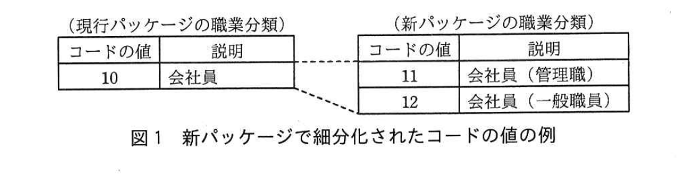

# 2017年春期（平成29年度）応用情報技術者試験 午後 問9（選択）
## プロジェクトマネジメント：システムの移行レビュー（P社）

---

## 問題文

**問9** システムの移行レビューに関する次の記述を読んで、設問1、2に答えよ。

P社は、家電量販店を営む会社である。約20店舗での店頭販売に加え、インターネットや電話による通信販売を行っている。電話応対は、コールセンタに勤務する約50名のオペレータが、商品の注文受付、問合せ対応などの業務を行っている。

---

### 〔コールセンタの新CTIシステム開発プロジェクトの概要〕

現在P社で運用しているコールセンタのシステム（以下、現行システムという）は、コンピュータと電話を統合したCTIシステムであり、Q社が提供するソフトウェアパッケージ（以下、現行パッケージという）を導入している。現行システムは、顧客の属性情報や購買履歴などを管理するCRMシステムや商品在庫管理システムなどの関連システムと、オンライン処理又はバッチ処理でデータ連携している。

現行システムのハードウェアが年度末に保守期限を迎えるので、Q社が新たに開発したソフトウェアパッケージ（以下、新パッケージという）に更改することに決め、新CTIシステム（以下、新システムという）開発プロジェクトを立ち上げた。プロジェクトマネージャにはシステム部開発課のX課長が選任された。プロジェクトのスコープは、現行パッケージに施されていたP社独自のカスタマイズを新パッケージに取り込んで導入すること、及び既存の関連システムとデータ連携できるようにすることである。

今回、新たなP社独自のカスタマイズ要件はない。新パッケージでは、主要なデータベース（以下、DBという）の一つである顧客属性管理テーブルの一部のコードの値が細分化された。新システムでは、新パッケージのコードの値を使用するが、今回は関連システムとの接続仕様を変更せず、新パッケージのコードの値を現行パッケージのコードの値に変換してから関連システムに引き渡すことにした。新パッケージで細分化されたコードの値の例を、図1に示す。

> 現行パッケージの職業分類：コード10「会社員」。新パッケージの職業分類：コード11「会社員（管理職）」、コード12「会社員（一般職員）」。新パッケージのコード11・12は、いずれも現行パッケージのコード10に対応する（破線で対応関係を表示）。

---

### 〔移行判定会議の開催と報告〕

プロジェクトは順調に進み、システム適格性確認テスト（以下、システムテストという）、運用者による受入れテスト（以下、運用テストという）及び利用者による受入れテストが終了したので、新システムへの移行の可否を判定する会議（以下、移行判定会議という）を開催することになった。X課長は、前工程のソフトウェア適格性確認テストの終了判定会議への出席者に加え、プロジェクトオーナであるE常務、プロジェクト責任者であるシステム部のF部長、営業部のG部長、及び①コールセンタの責任者であるHセンタ長に出席を依頼するように、部下のW君に指示した。

移行判定会議では、各担当リーダから次のとおり報告があった。

**(1) システムテストの実施結果及び評価（報告者：X課長）**

- システムテストの実施と検証、及び検出したバグの対応を完了した。バグ検出件数、バグ検出密度ともP社の品質基準を満たした。バグの検出状況を分析した結果、異常はなかった。
- システムテストは、新システムが稼働を予定している環境を使用して実施した。性能テストでは、関連システムも時間帯を調整して稼働環境を使用する予定であったが、商品在庫管理システムだけは時間帯の調整ができなかった。商品在庫管理システムのテスト環境の構成を調べたところ、性能テストをテスト環境で実施しても問題ないと判断できたので、稼働環境と同一のソフトウェアとDBをコピーしてテストを行った。
- 業務機能のテストでは、業務要件に基づく業務フローの正当性を、関連システムを含めて検証した。さらに、新システムで現行機能が正しく動作することを保証するために、新パッケージにおけるコードの値の細分化を考慮した上で現行システムと新システムに同一データを投入し、主要なテーブルの処理結果を比較した。②顧客属性管理テーブルのコードの値を自動的に比較するために、比較検証ツールを作成して検証を行った。結果は良好であった。
- 性能要件やデータボリューム要件など、`[　a　]`を満たしていることを検証するテストでの実測結果は目標値を満たし、システム全体の処理性能やデータボリュームに関する問題はなかった。
- 新システムのメンテナンスマニュアルを整備し、保守チームに引き継いだ。

**(2) 運用テストの評価（報告者：システム部運用課C課長）**

- システム部運用課の担当者も参加してテストを行い、結果は良好であった。
- 新システムの運用スケジュール、手順書、障害発生時の連絡体制など、必要なドキュメントを全て作成し、システム運用担当者に説明済みである。

**(3) 利用者による受入れテストの評価（報告者：X課長、コールセンタDリーダ）**

- 顧客属性管理画面のレイアウトが見づらいなどの指摘が2件あった。業務運用への影響は軽微なので、稼働後にプログラムを改修することを条件にHセンタ長から了承を得た。これらは、申し送り事項として管理する（X課長）。
- 新システムを使用して業務運用を行った。新パッケージの新機能や関連システムとの連動処理など、全ての業務を問題なく実施することができた（Dリーダ）。

**(4) 利用者訓練の状況と評価（報告者：Dリーダ）**

- コールセンタのオペレータの運用訓練を完了した。訓練のカリキュラムに従った業務運用を行い、参加者全員が一定の水準に達したことを確認した。
- 新システムの業務オペレーションマニュアルを整備した。

**(5) 移行計画（報告者：X課長）**

- 稼働開始前日の業務終了後、現行システムから新システムへ移行する。
- 稼働開始日の午前9時に、新システムのサービスを開始する。
- 移行作業に必要な時間は、十分に確保している。
- 新システムの稼働開始日に、現行システムの運用を停止する。

**(6) `[　b　]`の達成度確認（報告者：F部長）**

- 新システムの品質と性能、利用者の業務運用の習得度が、移行可能な基準に達しており、移行作業の準備が十分であることを確認した。

---

### 〔移行判定会議での指摘事項〕

各担当リーダからの報告後、次の質疑応答があった。

**G部長：** 新システムへの移行及び稼働開始時に、不測の事態が発生した場合の`[　c　]`とその発動条件を定めていますか。

**X課長：** はい。F部長に承認していただいたものを、文書化して共有しています。

**F部長：** 性能テストで、商品在庫管理システムはテスト環境を使用して実施しても問題ないと判断した理由を説明してください。

**X課長：** 商品在庫管理システムのテスト環境の構成を調べ、`[　d　]`であることを確認できたからです。

**F部長：** ③新システムの稼働後に行うシステム関連作業を整理してください。

**X課長：** 承知しました。引継ぎが必要な場合は、打合せを設定します。

E常務は、会議の報告内容と`[　b　]`の達成度から、新システムの稼働までに対応すべき残課題を解決することを条件に、新システムへの移行を承認した。

また、X課長は、F部長からの指摘を受けて、新システムが安定稼働していることを確認した後に実施すべきである`[　e　]`の計画を策定することにした。そこで、運用及び保守の組織だけでなく利用者も参加させて、この活動を開始した。

---

## 設問

### 設問1 〔移行判定会議の開催と報告〕について、(1)〜(3)に答えよ。

(1) 本文中の下線①について、X課長がHセンタ長を移行判定会議の出席者に選定した理由を、解答群の中から二つ選び、記号で答えよ。

**解答群：**
ア　オペレータが新システムで業務を行えると判断したことを報告するから
イ　コールセンタ業務への指摘事項に対するシステムの改修を指示するから
ウ　新システム稼働後の顧客満足の向上施策結果を報告するから
エ　利用者による受入れテストの評価に基づいて、システム品質が妥当であると判断したことを報告するから
オ　利用部門の責任者として、新システムへの業務要件を要求するから

(2) 本文中の下線②について、比較検証ツールの機能仕様を40字以内で述べよ。

(3) 本文中の`[　a　]`、`[　b　]`に入れる適切な字句を解答群の中から選び、記号で答えよ。

**解答群：**
ア　QMS　　イ　WBS
ウ　機能要件　　エ　ソフトウェア導入基準
オ　導入可否判断基準　　カ　非機能要件

### 設問2 〔移行判定会議での指摘事項〕について、(1)〜(4)に答えよ。

(1) 本文中の`[　c　]`に入れる適切な字句を答えよ。

(2) 本文中の`[　d　]`に入れる適切な字句を、25字以内で述べよ。

(3) 本文中の下線③について、ソフトウェアの保守作業担当者に引き継ぐべき事項を、30字以内で述べよ。

(4) 本文中の`[　e　]`に入れる適切な字句を、15字以内で答えよ。

---

## 解答と解説

### 設問1

**(1) 正解：ア、エ**

Hセンタ長は、コールセンタの責任者として利用者による受入れテスト（オペレータによる新システムでの業務運用テスト）の当事者である。移行判定会議に出席する理由は、**ア　オペレータが新システムで業務を行えると判断したことを報告するから**、及び**エ　利用者による受入れテストの評価に基づいて、システム品質が妥当であると判断したことを報告するから**である。イ・ウ・オは、Hセンタ長の役割（利用者受入れテスト結果の報告・承認）とは異なる内容である。

**IPA公式：ア，エ**

**(2) 正解例：新パッケージのコードの値を現行パッケージのコードの値に変換する。**

比較検証ツールは、新パッケージで細分化されたコードの値（図1の例では11、12）を、現行パッケージのコードの値（10）に変換した上で、現行システムと新システムの処理結果を比較する必要がある。したがって機能仕様は、**新パッケージのコードの値を現行パッケージのコードの値に変換する**機能である。

**IPA公式：新パッケージのコードの値を現行パッケージのコードの値に変換する。**

**(3) 正解：a = カ（非機能要件）、b = オ（導入可否判断基準）**

性能要件やデータボリューム要件は、機能そのものではなくシステムの品質特性に関する要件であるため**非機能要件**（カ、a）に分類される。会議(6)で報告される「品質と性能、習得度が移行可能な基準に達しているか」を確認する項目は、新システムへの移行可否を判断するための基準、すなわち**導入可否判断基準**（オ、b）である。

**IPA公式：a=カ、b=オ**

---

### 設問2

**(1) 正解例：緊急時対応計画**

不測の事態が発生した場合の対応方針とその発動条件を事前に定めておくものは、**緊急時対応計画**（コンティンジェンシープラン）である。

**IPA公式：c=緊急時対応計画**

**(2) 正解例：テスト環境の容量・能力が稼働環境と同等**

X課長は、商品在庫管理システムのテスト環境の構成を調べ、性能テストを実施しても問題ないと判断できる根拠を確認したと述べている。これは、**テスト環境の容量・能力が稼働環境と同等**であることを確認できたためである。

**IPA公式：テスト環境の容量・能力が稼働環境と同等**

**(3) 正解例：利用者による受入れテストで指摘されたプログラム改修**

〔移行判定会議の開催と報告〕(3)より、顧客属性管理画面のレイアウトについて指摘があり、稼働後にプログラムを改修することが申し送り事項として管理されている。この稼働後に行うシステム関連作業として、ソフトウェアの保守作業担当者に引き継ぐべき事項は、**利用者による受入れテストで指摘されたプログラム改修**である。

**IPA公式：利用者による受入れテストで指摘されたプログラム改修**

**(4) 正解例：現行システムの廃棄**

新システムが安定稼働していることを確認した後に実施すべき活動であり、運用・保守の組織だけでなく利用者も参加させて計画するものは、旧環境の後始末に当たる**現行システムの廃棄**である。

**IPA公式：e=現行システムの廃棄**

---

## 参考：主要キーワード

| 用語 | 説明 |
|------|------|
| 移行判定会議 | システムテスト・運用テスト・利用者受入れテストの結果を基に、新システムへの移行可否を関係者が判定する会議 |
| 導入可否判断基準 | 品質・性能・利用者の習熟度・移行準備状況など、システム移行を承認するために事前に定めておく評価基準 |
| 緊急時対応計画（コンティンジェンシープラン） | 移行・稼働開始時に不測の事態が発生した場合の対応方針と、その発動条件をあらかじめ定めた計画 |
| 非機能要件 | 性能要件・データボリューム要件・可用性など、機能そのものではなくシステムの品質特性に関する要件 |
| コードの値の細分化と変換 | パッケージ更改でマスタコードが細分化された場合、既存の関連システムとの接続仕様を変えずに連携するため、新コードを旧コードに変換してから引き渡す設計対応 |
| システム廃棄計画 | 新システムの安定稼働を確認した後に実施する、旧システムの廃棄に関する計画。運用・保守部門だけでなく利用者も交えて策定する |
