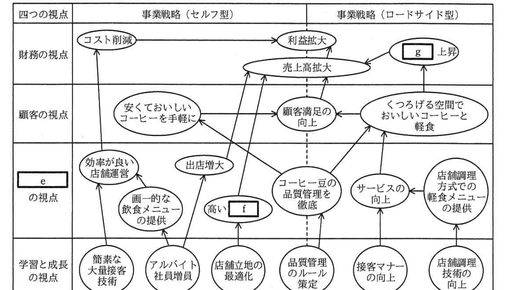

# 2017年春期（平成29年度）応用情報技術者試験 午後 問2（選択）
## 経営戦略：経営分析とバランススコアカード（A社／B社／C社）

---

## 問題文

**問2** 経営分析とバランススコアカードに関する次の記述を読んで、設問1、2に答えよ。

A社グループは、セルフサービス方式（以下、セルフ型という）のコーヒー店チェーンを全国展開するA社と、ファミリーレストランチェーンを展開するA社の子会社で構成される大手の外食グループである。セルフ型は、顧客回転率を上げて来客数を増やすために、店舗の立地環境が他の業種に比べて重要である。A社は、長年にわたって出店数を増加させ続けたことによって、駅前やオフィス街を中心に約900の直営コーヒー店舗を展開してきた。主な顧客は会社員や学生である。

喫茶店市場では縮小傾向が続いているが、A社は長年業界トップグループの位置を維持している。しかし、コンビニエンスストアが安価でおいしいコーヒーの販売を開始したので、対抗策として新機軸の戦略を打ち出すことにした。

---

### 〔B社との比較による現状確認〕

現状を確認するために、A社と同じセルフ型コーヒー店チェーンを運営するB社をベンチマークとして比較検討を行った。B社は、海外の最大手コーヒー店チェーン運営会社と日本国内において独占的にフランチャイズ契約を結び、全て直営で約600店舗を展開している。A社と出店地域は似ているが、B社はおしゃれな雰囲気や全席を禁煙とすることで、若者や女性の支持を得ている。コーヒーの単価はA社よりも5割程度高い。前年度末のA社（コーヒー店チェーン事業単体）とB社の貸借対照表、損益計算書、及び諸指標の比較を表1〜4に示す。

### 表1 A社の貸借対照表（単位：百万円）

| 資産の部 | | 負債の部 | |
|---|---|---|---|
| 流動資産 | 31,000 | 流動負債 | 11,000 |
| 　現金及び預金 | 22,000 | 　買掛金 | 4,000 |
| 　売掛金 | 4,000 | 　その他 | 7,000 |
| 　有価証券 | - | 固定負債 | 4,000 |
| 　棚卸資産 | 2,000 | | |
| 　繰延税金資産 | 1,000 | （純資産の部） | 58,000 |
| 　その他 | 2,000 | 株主資本 | 58,000 |
| 固定資産 | 42,000 | 　資本金 | 7,000 |
| 　有形固定資産 | 26,000 | 　資本剰余金 | 17,000 |
| 　無形固定資産 | 1,000 | 　利益剰余金 | 34,000 |
| 　投資その他の資産 | 15,000 | | |
| 資産合計 | 73,000 | 負債・純資産合計 | 73,000 |

> ※問題冊子内の正誤表により「繰延税金資金」→「繰延税金資産」、「投資その他資産」→「投資その他の資産」に修正済み。

### 表2 B社の貸借対照表（単位：百万円）

| 資産の部 | | 負債の部 | |
|---|---|---|---|
| 流動資産 | 20,000 | 流動負債 | 13,000 |
| 　現金及び預金 | 11,000 | 　買掛金 | 2,000 |
| 　売掛金 | 3,000 | 　その他 | 11,000 |
| 　有価証券 | 2,000 | 固定負債 | 3,000 |
| 　棚卸資産 | 2,000 | | |
| 　繰延税金資金 | 1,000 | （純資産の部） | 28,000 |
| 　その他 | 1,000 | 株主資本 | 28,000 |
| 固定資産 | 24,000 | 　資本金 | 5,000 |
| 　有形固定資産 | 10,000 | 　資本剰余金 | 7,000 |
| 　無形固定資産 | 1,000 | 　利益剰余金 | 16,000 |
| 　投資その他資産 | 13,000 | | |
| 資産合計 | 44,000 | 負債・純資産合計 | 44,000 |

### 表3 A社とB社の損益計算書（単位：百万円）

| 項目 | A社 | B社 |
|---|---|---|
| 売上高 | 72,000 | 79,000 |
| 売上原価 | 32,000 | 23,000 |
| 　売上総利益 | 40,000 | 56,000 |
| 販売費及び一般管理費 | 35,000 | 49,000 |
| 　人件費 | 12,000 | 21,000 |
| 　賃借料及び水道光熱費 | 10,000 | 19,000 |
| 　その他 | 13,000 | 9,000 |
| 　営業利益 | 5,000 | 7,000 |
| 営業外収益 | 400 | 200 |
| 営業外費用 | 100 | 100 |
| 　経常利益 | 5,300 | 7,100 |
| 特別利益 | 300 | 300 |
| 特別損失 | 700 | 800 |
| 　税引前当期純利益 | 4,900 | 6,600 |
| 法人税等の税金等 | 2,100 | 2,800 |
| 　当期純利益 | 2,800 | 3,800 |

> ※正誤表により「税金等調整前当期純利益」→「税引前当期純利益」に修正済み。

### 表4 A社とB社の諸指標の比較

| 指標 | A社 | B社 |
|---|---|---|
| 自己資本比率（％） | 79.5 | 63.6 |
| 流動比率（％） | `[　a　]` | （省略） |
| 固定比率（％） | 72.4 | 85.7 |
| 総資本回転率（回転） | 0.99 | 1.80 |
| 固定資産回転率（回転） | `[　b　]` | （省略） |
| ROE（％） | 4.8 | 13.6 |
| ROA（％） | `[　c　]` | （省略） |
| 売上高総利益率（％） | 55.6 | 70.9 |
| 売上高営業利益率（％） | 6.9 | 8.9 |
| 売上高経常利益率（％） | 7.4 | 9.0 |
| 売上高当期純利益率（％） | 3.9 | 4.8 |
| 店舗平均売上高（千円／年） | 77,000 | 130,000 |
| 店舗数（店） | 935 | 606 |
| 店舗平均席数（席） | 42 | 76 |
| 店舗平均来店客数（人／日） | 703 | 635 |

> ※正誤表により「総資本回転率（％）」→「総資本回転率（回転）」に修正済み。

安全性の視点から見ると、両社とも自己資本比率、流動比率が高く、固定比率は低い。さらに、固定負債額も小さいので、短期、長期ともに問題がないといえる。

収益性の視点から見ると、両社の売上高総利益率の差が大きい。A社は、世界中の主要生産地からコーヒー豆を買い付け、直火式焙煎を大量に行う仕組みを確立している。コーヒー豆の品質管理を徹底することで、おいしいコーヒーを提供することができ、それが顧客満足の向上につながっている。しかし、このためのコストに対し、コーヒーの単価を低く設定しているので、売上高総利益率が低くなっている。一方、B社は提携している海外のコーヒー店チェーン運営会社からコーヒー豆を安価で仕入れている。

A社は、安価な商品による売上を、出店数の多さ、人件費の低さ、顧客回転率の高さで補うことで利益を生み出すビジネスモデルであることを再認識した。しかし、A社はこれらに過剰に依存せず、新たな方法で営業利益率を向上させることが必要であると感じていた。

経営の効率性の視点から見ると、ROEで大きな差が出ている。ROEは、自己資本比率、売上高当期純利益率及び`[　d　]`に分解できるが、売上高当期純利益率と`[　d　]`はA社の方が低い。

---

### 〔ロードサイド型店舗の出店検討〕

A社の子会社の事業であるファミリーレストランの市場規模は、低価格競争、大量出店戦略の限界によって縮小傾向にあり、A社の子会社も売上高が減少して苦戦していた。一方、コーヒー店チェーンを運営するC社は、ロードサイド型と呼ばれる幹線道路の沿線での出店を促進し、売上を伸ばしていた。セルフ型に比べて顧客1人当たりの平均売上単価（以下、客単価という）は高く、広い空間でゆっくりとくつろげる独自のサービス形態で、特に家族連れやシルバー層に人気があった。C社は全て直営で約300店舗を展開し、売上高営業利益率は約10%であった。

A社は、C社の事例を参考にし、子会社が運営するファミリーレストランをロードサイド型のコーヒー店に業態変更する検討を始めた。ロードサイド型の出店は、商圏は広いが、潜在顧客数が駅前などのセルフ型店舗よりも少ないので、売上高と営業利益を拡大するためには客単価を上げる必要があった。そこで、一手間加えた軽食メニューを充実させることで他社との差別化を図ろうと、従来のファミリーレストランで採用していたセントラルキッチン方式から、店舗調理方式に切り替えることにした。切替後の運用コストについては、大きく増加しないことを確認済みである。

---

### 〔バランススコアカード戦略マップの作成〕

売上高と営業利益を拡大するために、新たな事業戦略を次のとおり策定した。

- ファミリーレストラン事業を客単価が高いロードサイド型コーヒー店に業態変更する。
- ゆっくりとくつろげる空間を提供する。
- おいしいコーヒーと、店舗調理方式による一手間加えた軽食によって、顧客満足を高める。

過去に事業戦略を策定した際は、その事業戦略が書かれた資料を店舗の責任者に送付しただけだったので、店舗の従業員まで十分に浸透せず、事業戦略に基づいた現場の活動につなげることができなかった。今回は、店舗の従業員まで浸透させることが重要であると考えた。

次に、新たな事業戦略を実現する手段を可視化するために、図1に示す、子会社を含めたA社グループのバランススコアカード（以下、BSCという）戦略マップを作成した。

> 四つの視点（財務・顧客・`[　e　]`・学習と成長）を縦軸に、事業戦略（セルフ型／ロードサイド型）を横軸にした戦略マップ。財務の視点：コスト削減→利益拡大←売上高拡大←`[　g　]`上昇。顧客の視点：安くておいしいコーヒーを手軽に→顧客満足の向上←くつろげる空間でおいしいコーヒーと軽食。`[　e　]`の視点：効率が良い店舗運営／画一的な飲食メニューの提供／出店増大／高い`[　f　]`／コーヒー豆の品質管理を徹底／サービスの向上／店舗調理方式での軽食メニューの提供。学習と成長の視点：簡素な大量接客技術／アルバイト社員増員／店舗立地の最適化／品質管理のルール策定／接客マナーの向上／店舗調理技術の向上。各要素は下位の視点から上位の視点へ矢印で結ばれている。

BSC戦略マップを作成することで、①既にレストランの店舗を保有していること、レストラン事業で得たロードサイド型店舗の運営ノウハウがあること、実務経験がある従業員を引き続き雇用できることなど、今回の業態変更にはA社グループならではの強みがあることを確認できた。

次に、BSC戦略マップを基に全社のCSF（重要成功要因）とKPI（重要業績評価指標）を設定した。さらに、これらの②BSC戦略マップ、CSF及びKPIを基に、店舗の従業員を巻き込んだ店舗ごとのアクションプランを策定するように、全てのロードサイド型店舗の責任者に指示した。

---

## 設問

### 設問1 〔B社との比較による現状確認〕について、(1)、(2)に答えよ。

(1) 表4中の`[　a　]`〜`[　c　]`に入れる適切な数値を求めよ。答えは小数第2位を四捨五入して、小数第1位まで求めよ。ここで、`[　c　]`の算出において、利益は当期純利益を用いること。

(2) 本文中の`[　d　]`に入れる適切な字句を答えよ。

### 設問2 〔バランススコアカード戦略マップの作成〕について、(1)〜(4)に答えよ。

(1) 図1中の`[　e　]`〜`[　g　]`に入れる適切な字句を答えよ。

(2) A社グループが、ファミリーレストランからロードサイド型コーヒー店に業態変更するときの、本文中の下線①以外のA社ならではの強みを、図1の用語を使って25字以内で述べよ。

(3) A社グループがロードサイド型店舗の運営を成功させるために、学習と成長の視点のKPIとして適切なものを解答群の中から選び、記号で答えよ。

**解答群：**
ア　アルバイト社員比率　　イ　客単価
ウ　顧客滞在時間　　エ　従業員1人当たりの営業利益
オ　店舗従業員調理訓練時間

(4) 本文中の下線②について、ロードサイド型店舗ごとのアクションプランを策定させる狙いを30字以内で述べよ。

---

## 解答と解説

### 設問1

**(1) 正解：a = 281.8、b = 1.7、c = 3.8**

流動比率(a) = 流動資産31,000 ÷ 流動負債11,000 × 100 ≈ **281.8**％
固定資産回転率(b) = 売上高72,000 ÷ 固定資産42,000 ≈ **1.7**回転
ROA(c) = 当期純利益2,800 ÷ 資産合計73,000 × 100 ≈ **3.8**％

**IPA公式：a=281.8、b=1.7、c=3.8**

**(2) 正解：d = 総資本回転率**

ROE(自己資本利益率)は、売上高当期純利益率×総資本回転率×財務レバレッジ(自己資本比率の逆数に相当する分解式)に分解できる。本文の分解方法では「自己資本比率、売上高当期純利益率及び`[　d　]`」の3要素への分解であり、これは**総資本回転率**を指す。表4より総資本回転率はA社0.99、B社1.80とA社が低く、売上高当期純利益率もA社が低いため、両指標の低さがROEの差（4.8％対13.6％）に直結している。

**IPA公式：d = 総資本回転率**

---

### 設問2

**(1) 正解：e = 業務プロセス、f = 顧客回転率、g = 客単価**

BSCの四つの視点は「財務の視点」「顧客の視点」「**業務プロセス**の視点」「学習と成長の視点」である。また、図1のセルフ型側で「高い`[　f　]`」から「出店増大」等につながる流れ、および効率的な店舗運営との関係から、セルフ型のビジネスモデルの特徴である**顧客回転率**が該当する。ロードサイド型側で「`[　g　]`上昇」から「売上高拡大」につながる流れは、客単価の高さを強みとするロードサイド型の特徴から**客単価**が該当する。

**IPA公式：e=業務プロセス、f=顧客回転率、g=客単価**

**(2) 正解例：コーヒー豆の品質管理を徹底していること**

下線①（既存店舗の保有、運営ノウハウ、従業員の継続雇用）以外のA社ならではの強みとしては、既存のセルフ型コーヒー事業で確立している、世界中の主要生産地からの買い付けと直火式焙煎による**コーヒー豆の品質管理を徹底していること**が挙げられる。これは図1にも共通の要素として描かれており、ロードサイド型でも「おいしいコーヒー」による顧客満足向上に活用できる強みである。

**IPA公式：コーヒー豆の品質管理を徹底していること**

**(3) 正解：オ（店舗従業員調理訓練時間）**

ロードサイド型店舗では、セントラルキッチン方式から店舗調理方式に切り替え、店舗調理方式での軽食メニューの提供によって顧客満足を高める戦略をとっている。学習と成長の視点のKPIとしては、この店舗調理技術の向上に直結する**店舗従業員調理訓練時間**が適切である。ア・イ・ウ・エはいずれも学習と成長の視点ではなく、財務や顧客・業務プロセスの視点の指標である。

**IPA公式：オ**

**(4) 正解例：新たな事業戦略を店舗の従業員まで浸透させるため**

〔バランススコアカード戦略マップの作成〕に「過去に事業戦略を策定した際は…店舗の従業員まで十分に浸透せず、事業戦略に基づいた現場の活動につなげることができなかった」「今回は、店舗の従業員まで浸透させることが重要であると考えた」とある。店舗ごとのアクションプランを従業員を巻き込んで策定させる狙いは、この反省を踏まえ、**新たな事業戦略を店舗の従業員まで浸透させるため**である。

**IPA公式：新たな事業戦略を店舗の従業員まで浸透させるため**

---

## 参考：主要キーワード

| 用語 | 説明 |
|------|------|
| バランススコアカード（BSC） | 財務の視点だけでなく、顧客・業務プロセス・学習と成長の四つの視点から経営を評価し、戦略を可視化する経営管理手法 |
| BSC戦略マップ | 四つの視点間の因果関係を図示し、下位の視点の取組みが上位の視点（最終的には財務成果）にどうつながるかを可視化した図 |
| ROE（自己資本利益率） | 当期純利益÷自己資本×100。売上高当期純利益率・総資本回転率・財務レバレッジ（自己資本比率の逆数）に分解して要因分析できる |
| ROA（総資産利益率） | 利益（本問では当期純利益）÷総資産×100で算出する、資産全体の効率性を示す収益性指標 |
| 客単価・顧客回転率 | 客単価は顧客1人当たりの平均売上、顧客回転率は一定時間内に何回転客を迎えられるかを示す指標。セルフ型は回転率、ロードサイド型は客単価を重視するビジネスモデルの違いを表す |
| CSF（重要成功要因）とKPI（重要業績評価指標） | CSFは戦略達成に不可欠な要因、KPIはその達成度を測る具体的な指標。BSC戦略マップを基に設定し、現場のアクションプランに落とし込む |
