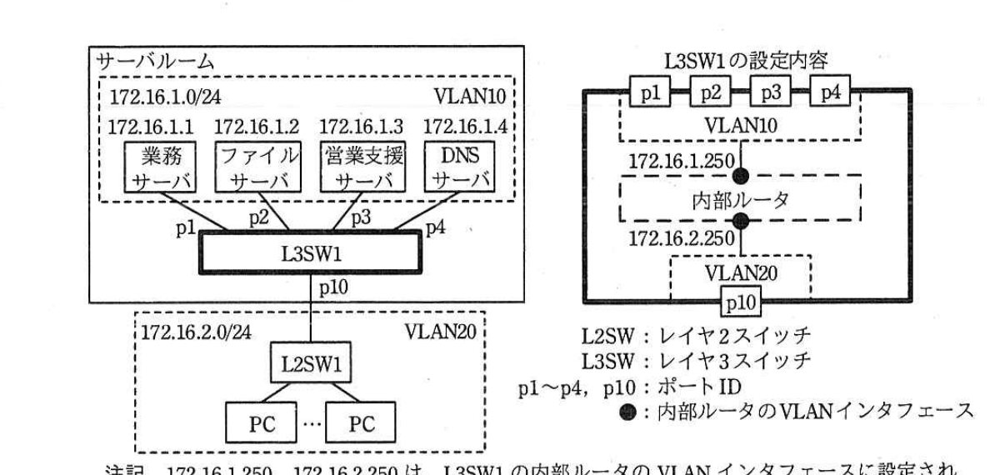
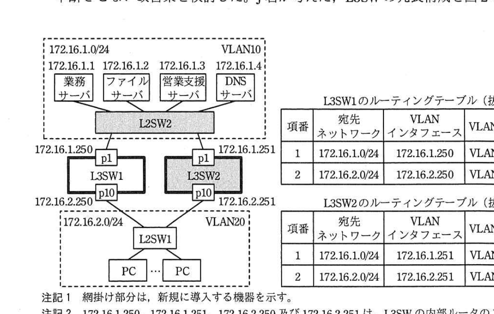
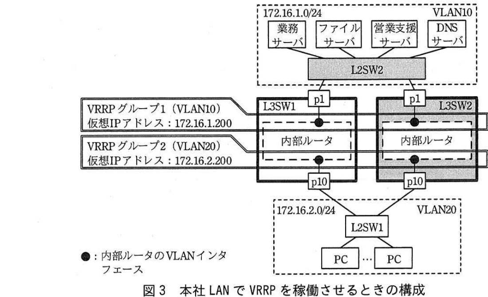

# 2017年春期（平成29年度）応用情報技術者試験 午後 問5（選択）
## ネットワーク：レイヤ3スイッチの故障対策（R社）

---

## 問題文

**問5** レイヤ3スイッチの故障対策に関する次の記述を読んで、設問1〜4に答えよ。

R社は、社員50名の電子機器販売会社であり、本社で各種のサーバを運用している。本社のLAN構成とL3SW1の設定内容を図1に示す。

> サーバルーム内、172.16.1.0/24（VLAN10）に業務サーバ(172.16.1.1)・ファイルサーバ(172.16.1.2)・営業支援サーバ(172.16.1.3)・DNSサーバ(172.16.1.4)がL3SW1のp1〜p4に接続。L3SW1のp10配下に172.16.2.0/24（VLAN20）としてL2SW1経由でPC群が接続。L3SW1の設定内容：p1〜p4はVLAN10、内部ルータのVLANインタフェースにVLAN10側172.16.1.250、VLAN20側172.16.2.250が設定され、p10はVLAN20。（172.16.1.250、172.16.2.250は、L3SW1の内部ルータのVLANインタフェースに設定されたIPアドレスである）

---

### 〔障害の発生と対応〕

ある日、社員のK君は顧客先から帰社した後、自席のPCで営業支援サーバとファイルサーバを利用して提案資料を作成した。その後、在庫を確認するために業務サーバを利用しようとしたが、利用できなかった。そこで、K君は情報システム課のJ君に、ファイルサーバと営業支援サーバは利用できるが、業務サーバが利用できないことを報告した。J君は、J君の席のPCからは業務サーバが利用できるので、業務サーバに問題はないと判断した。そこで、J君は①K君の席に行き、K君のPCでpingコマンドを172.16.1.1宛てに実行した。業務サーバからの応答はあったものの、利用できないままであった。しばらくすると、一部の社員から、業務サーバだけでなくファイルサーバや営業支援サーバも利用できないという連絡が入ってきた。

これらの連絡を受け、J君は②DNSサーバの故障又はDNSサーバへの経路の障害ではないかと考え、J君の席のPCでpingコマンドを`[　a　]`宛てに実行したところ応答がなかった。そこで、J君はサーバルームに行って調査し、L3SW1のp4が故障していることを突き止め、保守用のL3SWと交換して問題を解消した。

---

### 〔J君が考えた改善策〕

故障による業務の混乱が大きかったので、J君は、L3SW故障時もサーバの利用を中断させない改善策を検討した。J君が考えた、L3SWの冗長構成を図2に示す。

> サーバ群（業務・ファイル・営業支援・DNS）はL2SW2（新規導入、網掛け）に接続。L2SW2はL3SW1のp1(172.16.1.250)とL3SW2のp1(172.16.1.251、新規導入、網掛け)に接続。L3SW1のp10(172.16.2.250)とL3SW2のp10(172.16.2.251)はともにL2SW1に接続し、その先にPC群(VLAN20)。L3SW1のルーティングテーブル：項番1(宛先172.16.1.0/24、VLANインタフェース172.16.1.250、VLAN名VLAN10、ネクストホップなし)、項番2(宛先172.16.2.0/24、VLANインタフェース172.16.2.250、VLAN名VLAN20、ネクストホップなし)。L3SW2のルーティングテーブル：項番1(宛先172.16.1.0/24、VLANインタフェース172.16.1.251、VLAN名VLAN10、ネクストホップなし)、項番2(宛先172.16.2.0/24、VLANインタフェース172.16.2.251、VLAN名VLAN20、ネクストホップなし)。

図2では、L3SWを冗長化するためのL3SW2と、サーバを接続するためのL2SW2を新規に導入する。L3SW1とL3SW2に必要な設定を行い、L3SW1とL3SW2の間でOSPFによる`[　b　]`経路制御を稼働させる。PCとサーバに設定されたデフォルトゲートウェイなどのネットワーク情報は、図1の状態から変更しない。

J君は、図2に示した冗長構成案を上司のN主任に説明したところ、サーバが利用できなくなる問題は解消されないとの指摘を受けた。N主任の指摘内容を次に示す。

PCのデフォルトゲートウェイには、L3SW1の内部ルータのVLANインタフェースアドレス`[　c　]`が設定されており、PCによるサーバアクセスは、L3SW1のp10経由で行われる。L3SW1のp1故障時には、③図2中のL3SW1のルーティングテーブルが更新され、ネクストホップにIPアドレス`[　d　]`がセットされる。その結果、PCから送信されたサーバ宛てのパケットがL3SW1の内部ルータに届くと、L3SW1は当該PC宛てに、経路の変更を指示する`[　e　]`パケットを送信する。PCは`[　e　]`パケットの情報によって、サーバに到達可能な別経路のゲートウェイのIPアドレスを知り、サーバ宛てのパケットを`[　d　]`に送信し直すことによって、パケットはサーバに到達する。しかし、サーバからの応答パケットは、L3SW1の内部ルータのVLANインタフェースに届かないので、サーバは利用できない。L3SW1のp10の故障の場合、又はp10への経路に障害が発生した場合も、同様にサーバが利用できなくなる。

このような問題を発生させないために、N主任は、VRRP（Virtual Router Redundancy Protocol）を利用する改善策を示した。

---

### 〔N主任が示した改善策〕

VRRPは、ルータを冗長化する技術である。L3SWでVRRPを稼働させると、L3SWの内部ルータのVLANインタフェースに仮想IPアドレスが設定される。本社LANでVRRPを稼働させるときの構成を、図3に示す。

> サーバ群はL2SW2経由でL3SW1のp1とL3SW2のp1に接続。VRRPグループ1(VLAN10)の仮想IPアドレス172.16.1.200、VRRPグループ2(VLAN20)の仮想IPアドレス172.16.2.200が設定される。L3SW1・L3SW2の各内部ルータのVLANインタフェース（●）がそれぞれVRRPグループ1・2に参加する。PC群はL2SW1経由でL3SW1のp10とL3SW2のp10に接続。

図3に示したように、L3SW1とL3SW2の間で二つのVRRPグループを設定する。VRRPグループ1、2とも、L3SW1の内部ルータの優先度をL3SW2の内部ルータよりも高くして、L3SW1の内部ルータのVLANインタフェースに仮想IPアドレスを設定する。L3SW1の故障の場合、又はL3SW1への経路に障害が発生した場合は、VRRPの機能によって、L3SW2の内部ルータのVLANインタフェースに仮想IPアドレスが設定される。PC及びサーバは、パケットを仮想IPアドレスに向けて送信することによって、L3SW1経由の経路に障害が発生してもL3SW2経由で通信できるので、PCによるサーバの利用は中断しない。

図3の構成にするときは、④PCとサーバに設定されているネットワーク情報の一つを、図1の状態から変更することになる。

J君は、N主任から示された改善策を基に、本社LANのL3SWの故障対策案をまとめ、N主任と共同で情報システム課長に提案することにした。

---

## 設問

### 設問1 本文中の`[　a　]`〜`[　e　]`に入れる適切な字句を解答群の中から選び、記号で答えよ。

**解答群：**
ア　172.16.1.1　　イ　172.16.1.4　　ウ　172.16.1.250
エ　172.16.1.251　　オ　172.16.2.250　　カ　172.16.2.251
キ　GARP　　ク　ICMPリダイレクト　　ケ　静的
コ　動的　　サ　プロキシARP

### 設問2 〔障害の発生と対応〕について、(1)、(2)に答えよ。

(1) 本文中の下線①の操作の目的を、30字以内で述べよ。

(2) 本文中の下線②について、DNSサーバが利用できなくても、業務サーバ、ファイルサーバ及び営業支援サーバの利用を正常に行えている社員がいるのはなぜか。その理由を、25字以内で述べよ。

### 設問3 本文中の下線③について、更新が発生する図2中のL3SW1のルーティングテーブルの項番を答えよ。また、VLANインタフェースとVLAN名の更新後の内容を、それぞれ答えよ。

### 設問4 本文中の下線④について、変更することになる情報を答えよ。また、サーバにおける変更後の内容を答えよ。

---

## 解答と解説

### 設問1

**正解：a = イ（172.16.1.4）、b = コ（動的）、c = オ（172.16.2.250）、d = カ（172.16.2.251）、e = ク（ICMPリダイレクト）**

DNSサーバのIPアドレスは図1より**172.16.1.4**（イ、a）である。L3SW1とL3SW2間の経路制御はOSPFによる**動的**（コ、b）経路制御である。PCのデフォルトゲートウェイは、PCが属するVLAN20側のL3SW1内部ルータのVLANインタフェースアドレス**172.16.2.250**（オ、c）である。L3SW1のp1（VLAN10側）が故障すると、VLAN10宛ての経路（項番1）が更新され、ネクストホップにはL3SW2のVLAN20側インタフェースアドレスである**172.16.2.251**（カ、d）がセットされる。その結果パケットはL3SW1の内部ルータからL3SW2経由でサーバに向けられるが、L3SW1はPCに対して直接の別経路（L3SW2）の存在を通知する**ICMPリダイレクト**（ク、e）パケットを送信し、以降PCはこの経路情報を使って直接サーバ宛てパケットを送信できるようになる。

**IPA公式：a=イ、b=コ、c=オ、d=カ、e=ク**

---

### 設問2

**(1) 正解例：K君のPCからの業務サーバの利用可否を確認するため**

J君はK君の席に行き、K君のPC自身から業務サーバへのping応答を確認することで、K君が申告した「業務サーバだけ利用できない」という現象が、K君のPC・ネットワーク経路固有の問題によるものかどうかを、その場で直接確認しようとした。すなわち目的は**K君のPCからの業務サーバの利用可否を確認するため**である。

**IPA公式：業務サーバへの経路に障害があるかどうかを確認するため**

**(2) 正解例：PCにDNSのキャッシュが残っているから**

DNSサーバ（172.16.1.4）が利用できない状態でも、一部の社員のPCで各サーバの利用が正常に行えていたのは、それらのPCに過去の名前解決結果（サーバ名とIPアドレスの対応）のキャッシュが残っており、改めてDNSサーバに問い合わせる必要がなかったためである。

**IPA公式：PCにDNSのキャッシュが残っているから**

---

### 設問3

**正解：項番 = 1、VLANインタフェースの更新後の内容 = 172.16.2.250、VLAN名の更新後の内容 = VLAN20**

L3SW1のp1（VLAN10側、172.16.1.250）が故障すると、L3SW1のルーティングテーブルの項番1（宛先172.16.1.0/24）の経路がp1経由では使えなくなる。OSPFの動的経路制御により、この経路はp10（VLAN20側）経由でL3SW2へ迂回する経路に更新される。したがって、更新が発生するのは**ルーティングテーブルの項番1**であり、更新後のVLANインタフェースは**172.16.2.250**（L3SW1自身のVLAN20側インタフェース）、VLAN名は**VLAN20**に変わる。

**IPA公式：ルーティングテーブルの項番1／VLANインタフェースの更新後の内容　172.16.2.250／VLAN名の更新後の内容　VLAN20**

---

### 設問4

**正解：変更することになる情報 = デフォルトゲートウェイアドレス、サーバにおける変更後の内容 = 172.16.1.200**

図3のVRRP構成にすると、サーバのデフォルトゲートウェイは、個々のL3SWの内部ルータのVLANインタフェースアドレス（172.16.1.250）ではなく、VRRPグループ1の仮想IPアドレスに向ける必要がある。したがって、変更することになる情報は**デフォルトゲートウェイアドレス**であり、サーバにおける変更後の内容は**172.16.1.200**（VRRPグループ1の仮想IPアドレス）である。

**IPA公式：変更することになる情報　デフォルトゲートウェイアドレス／サーバにおける変更後の内容　172.16.1.200**

---

## 参考：主要キーワード

| 用語 | 説明 |
|------|------|
| レイヤ3スイッチ（L3SW） | ルーティング機能をもつスイッチ。複数のVLAN（サブネット）間の通信を中継する内部ルータ機能を備える |
| OSPF（動的経路制御） | リンク状態を基に経路情報を自動的に交換・更新するルーティングプロトコル。障害時に自動で迂回経路へ切り替わる |
| ICMPリダイレクト | ルータが、より適切な別経路のゲートウェイが存在することをホスト（PC）に通知するICMPメッセージ。ホストはこれを受けて送信先を切り替える |
| VRRP（Virtual Router Redundancy Protocol） | 複数のルータ（L3SW）を仮想的な1台のルータとして冗長化する技術。仮想IPアドレスに優先度の高いルータが応答し、故障時は自動的に次点のルータに切り替わる |
| DNSキャッシュ | 過去に名前解決した結果をPC等が一時的に保持する仕組み。DNSサーバが利用不能でも、キャッシュが残っていれば通信を継続できる |
| デフォルトゲートウェイ | 自セグメント外への通信で最初に経由するルータのアドレス。VRRP導入時は個々のルータのアドレスではなく仮想IPアドレスを設定する |
