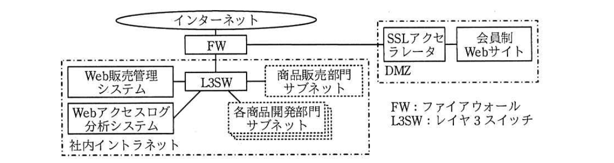

# 2017年秋期（平成29年度）応用情報技術者試験 午後 問1（必須）
## 情報セキュリティ：個人情報保護の強化（C社）

---

## 問題文

**問1** 個人情報保護の強化に関する次の記述を読んで、設問1、2に答えよ。

C社は、服飾・雑貨のインターネット販売業者である。約50,000人の顧客が同社の会員制Webサイトを利用している。会員制Webサイトには HTTPS を使用してアクセスする必要がある。

顧客が会員制Webサイトにログインするには会員番号が必要であり、会員登録時に、重複しない6桁の数字列をランダムに割り振っている。

C社には、商品販売部門の他に、服飾類を扱うX部門、生活雑貨を扱うY部門、そして輸入雑貨を扱うZ部門の三つの商品開発部門がある。

---

### 〔C社の現状〕

C社の会員制WebサイトはDMZ内に設置してあり、セキュリティ専門会社に委託してインターネットからの不正アクセスの検知と対応を行っている。

C社のネットワーク構成（抜粋）を図1に示す。

> 図1の内容：インターネットからFW（ファイアウォール）を経由し、一方はDMZ内のSSLアクセラレータ→会員制Webサイトへ、もう一方は社内イントラネット内のL3SW（レイヤ3スイッチ）を介してWeb販売管理システム、Webアクセスログ分析システム、商品販売部門サブネット、各商品開発部門サブネットへ接続される構成。

C社の会員制Webサイトで扱う顧客情報や販売情報は、社内イントラネット内のWeb販売管理システムに蓄積されている。Web販売管理システムの顧客情報データベースには、顧客の会員番号をキーとして、氏名、メールアドレス、電話番号、性別、年齢、住所などが格納されている。また、Web販売管理システムの販売情報データベースには、顧客の会員番号をキーとして、該当顧客の販売情報が格納されている。二つのデータベースは磁気テープを用いて、月次でフルバックアップを行い、日次で増分バックアップを行っている。C社の方針で過去1年間のバックアップデータを保管している。

C社では、会員制WebサイトのWebアプリケーションが出力する会員閲覧ログ（以下、Webサイト閲覧履歴という）を、毎日、社内イントラネット内のWebアクセスログ分析システムに転送して、その中に含まれる顧客の会員番号を基に、顧客ごとの閲覧履歴を分析している。

各商品開発部門は、Webサイト閲覧履歴や販売情報を参考にして、定期的に商品の品ぞろえを見直している。各商品開発部門では、有資格者だけがWeb販売管理システムにログインして、販売情報をPCで閲覧したり、CSV形式のファイルでPCに出力したりすることができる。全顧客のWebサイト閲覧履歴も、有資格者だけがWebアクセスログ分析システムにログインしてPCで閲覧したり、CSV形式のファイルでPCに出力したりすることができる。有資格者が出力したWebサイト閲覧履歴や販売情報のCSV形式のファイルは、分析完了後にPCから削除することになっている。

各商品開発部門の有資格者は有資格者リストで管理している。各商品開発部門からの申請に基づいて、システム部門が有資格者リストを更新するとともに、Web販売管理システムやWebアクセスログ分析システムへのアクセス権限を設定する。

顧客情報データベースは、各商品開発部門には公開していない。各商品開発部門の有資格者がWebサイト閲覧履歴と販売情報を関連付け、閲覧した商品と売れ筋商品を分析する。その際、性別や地域、年齢などを必要とする場合、システム部門は、顧客情報から必要がない個人情報の箇所をマスクしたデータ（以下、加工個人情報という）を提供している。加工個人情報は、CSV形式のファイルを暗号化して、電子メール（以下、メールという）に添付して有資格者に送付している。暗号化したファイルを復号するためのパスワードは別メールで送付することになっている。

---

### 〔個人情報保護の強化〕

システム部門のF部長は、Web販売管理システムのデータベースにある情報や、PCに保存されているWebサイト閲覧履歴や販売情報、加工個人情報について、社内からの不正アクセスや従業員の人的ミスによる漏えいのリスクが高いと考えた。会員番号を含めた個人情報が漏えいするおそれをできるだけ減らすためには、個人情報を含むデータの秘匿性を高める必要があると考え、社内で対策を協議した。

その結果、個人情報保護を強化するために、次の(1)〜(4)の対策を実施することとし、具体的な実現方法をシステム部門のD課長が検討することになった。

(1) Web販売管理システムへのアクセスはHTTPSによるものに限定する。

(2) 顧客情報データベースと販売情報データベースは、暗号化鍵を用いて暗号化する。バックアップデータからの情報漏えいを防ぐために、暗号化されたデータのままバックアップを行う。

(3) Webサイト閲覧履歴は、その中に含まれる会員番号を、元に戻せない仮のID（以下、仮IDという）に変換してから、Webアクセスログ分析システムに転送する。

(4) 各商品開発部門の有資格者がWeb販売管理システムにログインした場合は、`[　a　]`情報に含まれる会員番号を同じ方法で仮IDに変換して提供する。

D課長は検討した結果をF部長に報告した。

D課長：データベースの暗号化アルゴリズムには、共通鍵暗号方式の`[　b　]`を採用しようと考えています。暗号化鍵は四半期に1回変更します。新しい暗号化鍵でのデータベースの再暗号化が完了次第、古い暗号化鍵は削除する予定です。

F部長：①古い暗号化鍵を削除する運用だと問題があります。過去の暗号化鍵も含めて鍵を管理するように検討し直してください。

D課長：分かりました。それから、仮IDに変換する際には、変換後のIDが衝突しないように、会員番号に`[　c　]`を適用した結果を採用しようと考えています。

F部長：仮IDから直接元の会員番号に戻すことはできませんが、万一、採用した`[　c　]`が知られてしまった場合には、②間接的に仮IDから元の会員番号を特定できてしまいます。これを防ぐために、公開しない文字列と会員番号を文字列連結した結果に対して、`[　c　]`による変換を行ってください。

---

### 〔加工個人情報の提供方法の改善〕

加工個人情報をメールに添付して送付する方法には、次のリスクが存在することが分かった。

・パスワードを別メールで送付する運用だと、`[　d　]`に対して効果がない。

・間違って別のファイルや暗号化していないファイルを添付してメールを送付するおそれがある。

・間違って`[　e　]`にメールを送付するおそれがある。

D課長は、メールで送付する現状の受渡し方法ではリスクが高いと考え、加工個人情報をWeb販売管理システムに格納して、有資格者だけがアクセスできるように変更することにした。

---

## 設問

### 設問1 〔個人情報保護の強化〕について、(1)〜(4)に答えよ。

(1) 本文中の`[　a　]`に入れる適切な字句を4字以内で答えよ。

(2) 本文中の`[　b　]`、`[　c　]`に入れる適切な字句を解答群の中から選び、記号で答えよ。

**bに関する解答群：**
ア　AES　　イ　MAC　　ウ　RSA　　エ　SHA

**cに関する解答群：**
ア　共通鍵暗号方式　　イ　公開鍵暗号方式
ウ　ディジタル署名　　エ　ハッシュ関数

(3) 本文中の下線①について、どのような問題があるか。40字以内で述べよ。

(4) 本文中の下線②について、仮IDから元の会員番号をどのようにして特定することが可能か。35字以内で述べよ。

### 設問2 〔加工個人情報の提供方法の改善〕について、(1)、(2)に答えよ。

(1) 本文中の`[　d　]`に入れる適切な字句を解答群の中から選び、記号で答えよ。

**解答群：**
ア　DoS攻撃　　イ　盗聴
ウ　パスワードリスト攻撃　　エ　ブルートフォース攻撃

(2) 本文中の`[　e　]`に入れる適切な字句を10字以内で述べよ。

---

## 解答と解説

### 設問1

**(1) 正解：販売（販売情報）**

各商品開発部門の有資格者がWeb販売管理システムにログインした場合に提供されるのは、顧客情報データベースではなく**販売**情報データベースの情報である（顧客情報データベースは各商品開発部門には公開していない）。この販売情報に含まれる会員番号を仮IDに変換して提供する。

**IPA公式：a=販売**

**(2) 正解：b = ア（AES）、c = エ（ハッシュ関数）**

データベースの暗号化に用いる共通鍵暗号方式のアルゴリズムは**AES**（ア）である。RSAは公開鍵暗号方式、MACはメッセージ認証符号、SHAはハッシュ関数であり、共通鍵暗号方式のアルゴリズムではない。

会員番号を元に戻せない仮IDに変換する処理は不可逆変換であり、**ハッシュ関数**（エ）が用いられる。ハッシュ関数は同じ入力から必ず同じ出力が得られる一方、出力から入力を逆算することはできない。

**IPA公式：b=ア、c=エ**

**(3) 正解例：削除された暗号化鍵で暗号化されたバックアップデータを復号できない。**

データベースは暗号化された状態のままバックアップされている。暗号化鍵を四半期に1回変更し、再暗号化完了後に古い鍵を削除してしまうと、過去のバックアップデータ（古い鍵で暗号化されたまま保管されているもの）を復号する手段が失われてしまう。したがって、**削除された暗号化鍵で暗号化されたバックアップデータを復号できない**という問題がある。

**IPA公式：削除された暗号化鍵で暗号化されたバックアップデータを復号できない。**

**(4) 正解例：会員番号となり得る全数字列を同じハッシュ関数で変換して突き合わせる。**

会員番号は重複しない6桁の数字列であり、取り得る値の範囲は000000〜999999までの100万通りに限られる。ハッシュ関数（変換方法である`c`）が知られてしまうと、攻撃者は**会員番号となり得る全数字列を同じハッシュ関数で変換して突き合わせる**（総当たりで仮IDと照合する）ことで、元の会員番号を特定できてしまう。これがいわゆるレインボーテーブル攻撃・総当たり攻撃の原理であり、対策としてソルト（公開しない文字列）を会員番号に連結してからハッシュ化する必要がある。

**IPA公式：会員番号となり得る全数字列を同じハッシュ関数で変換して突き合わせる。**

---

### 設問2

**(1) 正解：イ（盗聴）**

暗号化ファイルの復号パスワードを別メールで送付する運用（いわゆるPPAP方式）は、同じ通信経路（メール）で暗号化ファイルとパスワードの両方が送られるため、経路上で両方を**盗聴**（イ）されてしまうと、暗号化の意味がなくなる。DoS攻撃、パスワードリスト攻撃、ブルートフォース攻撃は、いずれもパスワードを別送することとは直接関係しない。

**IPA公式：d=イ**

**(2) 正解例：意図しない宛先**

メールで送付する場合、宛先を間違えて指定してしまうと、加工個人情報が**意図しない宛先**に送信されてしまうおそれがある。これはメールの誤送信という人的ミスに起因するリスクである。

**IPA公式：意図しない宛先**

---

## 参考：主要キーワード

| 用語 | 説明 |
|------|------|
| 共通鍵暗号方式（AES） | 暗号化と復号に同じ鍵を使う方式。処理が高速でデータベースやファイル全体の暗号化に適する |
| ハッシュ関数 | 入力から固定長の出力を生成する一方向性の変換。同一入力は同一出力になるが出力から入力の復元は困難（不可逆） |
| ソルト（salt） | ハッシュ化の際に元データに付加する秘密の文字列。総当たり攻撃やレインボーテーブル攻撃を防ぐために用いる |
| 暗号化鍵のライフサイクル管理 | 鍵の生成・利用・更新・失効・破棄の各段階を管理すること。過去データの復号可能性を保つには、更新後も旧鍵を安全に保管する必要がある |
| PPAP（パスワード別送方式） | 暗号化ZIPファイルと復号パスワードを同じ経路（メール）で別々に送る方式。盗聴に対して実効性が乏しいとされる |
| 加工個人情報 | 個人情報から不要な項目をマスク・削除するなどして加工したデータ。分析用途などに個人情報保護を図りつつ利用するための手法 |
