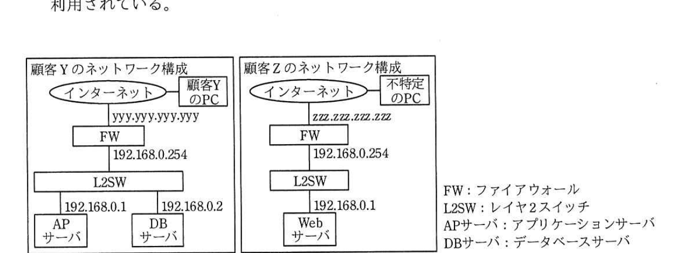
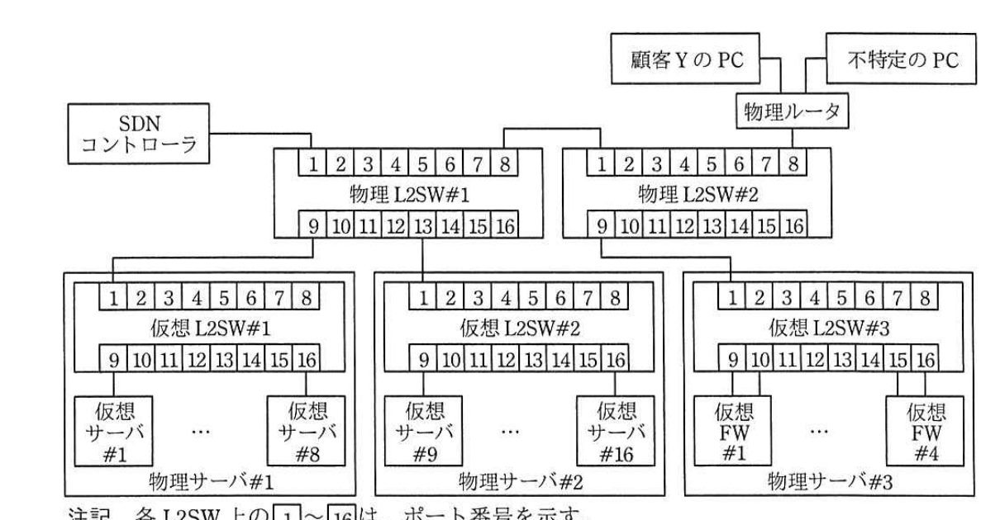

# 2017年秋期（平成29年度）応用情報技術者試験 午後 問5（選択）
## ネットワーク：SDNを利用したネットワーク設計（T社）

---

## 問題文

**問5** SDN（Software-Defined Networking）を利用したネットワーク設計に関する次の記述を読んで、設問1〜4に答えよ。

T社は、中小企業向けにIaaSを提供する会社である。国内2か所にデータセンタをもち、約100社の顧客にサービスを提供している。T社では、既存のデータセンタが手狭になってきたので、データセンタを新設することになった。

新設するデータセンタ（以下、新データセンタという）では、複数顧客の仮想サーバを一つの物理サーバに配備するマルチテナント方式を採用する。ネットワークについても、ソフトウェアによって仮想的なネットワークを構築する技術であるSDNを用いて、顧客ごとに独立した仮想ネットワークを迅速かつ柔軟に構築することを目指している。T社ネットワークサービス部のS君が、SDNを用いた仮想ネットワークの検証を行うことになった。

---

### 〔検証対象の仮想ネットワーク〕

検証対象は、図1に示す二つの顧客のネットワーク構成を想定した仮想ネットワークである。顧客Y、ZのLANともに、同じネットワークアドレス192.168.0.0/24が利用されている。

> 図1の内容：顧客Yのネットワーク構成は、インターネット―顧客YのPC（yyy.yyy.yyy.yyy）―FW（192.168.0.254）―L2SW―AP サーバ（192.168.0.1）とDBサーバ（192.168.0.2）。顧客Zのネットワーク構成は、インターネット―不特定のPC（zzz.zzz.zzz.zzz）―FW（192.168.0.254）―L2SW―Webサーバ（192.168.0.1）。（FW：ファイアウォール、L2SW：レイヤ2スイッチ、APサーバ：アプリケーションサーバ、DBサーバ：データベースサーバ）

---

### 〔新データセンタの検証環境構築〕

S君は、新データセンタに設置予定の物理L2SW、物理サーバ、SDNコントローラを利用して検証環境を構築した。S君が構築した検証環境の構成を図2に示す。各物理サーバには仮想化ソフトウェアをインストールして、複数の仮想サーバ・FWと一つの仮想L2SWを定義した。仮想サーバや仮想FWは仮想L2SWに接続し、仮想L2SWの1番ポートは物理L2SWに接続する。仮想L2SW及び物理L2SWは、SDNコントローラで定義したルールに従って、イーサネットフレーム内の送信元MACアドレスと宛先MACアドレスに応じて、イーサネットフレームをL2SWのどのポートに転送するかを制御する。

> 図2の内容：SDNコントローラが物理L2SW#1、#2を制御する。顧客YのPC・不特定のPCは物理ルータを経由し、物理ルータは物理L2SW#1・#2の1〜8番ポートに接続。物理L2SW#1の9〜16番ポートは物理サーバ#1、#2上の仮想L2SW#1、#2に、物理L2SW#2の9〜16番ポートは物理サーバ#3上の仮想L2SW#3に接続。仮想L2SW#1には仮想サーバ#1〜#8（物理サーバ#1）、仮想L2SW#2には仮想サーバ#9〜#16（物理サーバ#2）、仮想L2SW#3には仮想FW#1〜#4（物理サーバ#3）が接続される。（注記：各L2SW上の1〜16は、ポート番号を示す。）

S君は、図1に示す二つの顧客のネットワークを図2の環境で構成するために、各顧客のサーバとFWを表1のように割り当てた。

### 表1 各顧客のサーバとFWの割当て

| 項番 | 顧客 | サーバ・FW | 割当て先仮想サーバ・FW | 割当て仮想MACアドレス |
|---|---|---|---|---|
| 1 | 顧客Y | APサーバ | 仮想サーバ#1 | aaa |
| 2 | 顧客Y | DBサーバ | 仮想サーバ#9 | bbb |
| 3 | 顧客Y | FW | 仮想FW#1 | ccc（LAN側）、mmm（WAN側） |
| 4 | 顧客Z | Webサーバ | 仮想サーバ#16 | ddd |
| 5 | 顧客Z | FW | 仮想FW#4 | eee（LAN側）、nnn（WAN側） |

表1の割当てを行った図2の検証環境において、顧客YのPCから顧客YのAPサーバにアクセスする場合、FWとAPサーバの間を流れるAPサーバ向けイーサネットフレームの送信元MACアドレスは`[　a　]`、宛先MACアドレスは`[　b　]`となる。

同一顧客のネットワーク内の機器が相互に通信できるように、物理L2SW及び仮想L2SWのネットワーク情報をSDNコントローラに設定した。物理L2SW#1の通信制御テーブルの内容を表2に示す。

新データセンタに設置する物理L2SW及び仮想L2SWは、各ポートから入力されたイーサネットフレームに対して、通信制御テーブルの項番1から順に判定条件の評価を行い、判定条件にマッチしたルールが存在した場合には、アクションに記載された内容に従って処理を行う。

例えば、顧客YのDBサーバからAPサーバ向けのイーサネットフレームが、物理L2SW#1の`[　c　]`番ポートに入力されると、通信制御テーブルの項番`[　d　]`のルールにマッチし、イーサネットフレームが物理L2SW#1の9番ポートに転送される。同様に仮想L2SW#1でも、MACアドレスによる通信制御が行われ、APサーバにイーサネットフレームが届く。

### 表2 物理L2SW#1の通信制御テーブル

| 項番 | 送信元MACアドレス | 宛先MACアドレス | アクション |
|---|---|---|---|
| 1 | aaa | bbb | Forward 13 |
| 2 | aaa | ccc | Forward 8 |
| 3 | bbb | aaa | Forward 9 |
| 4 | bbb | ccc | Forward 8 |
| 5 | ccc | aaa | Forward 9 |
| 6 | ccc | bbb | Forward 13 |
| 7 | ddd | eee | Forward `[　e　]` |
| 8 | eee | ddd | Forward `[　f　]` |
| 9 | aaa | any | Forward 8, 13 |
| 10 | bbb | any | Forward 8, 9 |
| 11 | ccc | any | Forward 9, 13 |
| 12 | ddd | any | Forward 8 |
| 13 | eee | any | Forward 13 |
| 14 | any | any | Drop |

（注記1：Forward番号とは、指定された番号のポートにイーサネットフレームを転送することを指す。複数のポート全てに転送する場合は、コンマ区切りで示す。注記2："any"とは、対象が全てのMACアドレスであることを示す。注記3："Drop"とは、イーサネットフレームを破棄することを示す。）

各L2SWにおいてイーサネットフレーム内のMACアドレスを用いた通信制御を行うことによって、顧客Yと顧客ZのサーバのIPアドレスが同一であっても、それぞれの顧客の通信を区別することができる。

---

### 〔物理サーバ故障時の検証〕

S君は、物理サーバの故障に備えた仮想サーバの冗長化の検証を行うために、物理サーバ#1の故障時に、物理サーバ#1で動作していたAPサーバを物理サーバ#2に自動的に移動させる設定を行った。物理サーバ#2に移動させたAPサーバは仮想L2SW#2の2番ポートに接続する。

また、①物理サーバ#1が故障して、APサーバの移動を完了した場合に物理L2SW及び仮想L2SWの通信制御テーブルのルールを自動的に変更する設定をSDNコントローラに行った。

S君は、物理L2SW故障時に備えた冗長化や通信速度の検証なども行い、仮想ネットワークの検証作業を完了した。

---

## 設問

### 設問1 本文中の`[　a　]`、`[　b　]`に入れる適切な字句を、表1中の字句を用いて答えよ。

### 設問2 本文中の`[　c　]`、`[　d　]`に入れる適切な数値を答えよ。

### 設問3 表2について、(1)、(2)に答えよ。

(1) 表2中の`[　e　]`、`[　f　]`に入れる適切な字句を答えよ。

(2) 表2中の項番9〜13は、同一顧客内のサーバやFWがイーサネットフレームを用いて通信を行うために必要な情報を収集可能とするためのルールである。顧客Y、ZのサーバやFWが収集する情報とは何か。20字以内で答えよ。

### 設問4 本文中の下線①について、(1)、(2)に答えよ。

(1) 物理サーバ#1の故障時、物理L2SW#1の通信制御テーブルのルールのうちAPサーバを物理サーバ#2に移動させた場合に適用されなくなるルールはどれか。表2中の項番で全て答えよ。

(2) 物理サーバ#1の故障時、変更が必要となる物理L2SW#1の通信制御テーブルのルールはどれか。項番9、10、11以外のルールを表2中の項番で答えよ。また、変更後のアクションの内容を表2のアクションの表記に倣って答えよ。

---

## 解答と解説

### 設問1

**正解：a = ccc、b = aaa**

顧客YのFW（仮想FW#1）のLAN側MACアドレスはccc（表1項番3）、APサーバ（仮想サーバ#1）のMACアドレスはaaa（表1項番1）である。顧客YのPCからAPサーバへのアクセスにおいて、FWとAPサーバの間を流れるAPサーバ向けイーサネットフレームは、FW（送信元）からAPサーバ（宛先）へ送られるものなので、送信元MACアドレスはFWのLAN側MACアドレスである**ccc**（a）、宛先MACアドレスはAPサーバのMACアドレスである**aaa**（b）となる。

**IPA公式：a=ccc、b=aaa**

---

### 設問2

**正解：c = 13、d = 3**

顧客YのDBサーバ（仮想サーバ#9）は物理サーバ#2上にあり、物理サーバ#2は物理L2SW#1の13番ポートに接続されている（図2より）。したがって、DBサーバからのイーサネットフレームは物理L2SW#1の**13**番ポート（c）に入力される。

送信元MACアドレスbbb（DBサーバ）、宛先MACアドレスaaa（APサーバ）のフレームにマッチするルールは、表2の項番**3**（d）：「bbb → aaa：Forward 9」である。

**IPA公式：c=13、d=3**

---

### 設問3

**(1) 正解：e = 8、f = 13**

顧客ZのWebサーバ（ddd）は物理サーバ#3上の仮想FW#4を経由して外部と通信する。項番7「ddd→eee」（Webサーバ→FW LAN側）のフレームは、FW（仮想FW#4）に転送する必要がある。仮想FW#4は物理サーバ#3にあり、物理L2SW#1の観点では、物理サーバ#3へ向かう経路は物理L2SW#2経由となるため、物理L2SW#1の8番ポート（物理ルータ側）を経由して転送される。すなわちe＝**8**。

項番8「eee→ddd」（FW LAN側→Webサーバ）は、Webサーバ（物理サーバ#2）へ向かう必要があるため、物理L2SW#1の13番ポートに転送される。すなわちf＝**13**。

**IPA公式：e=8、f=13**

**(2) 正解例：サーバやFWのMACアドレス**

項番9〜13のルールは、送信元MACアドレスに対して宛先any（全てのMACアドレス）でForwardする設定であり、これはARP要求のようなブロードキャスト/未知の宛先への問合せに応答するための転送ルールである。これにより、同一顧客内の機器同士が、通信相手の**サーバやFWのMACアドレス**を収集（ARPなどにより解決）できるようになる。

**IPA公式：サーバやFWのMACアドレス**

---

### 設問4

**(1) 正解：1、3**

物理L2SW#1の通信制御テーブルのうち、APサーバ（aaa）が関わるルールで、APサーバが物理サーバ#1から物理サーバ#2へ移動した後は物理L2SW#1を経由しなくなる（同一物理サーバ内、または物理L2SW#2経由になる）ものを特定する。項番1「aaa→bbb：Forward 13」と項番3「bbb→aaa：Forward 9」は、APサーバ（物理サーバ#1にあった場合の9番ポート宛て・9番ポート発）に関する直接のルールであり、APサーバの移動後は物理L2SW#1経由でのAPサーバ・DBサーバ間の直接通信ルールとしては適用されなくなる。したがって、適用されなくなるルールは項番**1、3**である。

**IPA公式：1，3**

**(2) 正解：項番5／内容：Forward 13**

APサーバが物理サーバ#2（仮想L2SW#2の2番ポート）に移動すると、DBサーバ（同じく物理サーバ#2、仮想L2SW#2の9番ポート）とAPサーバは同一の物理サーバ・同一の仮想L2SW内に収容されることになる。したがって、顧客YのFW（ccc）からAPサーバ（aaa）向けの通信は、物理サーバ#2（物理L2SW#1の13番ポート）へ転送すればよくなる。項番5「ccc→aaa：Forward 9」は、APサーバの移動前は物理サーバ#1（9番ポート）向けだったが、移動後は物理サーバ#2（13番ポート）向けに変更する必要がある。よって、変更が必要なルールは項番**5**であり、変更後のアクションは**Forward 13**である。

**IPA公式：項番5／内容：Forward 13**

---

## 参考：主要キーワード

| 用語 | 説明 |
|------|------|
| SDN（Software-Defined Networking） | ソフトウェアによってネットワークの制御機能（経路制御など）を集中管理し、仮想的なネットワークを柔軟に構築する技術 |
| マルチテナント方式 | 複数の顧客（テナント）のリソースを同一の物理基盤上に共存させる方式。IPアドレス重複時もMACアドレス等で通信を分離する必要がある |
| L2SW（レイヤ2スイッチ）の通信制御テーブル | 送信元・宛先MACアドレスの組合せに基づいてフレームの転送先ポートを決定するルールの集合。SDNコントローラが集中管理する |
| ARPによるMACアドレス解決 | 同一セグメント内の機器同士が通信するために、宛先IPアドレスに対応するMACアドレスをブロードキャストで問い合わせる仕組み |
| 仮想サーバの冗長化・フェイルオーバー | 物理サーバの故障時に仮想サーバを別の物理サーバへ自動的に移動させ、通信制御テーブルのルールも合わせて更新することでサービス継続性を確保する |
