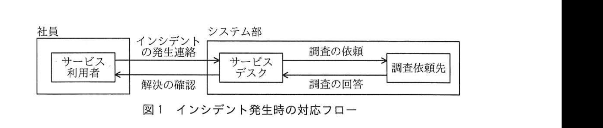
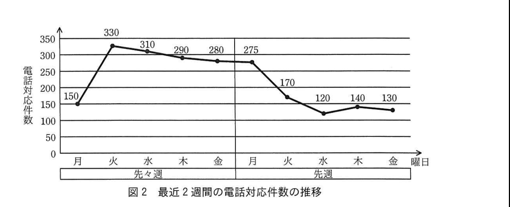

# 2017年秋期（平成29年度）応用情報技術者試験 午後 問10（選択）
## サービスマネジメント：サービスデスク（R社）

---

## 問題文

**問10** サービスデスクに関する次の記述を読んで、設問1、2に答えよ。

R社は、全国で電子機器の製造と販売を行う会社である。R社のシステム部では、数年前から、R社で運用するシステムのインシデントに電話で対応するサービスデスクを運営している。サービスデスクのサービス提供日はR社営業日、サービス提供時間帯は9時から18時までであり、利用者はR社の社員だけである。

システム部のITサービスマネージャのS君は、サービスデスクで必要なシステム及びインシデント管理の手順を構築し、現在はサービスデスクの責任者を務めている。サービスデスクは、S君とオペレータ数名で構成されている。

---

### 〔サービスデスクの業務〕

サービスデスクを運営する前までは、利用者からのインシデントに対して、アプリケーションに関することはシステム部のシステム開発課が、アプリケーション以外に関しては同部システム運用課が対応していた。"連絡先を選別する必要があって面倒である。"との利用者の意見を受けて、システム部ではサービスデスクを立ち上げ、機能的に`[　a　]`とした。

サービスデスクには、音声自動応答システム（以下、IVRという）、コンピュータと電話システム間を統合させた`[　b　]`、及びサービスデスクを支援するアプリケーション（以下、インシデント管理システムという）を導入した。

サービスデスクの利用者は、サービスデスクに電話を掛けると、IVRからの音声自動応答のメッセージ（以下、ガイドという）に従って、PCの障害やアプリケーションの障害といったインシデントの分類を選択肢から選び、利用者の情報などを入力した後、サービスデスクのオペレータと通話を開始する。IVRに登録する音声や利用者への応答に関する分岐ルールは、サービスデスクで設定することができる。`[　b　]`では、利用者が入力した情報に基づいて、システム部が運用する社員データベースから利用者の詳細をオペレータのPC画面に表示する。オペレータは、利用者との通話の内容や対応の状況を、インシデント管理システムに記録する。

インシデント管理システムには、オペレータが、全てのインシデントの対応記録を対象に、該当する事象と解決策を照会できる機能があって、①再発したインシデント（以下、再発インシデントという）の場合は、対応記録を参照して解決策を回答することができる。

サービスデスクが実施するインシデント管理の手順を表1に、インシデント発生時の対応フローを図1に示す。

### 表1 インシデント管理の手順

| 手順 | 内容 |
|---|---|
| 記録 | ・インシデントを受け付け、インシデント管理システムに対応を記録する。 |
| 優先度の割当て | ・インシデントに優先度として"高"、"中"、"低"のいずれかを、優先度の割当て基準※に基づいて割り当てる。 ・割り当てた優先度に基づいて、インシデントの解決目標時間を設定する。 |
| 分類 | ・インシデントをあらかじめ決められたカテゴリ（PCの障害など）に分類する。 |
| 記録の更新 | ・インシデントの内容、割り当てた優先度、分類したカテゴリの内容などでインシデントの対応記録を更新する。 |
| 段階的取扱い | ・インシデントの対応記録を参照して解決策が見つかった場合は、サービスデスクで解決を行うので、段階的取扱いは行わない。 ・上記以外の場合は、アプリケーションに関することはシステム開発課を、アプリケーション以外に関することはシステム運用課を段階的取扱い先（以下、調査依頼先という）として、調査を依頼する。 |
| 解決 | ・段階的取扱いを行わなかった場合、サービスデスクは解決策に基づき解決を図る。 ・段階的取扱いを行った場合、調査依頼先が解決策を導き出し、サービスデスクに調査の回答を行う。調査の回答に基づき、サービスデスクで解決を図る。 |
| 終了 | ・サービスデスクは、利用者に、インシデントが解決したことの確認を行う。 ・サービスデスクは、インシデント管理システムの対応記録を更新する。 |

（注※：インシデントが業務に与える影響度合い、及びインシデント発生の状況から判断される解決の緊急度に応じた優先度を規定している。）

> 図1の内容：社員（サービス利用者）からシステム部（サービスデスク）へ「インシデントの発生連絡」、サービスデスクから利用者へ「解決の確認」。サービスデスクから調査依頼先へ「調査の依頼」、調査依頼先からサービスデスクへ「調査の回答」。

S君は、毎週月曜日に前週のサービスデスクの活動状況を分析している。インシデント管理システムのデータを基に、オペレータの実施手順にミスがなかったか、利用者対応に不備がなかったかなどをまとめる。S君はこの分析作業に合わせて、サービスデスクの対応記録を基に、高い頻度で発生する再発インシデントの中で、利用者が自分で解決できる内容を取りまとめて、月曜日の夕方に、利用者の誰もが利用できるR社の情報掲示板にFAQとして掲載する。サービスデスクでは、利用者に、インシデントが発生した場合は、まずFAQを参照して解決を試みること、FAQで解決できない場合にサービスデスクを利用することを推奨している。

---

### 〔顧客満足調査と改善策の実施〕

システム部では、毎年、サービスデスクの利用者を対象に顧客満足調査を実施している。S君は、実施した調査の結果を分析した。利用者のコメントを分析した結果は次のとおりである。

(1) 多くの利用者で同じ事象のインシデントが発生すると、サービスデスクへの電話が集中し、電話がつながりにくくなる。このような状況は、数日続くことがある。

(2) 利用者が使うPCで発生するインシデントには、利用者の簡単な操作で解決するものがある。利用者からは、"このような解決策については、もっと早く分かるようにしてほしい。"といった要望がある。

(3) 利用者のインシデントが、サービスデスクのオペレータとの1回の通話で解決しない場合がある。利用者はオペレータからの次の連絡を待っているが、長い間待たされることがあり、サービスデスクに電話して催促を行っている。

(4) FAQの中には、長い間参照されていないものが多く存在し、利用者から"古いものが残っているので、調べるのに手間が掛かる。"との声もある。

S君は、最近のサービスデスクの電話対応件数を確認した。先々週の火曜日に多くの利用者で同じ事象のインシデントが発生して、サービスデスクの電話対応が急増し、電話がつながりにくくなっていた。電話対応件数は、その後、少しずつ減少したが、先週の月曜日まで多い状況が続いた。該当するインシデントは、利用者に解決策を伝えれば、利用者が自分で解決できるものであった。サービスデスクの最近2週間の電話対応件数の推移は、図2のとおりであった。

> 図2の内容：先々週：月150件、火330件、水310件、木290件、金280件。先週：月275件、火170件、水120件、木140件、金130件。

また、S君は、インシデントの段階的取扱いの状況を調べてみた。多くの調査依頼は調査依頼先からすぐにサービスデスクに調査の回答が届いているが、回答に長い時間を要しているものもあった。調査回答に時間が必要な場合には、利用者からサービスデスクに催促の電話が掛かってくることがあった。サービスデスクでは、利用者からの電話で初めて、サービスデスクから利用者への回答が滞っていることを認識し、急いで調査依頼先に連絡して調査の回答をもらうことがあった。

S君は、以上の調査の結果分析で判明した課題を整理し、次の改善策をまとめた。

**(1) FAQの改善**

・電話対応件数を減らすために、多くの利用者に共通して発生する再発インシデントについては、`[　c　]`。

・FAQの陳腐化を防ぐために、古いFAQを見直し、不要な項目は削除する。また、利用頻度に応じて掲載順を工夫し、検索しやすくする。

・これらの対策に必要な人的資源及び必要なシステムを整える。

**(2) IVRの改善**

一部の"利用者の簡単な操作で解決できるインシデントの解決策"を、早期に回答できるように、②IVRのガイドを改善する。

**(3) インシデント管理の手順の改善**

"利用者が、サービスデスクのオペレータとの1回の通話でインシデントを解決できないで、長い間待たされることがある"事案については、サービスデスクが`[　d　]`を管理できているか調査した。その結果、管理精度を向上させる必要があることが分かったので、インシデントの段階的取扱いの手順に、③内容を追加することにした。

---

## 設問

### 設問1 〔サービスデスクの業務〕について、(1)、(2)に答えよ。

(1) 本文中の`[　a　]`、`[　b　]`に入れる適切な字句を、解答群の中から選び、記号で答えよ。

**解答群：**
ア　CI　　イ　CSF　　ウ　CTI
エ　SAM　　オ　SLA　　カ　SPOC

(2) 本文中の下線①の再発インシデントの対応で、インシデント管理システムを使って得られるサービスデスクにとっての利点を、利用者に対する回答の観点から、40字以内で述べよ。

### 設問2 〔顧客満足調査と改善策の実施〕について、(1)〜(3)に答えよ。

(1) 図2の電話対応件数が先週の火曜日から大きく減少している理由、及び電話対応件数を減らすために改善策として実施する本文中の`[　c　]`に入れる適切な内容を、それぞれ20字以内で述べよ。

(2) 本文中の下線②の改善内容を解答群の中から選び、記号で答えよ。

**解答群：**
ア　ガイドで再生している音声の明瞭度を上げる。
イ　現状のガイドの内容を、利用者に分かりやすくする。
ウ　サービス提供時間帯以外は、緊急連絡先をガイドで案内する。
エ　高い頻度で再発するインシデントの解決策を、ガイドで案内する。

(3) 本文中の`[　d　]`に入れる内容として適切な字句を、表1中の字句を使って、20字以内で述べよ。また、本文中の下線③として追加する内容を、40字以内で具体的に述べよ。

---

## 解答と解説

### 設問1

**(1) 正解：a = カ（SPOC）、b = ウ（CTI）**

複数の連絡先（システム開発課・システム運用課）を選別する面倒さを解消するために、単一の窓口に統一することを、**SPOC**（Single Point Of Contact、単一窓口、カ、a）という。

コンピュータと電話システム間を統合させた仕組みは、**CTI**（Computer Telephony Integration、ウ、b）である。

**IPA公式：a=カ、b=ウ**

**(2) 正解例：サービスデスクのオペレータだけで解決策を早期に回答できる。**

インシデント管理システムで過去の対応記録から該当する事象と解決策を照会できることにより、再発インシデントが発生した場合、調査依頼先への段階的取扱い（エスカレーション）を行わずに、**サービスデスクのオペレータだけで解決策を早期に回答できる**という利点がある。

**IPA公式：サービスデスクのオペレータだけで解決策を早期に回答できる。**

---

### 設問2

**(1) 正解例：理由：月曜日の夕方にFAQに追加したから／c：随時、FAQに追加する。**

先々週火曜日に発生した多くの利用者に共通するインシデントについて、本文の〔サービスデスクの業務〕の記述にあるとおり、S君は高い頻度で発生する再発インシデントを月曜日の夕方にFAQとして情報掲示板に掲載している。先週月曜日の夕方にこのインシデントがFAQに追加されたことで、利用者が自分でFAQを参照して解決できるようになり、先週火曜日から電話対応件数が大きく減少したと考えられる。理由は、**月曜日の夕方にFAQに追加したから**である。

現状はFAQの更新が週1回（月曜日の夕方）のみであるため、発生から反映までにタイムラグが生じる。電話対応件数を減らす改善策としては、多くの利用者に共通して発生する再発インシデントについて、**随時、FAQに追加する**（c）ことが適切である。

**IPA公式：理由＝月曜日の夕方にFAQに追加したから／c＝随時，FAQに追加する。**

**(2) 正解：エ**

下線②は「一部の"利用者の簡単な操作で解決できるインシデントの解決策"を、早期に回答できるように」IVRのガイドを改善することである。これは、**高い頻度で再発するインシデントの解決策を、ガイドで案内する**（エ）ことで、利用者がオペレータと通話する前にIVRの段階で解決策を得られるようにする改善である。

**IPA公式：エ**

**(3) 正解：d = インシデントの解決目標時間／下線③：サービスデスクは、調査依頼先に解決目標時間を遵守させるよう納期を管理する。**

利用者が長い間待たされる問題は、調査依頼先からの回答に時間がかかっているにもかかわらず、サービスデスク側でその遅延を把握できていないことに起因する。表1の「優先度の割当て」の手順では、優先度に基づいて**インシデントの解決目標時間**（d）を設定することになっているが、この解決目標時間が管理（進捗監視）できていないことが問題である。

したがって、インシデントの段階的取扱いの手順に追加すべき内容は、**サービスデスクは、調査依頼先に解決目標時間を遵守させるよう納期を管理する**（下線③）ことである。

**IPA公式：d＝インシデントの解決目標時間／下線③＝サービスデスクは，調査依頼先に解決目標時間を遵守させるよう納期を管理する。**

---

## 参考：主要キーワード

| 用語 | 説明 |
|------|------|
| SPOC（Single Point Of Contact） | 利用者からの問合せ窓口を単一化する考え方。複数部署への連絡先選別の手間をなくし、利用者の利便性を高める |
| CTI（Computer Telephony Integration） | コンピュータと電話システムを統合する技術。着信情報に基づき顧客情報をオペレータ画面に自動表示するなどに利用される |
| IVR（音声自動応答システム） | 電話の自動音声ガイダンスにより、利用者の入力に応じて案内や振り分けを行うシステム |
| 段階的取扱い（エスカレーション） | 一次窓口で解決できない問題を、より専門的な部署・担当者に引き継いで対応する仕組み。ITILのインシデント管理における基本プロセス |
| 解決目標時間（SLAに基づく目標対応時間） | インシデントの優先度に応じて設定される、解決までに要すべき時間の目標値。進捗管理・納期管理の基準となる |
| FAQ（よくある質問）の鮮度管理 | 利用者が自己解決できるよう再発インシデントの解決策を随時公開し、陳腐化した項目は定期的に見直し・削除することで検索性と実効性を維持する |
