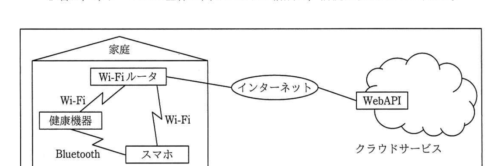

# 2017年秋期（平成29年度）応用情報技術者試験 午後 問4（選択）
## システムアーキテクチャ：WebAPIの設計（S社）

---

## 問題文

**問4** WebAPIの設計に関する次の記述を読んで、設問1〜4に答えよ。

S社は、家庭向けの体重計、血圧計、活動量計などの健康機器を製造販売している会社である。競合する他社との差別化を図るために、クラウドサービスを使った健康管理サービス（以下、本サービスという）の提供を検討している。例えば、健康機器で計測したデータ（以下、計測データという）を本サービスで管理して、スマートフォン（以下、スマホという）のアプリケーションプログラム（以下、アプリという）で計測データを確認できるようにすることを考えている。開発部のT君を中心に、本サービスを設計することになった。

T君は、本サービスのアーキテクチャを検討し、クラウドサービス上に健康機器やアプリから呼ばれるWebAPIを用意し、そのWebAPIを介して、計測データのアップロードや確認を行う方式を採用することにした。

---

### 〔本サービスの前提〕

T君は、本サービスの全体を図1のように構成し、前提を次のように考えた。

> 図1の内容：家庭内にWi-Fiルータ、健康機器、スマホがあり、健康機器とWi-FiルータはWi-Fiで、健康機器とスマホはBluetoothで、スマホとWi-FiルータはWi-Fiで接続される。Wi-Fiルータはインターネットを介してクラウドサービス上のWebAPIに接続される。

・健康機器は、表示用のディスプレイ、インターネットにアクセスするための無線LAN（以下、Wi-Fiという）、スマホと通信するためのBluetooth機能を装備する。

・家庭内はWi-Fiルータでインターネットにアクセスできる環境とする。

・計測時には、健康機器はスマホを介することなく、Wi-Fi経由で本サービスにアクセスする。

---

### 〔本サービスのユースケース〕

T君は、WebAPIの満たすべき要件を明らかにするために、本サービスのユースケースを洗い出し、表1のように整理した。また、本サービスで使用するデータベースの主なテーブルを表2のように定義した。

### 表1 本サービスのユースケース

| ユースケース名 | ユースケースシナリオ |
|---|---|
| ユーザの登録 | ・利用者は、アプリの"ユーザ登録"画面で、登録する利用者の愛称（アプリや健康機器で利用者を識別するためのもの）とメールアドレスを入力する。 ・アプリは、愛称とメールアドレスを"ユーザ登録"WebAPIに渡す。 ・WebAPIは、ユーザIDとパスワードを生成して"ユーザ"テーブルに追加し、ユーザIDとパスワードをアプリに返す。 ・アプリは、愛称、メールアドレス、ユーザID、パスワードをスマホ内に保存する。 |
| 健康機器のWi-Fi設定 | ・利用者は、スマホと健康機器をBluetoothで接続して、アプリの"健康機器Wi-Fi設定"画面で、利用するSSIDを選択し、対応する暗号化キーを入力する。 ・アプリは、SSIDと暗号化キーを健康機器に送る。 ・健康機器は、受け取ったSSIDと暗号化キーを保存し、Wi-Fiに接続する。 |
| 健康機器へのユーザの登録 | ・利用者は、スマホと健康機器をBluetoothで接続して、アプリの"健康機器ユーザ登録"画面で、登録する利用者の愛称を選択する。 ・アプリは、①必要なユーザ情報を健康機器に送る。 ・健康機器は、受け取ったユーザ情報で"ユーザ参照"WebAPIを呼び、そのユーザが登録されていることが確認できたら、アプリから受け取ったユーザ情報を健康機器内に保存する。 |
| 計測 | ・利用者は、健康機器で計測する。ディスプレイに表示される愛称を確認して、計測対象者を選択する。（具体的な選択方法は、各健康機器によって異なる。） ・健康機器は、計測した1件分の計測値種別、計測日時、計測値を"計測データ登録"WebAPIに渡す。計測値種別とは、体重、血圧、活動量などの計測値の種別を表す。 ・WebAPIは、渡されたデータを"計測データ"テーブルに追加して、メールアドレス宛てにメールを送信する。 |
| 計測データの参照 | ・利用者は、アプリの"計測データ参照"画面で、参照するユーザの愛称を選択する。 ・アプリは、"計測データ参照"WebAPIを呼ぶ。 ・WebAPIは、"計測データ"テーブルを参照し、対象となるデータをアプリに返す。 ・アプリは、計測データをグラフなどで見やすくして表示する。 |
| ユーザの削除 | ・利用者は、アプリの"ユーザ削除"画面で、削除するユーザの愛称を選択する。 ・アプリは、"ユーザ削除"WebAPIを呼ぶ。 ・WebAPIは、"ユーザ"テーブルと"計測データ"テーブル内の対象行を削除する。 ・アプリは、スマホ内に保存した削除対象ユーザの情報を削除する。 ・アプリは、健康機器に、健康機器内に保存した削除対象ユーザの情報を削除させる。 |

### 表2 主なテーブル

| テーブル名 | 列名 |
|---|---|
| ユーザ | ユーザID、パスワード、愛称、メールアドレス、登録日時 |
| 計測データ | ユーザID、計測値種別、計測日時、計測値 |

---

### 〔WebAPIの設計方針〕

T君は、最近のWebAPIの技術動向を調査、検討した結果、本サービスのWebAPIはREST（REpresentational State Transfer）形式を採用することとし、設計方針を次のように決めた。

・WebAPIへのアクセスは、全てHTTPSを用いて行う。

・アクセス対象へのCRUD（Create、Read、Update、Delete）の操作を、それぞれHTTPメソッドのPOST、GET、PUT、DELETEで提供する。

・URIは、次の(1)〜(5)に従って設計する。

(1) "api.example.co.jp"のように、APIであることが一目で分かるようにする。

(2) APIのバージョン番号を含める。

(3) deleteUserのようにリソースに対する操作を動詞を用いて表現するのではなく、usersのように対象とするリソースを複数形の名詞で表現し、操作はHTTPメソッドで指定する。

(4) アプリケーションや言語に依存する拡張子は含めない。

(5) リソースの関係性が一目で分かるようにする。

・全てのWebAPIでユーザ認証を行う。②ユーザ認証は、HTTPリクエストヘッダのX-Authorizationヘッダフィールドで、"ユーザID：パスワード"をBASE64エンコードしたものを設定する方式とし、設定された"ユーザID：パスワード"が"ユーザ"テーブルに存在することを確認する。"ユーザ登録"WebAPIを呼ぶ際は、ユーザIDが決まっていないので、ユーザ登録用に特別に用意したユーザIDでユーザ認証を行う。

・WebAPIの実行結果のステータスは、標準的なHTTPステータスを使用する。

200：OK
400：不正なパラメタ
401：認証失敗
404：データが存在しない

・リクエストとレスポンスのボディ部のフォーマットはJSON、文字コードはUTF-8を使用する。

設計方針に従ってWebAPIを設計した。URIテンプレートは、

`https://api.example.co.jp/{version}/users/{userId}/{valueType}`

とし、{version}はバージョン番号、{userId}はユーザID、{valueType}は計測値種別を必要に応じて指定する。

S社は、本サービスを利用する最初の健康機器として、体重計を発売することにした。体重計で利用するWebAPIでは、バージョン番号はv1、計測値種別はweightsとした。体重計で利用するWebAPIを表3に示す。

### 表3 体重計で利用するWebAPI

| API名 | URI | HTTPメソッド | リクエストのボディ部 | レスポンスのボディ部 |
|---|---|---|---|---|
| ユーザ登録 | （略） | POST | 愛称、メールアドレス | ユーザID、パスワード |
| ユーザ参照 | `[　b　]` | GET | `[　f　]` | 愛称、メールアドレス |
| ユーザ削除 | （略） | `[　d　]` | － | － |
| `[　a　]` | （略） | POST | `[　g　]` | － |
| 計測データ参照 | `[　c　]` | `[　e　]` | － | ｛計測日時、計測値｝の配列 |

（注記：－は、ボディ部がないことを表す。）

---

## 設問

### 設問1 表1中の下線①について、健康機器に送る必要があるユーザ情報を全て答えよ。

### 設問2 本文中の下線②の認証方式を採用する際に、セキュリティ上必要となる重要な設計方針を、本文中の字句を用いて35字以内で述べよ。また、その設計方針が必要な理由を20字以内で述べよ。

### 設問3 体重計で利用するWebAPIの仕様について、(1)〜(4)に答えよ。

(1) 表3中の`[　a　]`に入れる適切なAPI名を答えよ。

(2) 表3中の`[　b　]`、`[　c　]`に入れるURIを解答群の中から選び、記号で答えよ。

**解答群：**
ア　https://api.example.co.jp/v1/users
イ　https://api.example.co.jp/v1/users/{userId}
ウ　https://api.example.co.jp/v1/users/{userId}/weights
エ　https://api.example.co.jp/v1/weights

(3) 表3中の`[　d　]`、`[　e　]`に入れる適切なHTTPメソッドを答えよ。

(4) 表3中の`[　f　]`、`[　g　]`に入れる適切な字句を答えよ。

### 設問4 リクエストのボディ部が｛"nickname"："" ｝で"ユーザ登録"WebAPIが呼ばれた場合、どのような結果を返せばよいか。20字以内で述べよ。

---

## 解答と解説

### 設問1

**正解：愛称、ユーザID、パスワード**

健康機器は、受け取ったユーザ情報で"ユーザ参照"WebAPIを呼び、そのユーザが登録されていることを確認する。"ユーザ参照"WebAPIのユーザ認証にはユーザIDとパスワードが必要であり、また健康機器のディスプレイに利用者の愛称を表示して計測対象者を選択させる必要があるため、アプリから健康機器に送る必要があるユーザ情報は**愛称、ユーザID、パスワード**である。

**IPA公式：愛称，ユーザID，パスワード**

---

### 設問2

**正解例：設計方針：WebAPIへのアクセスは、全てHTTPSを用いて行う。／理由：HTTPだと盗聴される危険があるから**

下線②の認証方式は、"ユーザID：パスワード"をBASE64エンコードしたものをHTTPリクエストヘッダに設定する方式である。BASE64エンコードは暗号化ではなく単なる符号化であり、誰でも容易にデコードして元の文字列を復元できる。したがって、通信経路が平文（HTTP）のままだと、認証情報が盗聴されてそのまま漏えいしてしまう。これを防ぐために重要な設計方針は、本文中に既にある**WebAPIへのアクセスは、全てHTTPSを用いて行う**ことであり、その理由は**HTTPだと盗聴される危険があるから**である。

**IPA公式：設計方針＝WebAPIへのアクセスは，全てHTTPSを用いて行う。／理由＝HTTPだと盗聴される危険があるから**

---

### 設問3

**(1) 正解：計測データ登録**

表1のユースケース「計測」において、健康機器が計測した1件分のデータを渡すWebAPIは"**計測データ登録**"である。表3のAPI名の並び（ユーザ登録、ユーザ参照、ユーザ削除、a、計測データ参照）から、aは計測データの登録を行うAPIであると判断できる。

**IPA公式：a=計測データ登録**

**(2) 正解：b = イ、c = ウ**

"ユーザ参照"はユーザ単位の情報（愛称、メールアドレス）を取得するAPIであり、URIは特定のユーザを示す`users/{userId}`となる。よってb＝**イ**。

"計測データ参照"は特定ユーザの特定の計測値種別（体重計の場合weights）のデータを取得するAPIであり、URIは`users/{userId}/weights`となる。よってc＝**ウ**。

**IPA公式：b=イ、c=ウ**

**(3) 正解：d = DELETE、e = GET**

"ユーザ削除"はCRUDのDelete操作なので、HTTPメソッドは**DELETE**（d）。"計測データ参照"はCRUDのRead操作なので、HTTPメソッドは**GET**（e）。

**IPA公式：d=DELETE、e=GET**

**(4) 正解：f = －（ボディ部なし）、g = 計測日時、計測値**

"ユーザ参照"はGETメソッドでURIにuserIdを含めて特定のユーザを指定するため、リクエストのボディ部は不要であり、f＝**－**（ボディ部がないことを表す記号）。

"計測データ登録"（設問3(1)のa）は、健康機器が計測した1件分のデータ（計測値種別はURIで指定済み）をPOSTで渡すため、リクエストのボディ部には**計測日時、計測値**（g）が必要である。

**IPA公式：f=－、g=計測日時，計測値**

---

### 設問4

**正解例：HTTPステータスを400で返す。**

リクエストのボディ部が｛"nickname"：""｝、すなわち愛称（nickname）が空文字列である場合、これは不正なパラメタに該当する。WebAPIの実行結果のステータス定義に従い、**HTTPステータスを400で返す**（400：不正なパラメタ）のが適切である。

**IPA公式：HTTPステータスを400で返す。**

---

## 参考：主要キーワード

| 用語 | 説明 |
|------|------|
| REST（REpresentational State Transfer） | HTTPメソッド（GET/POST/PUT/DELETE）を用いてリソースに対するCRUD操作を表現するWebAPIの設計スタイル |
| URI設計の原則 | リソースを名詞（複数形）で表現し操作は動詞ではなくHTTPメソッドで指定する、バージョン番号を含める、拡張子を含めないなどの設計指針 |
| BASE64エンコード | バイナリデータを印字可能な文字列に変換する符号化方式。暗号化ではないため、単独では機密性を保証しない |
| HTTPS（TLS/SSL） | HTTP通信を暗号化するプロトコル。認証情報などの盗聴を防ぐために、平文でやり取りしない設計が重要 |
| HTTPステータスコード | Webサーバの処理結果を表す標準的なコード。200（成功）、400（不正なリクエスト）、401（認証失敗）、404（未存在）などがある |
| ユーザ認証ヘッダ（カスタムヘッダ） | HTTPリクエストヘッダに認証情報を含める方式。標準のAuthorizationヘッダの代わりにX-Authorizationのような独自ヘッダを用いる例もある |
