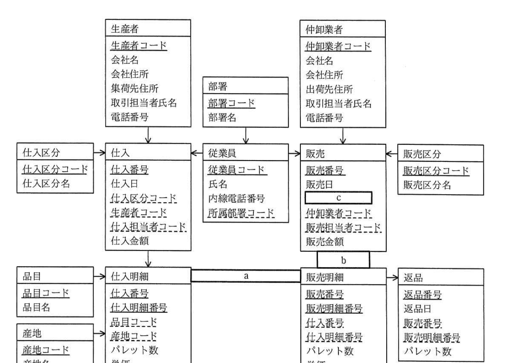
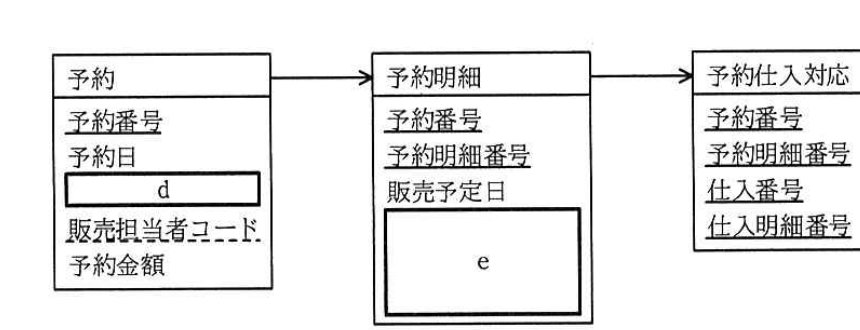

# 2017年秋期（平成29年度）応用情報技術者試験 午後 問6（選択）
## データベース：青果卸売業の取引システム改修（U社）

---

## 問題文

**問6** 青果卸売業の取引システム改修に関する次の記述を読んで、設問1〜3に答えよ。

U社は、卸売市場で青果物を取り扱う卸売業者である。生産者に対して青果物の販路を提供し、仲卸業者に対して迅速かつ安定的に青果物を供給している。生産者からは複数のパレット（運搬用の荷台）に積まれた青果物を一括で仕入れ、仲卸業者にはパレット単位で販売する。仲卸業者に販売された青果物は、箱単位に小分けされ、小売業者に販売される。青果物の取引の流れを図1に示す。

### 図1 青果物の取引の流れ

生産者 → 卸売市場（卸売業者(U社) → 仲卸業者） --（箱単位）--> 小売業者

（凡例：実線矢印はパレット単位の取引、点線矢印は箱単位の取引）

U社では、青果物の仕入と販売を管理するための取引システム、青果物の入荷や出荷を管理するための物流システム、仲卸業者への代金の請求や生産者への代金の支払、卸売手数料の精算を管理するための売掛・買掛システムなどが稼働している。

U社では、更なる安定価格・安定供給を実現するために、新たに予約相対売りという販売方法を行えるように取引システムを改修することにした。

---

### 〔現行の取引システムの概要〕

現行の取引システムのE-R図（抜粋）を図2に示す。U社の仕入担当者が生産者から青果物を仕入れ、U社の販売担当者が仲卸業者に販売している。仕入方法は、生産者から委託された商品を販売し、その代金から卸売手数料を差し引いた金額を生産者に支払う委託仕入が主である。近年はU社が自ら商品を購入する買付仕入も増加している。販売方法には、複数の仲卸業者が互いに価格を競い合い、最も高い価格を付けた仲卸業者に販売する競りと、一人の販売担当者と一人の仲卸業者が話合いで価格を決める相対売りの二つがある。仕入方法は仕入区分として管理され、販売方法は販売区分として管理される。仕入金額は仕入明細のパレット数と単価との積の総和であり、仕入伝票の入力時に取引システムによって算出される。販売金額も仕入金額と同様の方法で求める。青果物は毎日売り切ることが原則となっており、在庫はもたない。販売した青果物が傷んでいた場合は、販売日の取引時間内だけ仲卸業者からの返品を受け付ける。



> 図2の内容：生産者、部署、仲卸業者エンティティがそれぞれ仕入、従業員、販売エンティティに1対多で接続。仕入区分→仕入、従業員→仕入・販売、販売区分→販売もそれぞれ1対多。仕入→仕入明細、販売→販売明細も1対多。品目・産地→仕入明細も1対多。仕入明細と販売明細の間は`[　a　]`の関連。販売→販売明細は`[　b　]`。販売明細→返品は1対多。販売エンティティには`[　c　]`という属性がある。（凡例：→は1対多、↔は多対多。属性名の実線下線は主キー、破線下線は外部キー）

現行のデータベースでは、E-R図のエンティティ名を表名にし、属性名を列名にして、適切なデータ型で表定義した関係データベースによって、データを管理している。

---

### 〔取引システムの改修〕

予約相対売りとは、卸売業者と仲卸業者との間において、あらかじめ締結した契約に基づき青果物を仕入・販売する取引である。仲卸業者は複数の品目、複数の産地、複数の販売予定日の青果物を一括で予約できる。このとき、生産者の指定はできない。販売担当者が仲卸業者の希望する品目、産地、パレット数、単価、販売予定日を予約日と仲卸業者の組合せを軸に取りまとめ、それが予約情報として取引システムに入力される。予約情報を取りまとめる軸は今後変更される可能性がある。予約情報は品目や産地に応じて各仕入担当者に割り当てられ、その情報も取引システムに入力される。仕入担当者は予約情報に基づいて必要な青果物を生産者から仕入れる。

予約情報を管理するために、図2のE-R図に、図3に示す予約エンティティ、予約明細エンティティ及び予約仕入対応エンティティを追加する。また、販売明細がどの予約明細に対応しているかを後から確認できるようにするために、予約明細エンティティの主キーを販売明細エンティティに外部キーとして加える。



> 図3の内容：予約エンティティ（予約番号、予約日、`[　d　]`、販売担当者コード、予約金額）→予約明細エンティティ（予約番号、予約明細番号、販売予定日、`[　e　]`）→予約仕入対応エンティティ（予約番号、予約明細番号、仕入番号、仕入明細番号）。

---

### 〔販売伝票及び返品伝票の入力〕

取引時間は毎日午前3〜11時である。販売担当者は毎日一人当たり300件以上の取引を行っている。取引を迅速に行うために、取引の現場では販売担当者と仲卸業者が合意した販売条件を紙の販売伝票に記録している。販売伝票のヘッダ部には販売日、販売区分、仲卸業者、販売担当者が記載され、明細部には販売した青果物の仕入番号、仕入明細番号、パレット数、単価が複数記載される。販売伝票は事務員が当日の日中にまとめて取引システムに入力している。

返品が発生した場合には、販売担当者が返品伝票に返品内容の詳細を記録し、それが販売伝票と同様の流れで取引システムに入力される。

---

### 〔取引日報の出力〕

各営業日の販売実績は取引日報としてまとめられ、販売部門長に報告される。取引日報は、各営業日の全伝票の入力が完了した後、当日中に出力する。販売部門長から各営業日の返品実績も報告するよう指示があり、新たに合計返品金額と合計返品数量を取引日報に出力することになった。出力結果は品目ごとに産地別に当日中に集計する。合計返品金額と合計返品数量を算出するためのSQL文を図4に示す。ここで、USING句は名前付き列結合を示し、USING句内の列名は内部結合における等比較結合の結合条件に用いられる。

### 図4 合計返品金額と合計返品数量を算出するためのSQL文

```sql
SELECT 品目コード, 品目名, 産地コード, 産地名,
    [　f　] AS 合計返品金額, SUM(t1.パレット数) AS 合計返品数量
  FROM 返品 t1
    INNER JOIN 販売明細 t2 USING (販売番号, 販売明細番号)
    [　g　]
    INNER JOIN 品目 USING (品目コード)
    INNER JOIN 産地 USING (産地コード)
  WHERE 返品日 = CURRENT_DATE
  GROUP BY [　h　]
  ORDER BY 品目コード ASC, 産地コード ASC
```

---

## 設問

### 設問1 現行の取引システムのE-R図について、(1)、(2)に答えよ。

(1) 図2中の`[　a　]`〜`[　c　]`に入れる適切なエンティティ間の関連及び属性名を答え、E-R図を完成させよ。エンティティ間の関連及び属性名の表記は図2の凡例及び注記に倣うこと。

(2) 図2中で、他の属性から求めることが可能であるが、処理性能を改善するために追加されている属性の属性名を全て答えよ。

### 設問2 〔取引システムの改修〕について、(1)、(2)に答えよ。

(1) 図3中の`[　d　]`、`[　e　]`に入れる適切な属性名を、図2中の用語を用いて、全て答えよ。属性名の表記は図2の凡例及び注記に倣うこと。

(2) 図3中の予約エンティティにおいて、主キーに代用キーとして予約番号を用いる理由を、本文中の用語を用いて、35字以内で述べよ。

### 設問3 図4中の`[　f　]`〜`[　h　]`に入れる適切な字句を答えよ。

---

## 解答と解説

### 設問1

**(1) 正解：a = →、b = ↓、c = 販売区分コード**

仕入明細と販売明細は、それぞれ独立して管理されるが、販売明細の商品が仕入明細の商品に対応するため、仕入明細から販売明細への関連は1対多（**→**、a）となる。

販売から販売明細への関連は、凡例の1対多の表記に倣うと下向きの矢印（**↓**、b）で表される（販売：販売明細＝1：多）。

販売エンティティには、販売区分エンティティとの関連を実現する外部キーである**販売区分コード**（c）が必要である（仕入エンティティの仕入区分コードと対称的な構造）。

**IPA公式：a=→、b=↓、c=販売区分コード**

**(2) 正解：仕入金額、販売金額**

仕入金額は仕入明細のパレット数と単価との積の総和として算出可能であり、販売金額も同様に販売明細から算出可能である。これらは本来他の属性（仕入明細・販売明細の数量×単価の集計）から導出できる値だが、毎回集計計算をせずに済むよう、処理性能改善のために仕入・販売エンティティにあらかじめ保持されている。したがって、**仕入金額、販売金額**が該当する。

**IPA公式：仕入金額，販売金額**

---

### 設問2

**(1) 正解：d = 仲卸業者コード、e = 品目コード、産地コード、パレット数、単価、仕入担当者コード**

予約エンティティは、予約日と仲卸業者の組合せを軸に取りまとめられる情報であるため、外部キーとして**仲卸業者コード**（d）が必要である。

予約明細エンティティは、仲卸業者が希望する品目、産地、パレット数、単価、販売予定日（既に主キーの一部）の情報を保持し、さらに予約情報は品目や産地に応じて各仕入担当者に割り当てられるため、**品目コード、産地コード、パレット数、単価、仕入担当者コード**（e）が必要である。

**IPA公式：d=仲卸業者コード、e=品目コード，産地コード，パレット数，単価，仕入担当者コード**

**(2) 正解例：予約情報を取りまとめる軸は今後変更される可能性があるから**

本文中に「予約情報を取りまとめる軸は今後変更される可能性がある」と明記されている。もし予約日と仲卸業者コードの組合せをそのまま主キー（複合キー）とすると、取りまとめる軸が変更された場合に主キーの構造自体を変更する必要が生じてしまう。これを避けるため、業務的な意味をもたない代用キー（予約番号）を主キーとして採用し、**予約情報を取りまとめる軸は今後変更される可能性があるから**という理由で代用キーを用いている。

**IPA公式：予約情報を取りまとめる軸は今後変更される可能性があるから**

---

### 設問3

**正解：f = SUM(t2.単価 * t1.パレット数)、g = INNER JOIN 仕入明細 USING (仕入番号, 仕入明細番号)、h = 品目コード, 品目名, 産地コード, 産地名（または品目コード, 産地コード）**

合計返品金額は、返品されたパレット数（t1.パレット数）と、対応する販売明細の単価（t2.単価）との積の総和として算出する。したがって、f＝**SUM(t2.単価 * t1.パレット数)**。

品目コード・産地コードで集計するためには、販売明細から仕入明細（品目コード、産地コードをもつ）へ、仕入番号・仕入明細番号で結合する必要がある。したがって、g＝**INNER JOIN 仕入明細 USING (仕入番号, 仕入明細番号)**。

GROUP BY句は、SELECT句に列挙された非集計関数の列（品目コード、品目名、産地コード、産地名）を全て指定する必要がある。したがって、h＝**品目コード, 品目名, 産地コード, 産地名**（品目コードと産地コードが決まれば品目名・産地名も一意に決まるため、品目コード, 産地コードのみでもよい）。

**IPA公式：f=SUM(t2.単価 * t1.パレット数)、g=INNER JOIN 仕入明細 USING (仕入番号, 仕入明細番号)、h=品目コード, 品目名, 産地コード, 産地名 又は 品目コード, 産地コード**

---

## 参考：主要キーワード

| 用語 | 説明 |
|------|------|
| E-R図（実体関連図） | エンティティ（実体）とその間の関連（リレーションシップ）を図示したデータモデル。1対1・1対多・多対多の関連を矢印で表現する |
| 代用キー（サロゲートキー） | 業務的な意味をもたない人工的な識別子を主キーとして採用する手法。取りまとめる軸などの業務ルールが変化しても主キー構造を変えずに済む |
| 冗長化による処理性能改善 | 他の属性から計算可能な値をあらかじめ集計・保持しておくことで、都度の再計算を避け、参照性能を向上させる設計手法 |
| USING句（名前付き列結合） | INNER JOINにおいて、結合する両テーブルの同名列同士を等結合する場合に使う簡潔な結合条件の指定方法 |
| GROUP BY句とSELECT句の整合性 | 集計クエリでは、SELECT句の非集計列は全てGROUP BY句に含める必要がある（関数従属する列は省略可能な場合もある） |
