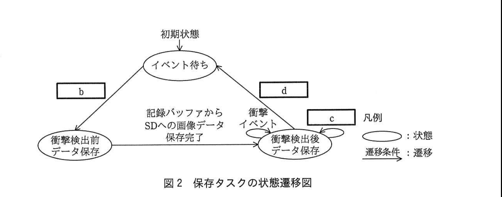

# 2017年秋期（平成29年度）応用情報技術者試験 午後 問7（選択）
## 組込みシステム開発：ドライブレコーダ（H社）

---

## 問題文

**問7** ドライブレコーダに関する次の記述を読んで、設問1〜4に答えよ。

H社は、カーアクセサリ用品の開発会社である。H社では、このたび、ドライブレコーダ（以下、レコーダという）を設計することになった。

レコーダは、自動車運転時における周囲の状況を撮影し、急停止、衝突など（以下、衝撃という）を検出すると、衝撃までの最大10秒間及び衝撃後20秒間の動画に、GPS情報を含めて動画ファイルとしてSDカード（以下、SDという）に保存する。

---

### 〔レコーダの基本動作〕

図1にレコーダのハードウェア構成を示す。

### 図1 レコーダのハードウェア構成

カメラ・SDコントローラ ─ 制御装置 ─ 記録バッファ・衝撃センサ・GPSモジュール（制御装置を中心に、カメラ、SDコントローラ、記録バッファ、衝撃センサ、GPSモジュールが接続される構成）

**(1) 電源投入後の動作**

各ハードウェアは、電源投入で起動し、次のとおり動作を開始する。

① 制御装置は、衝撃センサの割込みを有効にし、カメラに撮影を指示する。

② GPSモジュールは、GPS情報の取得を開始する。取得したGPS情報を1秒ごとに制御装置に通知し、GPS情報を取得できないときは通知しない。GPS情報には、GPSから得られた位置及び時刻が含まれる。

③ 制御装置は、最初のGPS情報を受け取ると、GPS情報から時刻を取り出してシステム時刻に設定し、その後、ソフトウェアでシステム時刻を逐次更新する。また、GPS情報を取得できるときは、GPS情報の時刻によって1時間ごとにシステム時刻を補正する。

④ 制御装置は、カメラから1フレームごとの画像データを受け取り、記録バッファに書き込む。このとき、GPS情報があれば、画像データに含めて記録バッファに書き込む。

**(2) 衝撃検出時の動作**

・衝撃センサは、衝撃を検出すると、制御装置に割込みで通知する。

・制御装置は、衝撃センサからの割込みを受けると記録バッファに書き込まれている画像データを動画ファイルとしてSDに保存する。

**(3) 電源断時の動作**

レコーダは電源断となっても最低30秒間は動作を維持できる二次電池を内蔵している。電源断となったときには、衝撃センサからの割込みを禁止とし、二次電池から電力を供給する。この結果、レコーダが`[　a　]`しているときに電源断となっても、動画ファイルの破損を防止できる。

---

### 〔記録バッファ〕

記録バッファは、画像データを書き込むためのFIFO構成のメモリである。カメラで撮影した画像データが書き込まれ、動画ファイルをSDに保存するとき、その画像データが読み出される。読み出された画像データは記録バッファから削除される。

画像データが読み出されずに記録バッファの空き容量がなくなったときは、最も古い画像データから順に破棄され、常に最新の画像データが書き込まれていることになる。

カメラはFフレーム／秒で画像を撮影する。1フレームの画像データはGPS情報を含めてNバイトである。

記録バッファには、衝撃検出直前の10秒間分の画像データが書き込まれる。さらに、動画ファイルの保存の処理遅れを考慮して、10.5秒間分の画像データを書き込むことができる容量とする。

---

### 〔動画ファイルの保存〕

動画ファイルは、SDの空き容量が十分であれば、衝撃を検出したシステム時刻（YYYYMMDD_hhmmss）をファイル名として保存される。ここで、YYYY、MM、DD、hh、mm、ssは、それぞれ西暦年、月、日、時、分、秒を表す。

なお、システム時刻が設定されていないときは、動画ファイルを保存しない。

(i) 制御装置は、衝撃センサからの割込みを受けると、記録バッファに書き込まれている最大10秒間分の画像データを圧縮して動画ファイルとしてSDに保存する。保存に要する時間は最大100ミリ秒である。

(ii) 以降20秒間、記録バッファに書き込まれる画像データを待ち受け、新しい画像データが書き込まれると、逐次、圧縮して動画ファイルに追記する。

(iii) SDに動画ファイルを保存中に再度衝撃センサからの割込みを受けると、受けた時点から20秒間、(ii)と同様に画像データを圧縮して動画ファイルに追記する。

---

### 〔レコーダのタスク構成〕

表1にレコーダのタスク構成を示す。

各タスクはイベントドリブン方式で制御され、イベントを受信すると必要な処理を行う。

衝撃センサが衝撃を検出すると割込みで通知し、割込み処理プログラムは保存タスクに衝撃イベントを送信する。

### 表1 レコーダのタスク構成

| タスク | 主な動作 |
|---|---|
| 録画タスク | ・カメラからの画像データを1フレームごとに記録バッファに書き込む。このとき、GPS情報があれば画像データに含める。保存タスクに画像格納イベントを送信する。 ・GPSタスクからGPS取得イベントを受信すると、GPS情報を保存する。 |
| 保存タスク | ・記録バッファの画像データを動画ファイルとしてSDに保存する。 |
| GPSタスク | ・1秒ごとにGPS情報を取得し、録画タスクにGPS取得イベントを送信する。 ・電源投入直後及び1時間ごとに、GPS情報の時刻をシステム時刻に設定する。 |
| タイマタスク | ・指定された時間が経過するとタイマ満了イベントを送信する。 |

---

### 〔保存タスクの動作〕

図2に保存タスクの状態遷移図を示す。

> 図2の内容：初期状態からイベント待ちに入り、遷移条件`[　b　]`で衝撃検出前データ保存に遷移。「記録バッファからSDへの画像データ保存完了」で衝撃検出後データ保存に遷移。衝撃検出後データ保存では遷移条件`[　c　]`で自己遷移（ループ）し、遷移条件`[　d　]`でイベント待ちに戻る。

**(1) イベント待ち**

衝撃イベントを受信すると、衝撃検出前データ保存状態に遷移する。

**(2) 衝撃検出前データ保存**

タイマに`[　e　]`秒を設定し、動画ファイルを生成する。次に、記録バッファに書き込まれている画像データを読み出して動画ファイルに追記する。記録バッファに書き込まれている最大10秒分の画像データを全て保存すると、衝撃検出後データ保存状態に遷移する。

**(3) 衝撃検出後データ保存**

各種イベントを受信してイベントに応じた処理を行う。

・画像格納イベントを受信すると、記録バッファから1フレーム分の画像データを読み出し、動画ファイルに追記する。

・衝撃イベントを受信すると、設定してあるタイマ要求を取り消し、タイマに新たに`[　f　]`秒を設定する。

・タイマ満了イベントを受信すると、動画ファイルの保存を終了し、イベント待ち状態に遷移する。

---

## 設問

### 設問1 〔レコーダの基本動作〕について、本文中の`[　a　]`に入れる適切な字句を答えよ。

### 設問2 〔記録バッファ〕について、記録バッファの容量を求める式を、カメラが1秒間に撮影するフレーム数F及びGPS情報を含む1フレームの画像データのバイト数Nを使って答えよ。

### 設問3 〔保存タスクの動作〕について、(1)、(2)に答えよ。

(1) 図2中の`[　b　]`〜`[　d　]`に入れるイベントを、本文中のイベントを用いて答えよ。

(2) 本文中の`[　e　]`、`[　f　]`に入れる適切な数値を答えよ。

### 設問4 現在のレコーダの設計では、電源投入後に衝撃を検出しても、動画ファイルをSDに保存しないことがある。どのような場合にこのようなことが起きるのか。40字以内で述べよ。ここで、SDには十分な空き容量があり、ハードウェアに故障はないものとする。

---

## 解答と解説

### 設問1

**正解：動画ファイルを保存**

電源断時には衝撃センサからの割込みを禁止し二次電池から電力を供給することで、レコーダが**動画ファイルを保存**しているとき（SDへの書き込み処理の途中）に電源断となっても、書き込み処理を安全に完了させることができ、動画ファイルの破損を防止できる。

**IPA公式：動画ファイルを保存**

---

### 設問2

**正解：10.5FN**

記録バッファは、10.5秒間分の画像データを書き込むことができる容量とすると本文にある。1秒間にFフレーム撮影し、1フレームがNバイトなので、10.5秒間分のデータ量は **10.5FN**（バイト）となる。

**IPA公式：10.5FN**

---

### 設問3

**(1) 正解：b = 衝撃イベント、c = 画像格納イベント、d = タイマ満了イベント**

イベント待ち状態から衝撃検出前データ保存状態への遷移条件は、本文(1)より「衝撃イベントを受信すると、衝撃検出前データ保存状態に遷移する」なので、b＝**衝撃イベント**。

衝撃検出後データ保存状態での自己遷移（ループ）条件は、本文(3)より画像格納イベントを受信して1フレーム分を追記する処理なので、c＝**画像格納イベント**。

衝撃検出後データ保存状態からイベント待ちへの遷移条件は、本文(3)より「タイマ満了イベントを受信すると、動画ファイルの保存を終了し、イベント待ち状態に遷移する」なので、d＝**タイマ満了イベント**。

**IPA公式：b=衝撃イベント、c=画像格納イベント、d=タイマ満了イベント**

**(2) 正解：e = 20、f = 20**

衝撃検出前データ保存の段階では、衝撃検出前の最大10秒分の画像データの保存に続き、衝撃検出後の20秒間分の画像データも保存する必要がある。タイマは衝撃検出後データ保存の20秒間を計測するために設定されるので、e＝**20**。

衝撃検出後データ保存中に再度衝撃イベントを受信した場合、(iii)の記述より「受けた時点から20秒間」画像データを保存するとあるので、タイマに新たに設定する秒数もf＝**20**である。

**IPA公式：e=20、f=20**

---

### 設問4

**正解例：電源投入後、システム時刻の設定が完了するまでの間に衝撃を検出した場合**

本文の〔動画ファイルの保存〕に「システム時刻が設定されていないときは、動画ファイルを保存しない」とある。システム時刻は、GPSモジュールから最初のGPS情報を受け取った時点で設定される（電源投入直後は未設定）。したがって、**電源投入後、システム時刻の設定が完了するまでの間に衝撃を検出した場合**には、動画ファイルが保存されないことになる。

**IPA公式：電源投入後，システム時刻の設定が完了するまでの間に衝撃を検出した場合**

---

## 参考：主要キーワード

| 用語 | 説明 |
|------|------|
| FIFO構成のメモリ（リングバッファ） | 先入れ先出し（First In First Out）方式で管理されるバッファ。空き容量がなくなると最も古いデータから破棄され、常に最新データを保持する |
| イベントドリブン方式 | 各タスクが特定のイベント（信号・メッセージ）を受信したときに処理を実行する制御方式。組込みシステムでよく用いられる |
| 状態遷移図 | システムが取り得る状態と、イベント（遷移条件）による状態間の移動を図示したモデル。組込みシステムの設計でよく用いられる |
| GPSによる時刻同期 | GPSモジュールから得られる時刻情報を用いてシステム時刻を設定・補正する仕組み。取得できない場合は時刻未設定のままとなる点に注意 |
| 二次電池によるバックアップ | 電源断時にも一定時間動作を継続できるようにする設計。処理途中でのデータ破損を防ぐ目的で使われる |
