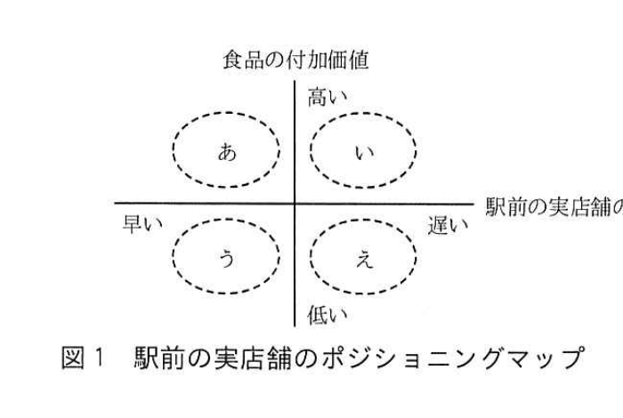

# 2018年春期（平成30年度）応用情報技術者試験 午後 問2（選択）
## 経営戦略：事業戦略の策定（G社／スーパーマーケットチェーン）

---

## 問題文

**問2** 事業戦略の策定に関する次の記述を読んで、設問1〜3に答えよ。

G社は、郊外及び駅前に、加工食品・生鮮食品を主体としたスーパーマーケットチェーンを展開している、中規模の企業である。これまでのターゲット顧客は、郊外の住宅地にある中規模な店舗の場合は、近隣に居住している主婦であり、住宅地と商業地とが混在した地域にある駅前の小規模な店舗の場合は、住宅地の主婦と通勤者である。

G社は、近年、売上高、利益率とも伸び悩んできたことから、昨年、既存の店舗（以下、実店舗という）の周囲5km圏内に居住する共働き者・単身者をターゲット顧客として取り込もうと、インターネット店舗（以下、ネット店舗という）での販売を開始した。ネット店舗では、実店舗で扱っている商品を対象に、受注は受付センタで行い、梱包と配送の手配は、実店舗で行っている。

今年度、G社の経営企画部では、売上高、利益率を増加するために、実店舗とネット店舗の活性化を柱とする、新たな中期事業戦略を策定することになった。そこで、経営企画部のH部長は、I課長に対して、G社の内部環境と外部環境を整理した上で、中期事業戦略案を作成するよう指示した。

---

### 〔内部環境と外部環境の整理〕

I課長は、内部環境と外部環境を調査し、次のとおり整理した。

**(1) 内部環境**

**(i) 実店舗の状況**
- 営業時間は、8時から19時までである。
- 価格が安く、価格以外にはこだわりがない顧客向けの食品（以下、低付加価値食品という）の販売が主体であり、店舗の規模を考慮した品ぞろえとなっている。
- 価格が高くても購入してもらえる、品質にこだわりがある顧客向けの食品（以下、高付加価値食品という）は、少量の販売とはいえ、顧客には好評である。
- 丁寧な接客と、商品が見つけやすく明るい雰囲気を特徴とする店舗が、スーパーマーケットチェーンのブランドとして定着してきた。
- 会員制度を運営しており、実店舗で会員登録した顧客には、実店舗用の顧客IDの入ったポイントカードを発行して、商品購入時に所定のポイントを付与している。

**(ii) ネット店舗の状況**
- 販売は、少量にとどまっている。
- ネット店舗利用のため、インターネットで会員登録した顧客には、ネット店舗用の顧客IDを割り振り、商品購入時に所定のポイントを付与している。

**(iii) 購入者及びポイント利用の状況**
- 郊外の実店舗では、近隣に居住する主婦への売上が80%を占めている。
- 駅前の実店舗では、住宅地の主婦への売上が40%、通勤者への売上が40%を占めている。
- ネット店舗では、共働き者への売上が60%、単身者への売上が20%を占めている。
- 実店舗とネット店舗のポイントを相互に利用することはできない。

**(iv) 社内の情報システムの状況**
- 顧客情報は、実店舗とネット店舗での共用は行わず、個々の顧客管理システムで、それぞれの顧客IDを用いて管理し、購入額を集計している。

**(2) 外部環境**

**(i) スーパーマーケット市場の状況**
- 実店舗のスーパーマーケットの市場規模は、インターネット通販の台頭などの影響で縮小傾向にある。
- スーパーマーケット業界では、価格競争が激化している。

**(ii) 顧客の購入状況**
- 主婦には、安全性が高い自然食品などの高付加価値食品が人気になっている。
- 通勤者には、価格の高さにもかかわらず、海外から仕入れたブランド物の酒類などの高付加価値食品の人気が高まっている。
- 仕事帰りの遅い時間帯に、高付加価値食品が購入される傾向が強く見られる。
- ブランド物の酒類に合う高級なおつまみ類にこだわる顧客が増えている。
- "高価格だが、それに見合うおいしさ"などといった友人・知人の口コミから判断して食品を購入し、その感想を自分の友人・知人に知らせることによって、人気となる食品が増えている。

---

### 〔中期事業戦略の策定〕

I課長は、中期事業戦略案を策定するために、クロスSWOT分析による戦略オプションを表1のように策定した。

### 表1 クロスSWOT分析による戦略オプション

| | 機会(O) | 脅威(T) |
|---|---|---|
| **強み(S)** | 〔積極的な推進戦略〕 ・`[　a　]`の品ぞろえを充実して、売上を増やす。 | 〔差別化戦略〕 ・商品購入時の心地良い環境を更に整えることによって、`[　b　]`を強化する。 ・口コミを拡大して、新規顧客を開拓する。 |
| **弱み(W)** | 〔弱点強化戦略〕 ・販売機会を拡大する。 ・社内の情報システムを改善する。 | 〔専守防衛、又は撤退戦略〕 ・関連商品による範囲の経済性を活用する。 ・`[　a　]`を充実して価格競争を避ける。 |

I課長は、戦略オプションに基づいて、中期事業戦略案を次のように作成して、H部長に説明した。
- 実店舗、ネット店舗の特性に応じて、`[　a　]`の品ぞろえを充実する。
- 店舗での販売機会を拡大する。
- 情報システムを改善して、コスト低減とマーケティング強化を図る。
- 店舗の心地良い環境を更に整えることによって、`[　b　]`を強化する。
- ソーシャルメディアを活用して、口コミの拡大を進める。

その後、I課長が提案した中期事業戦略案は経営層の承認が得られ、I課長は、中期事業戦略に基づいて、ターゲットとする顧客の見直しとポジショニングの設定を行い、事業施策案の作成を進めた。

---

### 〔ターゲットとする顧客の見直しとポジショニングの設定〕

I課長は、事業施策案の作成に当たり、店舗の地域特性と規模に応じて、ターゲットとする顧客を見直すことにした。郊外の実店舗とネット店舗では、ターゲットとする顧客をこれまでどおりとし、駅前の実店舗は小規模なので、今後注力すべきターゲット顧客を明確にして、ポジショニングを設定することにした。

**(1) 注力すべきターゲット顧客の明確化**

駅前の実店舗では、高付加価値食品の購入が多い通勤者を、注力すべきターゲットとする。

**(2) ポジショニングの設定**

I課長は、注力すべきターゲットに基づき、食品の付加価値と食品の価格を二つの軸として駅前の実店舗のポジショニングマップ案を作成し、H部長に説明した。H部長からは、このポジショニングマップで顧客の`[　c　]`を表現することはできるが、二つの軸は`[　d　]`ので、食品の付加価値と駅前の実店舗の閉店時刻を軸にして、ポジショニングマップを修正するようにアドバイスを受けた。そこで、I課長は、駅前の実店舗のポジショニングマップを図1のとおり作成し、H部長の了解を得た。

> 縦軸：食品の付加価値（高い／低い）、横軸：駅前の実店舗の閉店時刻（早い／遅い）の4象限マップ。左上「あ」＝付加価値高い×閉店時刻早い、右上「い」＝付加価値高い×閉店時刻遅い、左下「う」＝付加価値低い×閉店時刻早い、右下「え」＝付加価値低い×閉店時刻遅い。

---

### 〔事業施策の策定〕

ターゲットとする顧客と実店舗のポジショニングが明確となったので、I課長は引き続き、事業施策案を作成した。事業施策案の抜粋は、次のとおりである。

**(1) 商品に関する施策**
- 郊外の実店舗では、低付加価値食品の品ぞろえを主体としながら、自然食品を使った手作りの総菜を充実させる。
- 駅前の実店舗では、①顧客がブランド物の酒類を購入する際に、範囲の経済性の効果をもたらすように、品ぞろえを充実させる。

**(2) 各店舗での販売チャネルに関する施策**
- 実店舗では、来店した顧客に食品の新たな調理方法や効能を丁寧に説明する。
- 駅前の実店舗では、閉店時刻を19時から23時に変更する。
- ネット店舗では、料理のレシピ集を掲載する。

**(3) 情報システムに関する施策**
- 実店舗とネット店舗の両店舗を利用し、会員登録している顧客については、本人の承諾が得られた場合、②両店舗での総購入額に応じたボーナスポイントをプレゼントし、両店舗でのポイントの合算、利用を可能とする。

**(4) プロモーション施策**
- 実店舗での購買行動のモデルであるAIDMAに加えて、ネット店舗ではインターネットを活用した新しい購買行動モデルを反映する。具体的には、顧客がソーシャルメディアなどの口コミ情報を`[　e　]`して商品を購入し、使用後の感想などを`[　f　]`することによって、消費行動の迅速な拡大につなげる。

I課長は、これらの事業施策案についてH部長に説明して、承認を得た後、事業施策の評価基準及びアクションプランを策定することにした。

---

## 設問

### 設問1 〔中期事業戦略の策定〕について、表1中及び本文中の`[　a　]`に入れる適切な字句を10字以内で、`[　b　]`に入れる適切な字句を25字以内でそれぞれ答えよ。

### 設問2 〔ターゲットとする顧客の見直しとポジショニングの設定〕について、(1)、(2)に答えよ。

(1) 本文中の`[　c　]`に入れる適切な字句を5字以内で、`[　d　]`に入れる適切な字句を10字以内でそれぞれ答えよ。

(2) 駅前の実店舗について、ターゲットとする顧客の見直し前と見直し後のポジショニングとして、図1中の記号の適切な組合せを解答群の中から選び、記号で答えよ。ここで、"（見直し前のポジショニング）→（見直し後のポジショニング）"と表記するものとする。

**解答群：**
ア　（あ）→（い）　　イ　（い）→（え）　　ウ　（う）→（あ）
エ　（う）→（い）　　オ　（え）→（あ）　　カ　（え）→（う）

### 設問3 〔事業施策の策定〕について、(1)〜(3)に答えよ。

(1) 本文中の下線①について、品ぞろえを充実させる方法を25字以内で述べよ。

(2) 本文中の下線②について、情報システムの改善内容を40字以内で述べよ。

(3) 本文中の`[　e　]`、`[　f　]`に入れる適切な字句を解答群の中から選び、記号で答えよ。

**解答群：**
ア　拡散　　イ　記憶　　ウ　検索　　エ　行動　　オ　注目

---

## 解答と解説

### 設問1

**正解：a = 高付加価値食品（7字）、b = スーパーマーケットチェーンのブランド（19字）**

- a：表1の「強み×機会」（積極的な推進戦略）と「弱み×脅威」（専守防衛・撤退戦略）の両方に入る字句であり、G社の強みである少量ながら好評な**高付加価値食品**の品ぞろえ充実が該当する。価格競争を避ける戦略にも一致する。
- b：〔内部環境〕(i)に「丁寧な接客と、商品が見つけやすく明るい雰囲気を特徴とする店舗が、スーパーマーケットチェーンのブランドとして定着してきた」とあり、店舗の心地良い環境整備によって強化されるのは**スーパーマーケットチェーンのブランド**。

**IPA公式：a = 高付加価値食品、b = スーパーマーケットチェーンのブランド**

---

### 設問2

**(1) 正解：c = ニーズ（2字）、d = 強い相関がある（8字）**

食品の付加価値と食品の価格を軸としたポジショニングマップは、顧客の**ニーズ**（高付加価値を求めるか、低価格を求めるか）を表現できる。しかし、外部環境より「価格が高くても品質にこだわる高付加価値食品が人気」とあるように、付加価値が高い食品ほど価格も高くなる傾向があり、二つの軸（付加価値・価格）は**強い相関がある**ため、軸として独立性に乏しく不適切と判断された。

**IPA公式：c = ニーズ、d = 強い相関がある**

**(2) 正解：エ（（う）→（い））**

見直し前の駅前の実店舗は、低付加価値食品中心の販売で、閉店時刻も19時と早かったため、付加価値が低く閉店時刻が早い「う」に位置していた。事業施策により、通勤者をターゲットとしてブランド物の酒類など高付加価値食品の品ぞろえを充実させ、閉店時刻を23時（遅い）に変更したことで、見直し後は付加価値が高く閉店時刻が遅い「い」に移行する。

**IPA公式：エ**

---

### 設問3

**(1) 正解例：ブランド物の酒類に合う高級なおつまみ類を充実させる。（25字以内）**

外部環境の調査結果に「ブランド物の酒類に合う高級なおつまみ類にこだわる顧客が増えている」とあり、範囲の経済性（関連商品を組み合わせて相乗効果を得ること）を活かすには、酒類と一緒に購入されるおつまみ類の品ぞろえを充実させることが有効である。

**IPA公式：高級なおつまみ類の品ぞろえを増やす。**

**(2) 正解例：実店舗とネット店舗の顧客IDを統合し、顧客ごとの購入額を集計する。（40字以内）**

現状では実店舗とネット店舗の顧客情報・顧客IDは別々に管理されており、ポイントも相互利用できない。両店舗の総購入額に応じたボーナスポイント付与を実現するには、実店舗とネット店舗の顧客IDを統合（または顧客の属性情報で名寄せ）し、顧客ごとの購入額を合算して集計できるようにシステムを改善する必要がある。

**IPA公式：**
- 実店舗とネット店舗の顧客IDを統合し、顧客ごとの購入額を集計する。
- 顧客の属性情報によって名寄せをし、顧客ごとの購入額を集計する。

**(3) 正解：e = ウ（検索）、f = ア（拡散）**

AIDMA（Attention注目→Interest関心→Desire欲求→Memory記憶→Action行動）に対し、インターネット時代の購買行動モデルAISAS/AISCEASでは、口コミ情報を**検索**（Search）してから購入し、購入後の感想を**拡散**（Share）する行動が加わる。

**IPA公式：e = ウ、f = ア**

---

## 参考：主要キーワード

| 用語 | 説明 |
|------|------|
| クロスSWOT分析 | 強み・弱み（内部環境）と機会・脅威（外部環境）を掛け合わせ、積極推進・差別化・弱点強化・専守防衛/撤退の4つの戦略オプションを導く分析手法 |
| ポジショニングマップ | 顧客のニーズや自社の立ち位置を、独立性の高い2軸で可視化し、競合との差別化ポイントを明確にする手法。軸同士の相関が強いと有効な分析にならない |
| 範囲の経済性 | 関連する複数の商品・事業を組み合わせて提供することで、個別に提供するよりも高い効果・効率を得られること |
| AIDMA / AISAS | AIDMAは伝統的な購買行動モデル（注目→関心→欲求→記憶→行動）。インターネット時代はAISAS（注目→関心→検索→行動→共有）のように検索・拡散が加わる |
| 名寄せ | 異なるシステムに存在する顧客データを、氏名や属性情報等を用いて同一人物として統合すること |
| 口コミ拡大戦略 | ソーシャルメディア等を通じて顧客の購入後の感想を拡散させ、新規顧客の獲得につなげる差別化戦略 |
