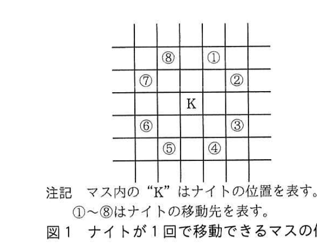
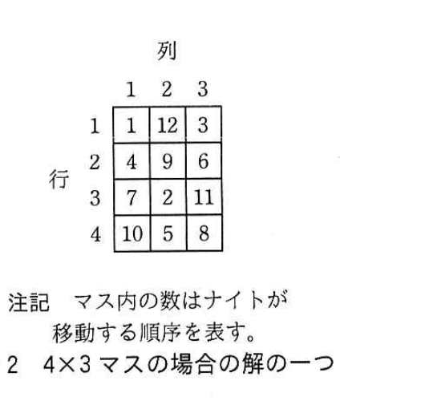
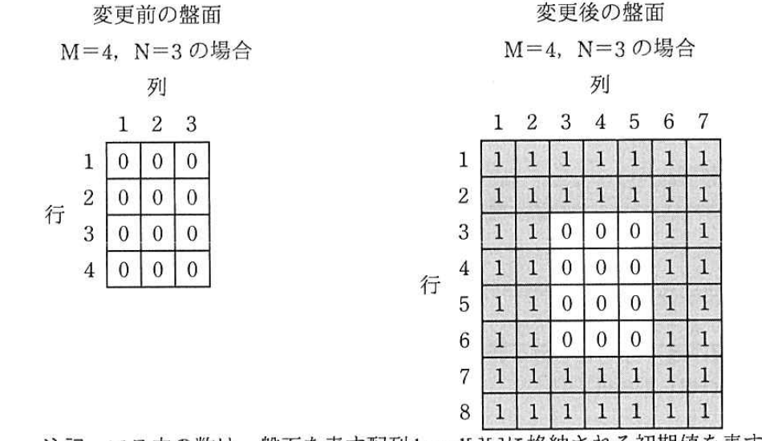

# 2018年春期（平成30年度）応用情報技術者試験 午後 問3（選択）
## プログラミング：ナイトの巡歴問題

---

## 問題文

**問3** ナイトの巡歴問題に関する次の記述を読んで、設問1〜3に答えよ。

ナイトの巡歴問題とは、M行N列（以下、M×Nマスという）の盤面上でチェスの駒の一種であるナイトを移動させ、全てのマスを1回ずつ通過する経路を発見する問題である。

ナイト（K）が1回で移動できるマス（以下、移動先という）の位置を図1に示す。また、4×3マスの場合のナイトの巡歴問題の解の一つを図2に示す。図2に示す、ナイトの移動する順序を表す数を、移動順序という。

なお、行番号は上から下、列番号は左から右に増加する。



> マス内の"K"はナイトの位置を表す。①〜⑧はナイトの移動先を表す。中央のKから見て、上2下2左2右2に2マス、その垂直方向に1マスずらした位置（桂馬飛び）に①〜⑧が配置されている。



> マス内の数はナイトが移動する順序を表す。3行3列の盤面に1〜12の移動順序が桂馬飛びの経路で配置されている。

M×Nマスのナイトの巡歴問題について、行1列1のマスを起点とする全ての経路を求める処理の概要を示す。この処理は、再帰による深さ優先探索として実現されている。

---

### 〔ナイトの巡歴問題の処理の概要〕

**(1)** 移動順序1、行1、列1で、再帰関数searchを呼び出す。

再帰関数search(移動順序, 行, 列)

**(i)** 行と列で指定されるマス（以下、現在のマスという）が盤面の範囲外、又は既に通過したマスであった場合、何もせずに再帰関数searchの呼出し元へ戻る。

**(ii)** (i)以外の場合、現在のマスに、移動順序を記録する。

**(ii-1)** 記録した移動順序がM×Nに等しい場合、その経路を解の一つとして出力する。

**(ii-2)** (ii-1)以外の場合、現在のマスを起点とした図1の移動先①〜⑧のそれぞれについて再帰関数searchを呼び出す。引数の行と列には、移動先を指定する。移動順序には、現在の移動順序に1を加えたものを指定する。

**(ii-3)** 現在のマスの移動順序を取り消して、マスを通過していない状態に戻す。

**(ii-4)** 再帰関数searchの呼出し元へ戻る。

**(2)** 終了する。

この処理の概要をプログラムに実装するために、M×Nマスの盤面、ナイトの移動先をそれぞれ次のデータ構造で表現することにした。

- M×Nマスの盤面を2次元配列board[M][N]で表現する。添字は1から始まる。各要素の初期値は0とし、ナイトが通過した場合に、移動順序を各要素に格納する。
- ナイトの各移動先について、行方向、列方向、それぞれの移動量をdv[ ], dh[ ]の配列で表現する。添字は1から始まる。dv[ ], dh[ ]はそれぞれ、八つの要素をもち、図1の移動先①〜⑧に対応する行方向、列方向の移動量を設定する。

dv[ ], dh[ ]に設定する値を表1に示す。①の場合、行方向は上に2マス、列方向は右に1マス移動するので、dv[1]は-2、dh[1]は1となる。

### 表1 dv[ ], dh[ ]に設定する値

| 図1の移動先 | ① | ② | ③ | ④ | ⑤ | ⑥ | ⑦ | ⑧ |
|---|---|---|---|---|---|---|---|---|
| dv[ ] | -2 | -1 | 1 | `[　ア　]` | 2 | 1 | -1 | -2 |
| dh[ ] | 1 | 2 | 2 | 1 | -1 | `[　イ　]` | -2 | -1 |

---

### 〔ナイトの巡歴問題の解法のプログラム〕

M×Nマスのナイトの巡歴問題について、解法のプログラムを考える。

解法のプログラムで使用する定数、変数及び関数を表2に示す。

### 表2 解法のプログラムで使用する定数、変数及び関数

| 名称 | 種類 | 内容 |
|---|---|---|
| M | 定数 | 盤面の行数を表す定数 |
| N | 定数 | 盤面の列数を表す定数 |
| m | 変数 | プログラム中で盤面の行数を表す変数 |
| n | 変数 | プログラム中で盤面の列数を表す変数 |
| search(i,v,h) | 関数 | ナイトを次のマスへ移動させる再帰関数 |
| i | 変数 | ナイトの移動順序を表す変数 |
| v | 変数 | 調べるマスの行番号を表す変数 |
| h | 変数 | 調べるマスの列番号を表す変数 |
| printBoard() | 関数 | 解答を印字する関数 |
| printFlag | 変数 | 解答を印字したかどうかを表す変数 |

再帰関数searchのプログラムを図3に、解答を印字する関数printBoardのプログラムを図4に、メインプログラムを図5に示す。なお、左側の番号はプログラムの行番号を示す。

```
図3 再帰関数searchのプログラム
 1: function search( i, v, h )
 2:   if( vが1以上、かつ、m以下 )
 3:     if( hが1以上、かつ、n以下 )
 4:       if( board[v][h] が 0 )         //通過したマスを判定する。
 5:         board[v][h] ← i              //移動順序を記録する。
 6:         if( [　ウ　] )
 7:           printBoard()                //解答を印字する。
 8:           printFlag ← 1
 9:         else
10:           for( j を 1から8まで1ずつ増やす)
11:             search( [　エ　], [　オ　], [　カ　] )  //次の移動先を調べる。
12:           endfor
13:         endif
14:         [　キ　]                       //移動順序を取り消す。
15:       endif
16:     endif
17:   endif
18: endfunction
```

```
図4 関数printBoardのプログラム
19: function printBoard()
20:   for( v を 1から m まで1ずつ増やす )
21:     for( h を 1から n まで1ずつ増やす )
22:       print( board[v][h] )
23:     endfor
24:     print( 改行 )
25:   endfor
26: endfunction
```

```
図5 メインプログラム
27: function main()
28:   m ← M
29:   n ← N
30:   board[][]を初期化する
31:   printFlag ← 0
32:   search( 1, 1, 1 )
33:   if( printFlag が 0 )
34:     print( "解答がありません。" )
35:   endif
36: endfunction
```

---

### 〔盤面の表現の変更〕

ナイトの移動先が盤面の範囲外となった場合の判定処理を簡略化するために、図6のように盤面をナイトが移動できるマスが全て含まれる範囲まで拡大して表現する。

この変更に合わせて①関数printBoardの変更、②メインプログラムの変更、③再帰関数searchの一部の行の削除を同時に行うことによって、プログラムを短縮することができる。



> 変更前の盤面（M=4, N=3の場合）は4行3列の0で初期化された配列。変更後の盤面は行1〜8、列1〜7に拡張され、実際に使用する中央の4行3列部分（行3〜6、列3〜5）だけが0で初期化され、外周部分は全て1（移動不可を示す値）で埋められている。

---

## 設問

### 設問1 表1中の`[　ア　]`、`[　イ　]`に入れる適切な移動量を答えよ。

### 設問2 図3中の`[　ウ　]`〜`[　キ　]`に入れる適切な字句を答えよ。

### 設問3 〔盤面の表現の変更〕について、(1)〜(3)に答えよ。

(1) 本文中の下線①について、関数printBoardのプログラムで変更が必要な行の行番号と、変更後のプログラムを、2か所答えよ。

(2) 本文中の下線②について、メインプログラムで変更が必要な行の行番号と、変更後のプログラムを、1か所答えよ。

(3) 本文中の下線③について、再帰関数searchのプログラムで削除することが必要な行の行番号を全て答えよ。

---

## 解答と解説

### 設問1

**正解：ア = 2、イ = -2**

表1は図1の桂馬飛びの移動先①〜⑧に対応する(dv, dh)の組で、①(-2,1)から反時計回りに8方向を一巡する規則性がある。④はdh[4]=1で、③(1,2)から⑤(2,-1)へ向かう間の移動先であり、dv[4]は**2**。⑥はdv[6]=1で、⑤(2,-1)と⑦(-1,-2)の間に位置し、dh[6]は**-2**。

**IPA公式：ア = 2、イ = -2**

---

### 設問2

**正解：ウ = iがM×N、エ = v+dv[j]、オ = h+dh[j]、カ = board[v][h] ← 0**

- ウ：〔ナイトの巡歴問題の処理の概要〕(ii-1)「記録した移動順序がM×Nに等しい場合、その経路を解の一つとして出力する」に対応。したがって`if( i が m×n )`。
- エ・オ：(ii-2)「現在のマスを起点とした図1の移動先①〜⑧のそれぞれについて再帰関数searchを呼び出す。引数の行と列には、移動先を指定する」に対応し、移動先の行はv+dv[j]、列はh+dh[j]で計算される。
- キ：(ii-3)「現在のマスの移動順序を取り消して、マスを通過していない状態に戻す」に対応し、board[v][h]を初期値0に戻す。

**IPA公式：ウ = i が m×n、エ = i+1、オ = v+dv[j]、カ = h+dh[j]、キ = board[v][h] ← 0**

補足：IPA公式解答ではsearch呼出しの第1引数（移動順序）は`i+1`であり、エ・オ・カの順は「search(エ, オ, カ)」の並びに対応して、エ=i+1（移動順序）、オ=v+dv[j]（行）、カ=h+dh[j]（列）となる。

---

### 設問3

**(1) 正解：行番号20 → `for( vを3からm+2まで1ずつ増やす )`、行番号21 → `for( hを3からn+2まで1ずつ増やす )`**

盤面が拡大され、実際に使用する範囲は行3〜m+2、列3〜n+2に変わったため、printBoardのループ範囲もこれに合わせて変更する必要がある。

**IPA公式：**
- 行番号20：`for( vを3からm+2まで1ずつ増やす )`
- 行番号21：`for( hを3からn+2まで1ずつ増やす )`

**(2) 正解：行番号32 → `search( 1, 3, 3 )`**

盤面拡大後、起点となる本来の行1列1のマスは、拡大後の盤面上では行3列3に相当するため、searchの初回呼出しをsearch(1, 3, 3)に変更する。

**IPA公式：行番号32　search( 1, 3, 3 )**

**(3) 正解：行番号2、3、16、17**

盤面を拡大し、範囲外が全て1（既に通過済みとみなせる値）で埋められたことで、範囲外かどうかを判定する行2「if( vが1以上、かつ、m以下 )」、行3「if( hが1以上、かつ、n以下 )」とそれに対応するendif（行16、17）が不要になる。

**IPA公式：2，3，16，17**

---

## 参考：主要キーワード

| 用語 | 説明 |
|------|------|
| 再帰関数 | 自分自身を呼び出す関数。深さ優先探索やバックトラッキングを伴う問題（巡歴問題、迷路探索など）の実装に適する |
| バックトラッキング | 探索の途中で失敗（行き止まり）した場合に、直前の状態に戻して別の選択肢を試す手法。本問の(ii-3)「移動順序を取り消す」処理がこれに当たる |
| 深さ優先探索（DFS） | 一つの経路を可能な限り深く探索してから、他の分岐を試す探索アルゴリズム |
| 番兵（sentinel）法 | 配列やループの境界判定処理を簡略化するために、実際のデータ範囲の外側にあらかじめ判定用の値（番兵）を配置しておく手法。本問の盤面拡大がこれに相当する |
| 2次元配列の初期化 | 盤面などを2次元配列で表現し、通過済み・範囲外などの状態を数値で管理する典型的なデータ構造設計 |
