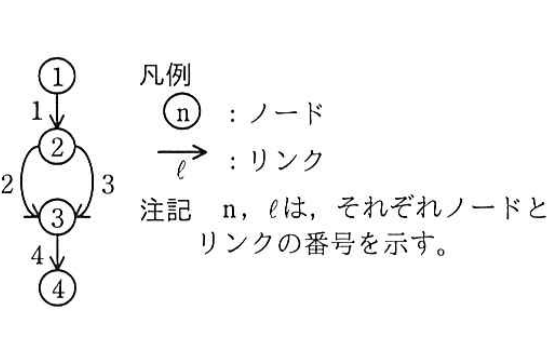
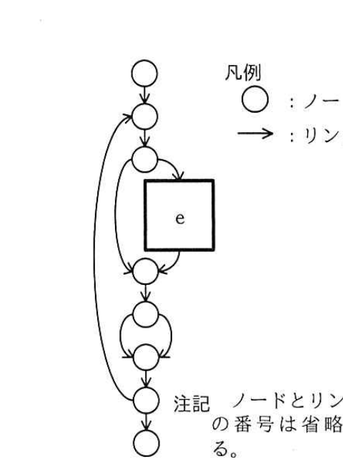

# 2018年春期（平成30年度）応用情報技術者試験 午後 問8（選択）
## 情報システム開発：プログラムの品質評価（Z社）

---

## 問題文

**問8** プログラムの品質評価に関する次の記述を読んで、設問1〜3に答えよ。

Z社では、全国に店舗展開する家電量販店向けに、顧客管理システムを開発している。開発中の顧客管理システムは、運用開始後、家電量販店の業務内容の変化に合わせて、3か月おきを目安に継続的に改修していくことが想定されている。

Z社では、プログラムの品質を定量的に評価するために、メトリクスを計測し、活用している。プログラムを関数の単位で評価する際には、関数の長さとサイクロマティック複雑度をメトリクスとして計測し、評価する。開発プロセスにおいては、プログラムのテストを開始する前にメトリクスを計測し、評価された値が、あらかじめ設定されたしきい値を上回らないことを確認することにしている。

開発中の顧客管理システムについても、開発プロセスのルールに従い、この評価方法によって評価した。

---

### 〔サイクロマティック複雑度〕

サイクロマティック複雑度とは、プログラムの複雑度を示す指標である。プログラムの制御構造を有向グラフで表したときの、グラフ中のノードの数Nとリンク（辺）の数Lを用いて次の式で算出する。

```
サイクロマティック複雑度 C = L − N + 2
```

プログラムの制御構造を有向グラフで表した例を図1に示す。プログラムの開始位置と終了位置、反復や条件分岐が開始する位置と終了する位置をノードとし、ノード間をつなぐ順次処理の部分をリンクとしてグラフにする。ノードの間に含まれる順次処理のプログラムの行数は考慮せず、一つのリンクとして記述する。また、図1のリンク1やリンク4のように、処理がない場合も一つのリンクとして記述する。



> function sample()の制御構造：ノード①開始→リンク1→ノード②(if 条件1)→（真ならリンク2で処理1を経て）ノード③(endif)→リンク4→ノード④終了。偽の場合はリンク3で処理2〜4を経てノード③へ。ノード②から③へはリンク2とリンク3の2経路がある。

図1の場合、ノードの数Nは4、リンクの数Lは4となり、Cは`[　a　]`と評価される。

ソフトウェアの内部構造及び内部仕様に基づいたテストを`[　b　]`という。Z社では、`[　b　]`を実施するに当たって、全ての条件分岐の箇所で、個々の判定条件の真及び偽の組合せを満たすことを基準としたテストを実施する方針としている。このような方針を`[　c　]`という。一般に、サイクロマティック複雑度は小さい方が、実行網羅率100%を目指すために必要なテストケース数が少なくなり、テスト工程の作業が容易になる。Z社では、サイクロマティック複雑度のしきい値を10に設定している。

---

### 〔評価対象のプログラム〕

開発中の顧客管理システムにおいて、顧客から問合せを受け付けた際に記録する情報には、タイトル、概要、発生店舗、詳細情報及び顧客の個人情報が含まれており、これらの情報をまとめたものを案件と呼ぶ。案件には、未完了と完了のステータスがある。画面に案件の情報を表示する際には、案件のステータスとシステムの利用者の立場によって、情報の公開範囲と編集可否の権限を制御する必要がある。

図2は、画面上に案件の一覧を表示する際の権限判定を行うプログラムの一部である。システムの利用者の役職や所属する店舗と、それぞれの案件のステータスから、画面上に表示する情報の公開範囲と編集可否についての権限を判定する。

図2のプログラムについて、メトリクスの計測を行った。計測結果を表1に示す。なお、サイクロマティック複雑度の計測のために作成した有向グラフの記載は省略する。

```
図2 権限判定を行うプログラム（一部）
 1: function get_permission()
 2:   for( 案件の数だけ繰り返し )
 3:     権限 ← 詳細情報，個人情報を参照不可
 4:     if( 案件のステータスが完了でない )
 5:       if ( 案件の店舗に所属している )
 6:         権限 ← 詳細情報だけを参照可能
 7:         if ( 管理職である )
 8:           if( 案件の登録者である )
 9:             権限 ← 詳細情報，個人情報を参照・編集可能
10:          else
11:             権限 ← 詳細情報だけを参照・編集可能
12:             if ( 店長である )
13:               権限 ← 詳細情報，個人情報を参照・編集可能    ┐
14:             endif                                          │
15:           endif                                            │(A)
16:         else                                                │
17:           if( 案件の登録者である )                          │
18:             権限 ← 詳細情報，個人情報を参照・編集可能        │
19:           endif                                            │
20:         endif                                              │
21:       endif                                                ┘
22:     else
23:       if ( 公開フラグが立っている )
24:         権限 ← 詳細情報だけを参照可能
25:       endif
26:     endif
27:     if ( システム管理者である )
28:       権限 ← 詳細情報，個人情報の参照・編集が可能    ┐
29:       if ( 案件のステータスが完了である )            │(B)
30:         権限 ← 詳細情報，個人情報を参照可能          │
31:       endif                                          ┘
32:     endif
33:     案件の表示・操作権限 ← 権限
34:   endfor
35: endfunction
```

### 表1 計測結果

| メトリクス | 結果 |
|---|---|
| 関数の長さ | 33 |
| サイクロマティック複雑度 | 11 |

（関数の長さには、関数の開始と終了の行は含まない。）

表1の計測結果から、図2のプログラムはサイクロマティック複雑度がしきい値を上回っており、テスト実施のコストが大きくなることが予想される。そこで、プログラムの外部的振る舞いを保ったままプログラムの理解や修正が簡単になるように内部構造を改善する`[　d　]`を行うことにした。改善する一つの方法として、図2のプログラム中（A）の範囲を"未完了案件権限判定"、（B）の範囲を"管理者権限判定"という名称で関数化することを検討した。改善後のプログラムを図3に、改善後のプログラムの有向グラフを図4に示す。

```
図3 改善後のプログラム
function get_permission()
  for( 案件の数だけ繰り返し )
    権限 ← 詳細情報，個人情報を参照不可
    if( 案件のステータスが完了でない )
      権限 ← 未完了案件権限判定( )
    else
      if ( 公開フラグが立っている )
        権限 ← 詳細情報だけを参照可能
      endif
    endif
    if ( システム管理者である )
      権限 ← 管理者権限判定( )
    endif
    案件の表示・操作権限 ← 権限
  endfor
endfunction
```



> 改善後のget_permission関数の制御構造を表す有向グラフ。開始ノードから順にノードが連なり、途中に「未完了案件権限判定」「管理者権限判定」の関数呼出しに相当するノード`[e]`（四角）を経由し、ループ構造やif分岐に対応する分岐・合流のリンクが描かれ、終了ノードに至る。

図3のプログラムのサイクロマティック複雑度は`[　f　]`であった。また、関数"未完了案件権限判定"については6、"管理者権限判定"については2となった。その結果、全てのプログラムのサイクロマティック複雑度がしきい値を上回らないことが確認された。

---

### 〔改善の効果〕

簡潔なプログラムにすることによって、プログラムの可読性が高まり、初期開発時の機能実装のミスを減少させることができる。また、プログラムのリリース後に発生する改修や修正の難易度を下げることができる。そうすることによって、ソフトウェアの品質モデルのうち、機能適合性及び`[　g　]`を高めることができる。

Z社で開発している顧客管理システムのような場合、①リリース後の改修や修正の難易度を下げることが、初期開発が容易になることよりも重要であることが多い。

---

## 設問

### 設問1 本文中の`[　a　]`〜`[　c　]`に入れる適切な字句を答えよ。

### 設問2 〔評価対象のプログラム〕について、(1)、(2)に答えよ。

(1) 本文中の`[　d　]`に入れる適切な字句を答えよ。

(2) 図4中の`[　e　]`を埋めて有向グラフを完成させよ。また、本文中の`[　f　]`に入れるサイクロマティック複雑度を求めよ。

### 設問3 〔改善の効果〕について、(1)、(2)に答えよ。

(1) 本文中の`[　g　]`に入れる適切な字句を解答群の中から選び、記号で答えよ。

**解答群：**
ア　移植性　　イ　互換性　　ウ　使用性
エ　信頼性　　オ　性能効率性　　カ　保守性

(2) 本文中の下線①について、その理由を35字以内で述べよ。

---

## 解答と解説

### 設問1

**正解：a = 2、b = ホワイトボックステスト、c = 条件網羅**

- a：図1はN=4、L=4であるため、C = L − N + 2 = 4 − 4 + 2 = **2**。
- b：ソフトウェアの内部構造・内部仕様に基づいて行うテストは**ホワイトボックステスト**（対語はブラックボックステスト）。
- c：全ての条件分岐箇所で、判定条件の真偽の組合せを網羅する基準は**条件網羅**（分岐網羅／判定条件網羅とも呼ばれる）。

**IPA公式：a = 2、b = ホワイトボックステスト、c = 条件網羅**

---

### 設問2

**(1) 正解：リファクタリング**

外部的振る舞いを変えずに内部構造だけを改善し、理解や修正を容易にする作業は**リファクタリング**。

**(2) 正解：e＝「未完了案件権限判定」「管理者権限判定」の呼出しを表すノード（サブルーチンコールを示す四角のノード）、f = 5**

図3の改善後のプログラムは、関数呼出し部分（未完了案件権限判定、管理者権限判定）を1つのノードとして扱う。改善後のプログラム全体の制御構造は、if(ステータスが完了でない)～else～endif、if(システム管理者である)～endifの分岐と、ループのみとなり、複雑度が大幅に下がる。N、Lを数えると、C = L − N + 2 = **5**となる。

**IPA公式：f = 5**

---

### 設問3

**(1) 正解：カ（保守性）**

プログラムの理解や修正のしやすさに関わる品質特性は、ISO/IEC 25010のソフトウェア品質モデルにおける**保守性**（Maintainability）。

**IPA公式：カ**

**(2) 正解例：プログラムの改修や修正が継続的に発生することが想定されるから（35字以内）**

本文冒頭に「開発中の顧客管理システムは、運用開始後、家電量販店の業務内容の変化に合わせて、3か月おきを目安に継続的に改修していくことが想定されている」とあり、リリース後も頻繁に改修・修正が発生する見込みのシステムでは、初期開発の容易さよりも、長期にわたる保守のしやすさ（改修・修正の難易度の低さ）の方が全体のコストに与える影響が大きい。

**IPA公式：プログラムの改修や修正が継続的に発生することが想定されるから**

---

## 参考：主要キーワード

| 用語 | 説明 |
|------|------|
| サイクロマティック複雑度 | プログラムの制御構造の複雑さを示す指標。C = L − N + 2（L：リンク数、N：ノード数）で算出し、値が大きいほどテストケースが増え保守性が下がる |
| ホワイトボックステスト | プログラムの内部構造・ロジックに着目して行うテスト。命令網羅、分岐網羅、条件網羅などの網羅基準がある |
| 条件網羅 | 全ての判定条件（分岐条件）について、真・偽の両方の組合せを少なくとも1回はテストする網羅基準 |
| リファクタリング | プログラムの外部的振る舞い（機能）を変えずに、内部構造を整理・改善して可読性・保守性を高める作業 |
| ソフトウェア品質モデル（ISO/IEC 25010） | 機能適合性、性能効率性、互換性、使用性、信頼性、セキュリティ、保守性、移植性の8特性からソフトウェア品質を評価するモデル |
