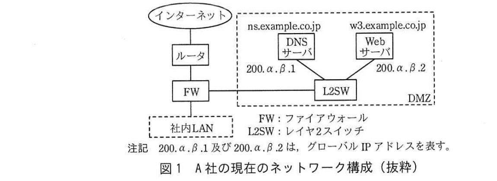
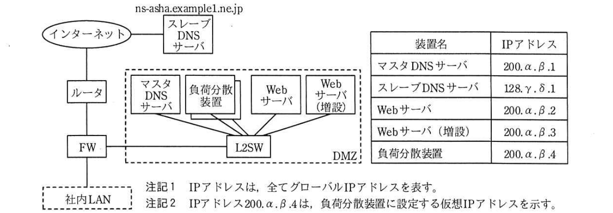

# 2018年春期（平成30年度）応用情報技術者試験 午後 問5（選択）
## ネットワーク：Webシステムの構成変更とDNS（A社／B社）

---

## 問題文

**問5** Webシステムの構成変更に関する次の記述を読んで、設問1〜3に答えよ。

A社は、従業員が300名の情報機器卸売会社であり、250社の販売会社と販売代理店契約を結んでいる。A社では、DMZに設置したWebサーバで代理店向けのWebサイトを運営している。Webサイトでは、商品情報の閲覧、見積書作成、問合せ対応などを行う代理店支援システムを稼働させている。インターネット接続には、ISPのB社のサービスを利用している。A社の現在のネットワーク構成を図1に示す。



> インターネット―ルータ―FW―（社内LAN、L2SW経由でDMZ内のDNSサーバ ns.example.co.jp（200.α.β.1）、Webサーバ w3.example.co.jp（200.α.β.2））という構成。

Webサイトは開設から3年が経過し、アクセス数が初年度の5倍に増加した。Webサイトの利用拡大に伴い、システム停止が商品販売に大きな影響を及ぼすようになった。そこで、A社では、Webシステムの処理能力、可用性及びセキュリティを高める目的で、Webシステムの構成変更を行うことを決めた。

情報システム部のM課長は、まず、Webシステムの処理能力と可用性の向上策の立案を、部下のN主任に指示した。

---

### 〔Webシステムの処理能力と可用性の向上策の検討〕

N主任は、Webサーバ及びDNSサーバそれぞれの処理能力と可用性を向上させる冗長化構成を検討した。

Webサーバの冗長化には、Webサーバを2台構成にし、DNSの機能である`[　a　]`によって負荷分散する方式があるが、可用性向上策としては十分でない。そこで、負荷分散装置を利用してWebサーバを冗長化することにした。負荷分散装置自体は、アクティブ／スタンバイ方式で冗長化する。

A社のドメイン（example.co.jp）の情報（以下、ゾーン情報という）を管理するDNSサーバの冗長化は、B社が提供するDNSサービスを利用して実現する。A社のDNSサーバ（ns.example.co.jp）をマスタDNSサーバにし、B社のDNSサーバ（以下、B社DNSサーバという）（ns-asha.example1.ne.jp）をスレーブDNSサーバにする場合、A社又はB社が実施する作業を次に示す。

- A社のドメインを管理するDNSサーバとして、B社DNSサーバのFQDNと`[　b　]`を、JPドメイン名の登録管理事業者に登録申請する。
- A社のDNSサーバのゾーン情報にNSレコードを追加して、スレーブDNSサーバのFQDNを設定する。
- ゾーン情報の設定・変更作業を一度で済ませるために、A社のDNSサーバのゾーン情報を、`[　c　]`DNSサーバへ転送させるのに必要な情報を設定する。

---

### 〔Webシステム変更後の構成〕

N主任が考えた、Webシステム変更後の構成を図2に、そのときの、マスタDNSサーバのゾーン情報の内容を図3に示す。



> インターネット―（スレーブDNSサーバ ns-asha.example1.ne.jp）とインターネット―ルータ―FW―L2SW経由でDMZ内のマスタDNSサーバ、負荷分散装置、Webサーバ、Webサーバ（増設）が接続。装置名とIPアドレス対応：マスタDNSサーバ=200.α.β.1、スレーブDNSサーバ=128.γ.δ.1、Webサーバ=200.α.β.2、Webサーバ（増設）=200.α.β.3、負荷分散装置=200.α.β.4（仮想IPアドレス）。

### 図3 マスタDNSサーバのゾーン情報の内容（抜粋）

| 行番号 | owner | class | type | record_data |
|---|---|---|---|---|
| 1 | example | IN | NS | ns.example.co.jp. |
| 2 | （空欄） | IN | NS | `[　d　]`. |
| 3 | ns | IN | A | `[　e　]` |
| 4 | w3 | IN | A | `[　f　]` |

（外側の太線の枠内が、ゾーン情報を示す。）

N主任が検討結果をM課長に報告したときの、2人の会話の一部を次に示す。

**N主任：** Webシステムを図2の構成に変更します。Webシステム変更後のマスタDNSサーバのゾーン情報の内容は、図3のとおりになります。図3の設定によって、Webサイトの利用者は、使用中のURLを変更せずに済みます。

**M課長：** 分かった。この構成なら処理能力と可用性を高めることができるだろう。ところで、Webシステムのセキュリティを高めるために、WAF（Web Application Firewall）の導入も必要ではないかと考えているが、当社の体制ではWAFの運用は難しそうなので困っている。良い方法はないだろうか。

**N主任：** クラウド型WAFサービスが利用できるか調べてみます。

---

### 〔クラウド型WAFサービスの利用〕

N主任の調査の結果、B社が提供するクラウド型WAFサービスが利用可能なことが分かった。その際の利用者のWebサイトへのアクセス手順は、次のとおりになる。

- A社のWebサイトの利用者は、始めにWAFサービスのFQDNであるwaf-asha.example1.ne.jpにアクセスする。
- WAFサービスで通信パケットが検査される。
- パケットに問題がないとき、そのパケットがA社のWebサイトに転送される。

B社のWAFサービスを利用する場合、次の対応も必要になる。

- 利用者にWAFサービスの存在を意識させることなくWAFサービスを利用するために、①図3中の4行目の後に、Webサイトのホスト名w3の別名を定義するレコードを追加する。さらに、WAFサービスが、検査後のパケットをA社のWebサイトに転送できるようにするために、②図3中の転送先を示す資源レコードを変更する。図3中に追加設定する資源レコードを図4に示す。

### 図4 図3中に追加設定する資源レコード

```
w3    IN    CNAME    waf-asha.example1.ne.jp.
```

- ③WAFサービスを経由せず、直接Webサイトにアクセスされるのを防止するためのアクセス制御を、A社のFWに設定する。

N主任が調査結果をM課長に報告したときの、2人の会話の一部を次に示す。

**N主任：** B社のWAFサービスを利用すれば、運用の問題は発生しません。図3の変更、図4の追加設定などによって、WAFサービスが利用できます。

**M課長：** それは良いな。それでは、N主任の検討結果を基に、Webシステムの構成変更を行うことにしよう。

---

## 設問

### 設問1 本文中の`[　a　]`〜`[　c　]`に入れる適切な字句を答えよ。

### 設問2 図3中の`[　d　]`〜`[　f　]`に入れる適切なIPアドレス又はFQDNを解答群の中から選び、記号で答えよ。

**解答群：**
ア　200.α.β.1　　イ　200.α.β.2　　ウ　200.α.β.3
エ　200.α.β.4　　オ　example.co.jp　　カ　ns-asha.example1.ne.jp
キ　ns.example.co.jp　　ク　w3.example.co.jp　　ケ　waf-asha.example1.ne.jp

### 設問3 〔クラウド型WAFサービスの利用〕について、(1)〜(3)に答えよ。

(1) 本文中の下線①によって、Webサイトの利用者が変更しなくてもよくなるものを、15字以内で答えよ。

(2) 本文中の下線②について、変更する行番号及び変更する必要のある資源レコードのフィールド名を、それぞれ答えよ。

(3) 本文中の下線③について、アクセス制御の内容を、35字以内で述べよ。

---

## 解答と解説

### 設問1

**正解：a = ラウンドロビン、b = IPアドレス、c = スレーブ**

- a：DNSの機能で複数のWebサーバへ順番にアクセスを振り分ける方式は**ラウンドロビン**方式。ヘルスチェック機能がなく、サーバ障害時にも振り分け続けるため可用性向上策としては不十分。
- b：JPドメイン名の登録管理事業者への登録申請には、DNSサーバのFQDNとその**IPアドレス**の登録が必要。
- c：ゾーン情報の設定・変更作業を一度で済ませるため、マスタDNSサーバのゾーン情報を**スレーブ**DNSサーバへゾーン転送（AXFR）させる設定を行う。

**IPA公式：a = ラウンドロビン、b = IPアドレス、c = スレーブ**

---

### 設問2

**正解：d = カ（ns-asha.example1.ne.jp）、e = ア（200.α.β.1）、f = エ（200.α.β.4）**

- d：行2はNSレコードで、行1（ns.example.co.jp＝マスタDNSサーバ）に続くスレーブDNSサーバのFQDNを設定する。図2よりスレーブDNSサーバのFQDNは**ns-asha.example1.ne.jp**。
- e：行3はホスト名nsのAレコードで、マスタDNSサーバ（ns.example.co.jp）のIPアドレスを設定する。表より**200.α.β.1**。
- f：行4はホスト名w3のAレコードで、WebサイトのURLを変更せずに済ませるには、利用者がアクセスするw3.example.co.jpが負荷分散装置の仮想IPアドレスを指す必要がある。表より**200.α.β.4**。

**IPA公式：d = カ、e = ア、f = エ**

---

### 設問3

**(1) 正解例：Webサイト利用時のURL（15字以内）**

Webサイトのホスト名w3の別名としてwaf-asha.example1.ne.jpを指すCNAMEレコードを追加することで、利用者は従来どおりw3.example.co.jp（＝現在使用中のURL）にアクセスするだけでよく、WAFサービスの存在を意識してURLを変更する必要がない。

**IPA公式：Webサイト利用時のURL**

**(2) 正解：行番号4、フィールド名 owner**

下線②「図3中の転送先を示す資源レコードを変更する」とは、WAFサービスが検査後のパケットを転送する先（＝実際のA社Webサイト）を示すレコードの変更を指す。図4でCNAMEレコードがw3の別名としてwaf-asha.example1.ne.jpを定義したことで、行4（w3のAレコード）はもはやw3自身の直接のアドレスとしては参照されなくなるため、行4のownerフィールドを変更（w3から別の名前、例えば実体を表す別ホスト名に変更）し、実体側のAレコードとして転送先IPアドレスを指すよう設定し直す必要がある。

**IPA公式：行番号4、フィールド名：owner**

**(3) 正解例：Webサイトへのアクセスをwafサービスだけから許可する。（35字以内）**

WAFサービスを経由しない直接アクセスを防ぐには、A社のFWにおいて、WebサイトへのインバウンドアクセスをWAFサービスのIPアドレスからのものだけに制限するアクセス制御を設定する必要がある。

**IPA公式：Webサイトへのアクセスをwafサービスだけから許可する。**

---

## 参考：主要キーワード

| 用語 | 説明 |
|------|------|
| マスタ／スレーブDNSサーバ | ゾーン情報を管理する権威DNSサーバの冗長化構成。マスタが原本を保持し、スレーブはゾーン転送（AXFR/IXFR）によって複製を保持する |
| NSレコード | ドメインの権威DNSサーバを示すDNSリソースレコード |
| CNAMEレコード | あるホスト名を別のホスト名（正規名）の別名として定義するDNSリソースレコード |
| ゾーン転送 | マスタDNSサーバからスレーブDNSサーバへゾーン情報を複製する仕組み |
| WAF（Web Application Firewall） | Webアプリケーションの脆弱性を悪用する攻撃を検知・防御するファイアウォール。クラウド型サービスとして提供されることも多い |
| ラウンドロビン方式 | DNSが複数のIPアドレスを順番に応答することで負荷分散を行う方式。サーバ障害を検知しないため可用性向上には不十分 |
| 負荷分散装置（ロードバランサ） | 複数のサーバへのアクセスを振り分け、ヘルスチェックによる障害検知を伴う冗長化・負荷分散を実現する装置 |
