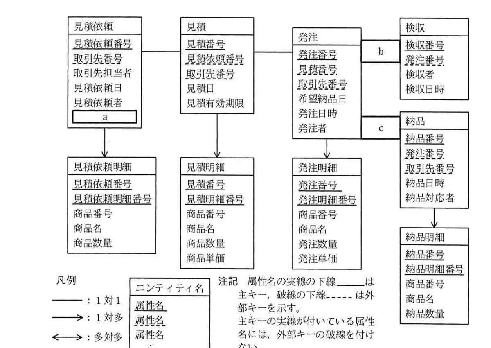

# 2018年春期（平成30年度）応用情報技術者試験 午後 問6（選択）
## データベース：備品購買システムの設計と実装（R社）

---

## 問題文

**問6** 備品購買システムの設計と実装に関する次の記述を読んで、設問1〜4に答えよ。

R社は、ソフトウェアパッケージの開発及び販売を行う中堅企業である。これまで備品の購買は、総務部が表計算ソフトを用いて管理し、行っていた。このたび、見積依頼や発注、納品された備品の確認などを円滑に行うために、備品購買システムを構築することになった。

備品購買の処理の流れとシステム化対象を表1に示す。

### 表1 備品購買の処理の流れとシステム化対象

| No. | 処理名 | 概要 |
|---|---|---|
| 1 | 購買依頼 | 利用部門が総務部に、備品の調達を依頼する。 |
| 2 | 見積依頼（システム化対象） | 総務部が依頼された調達の内容を確認し、在庫がない場合は取引先に見積りを依頼する。その際、取引先のカタログを使って依頼された備品の商品番号と商品名を調べ、数量及び希望回答日と一緒に入力する。 |
| 3 | 見積登録（システム化対象） | 総務部が取引先から回答された見積りの内容を登録する。その際、見積有効期限や価格情報などを入力する。 |
| 4 | 発注（システム化対象） | 総務部が取引先に、見積りに対して発注する。その際、発注する商品の数量や希望納品日を入力する。 |
| 5 | 納品 | 総務部が取引先から届いた商品を登録する。その際、届いた商品の数量などを入力する。取引先の在庫状況によっては、複数回に分けて商品が届くことがある。 |
| 6 | 検収（システム化対象） | 総務部が発注した商品が全て納品されたことを確認する。 |
| 7 | 請求 | 総務部が取引先から送られてきた請求書の情報を登録する。 |
| 8 | 支払依頼 | 総務部が経理部に、請求書に対する支払を依頼する。 |

（システム化対象＝見積依頼、見積登録、発注、検収、納品）

この処理の流れから検討した、備品購買システムのデータベースのE-R図を図1に示す。

このデータベースでは、E-R図のエンティティ名を表名にし、属性名を列名にして、適切なデータ型で表定義した関係データベースによって、データを管理する。



> 見積依頼（見積依頼番号、取引先番号、取引先担当者、見積依頼日、見積依頼者、`[a]`）→見積依頼明細（見積依頼番号、見積依頼明細番号、商品番号、商品名、商品数量）。見積依頼→見積（見積番号、見積依頼番号、取引先番号、見積日、見積有効期限）→見積明細（見積番号、見積明細番号、商品番号、商品名、商品数量、商品単価）。見積→発注（発注番号、見積番号、取引先番号、希望納品日、発注日時、発注者）→発注明細（発注番号、発注明細番号、商品番号、商品名、発注数量、発注単価）。発注と検収（検収番号、発注番号、検収者、検収日時）は関連`[b]`で接続。発注と納品（納品番号、発注番号、取引先番号、納品日時、納品対応者）は関連`[c]`で接続。納品→納品明細（納品番号、納品明細番号、商品番号、商品名、納品数量）。凡例：実線＝1対1、矢印線＝1対多、両矢印線＝多対多。属性名の実線の下線は主キー、破線の下線は外部キーを示す。

---

### 〔相見積り機能の検討〕

備品購買システムに相見積り機能を追加することを検討する。相見積り機能とは、複数の取引先へ同じ内容の見積依頼を出す機能である。これによって、より安い価格を提示した取引先へ発注を行うことができるようになる。見積依頼を一度に複数の取引先へ出すために、見積依頼エンティティを二つのエンティティに分けることを考える。

一つ目のエンティティは、複数の取引先への見積依頼を束ねるエンティティとして、主キーに見積依頼番号、属性に見積依頼日と見積依頼者、`[　a　]`をもたせる。

二つ目のエンティティは、各取引先への見積依頼を管理するエンティティとして、主キーに`[　d　]`と`[　e　]`、属性に取引先担当者をもたせる。

この変更に伴い、`[　f　]`エンティティにも変更を加えることで、この機能を実装することができた。

---

### 〔検収機能の作成〕

検収のために、発注した各商品の数量と納品された数量を、商品番号の昇順に一覧表示するSQL文を図2に示す。ここで、":発注番号"は、指定された発注番号を格納する埋込み変数である。

なお、関数COALESCE(A, B)は、AがNULLでないときはAを、AがNULLのときはBを返す。

```sql
図2 一覧表示するSQL文
SELECT ORD.発注番号, ORD.商品番号, ORD.商品名, ORD.発注数量,
  COALESCE( [　g　] , 0)
FROM
  (SELECT OD.発注番号, OT.商品番号, OT.商品名, OT.発注数量
   FROM 発注 OD
     INNER JOIN 発注明細 OT ON OD.発注番号 = OT.発注番号
   WHERE [　h　]
  ) ORD
LEFT OUTER JOIN
  (SELECT DE.発注番号, DD.商品番号, SUM(DD.納品数量) AS 納品数量計
   FROM 納品 DE
     INNER JOIN 納品明細 DD ON DE.納品番号 = DD.納品番号
   WHERE DE.発注番号 = :発注番号
   [　i　]
  ) DLI
ON ORD.発注番号 = DLI.発注番号
  AND ORD.商品番号 = DLI.商品番号
[　j　]
```

---

### 〔返品対応〕

備品購買システムが完成し、運用が開始されてから数か月後、総務部から問合せがあった。取引先から納品された商品を登録した後、利用部門から商品の一部に問題があったので返品したが、その際の情報を記録したい、とのことであった。

納品登録したレコード中の納品数量から返品した数を減らす方法をまず考えたが、その方法では、納品された商品数量や返品したという事実を記録することができない。そこで、データベースの定義や納品登録した際のレコードには変更を加えずに、①納品表と納品明細表にそれぞれ新しいレコードを追加することで、返品に関する情報を記録することができた。

---

## 設問

### 設問1 図1及び本文中の`[　a　]`、図1中の`[　b　]`、`[　c　]`に入れる適切なエンティティ間の関連及び属性名を答え、E-R図を完成させよ。

なお、エンティティ間の関連及び属性名の表記は、図1の凡例に倣うこと。

### 設問2 本文中の`[　d　]`〜`[　f　]`に入れる適切な字句を答えよ。

### 設問3 図2中の`[　g　]`〜`[　j　]`に入れる適切な字句又は式を答えよ。

なお、表の列名には必ずその表の別名を付けて答えよ。

### 設問4 〔返品対応〕について、本文中の下線①にある追加したレコードのうち、納品明細表に追加したのはどのようなレコードか。返品に関する情報を記録することを考慮して、30字以内で述べよ。

---

## 解答と解説

### 設問1

**正解：a = 希望回答日、b・c = 1対1（実線）**

- a：見積依頼エンティティの属性として、表1「見積依頼」処理概要に「数量及び希望回答日と一緒に入力する」とあり、a には**希望回答日**が入る。
- b・c：発注と検収、発注と納品は、それぞれ1件の発注に対して1件の検収・1件の納品が対応する関係として表現されており（発注明細と納品明細で数量を管理する構造のため）、凡例の**1対1（実線）**の関連となる。

**IPA公式：a = 希望回答日、b・c＝（1対1の実線、図として表現）**

---

### 設問2

**正解：d = 見積依頼番号、e = 取引先番号、f = 見積依頼明細**

相見積り機能では、見積依頼を「複数取引先への依頼を束ねるエンティティ」（主キー：見積依頼番号）と「各取引先への見積依頼を管理するエンティティ」（主キー：見積依頼番号＋取引先番号）に分割する。したがって二つ目のエンティティの主キーは**見積依頼番号**と**取引先番号**の組み合わせとなる。この分割に伴い、見積依頼明細の外部キーである見積依頼番号だけでは特定の取引先への依頼明細を識別できなくなるため、**見積依頼明細**エンティティにも取引先番号を追加するなどの変更が必要になる。

**IPA公式：d = 見積依頼番号、e = 取引先番号（順不同）、f = 見積依頼明細**

---

### 設問3

**正解：g = DLI.納品数量計、h = OD.発注番号 = :発注番号、i = GROUP BY DE.発注番号, DD.商品番号、j = ORDER BY ORD.商品番号**

- g：COALESCEで、納品数量計がNULLの場合0を返す対象は、サブクエリDLIで計算した**DLI.納品数量計**。
- h：発注明細の内部結合サブクエリORDにおいても、埋込み変数で指定された発注番号に絞り込む必要があるため、**OD.発注番号 = :発注番号**という条件が入る。
- i：納品・納品明細の内部結合サブクエリで、SUM(DD.納品数量)を発注番号・商品番号単位で集計するため、**GROUP BY DE.発注番号, DD.商品番号**が必要。
- j：最終結果を商品番号の昇順に一覧表示するため、**ORDER BY ORD.商品番号**を指定する。

**IPA公式：g = DLI.納品数量計、h = OD.発注番号 = :発注番号、i = GROUP BY DE.発注番号, DD.商品番号、j = ORDER BY ORD.商品番号**

---

### 設問4

**正解例：返品した商品の数量をマイナスの値に設定したレコード（30字以内）**

納品表・納品明細表の既存レコードは変更せず、返品事実を記録するために、返品した商品の数量をマイナス値として設定した新しい納品明細レコード（対応する納品レコードとともに）を追加する。これにより、SUM(DD.納品数量)の集計時に返品分が自動的に差し引かれ、実質的な納品数量が正しく計算される。

**IPA公式：返品した商品の数量をマイナスの値に設定したレコード**

---

## 参考：主要キーワード

| 用語 | 説明 |
|------|------|
| E-R図 | エンティティ（実体）と、それらの間のリレーションシップ（関連）を図示したデータモデル。1対1、1対多、多対多の関連種別がある |
| COALESCE関数 | 引数を左から評価し、最初にNULLでない値を返すSQL関数。集計結果がNULLになる場合のデフォルト値設定によく使う |
| LEFT OUTER JOIN | 左側のテーブルの全行を保持し、右側テーブルに一致する行がない場合はNULLで埋めて結合するSQLの結合方式 |
| GROUP BY | 指定した列の値ごとにレコードをグループ化し、集計関数（SUM, COUNTなど）を適用するためのSQL句 |
| マイナス値による取消記録 | 既存レコードを変更・削除せず、符号を反転させた新しいレコードを追加することで、取消・返品などの事実を履歴として保持する設計パターン |
| 相見積り | 複数の取引先に同一条件で見積りを依頼し、価格等を比較検討して発注先を決定する購買手法 |
